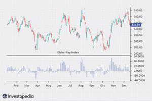

The financial markets represent a complex ecosystem where the interactions between buyers and sellers establish the framework for price movements and trends. Within this intricate environment, technical analysis tools are indispensable for traders aiming to decipher the underlying dynamics that drive market behavior. One such tool is the Elder Ray Indicator, conceived by Dr. Alexander Elder in 1989. This indicator functions as a metaphorical X-ray, providing traders with valuable insights into the bullish and bearish forces exerted on market prices.

The Elder Ray Indicator is instrumental because it combines different aspects of market dynamics into a cohesive tool that illustrates the balance of power between buyers and sellers. By identifying when buyers have the upper hand (bullish forces) or when sellers are predominantly in control (bearish forces), the Elder Ray assists traders in predicting potential price shifts that may not be immediately apparent through other forms of analysis.



This article examines the application of the Elder Ray Indicator in market analysis, emphasizing its integration within algorithmic trading strategies. By harmonizing traditional technical analysis with systematic algorithmic approaches, traders can devise more robust market strategies that are not only reactive but also predictive of future market conditions. Through this synthesis, the Elder Ray Indicator is leveraged not merely as a static observational tool but as a dynamic component of an advanced trading system.

## Table of Contents

## Understanding the Elder Ray Indicator

The Elder Ray Indicator consists of two primary measures: Bull Power and Bear Power, accompanied by a 13-day Exponential Moving Average (EMA). Bull Power quantifies the buyers' ability to drive the price above the EMA by calculating the difference between the highest price and the EMA. Conversely, Bear Power evaluates the sellers' strength in pushing the price below the EMA by determining the difference between the lowest price and the EMA. Mathematically, these are expressed as:

- Bull Power = High - EMA
- Bear Power = Low - EMA

Both components are typically represented as histograms on a chart, providing traders with visual indicators of market pressures, particularly in sensing potential trend reversals or continuations. Bull Power's histogram, plotted above the zero line when positive, indicates a bullish bias, while Bear Power, plotted below the zero line, suggests a bearish environment when positive values are absent.

The core principle behind the Elder Ray Indicator is identifying discrepancies between price movements and the Bull or Bear Power values. Such divergences can signal potential shifts in market trends. For instance, if prices reach new highs and Bull Power fails to surpass its previous peak, it may indicate a weakening bull trend. Similarly, if prices hit new lows while Bear Power does not reach corresponding lows, it may hint at diminishing bearish strength.

Understanding these interactions aids traders in executing more informed decisions, leveraging the indicator for recognizing subtle market nuances.

## Using the Elder Ray Indicator in Trading

The Elder Ray Indicator is a versatile tool in technical trading, enabling traders to gauge market dynamics through its components: the Exponential Moving Average (EMA), Bull Power, and Bear Power. Effective utilization of this indicator involves analyzing the interplay between EMA trends and the fluctuations in Bull and Bear Power.

The EMA, typically set at a 13-day period, serves as a pivotal benchmark in assessing market [momentum](/wiki/momentum). A rising EMA indicates a bullish market trend, as it suggests that prices are closing above the average, indicating sustained buying pressure. Conversely, a falling EMA signals bearish conditions, suggesting that prices are consistently closing below the average, reflecting persistent selling pressure.

Detection of divergence signals is a critical aspect of using the Elder Ray Indicator for trading decisions. Divergence occurs when the direction of the price movement diverges from the movements of Bull and Bear Power. For instance, if prices reach a new high, but Bull Power does not surpass its previous high, it indicates a potential weakening in bullish momentum, suggesting a possible trend reversal. Similarly, when prices make a new low but Bear Power does not achieve a new low, it may signal a weakening bearish trend and a potential shift or reversal.

Zero-line crossovers in the Bull and Bear Power histograms are essential signals of impending market transitions. A Bull Power crossover from negative to positive suggests a shift towards bullish dominance, with buyers gaining control. Conversely, a transition of Bear Power from positive to negative indicates increasing bearish pressure, suggesting a move towards seller control. These crossover points serve as crucial indicators for traders, signaling potential entry or [exit](/wiki/exit-strategy) points in the market.

Incorporating these elements of the Elder Ray Indicator into a cohesive trading strategy allows traders to make informed decisions based on a nuanced understanding of market dynamics. Through careful analysis and interpretation of EMA trends, divergence signals, and zero-line crossovers, traders can enhance the accuracy and effectiveness of their trading strategies.

## Algorithmic Trading with Elder Ray Indicator

Algorithmic trading with the Elder Ray Indicator involves transforming its components—Bull Power, Bear Power, and the 13-day Exponential Moving Average (EMA)—into actionable trading algorithms. This transformation enables the systematic generation of buy and sell signals based on predefined criteria, facilitating automated trading decisions.

To start, trading algorithms assess the Bull Power and Bear Power metrics. Bull Power is calculated as the difference between the highest price of the day and the 13-day EMA, while Bear Power is determined by analyzing the lowest price of the day minus the EMA. These values provide crucial insights into the balance of power between buyers and sellers within the market.

The logic of an algorithm intended to execute trades based on these indicators is typically structured around meeting certain conditions. For example, a common rule is to enter a long position when Bull Power is positive and increasing, coupled with a rising EMA, indicating a strengthening bullish trend. Conversely, a short position might be triggered when Bear Power is negative and declining, along with a falling EMA, signaling potential bearish dominance.

The integration of the Elder Ray into trading algorithms offers significant advantages, particularly in speed and precision. Algorithms can scan and react to market data far more quickly and accurately than human traders, minimizing delay and increasing the chances of executing trades at optimal prices. Moreover, the use of [algorithmic trading](/wiki/algorithmic-trading) allows for extensive [backtesting](/wiki/backtesting), where past market data is employed to simulate how a strategy would have performed historically. This process helps in the identification and mitigation of potential risks, enhancing the overall robustness of trading strategies.

Consider the following Python pseudo-code as an illustration of the Elder Ray Indicator's application in an algorithmic trading context:

```python
class ElderRayTrader:
    def __init__(self, data):
        self.data = data
        self.ema_period = 13

    def calculate_ema(self, prices):
        # Compute the EMA
        return prices.ewm(span=self.ema_period).mean()

    def bull_power(self, high_prices, ema):
        return high_prices - ema

    def bear_power(self, low_prices, ema):
        return low_prices - ema

    def generate_signals(self):
        prices = self.data['Close']
        high_prices = self.data['High']
        low_prices = self.data['Low']
        ema = self.calculate_ema(prices)
        bull = self.bull_power(high_prices, ema)
        bear = self.bear_power(low_prices, ema)

        # Placeholder for buy/sell signal logic
        for i in range(1, len(prices)):
            if bull[i] > 0 and ema[i] > ema[i-1]:
                print("Buy signal at index:", i)
            elif bear[i] < 0 and ema[i] < ema[i-1]:
                print("Sell signal at index:", i)

```

This pseudo-code demonstrates how key triggers such as power shifts and EMA trends can guide the creation of automated buy and sell signals. Implementing these strategies in real trading necessitates considerations of account risk management, transaction costs, and market [liquidity](/wiki/liquidity-risk-premium). Successful deployment of the Elder Ray Indicator within algorithmic trading thus hinges on the precise tuning of these parameters, coupled with continuous optimization based on evolving market patterns.

## Quantitative Performance of the Elder Ray Indicator

Backtesting the Elder Ray Indicator on various financial instruments demonstrates its potential effectiveness under certain conditions. When applied to assets such as the S&P 500 and Gold, positive results have been observed in specific scenarios. These scenarios typically involve sufficient liquidity and [volatility](/wiki/volatility-trading-strategies), which allow the indicator's signals to align effectively with market movements. For instance, in a liquid market, large transaction volumes provide clearer data points for the Elder Ray's calculations, enhancing signal reliability.

Despite its advantages, the indicator can produce false signals, particularly in volatile markets where rapid price reversals occur. These false signals make it necessary for traders to use the Elder Ray in conjunction with other momentum or trend-confirming indicators, such as the Relative Strength Index (RSI) or the Moving Average Convergence Divergence (MACD). By combining multiple indicators, traders can corroborate signals, thereby reducing the likelihood of acting on misleading information.

Integrating technical insights from the Elder Ray with [fundamental analysis](/wiki/fundamental-analysis) also aids in filtering out market noise. Fundamental analysis can include factors like economic indicators, earnings reports, or geopolitical events, which help traders to contextualize the signals given by technical tools. By aligning the indicators with broader economic conditions, traders can make more informed decisions.

Overall, the quantitative performance of the Elder Ray Indicator is optimized when it's employed as part of a comprehensive trading strategy that includes multiple analytical tools. This multifaceted approach enhances the accuracy of market predictions and supports more robust trading decisions.

## Challenges and Limitations

The Elder Ray Indicator, despite being a valuable tool for traders, has inherent limitations that need careful consideration. Its heavy reliance on Exponential Moving Averages (EMAs) can be a drawback, particularly due to the lagging nature of EMAs. This latency means the indicator can be slow to respond to abrupt market fluctuations and may not offer timely signals for traders seeking to capitalize on short-term market movements.

In volatile market conditions, the Elder Ray Indicator is susceptible to producing 'whipsaws,' where rapid market reversals lead to false trading signals. These whipsaws can cause traders to enter or exit positions prematurely, potentially resulting in losses. This vulnerability highlights the necessity of integrating a robust risk management framework. Risk management strategies, such as setting stop-loss orders or employing position-sizing techniques, are vital to protect capital.

To overcome these challenges, it is essential to use the Elder Ray Indicator in conjunction with other analytical tools. Complementary indicators, such as the Relative Strength Index (RSI) or the Moving Average Convergence Divergence (MACD), can provide additional confirmation of trends and help filter out false signals. This multi-indicator approach increases the reliability of trading signals and enhances decision-making.

Incorporating dynamic thresholds and adaptive strategies can further improve the indicator's effectiveness. For example, adjusting the sensitivity of the Elder Ray components according to market conditions can help in responding more flexibly to changing environments. Algorithmic trading systems can be programmed to modify thresholds dynamically, optimizing the indicator's responsiveness to diverse market scenarios.

In summary, while the Elder Ray Indicator can offer significant insights, traders need to be aware of its limitations, particularly in fast-moving and volatile markets. By strengthening trading approaches with comprehensive risk management, other verifying indicators, and adaptable strategies, the challenges associated with the Elder Ray Indicator can be effectively mitigated.

## Conclusion

While the Elder Ray Indicator offers valuable insights into market dynamics, its standalone usage in trading can be limited. This limitation largely stems from its reliance on exponential moving averages (EMAs). As a result, it may not quickly respond to sudden market shifts or capture rapid reversals, necessitating the integration of additional analytical tools for comprehensive market analysis.

To enhance reliability and profitability, incorporating the Elder Ray Indicator within a broader set of tools is essential. This involves combining it with other momentum and trend-confirming indicators such as the Relative Strength Index (RSI) and the Moving Average Convergence Divergence (MACD). By doing so, traders can better validate signals and reduce the likelihood of false indications leading to improved decision-making processes.

Moreover, rigorous backtesting is crucial for optimizing trading strategies. Backtesting aids in assessing the performance of the Elder Ray Indicator under different market conditions and across various financial instruments. It allows traders to refine their approach by identifying conditions wherein the indicator shows the most promise, ultimately mitigating risks associated with unpredictable market environments.

Traders should also commit to maintaining robust risk management practices. This involves setting appropriate stop-loss levels and employing position sizing techniques to manage exposure effectively. Risk management ensures that even when false signals occur, the negative impact on overall portfolio performance is minimized.

Finally, continual learning and adaptation to market conditions are pivotal in mastering the use of the Elder Ray Indicator in financial markets. As market dynamics evolve, the ability to adjust strategies and parameters becomes essential. Staying informed about market developments and refining one's technical knowledge contribute significantly to maximizing the potential of the Elder Ray Indicator and achieving sustained success in trading.

## FAQs

### FAQs

**How does the Elder Ray Indicator work?**

The Elder Ray Indicator functions by analyzing the market forces of bulls and bears through two main components: Bull Power and Bear Power. It incorporates a 13-day Exponential Moving Average (EMA) as a baseline. Bull Power is calculated by subtracting the EMA from the daily high price, offering insights into the strength of the buyers. Conversely, Bear Power is obtained by subtracting the daily low price from the EMA, reflecting the sellers’ strength. These values are plotted as histograms, allowing traders to visualize buying and selling pressures. By comparing the price movements with these power values, traders can detect divergences suggesting potential trend reversals or continuations.

**Can the Elder Ray Indicator be used for algo trading?**

Yes, the Elder Ray Indicator can be effectively employed in algorithmic trading. By translating the indicator's components—EMA, Bull Power, and Bear Power—into algorithmic conditions, traders can automate trading decisions. For instance, a trading algorithm can be designed to execute buy or sell orders based on predefined conditions like the crossover of Bull Power and Bear Power over the zero line, or rising/falling EMA trends. This systematic approach ensures speed and precision in trading operations. Below is a simplified Python pseudo-code example illustrating how the Elder Ray Indicator could be integrated into a trading algorithm:

```python
def elder_ray_strategy(prices):
    ema = calculate_ema(prices, 13)
    bull_power = [high - ema[i] for i, high in enumerate(prices['high'])]
    bear_power = [low - ema[i] for i, low in enumerate(prices['low'])]

    for i in range(1, len(prices)):
        if bull_power[i] > 0 and bear_power[i] > 0 and prices['close'][i-1] < prices['close'][i]:
            enter_buy_order()
        elif bull_power[i] < 0 and bear_power[i] < 0 and prices['close'][i-1] > prices['close'][i]:
            enter_sell_order()
```

**What are the best practices in using the Elder Ray Indicator?**

To optimize the use of the Elder Ray Indicator, traders should consider the following best practices:

1. **Combine with Other Indicators**: The Elder Ray Indicator is more reliable when used alongside other technical analysis tools such as the Relative Strength Index (RSI) or Moving Average Convergence Divergence (MACD). This multifaceted approach can help confirm signals and mitigate the risk of false positives.

2. **Backtesting**: Prior to live trading, extensive backtesting should be conducted on historical data to understand the indicator's performance under various market conditions.

3. **Risk Management**: Employ robust risk management strategies, as the indicator is not immune to generating false signals, especially in highly volatile or rapidly changing markets.

4. **Continuous Monitoring and Adjustment**: Market conditions evolve, and so should your strategies. Regularly update and refine the application of the Elder Ray Indicator based on performance analytics and changing trading environments.

5. **Dynamic Thresholds**: Adjust trigger points and thresholds dynamically to better suit the prevailing market conditions, rather than relying on static benchmarks. This flexibility aids in accommodating market volatility and unique asset characteristics.

## References & Further Reading

1. Elder, A. (1993). Trading for a Living: Psychology, Trading Tactics, Money Management. This book by Dr. Alexander Elder covers comprehensive strategies for trading in financial markets, emphasizing the psychological aspects, tactics, and effective money management techniques. The Elder Ray Indicator was first introduced by Dr. Elder and is thoroughly explained in this book, offering practical insights into its application in trading.

2. Murphy, J. J. (1999). Technical Analysis of the Financial Markets: A Comprehensive Guide to Trading Methods and Applications. John J. Murphy's authoritative guide provides an extensive overview of technical analysis methods used in financial trading. While not specifically focused on the Elder Ray Indicator, this book is a essential resource for understanding various technical analysis tools and their applications, providing a broader context to integrate the Elder Ray Indicator into trading strategies.

For further reading, consider exploring additional technical analysis literature and algorithmic trading resources to deepen understanding and enhance the practical application of the Elder Ray Indicator. The integration of technical indicators with systematic trading approaches can be further understood through up-to-date research articles and trading platform manuals, which often provide examples and case studies.