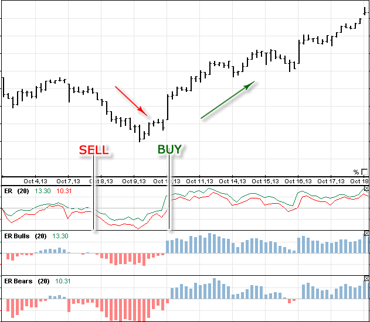

## Table of Contents

## What is the Elder Ray Indicator?

The Elder Ray Indicator is a tool used in trading to help people understand how strong a market trend is and where the market might be heading. It was created by a man named Dr. Alexander Elder. The indicator looks at the difference between the closing price of a stock and two moving averages. This helps traders see if buyers or sellers are in control of the market.

The Elder Ray Indicator has two main parts: the Bull Power and the Bear Power. Bull Power measures the strength of buyers by comparing the highest price of the day to a 13-day moving average. If the Bull Power is high, it means buyers are strong. Bear Power, on the other hand, measures the strength of sellers by comparing the lowest price of the day to the same 13-day moving average. If the Bear Power is high, it means sellers are strong. Traders use these two measures to make decisions about buying or selling stocks.

## Who developed the Elder Ray Indicator and why?

The Elder Ray Indicator was developed by Dr. Alexander Elder. He is a well-known trader, author, and teacher in the world of finance. Dr. Elder created this tool to help traders better understand the balance of power between buyers and sellers in the market. He wanted to give traders a way to see if a trend was strong or weak and to predict where the market might go next.

Dr. Elder came up with the Elder Ray Indicator because he believed that looking at the closing price alone wasn't enough to understand market trends. By comparing the high and low prices of the day to a moving average, he could measure the strength of bulls (buyers) and bears (sellers). This helped traders make smarter decisions about when to buy or sell stocks. His goal was to make trading easier and more effective for people by providing them with clear signals about market movements.

## What are the components of the Elder Ray Indicator?

The Elder Ray Indicator has two main parts: Bull Power and Bear Power. Bull Power shows how strong the buyers are. It does this by taking the highest price of the day and subtracting a 13-day moving average from it. If the Bull Power is high, it means that buyers are feeling strong and pushing the price up. Bear Power shows how strong the sellers are. It is found by taking the lowest price of the day and subtracting the same 13-day moving average. If the Bear Power is high, it means that sellers are strong and pushing the price down.

These two parts help traders see who is in control of the market. When Bull Power is high, it's a good sign for buying because it shows that buyers are in charge. When Bear Power is high, it might be a good time to sell because it shows that sellers are in charge. By looking at both Bull Power and Bear Power, traders can make better decisions about when to buy or sell stocks.

## How is the Bull Power calculated in the Elder Ray Indicator?

Bull Power is a part of the Elder Ray Indicator that shows how strong the buyers are in the market. To find Bull Power, you take the highest price of the day and subtract a 13-day moving average from it. The 13-day moving average is just the average closing price of the stock over the last 13 days.

If the Bull Power number is high, it means that buyers are feeling strong and are pushing the price of the stock up. Traders use this information to decide if it's a good time to buy the stock. When Bull Power is high, it's a sign that the market might keep going up because buyers are in control.

## How is the Bear Power calculated in the Elder Ray Indicator?

Bear Power is a part of the Elder Ray Indicator that shows how strong the sellers are in the market. To calculate Bear Power, you take the lowest price of the day and subtract a 13-day moving average from it. The 13-day moving average is just the average closing price of the stock over the last 13 days.

If the Bear Power number is high, it means that sellers are feeling strong and are pushing the price of the stock down. Traders use this information to decide if it's a good time to sell the stock. When Bear Power is high, it's a sign that the market might keep going down because sellers are in control.

## What does the Elder Ray Indicator tell us about market trends?

The Elder Ray Indicator helps us understand how strong the market trend is and which way the market might go next. It does this by looking at the balance between buyers and sellers. The indicator has two parts: Bull Power and Bear Power. Bull Power tells us how strong the buyers are by comparing the highest price of the day to a 13-day moving average. If Bull Power is high, it means buyers are pushing the price up and the market trend might be strong and going up.

Bear Power tells us how strong the sellers are by comparing the lowest price of the day to the same 13-day moving average. If Bear Power is high, it means sellers are pushing the price down and the market trend might be strong but going down. By looking at both Bull Power and Bear Power, traders can see if the market trend is strong or weak and make better decisions about when to buy or sell stocks.

## How can the Elder Ray Indicator be used to identify buying opportunities?

The Elder Ray Indicator can help traders spot good times to buy stocks by looking at the Bull Power and Bear Power. Bull Power shows how strong the buyers are. If the Bull Power is high, it means buyers are pushing the price up. This is a sign that it might be a good time to buy because the market could keep going up. Traders look for times when Bull Power is high and getting higher to find these buying opportunities.

Another way the Elder Ray Indicator can help find buying opportunities is by watching for when Bull Power crosses above zero. When this happens, it means the buyers are starting to take control of the market. This can be a signal to buy because it might mean the start of a new upward trend. So, traders often look for these moments to make their buying decisions.

## How can the Elder Ray Indicator be used to identify selling opportunities?

The Elder Ray Indicator helps traders find good times to sell stocks by looking at the Bear Power. Bear Power shows how strong the sellers are. If the Bear Power is high, it means sellers are pushing the price down. This is a sign that it might be a good time to sell because the market could keep going down. Traders watch for times when Bear Power is high and getting higher to find these selling opportunities.

Another way the Elder Ray Indicator can help find selling opportunities is by watching for when Bear Power crosses below zero. When this happens, it means the sellers are starting to take control of the market. This can be a signal to sell because it might mean the start of a new downward trend. So, traders often look for these moments to make their selling decisions.

## What are common strategies that incorporate the Elder Ray Indicator?

One common strategy that uses the Elder Ray Indicator is to buy when the Bull Power is high and getting higher. Traders look at the Bull Power to see if buyers are getting stronger. When they see that the Bull Power is above zero and going up, they think it's a good time to buy because the market might keep going up. They also watch for when the Bull Power crosses above zero, which can be a signal that a new upward trend is starting. This helps them jump into the market at the right time.

Another strategy is to sell when the Bear Power is high and getting higher. Traders use the Bear Power to see if sellers are getting stronger. When they see that the Bear Power is below zero and going down, they think it's a good time to sell because the market might keep going down. They also watch for when the Bear Power crosses below zero, which can be a signal that a new downward trend is starting. This helps them get out of the market at the right time before the price drops too much.

## How does the Elder Ray Indicator perform in different market conditions?

The Elder Ray Indicator works well in different market conditions because it helps traders see who is in control, the buyers or the sellers. In a strong uptrend, when the market is going up a lot, the Bull Power part of the indicator will be high. This means buyers are strong and pushing the price up. Traders can use this information to buy stocks at the right time and make money as the market keeps going up. In a strong downtrend, when the market is going down a lot, the Bear Power will be high. This shows that sellers are strong and pushing the price down. Traders can use this to sell their stocks before the price falls too much.

In a sideways market, where the price is not going up or down a lot, the Elder Ray Indicator can still be useful. It might show small changes in Bull Power and Bear Power, helping traders see when buyers or sellers are starting to get stronger. This can give them a chance to make small trades and make a little money even when the market is not moving much. Overall, the Elder Ray Indicator can help traders in any market condition by showing them when it's a good time to buy or sell based on the strength of buyers and sellers.

## What are the limitations and potential pitfalls of using the Elder Ray Indicator?

The Elder Ray Indicator can be helpful, but it has some limitations. One big problem is that it uses a 13-day moving average, which might not work well for all types of stocks or markets. Some stocks might move faster or slower than others, so this one-size-fits-all approach can lead to wrong signals. Also, the indicator looks at the high and low prices of the day, but these can be affected by things like news or events that happen after the market closes. This means the indicator might not always give the full picture of what's happening in the market.

Another potential pitfall is that the Elder Ray Indicator can give false signals, especially in choppy or sideways markets. If the market is not moving up or down much, the Bull Power and Bear Power might keep going up and down without showing a clear trend. This can make it hard for traders to know when to buy or sell, leading to confusion and possible losses. Traders need to be careful and use other tools along with the Elder Ray Indicator to make better decisions and avoid these pitfalls.

## How can the Elder Ray Indicator be combined with other technical indicators for enhanced analysis?

The Elder Ray Indicator can be used with other tools to make better trading choices. One popular tool to use with it is the Moving Average Convergence Divergence (MACD). The MACD helps show when a trend might be starting or ending. When the Elder Ray Indicator's Bull Power goes up and the MACD line crosses above its signal line, it's a strong sign that it's time to buy. On the other hand, if the Bear Power goes up and the MACD line crosses below its signal line, it's a good time to sell. By using both tools together, traders can see if the market is really moving in one direction or if it might be a false signal.

Another useful tool to combine with the Elder Ray Indicator is the Relative Strength Index (RSI). The RSI shows if a stock is overbought or oversold. If the Elder Ray Indicator shows high Bull Power and the RSI is above 70, it might mean the stock is overbought and could soon go down. If the Bear Power is high and the RSI is below 30, it might mean the stock is oversold and could go up soon. By looking at both the Elder Ray Indicator and the RSI, traders can get a better idea of when to buy or sell and avoid making bad trades based on one tool alone.

## References & Further Reading

1. Elder, A. (1993). Trading for a Living: Psychology, Trading Tactics, Money Management. This book by Dr. Alexander Elder covers comprehensive strategies for trading in financial markets, emphasizing the psychological aspects, tactics, and effective money management techniques. The Elder Ray Indicator was first introduced by Dr. Elder and is thoroughly explained in this book, offering practical insights into its application in trading.

2. Murphy, J. J. (1999). Technical Analysis of the Financial Markets: A Comprehensive Guide to Trading Methods and Applications. John J. Murphy's authoritative guide provides an extensive overview of technical analysis methods used in financial trading. While not specifically focused on the Elder Ray Indicator, this book is a essential resource for understanding various technical analysis tools and their applications, providing a broader context to integrate the Elder Ray Indicator into trading strategies.

For further reading, consider exploring additional technical analysis literature and [algorithmic trading](/wiki/algorithmic-trading) resources to deepen understanding and enhance the practical application of the Elder Ray Indicator. The integration of technical indicators with systematic trading approaches can be further understood through up-to-date research articles and trading platform manuals, which often provide examples and case studies.

