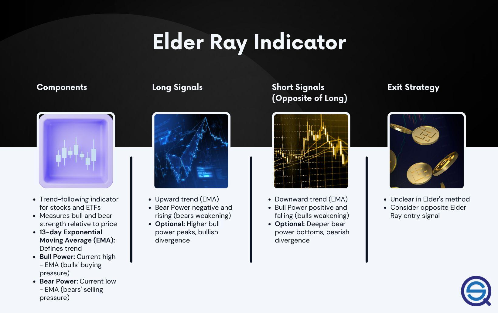

## Table of Contents

## What is the Elder-Ray Indicator?

The Elder-Ray Indicator is a tool used in trading to help people understand the market better. It was created by a man named Dr. Alexander Elder. This indicator helps traders see how strong the buying and selling pressure is in the market. It does this by looking at two main parts: the Bull Power and the Bear Power. Bull Power shows how strong the buyers are, and Bear Power shows how strong the sellers are.

To use the Elder-Ray Indicator, traders look at a chart of a stock or another thing they want to trade. They use a special line called the moving average, which helps smooth out the price movements over time. The Bull Power is calculated by taking the highest price of the day and subtracting the moving average. The Bear Power is calculated by taking the lowest price of the day and subtracting the moving average. By watching these two numbers, traders can decide if it's a good time to buy or sell.

## Who developed the Elder-Ray Indicator?

The Elder-Ray Indicator was developed by Dr. Alexander Elder. He is a well-known trader and author who has written books to help people understand trading better. Dr. Elder wanted to create a tool that could help traders see if the market was being pushed by buyers or sellers.

The Elder-Ray Indicator is made up of two parts: Bull Power and Bear Power. Bull Power shows how strong the buyers are, and Bear Power shows how strong the sellers are. By using this indicator, traders can make better decisions about when to buy or sell.

## What are the components of the Elder-Ray Indicator?

The Elder-Ray Indicator has two main parts: Bull Power and Bear Power. Bull Power shows how strong the buyers are in the market. It is calculated by taking the highest price of the day and subtracting the moving average. The moving average is a line on the chart that helps smooth out the price movements over time. When Bull Power is high, it means buyers are strong and might push the price up.

Bear Power shows how strong the sellers are in the market. It is calculated by taking the lowest price of the day and subtracting the moving average. When Bear Power is high, it means sellers are strong and might push the price down. By looking at both Bull Power and Bear Power, traders can understand if the market is being pushed by buyers or sellers and make better decisions about when to buy or sell.

## How is the Bull Power calculated in the Elder-Ray Indicator?

Bull Power is a part of the Elder-Ray Indicator that shows how strong the buyers are in the market. It helps traders understand if the buyers are pushing the price up. To find Bull Power, you take the highest price of the day and subtract the moving average. The moving average is a line on the chart that smooths out the price movements over time.

When the Bull Power number is high, it means the buyers are strong. This could be a sign that the price might go up because the buyers are in control. Traders look at Bull Power to decide if it's a good time to buy the stock or other thing they are trading.

## How is the Bear Power calculated in the Elder-Ray Indicator?

Bear Power is a part of the Elder-Ray Indicator that helps traders understand how strong the sellers are in the market. It shows if the sellers are pushing the price down. To calculate Bear Power, you take the lowest price of the day and subtract the moving average. The moving average is a line on the chart that makes the price movements smoother over time.

When Bear Power is high, it means the sellers are strong. This could be a sign that the price might go down because the sellers are in control. Traders look at Bear Power to decide if it's a good time to sell the stock or other thing they are trading. By watching Bear Power, traders can make better choices about when to sell.

## What does the Bull Power signify in the Elder-Ray Indicator?

Bull Power in the Elder-Ray Indicator shows how strong the buyers are in the market. It is calculated by taking the highest price of the day and subtracting the moving average. The moving average is a line on the chart that smooths out the price movements over time. When Bull Power is high, it means that buyers are very active and pushing the price up.

Traders use Bull Power to decide if it's a good time to buy a stock or another thing they are trading. If Bull Power is high, it could be a sign that the price will keep going up because buyers are in control. By looking at Bull Power, traders can make better choices about when to enter the market and buy.

## What does the Bear Power signify in the Elder-Ray Indicator?

Bear Power in the Elder-Ray Indicator shows how strong the sellers are in the market. It is calculated by taking the lowest price of the day and subtracting the moving average. The moving average is a line on the chart that helps smooth out the price movements over time. When Bear Power is high, it means that sellers are very active and pushing the price down.

Traders use Bear Power to decide if it's a good time to sell a stock or another thing they are trading. If Bear Power is high, it could be a sign that the price will keep going down because sellers are in control. By looking at Bear Power, traders can make better choices about when to leave the market and sell.

## How can the Elder-Ray Indicator be used to identify buying opportunities?

The Elder-Ray Indicator can help traders find good times to buy by looking at Bull Power and Bear Power. Bull Power shows how strong the buyers are. When Bull Power is high, it means buyers are pushing the price up. Traders can look for times when Bull Power is getting stronger. This could be a sign that the price will keep going up, so it might be a good time to buy.

Traders also need to watch Bear Power, which shows how strong the sellers are. If Bear Power is low or getting weaker, it means sellers are not as strong. When Bull Power is high and Bear Power is low, it's a good sign for buying. Traders can use these signals to decide when to enter the market and buy a stock or another thing they are trading.

## How can the Elder-Ray Indicator be used to identify selling opportunities?

The Elder-Ray Indicator can help traders find good times to sell by looking at Bear Power and Bull Power. Bear Power shows how strong the sellers are. When Bear Power is high, it means sellers are pushing the price down. Traders can look for times when Bear Power is getting stronger. This could be a sign that the price will keep going down, so it might be a good time to sell.

Traders also need to watch Bull Power, which shows how strong the buyers are. If Bull Power is low or getting weaker, it means buyers are not as strong. When Bear Power is high and Bull Power is low, it's a good sign for selling. Traders can use these signals to decide when to leave the market and sell a stock or another thing they are trading.

## What are the limitations of using the Elder-Ray Indicator?

The Elder-Ray Indicator can be helpful, but it has some limits. One big limit is that it can give wrong signals sometimes. The market can be tricky, and just because Bull Power is high or Bear Power is high doesn't always mean the price will go up or down right away. Traders need to be careful and use other tools too, not just the Elder-Ray Indicator, to make sure they are making good choices.

Another limit is that the Elder-Ray Indicator works best when the market is moving a lot. If the market is not moving much, the signals from Bull Power and Bear Power might not be very clear. This can make it hard for traders to decide when to buy or sell. So, it's important to look at the bigger picture and use the Elder-Ray Indicator along with other ways to understand the market.

## How can the Elder-Ray Indicator be combined with other technical indicators for better results?

The Elder-Ray Indicator can be used with other tools to make better trading choices. One way is to use it with the Moving Average Convergence Divergence (MACD). The MACD helps show if the market is getting stronger or weaker over time. If the Elder-Ray Indicator shows high Bull Power and the MACD line crosses above its signal line, it might be a good time to buy. On the other hand, if Bear Power is high and the MACD line crosses below its signal line, it might be a good time to sell. Using these two together can give traders a clearer picture of what's happening in the market.

Another tool that works well with the Elder-Ray Indicator is the Relative Strength Index (RSI). The RSI helps show if a stock is being bought too much or sold too much. If Bull Power is high and the RSI is above 70, it might mean the stock is overbought and could go down soon. If Bear Power is high and the RSI is below 30, it might mean the stock is oversold and could go up soon. By looking at the Elder-Ray Indicator and the RSI together, traders can make better decisions about when to buy or sell.

## Can you provide a case study or example of the Elder-Ray Indicator in action?

Let's look at a simple case study of how the Elder-Ray Indicator was used to make a trading decision. Imagine a trader named Sarah who is watching a stock called XYZ. She sees that the stock's price has been going up slowly for a few weeks. One day, she notices that the Bull Power of the Elder-Ray Indicator is getting stronger. It shows that buyers are pushing the price up. At the same time, the Bear Power is weak, meaning sellers are not very strong. Sarah also checks the Moving Average Convergence Divergence (MACD) and sees that the MACD line has just crossed above its signal line, which is another sign that the stock might keep going up. So, Sarah decides it's a good time to buy XYZ stock.

A few weeks later, Sarah is watching the same stock, XYZ. She sees that the price has gone up a lot since she bought it. Now, she is thinking about selling. She looks at the Elder-Ray Indicator again and notices that the Bear Power is getting stronger. This means that sellers are starting to push the price down. The Bull Power is still okay but not as strong as before. Sarah also checks the Relative Strength Index (RSI) and sees that it's above 70, which means the stock might be overbought and could go down soon. With these signs from the Elder-Ray Indicator and the RSI, Sarah decides it's a good time to sell her XYZ stock and take her profits.

## What is the Elder Ray Indicator and how does it work?

The Elder Ray Indicator is a technical analysis tool devised to measure the strength of market participants, specifically bulls and bears, through its three primary components: the 13-day Exponential Moving Average (EMA), Bull Power, and Bear Power. 

The 13-day EMA serves as a smoothing element, capturing the overall trend by averaging price movements. The calculation of the EMA at a specific time, $t$, typically involves the following formula:

$$
\text{EMA}_t = (\text{Price}_t \times \text{Multiplier}) + (\text{EMA}_{t-1} \times (1-\text{Multiplier}))
$$

where the Multiplier is $\frac{2}{\text{N} + 1}$, and $N$ is the period for which the average is calculated (13 days in this case).

Bull Power is defined as the difference between the day's high price and the 13-day EMA, represented mathematically as:

$$
\text{Bull Power} = \text{High Price} - \text{EMA}
$$

This measure gauges the ability of buyers to push prices above the average price level, indicating dominance when it is positive.

Conversely, Bear Power is computed by subtracting the EMA from the day's low price:

$$
\text{Bear Power} = \text{Low Price} - \text{EMA}
$$

Bear Power indicates the strength of sellers in pulling prices below the average level. A positive Bear Power suggests that despite a downward trend, sellers are losing [momentum](/wiki/momentum).

These calculations assist traders in identifying shifts in market control. A rising Bull Power can suggest an increasing buying interest, while a decreasing Bear Power may indicate a loss of selling momentum. Collectively, these indicators aim to signal potential points of price reversal or continuation, allowing traders to make more informed decisions.

## References & Further Reading

[1]: Elder, A. (1993). ["Trading for a Living: Psychology, Trading Tactics, Money Management"](https://www.amazon.com/Trading-Living-Psychology-Tactics-Management/dp/0471592242). John Wiley & Sons.

[2]: Elder, A. (2002). ["Come into My Trading Room: A Complete Guide to Trading"](https://www.amazon.com/Come-Into-My-Trading-Room/dp/0471225347). John Wiley & Sons.

[3]: Murphy, J. J. (1999). ["Technical Analysis of the Financial Markets: A Comprehensive Guide to Trading Methods and Applications"](https://www.amazon.com/Technical-Analysis-Financial-Markets-Comprehensive/dp/0735200661). New York Institute of Finance.

[4]: Pring, M. J. (2006). ["Technical Analysis Explained"](https://www.amazon.com/Technical-Analysis-Explained-Fifth-Successful/dp/0071825177). McGraw-Hill.

[5]: Aronson, D. R. (2006). ["Evidence-Based Technical Analysis: Applying the Scientific Method and Statistical Inference to Trading Signals"](https://www.amazon.com/Evidence-Based-Technical-Analysis-Scientific-Statistical/dp/0470008741). John Wiley & Sons.