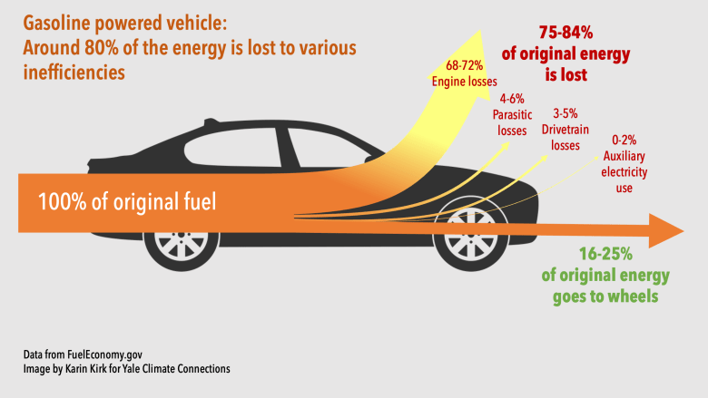

## Table of Contents

## What is an electric vehicle (EV)?

An electric vehicle (EV) is a type of car that runs on electricity instead of gasoline. Instead of a gas engine, it has an electric motor powered by a battery. You charge the battery by plugging the car into an electrical outlet, much like charging a smartphone. EVs produce zero tailpipe emissions, making them better for the environment than traditional cars.

There are different kinds of electric vehicles. Some are fully electric and only use electricity to run. Others are plug-in hybrids, which have both an electric motor and a gas engine. Plug-in hybrids can switch between using electricity and gasoline, giving drivers more flexibility. Electric vehicles are becoming more popular as people look for ways to reduce their carbon footprint and save money on fuel.

## How does an electric vehicle differ from a gasoline-powered car?

An electric vehicle (EV) and a gasoline-powered car work in different ways. An EV uses electricity to run its motor, which is powered by a rechargeable battery. You charge this battery by plugging the car into an electrical outlet, similar to charging a phone. On the other hand, a gasoline-powered car uses a gas engine that burns gasoline to move the car. You fill up the gas tank at a gas station, and the car runs until the gas runs out.

Another big difference is how they affect the environment. Electric vehicles produce no harmful emissions from the tailpipe, making them cleaner for the air we breathe. Gasoline cars, however, release pollutants like carbon dioxide and other gases that can harm the environment. Also, EVs are generally quieter than gas cars because their motors don't make as much noise. This makes cities and neighborhoods quieter when more people drive electric vehicles.

## What are the main components of an electric vehicle?

The main parts of an electric vehicle include the electric motor, the battery pack, and the power electronics controller. The electric motor is what makes the car move. It uses the electricity from the battery to turn the wheels. The battery pack is like a big rechargeable battery that stores the electricity needed to power the motor. You can charge it by plugging the car into an electrical outlet. The power electronics controller is like the brain of the system. It manages how the electricity flows from the battery to the motor, making sure everything works smoothly.

Another important part is the charging system, which lets you plug the car into an outlet to recharge the battery. Some electric vehicles also have a regenerative braking system. This system helps the car slow down and at the same time, it sends some of the energy back into the battery, which can help extend the car's range. Together, these parts make the electric vehicle work without needing gas, making it a clean and efficient way to travel.

## What are the environmental benefits of using electric vehicles over gasoline cars?

Electric vehicles help the environment by not releasing harmful gases from their tailpipes. When you drive a gasoline car, it puts out carbon dioxide and other pollutants that can make the air dirty and contribute to climate change. Electric cars, on the other hand, don't produce these harmful emissions, so they are better for the air we breathe and for the planet.

Another way electric vehicles help the environment is by reducing our need for fossil fuels. Gasoline comes from oil, which is a non-renewable resource that we can run out of. When we use electric cars, we can power them with electricity from renewable sources like solar or wind power. This means we're not only cutting down on pollution but also using energy that can be replenished, making our energy use more sustainable in the long run.

## How does the cost of owning an electric vehicle compare to a gasoline car?

The cost of owning an electric vehicle can be different from a gasoline car in several ways. At first, electric vehicles might cost more to buy than a similar gasoline car. But, they can save you money over time. Electric cars are cheaper to run because charging them costs less than filling up with gas. Also, electric vehicles have fewer parts that can break, so they might need less maintenance, like oil changes, which saves money too.

Another thing to think about is how long the car will last and how much it will be worth later. Electric cars can keep their value better than gasoline cars, which means they might be worth more when you want to sell them or trade them in. But, if you have to pay for a home charger or use public charging stations a lot, that can add to the cost. So, while electric vehicles might cost more at the start, they can save you money in the long run if you consider all these things.

## What is the typical range of an electric vehicle on a single charge?

The typical range of an electric vehicle on a single charge can vary a lot depending on the model. On average, many electric cars can go between 200 to 300 miles before they need to be charged again. Some newer models, like the Tesla Model S, can even go over 400 miles on one charge. This range can change based on things like how fast you drive, the weather, and if you use the heater or air conditioning a lot.

Even though the range is important, it's also good to think about how easy it is to charge an electric vehicle. Most people charge their cars at home overnight, which is like filling up a gas tank slowly over time. There are also more and more public charging stations popping up, so it's getting easier to charge on the go. With planning, the range of an electric vehicle is usually enough for daily driving and even for longer trips.

## How long does it take to charge an electric vehicle?

The time it takes to charge an electric vehicle can be different depending on the type of charger you use. A regular home outlet, which is called Level 1 charging, can take a long time—usually around 8 to 20 hours to fully charge a car. This is good for people who can leave their car plugged in overnight. A faster option is a Level 2 charger, which you might install at home or find at public charging stations. With a Level 2 charger, it can take about 4 to 8 hours to get a full charge, which is quicker and more convenient for many people.

The fastest way to charge an electric vehicle is with a Level 3 charger, also known as a DC fast charger. These are usually found at public charging stations and can charge your car to 80% in about 20 to 60 minutes, depending on the car and the charger. Most electric vehicles can't go from 0 to 100% with these fast chargers because it's better for the battery to slow down the charging once it gets to around 80%. So, the type of charger you use makes a big difference in how long it takes to charge your electric vehicle.

## What infrastructure is needed to support widespread use of electric vehicles?

To make electric vehicles popular and easy to use, we need a good charging network. This means having enough charging stations in places where people live, work, and travel. Home chargers are important because most people charge their cars overnight at home. But we also need public chargers at places like shopping centers, workplaces, and along highways. These public stations should include both fast chargers, which can charge a car in about 20 to 60 minutes, and slower chargers that might take a few hours. Having a mix of these chargers helps make sure that drivers can find a place to charge no matter where they are or how long they plan to stay.

Another key part of the infrastructure is the power grid. It needs to be strong enough to handle all the extra electricity that electric vehicles will use. This might mean upgrading the grid in some areas to make sure it can deliver power reliably. Also, it's important to have more renewable energy sources like solar and wind power. Using clean energy to charge electric vehicles makes them even better for the environment. With a good charging network and a strong, green power grid, more people will feel comfortable switching to electric vehicles.

## What are the latest technological advancements in electric vehicle batteries?

One big step forward in electric vehicle batteries is the use of new materials like lithium iron phosphate (LFP) and nickel manganese cobalt (NMC). These materials can store more energy and last longer than older types of batteries. LFP batteries are safer and cheaper, while NMC batteries have a higher energy density, which means they can make cars go farther on a single charge. Scientists are also working on solid-state batteries, which could be even better. They are lighter, can hold more energy, and charge faster than the batteries we use now.

Another important advancement is in how we make batteries. New ways of making batteries are helping to cut down the cost and time it takes to build them. This means electric vehicles can become more affordable for more people. Also, smart battery management systems are getting better. These systems help the battery work better and last longer by controlling how it charges and discharges. They can even tell the driver how to drive to save energy and extend the car's range. With all these improvements, electric vehicles are becoming more practical and appealing to more people.

## How do government policies and incentives affect the adoption of electric vehicles?

Government policies and incentives play a big role in helping more people switch to electric vehicles. Many countries and cities offer money back or tax breaks when you buy an electric car. This makes them cheaper and more attractive to buyers. Governments also set rules, like saying that car companies have to sell a certain number of electric vehicles. This pushes car makers to make more electric cars and helps make them more common. Also, some places let electric vehicles use special lanes on the highway or park for free, which makes them even more appealing.

Another way governments help is by building more charging stations. They spend money to put chargers in public places like parking lots and along roads. This makes it easier for people to charge their cars and feel confident that they can travel without running out of power. By making it easier to own and use electric vehicles, these policies and incentives help more people choose them over gas cars. This is important for cutting down on pollution and fighting climate change.

## What are the challenges associated with the mass adoption of electric vehicles?

One big challenge with getting lots of people to use electric vehicles is the cost. Electric cars can be more expensive to buy at first than gas cars. Even though they can save money over time with lower charging and maintenance costs, the high starting price can stop some people from buying them. Another challenge is the range of the cars. Some people worry that electric cars won't go far enough on one charge, especially for long trips. This can make them nervous about switching from gas cars.

Another issue is the charging infrastructure. Right now, there aren't enough charging stations in many places, especially in rural areas. This can make it hard for people to find a place to charge their cars, especially if they don't have a charger at home. Also, charging can take longer than filling up with gas, which can be inconvenient for some drivers. Governments and companies are working to build more charging stations, but it will take time and money to make this happen everywhere.

Lastly, there are concerns about the power grid and the environment. If everyone starts using electric vehicles, the power grid might not be able to handle all the extra electricity. Upgrading the grid will be expensive and take time. Also, while electric vehicles don't produce tailpipe emissions, making the batteries can be bad for the environment. Mining the materials for batteries can harm the planet, and we need to find better ways to recycle old batteries. All these challenges need to be solved to make electric vehicles a common choice for everyone.

## What is the future outlook for electric vehicles in comparison to gasoline-powered cars?

The future looks bright for electric vehicles. More and more people are choosing them because they are better for the environment and can save money over time. Car companies are making electric cars that can go farther on a single charge and are cheaper to buy. Governments around the world are helping too by giving money back when you buy an electric car and building more places to charge them. This makes it easier for people to switch from gas cars to electric ones.

Even though electric vehicles have a promising future, there are still some challenges. The cost of buying an electric car can be high at first, which might stop some people from choosing them. Also, there aren't enough places to charge electric cars everywhere, especially in rural areas. But, as more people use electric vehicles and technology gets better, these problems should get smaller. In the long run, electric vehicles are likely to become more common than gas cars because they are cleaner, cheaper to run, and better for the planet.

## References & Further Reading

[1]: International Energy Agency. (2020). ["Global EV Outlook 2020."](https://www.iea.org/reports/global-ev-outlook-2020)

[2]: Consumer Reports. (2020). ["Electric Vehicle Ownership Costs: Today's Electric Vehicles Offer Big Savings."](https://advocacy.consumerreports.org/wp-content/uploads/2020/10/EV-Ownership-Cost-Final-Report-1.pdf)

[3]: Janek, J., & Zeier, W. G. (2016). ["A Solid Future for Battery Development."](https://www.nature.com/articles/nenergy2016141) Nature Energy, 1(9), 16141.

[4]: Lopez de Prado, M. (2018). ["Advances in Financial Machine Learning."](https://www.amazon.com/Advances-Financial-Machine-Learning-Marcos/dp/1119482089) Wiley.

[5]: Chan, E. P. (2009). ["Quantitative Trading: How to Build Your Own Algorithmic Trading Business."](https://github.com/ftvision/quant_trading_echan_book) Wiley.