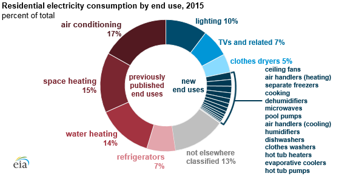

## Table of Contents

## What is electricity consumption analysis?

Electricity consumption analysis is the process of looking at how much electricity is used and figuring out patterns and reasons behind the usage. It helps people and businesses understand where their electricity goes, like which appliances or machines use the most power. By doing this analysis, they can find ways to use less electricity and save money on their bills. It also helps in planning for future energy needs and making sure there's enough power available when it's needed.

This analysis can be done using special tools and software that collect data from electric meters. These tools can show detailed information about electricity use over time, like daily, weekly, or monthly patterns. For example, they might show that a lot of electricity is used in the morning when people are getting ready for work, or at night when they are using lights and watching TV. By understanding these patterns, people can make changes, like using energy-saving light bulbs or running heavy appliances during off-peak times when electricity is cheaper.

## Why is it important to analyze electricity consumption?

Analyzing electricity consumption is important because it helps us understand how we use electricity and where we can save money. By looking at the data, we can see which appliances or machines use the most power. This can help us make smart choices, like turning off lights when we leave a room or using energy-saving light bulbs. It also helps us find out if there are any problems, like a machine that is using more electricity than it should because it needs to be fixed.

Another reason why analyzing electricity consumption is important is that it helps us plan for the future. By knowing how much electricity we use now, we can predict how much we might need later. This is useful for big companies and cities that need to make sure there is enough power for everyone. It also helps us think about using renewable energy sources, like solar or wind power, to meet our needs in a way that is good for the environment.

## What are the basic tools needed for electricity consumption analysis?

To analyze electricity consumption, you need some basic tools. The main tool is an electric meter, which measures how much electricity you use. There are different types of meters, like digital meters that show numbers on a screen or smart meters that can send data to your computer or phone. Another important tool is a data logger, which records the electricity usage over time. This helps you see patterns in your electricity use, like when you use the most power.

Software is also important for analyzing electricity consumption. There are programs that can take the data from your meter or data logger and turn it into graphs and charts. These visuals make it easier to understand your electricity use. Some software can even suggest ways to save energy based on your usage patterns. All these tools together help you see where your electricity goes and how you can use less of it.

## How can one start monitoring their electricity usage at home?

To start monitoring your electricity usage at home, the first thing you need is a good electric meter. You might already have a basic meter that shows numbers, but a smart meter is even better because it can send data to your phone or computer. If you don't have a smart meter, you can get a data logger that connects to your regular meter and records how much electricity you use over time. This helps you see when you use the most power, like in the morning when everyone is getting ready for school or work.

Once you have the right tools, you can use software to help you understand your electricity usage. There are many apps and programs that can take the data from your meter or data logger and turn it into easy-to-read graphs and charts. These visuals show you patterns in your electricity use and can even suggest ways to save energy. For example, the software might tell you to turn off lights when you leave a room or to use big appliances like the washing machine during off-peak times when electricity is cheaper. By using these tools, you can make smart choices about how to use less electricity and save money on your bills.

## What are the common units of measurement for electricity consumption?

The most common unit of measurement for electricity consumption is the kilowatt-hour (kWh). A kilowatt-hour is the amount of electricity used when a device that needs 1,000 watts of power runs for one hour. For example, if you have a 1,000-watt heater and you use it for one hour, you will have used 1 kilowatt-hour of electricity. This unit is used on your electricity bill to show how much power you have used over a billing period, like a month.

Another unit you might see is the watt-hour (Wh), which is smaller than a kilowatt-hour. One kilowatt-hour is equal to 1,000 watt-hours. Watt-hours are often used for smaller devices or for shorter periods of time. For instance, if you use a 100-watt light bulb for 10 hours, you will have used 1,000 watt-hours, or 1 kilowatt-hour, of electricity. Understanding these units helps you keep track of your electricity use and find ways to save energy.

## How does electricity consumption vary by season and what causes these variations?

Electricity consumption changes with the seasons because of the weather and how people use their homes. In the summer, people often use more electricity because it's hot outside. They turn on air conditioners and fans to stay cool, which uses a lot of power. Also, the days are longer, so people might use more lights in the evening. In the winter, people use more electricity for heating their homes, like with electric heaters or heat pumps. They might also use more lights because it gets dark earlier in the day.

These seasonal changes in electricity use are also affected by what people do at different times of the year. For example, in the summer, people might use more electricity for things like swimming pools or outdoor lighting for barbecues. In the winter, people might use more electricity for holiday lights and decorations. Also, the weather can play a big role. If it's very cold or very hot, people will use more electricity to keep their homes comfortable. By understanding these patterns, people can find ways to save energy and lower their electricity bills.

## What are the typical patterns of electricity consumption in residential versus commercial buildings?

In residential buildings, electricity consumption usually follows a daily pattern based on when people are home. In the morning, there's a peak when people wake up and use things like lights, coffee makers, and maybe the washing machine. Then, usage drops during the day when most people are at work or school. It goes up again in the evening when people come home and start cooking, watching TV, and using lights. On weekends, the pattern can be different because people are home more, so they might use more electricity during the day. Seasonal changes also affect residential use, with more electricity used for heating in winter and cooling in summer.

In commercial buildings, the pattern of electricity consumption is different because it's tied to business hours. During the day, when businesses are open, there's a lot of electricity used for lights, computers, and other office equipment. The peak times are usually during the workday, and usage drops off at night and on weekends when the building is empty. However, some businesses like restaurants or hospitals might have different patterns because they are open late or all the time. Just like in homes, commercial buildings use more electricity in summer for air conditioning and in winter for heating, but the overall pattern is more about when the business is operating.

## How can data analytics be used to improve electricity consumption efficiency?

Data analytics can help make electricity use more efficient by looking at the numbers and finding patterns. When you collect data about how much electricity you use and when you use it, you can see where you might be wasting power. For example, if you notice that your electricity use goes up a lot in the evening, you might find out that you're using too many lights or leaving appliances on. By using data analytics, you can figure out which things use the most electricity and make changes to use less. This could mean turning off lights when you leave a room, using energy-saving light bulbs, or running big appliances like the washing machine at times when electricity is cheaper.

In businesses, data analytics can help even more. Companies can use special software to look at their electricity use over time and see if there are any problems, like machines that are using too much power. They can also find out when they use the most electricity and plan to use less during those times. For example, a factory might find out that it uses a lot of electricity during the day and decide to run some machines at night when electricity costs less. By using data analytics, businesses can save money on their electricity bills and use energy in a smarter way.

## What are the advanced technologies used for real-time electricity consumption monitoring?

Advanced technologies for real-time electricity consumption monitoring include smart meters and IoT devices. Smart meters are special meters that can send data about your electricity use to your phone or computer right away. This means you can see how much electricity you're using at any moment, not just at the end of the month when you get your bill. IoT devices, or Internet of Things devices, are things like smart plugs and sensors that can be connected to the internet. They can track how much electricity each appliance in your home uses and send that information to you in real time.

Another technology is energy management systems, which use software to collect and analyze data from smart meters and IoT devices. These systems can show you graphs and charts that make it easy to understand your electricity use. They can also suggest ways to save energy, like turning off devices when you're not using them or using big appliances during times when electricity is cheaper. By using these advanced technologies, you can keep an eye on your electricity use and make smart choices to save money and use less power.

## How do smart grids contribute to electricity consumption analysis and management?

Smart grids help with electricity consumption analysis and management by using special technology to keep track of how much electricity is used and where it goes. They use smart meters that send information about electricity use to a central system right away. This means people can see their electricity use in real time and make quick changes to save energy. For example, if someone sees that they are using a lot of electricity in the evening, they can turn off lights or unplug devices they are not using. Smart grids also help power companies see where there might be problems, like a part of the grid that is using too much power, so they can fix it before it causes a blackout.

Another way smart grids help is by making it easier to use renewable energy sources like solar and wind power. They can balance the electricity supply and demand better because they can see what is happening all over the grid. If there is a lot of solar power being made on a sunny day, the smart grid can send that power to places that need it. This helps use less electricity from non-renewable sources like coal and gas, which is good for the environment. By giving people and power companies more information and control, smart grids help everyone use electricity in a smarter and more efficient way.

## What are the economic impacts of optimizing electricity consumption in large-scale industries?

Optimizing electricity consumption in large-scale industries can save a lot of money. When industries use less electricity, they pay less on their bills. This can be a big deal because electricity costs can be a large part of their expenses. By using data to find out where they are using too much power, industries can make changes like fixing machines that use too much electricity or running them at times when electricity is cheaper. This helps them save money and stay competitive in their market.

Another economic impact is that optimizing electricity use can help industries grow. When they save money on electricity, they can use that money for other things like hiring more workers or buying new equipment. This can help them make more products and earn more money. Also, by using less electricity, industries can be seen as more environmentally friendly, which can attract more customers and investors who care about the environment. So, optimizing electricity consumption is not just good for saving money, but it can also help industries grow and be more successful.

## How can predictive modeling enhance electricity consumption forecasting and planning?

Predictive modeling helps with electricity consumption forecasting and planning by using past data to guess what will happen in the future. It looks at how much electricity was used before and finds patterns, like how usage changes with the weather or the time of day. This helps power companies and big businesses plan better. They can see when they will need more electricity and make sure they have enough power ready. It's like looking at the weather forecast to know if you need to bring an umbrella, but for electricity.

By using predictive modeling, companies can also save money and be more efficient. If they know when they will use the most electricity, they can buy power at cheaper times or use less when it's expensive. This helps them keep their costs down. Also, predictive modeling can help with using renewable energy sources like solar and wind power. If the model shows that there will be a lot of sunny days, the company can plan to use more solar power. This makes the whole system work better and helps the environment too.

## What is the electricity consumption in algo trading?

Algorithmic trading, or algo trading, denotes the use of computer algorithms to automate trading processes, executed at speeds and frequencies that surpass human capacity. Central to the functioning of this approach are data centers and communication networks, where electricity consumption is a critical [factor](/wiki/factor-investing). This section outlines how electricity serves these key components, delineates the challenges of high consumption rates, and contrasts the energy use in algorithmic and traditional trading methods.

In the landscape of [algorithmic trading](/wiki/algorithmic-trading), data centers play a pivotal role by housing the servers that process vast amounts of market data and execute trades at high speeds. These operations demand continuous, robust electrical power to maintain servers, cooling systems, and network connectivity. A typical data center supporting algorithmic trading requires significant energy for computational tasks and infrastructure cooling. As algorithms execute trades within milliseconds, the computing and network hardware must operate with minimal latency, leading to increased electricity consumption.

Beyond the sheer energy demands of data centers, the networks responsible for transmitting data between trading platforms and markets also consume electricity. These networks must deliver high-speed data transfer to ensure trade orders are executed rapidly, necessitating a power supply that supports sophisticated, high-frequency communication technologies.

The challenges attributed to high electricity consumption in algo trading are manifold. First, operational costs surge with increased energy usage, impacting the profitability of trading firms. Secondly, the environmental footprint grows, as higher electricity consumption often correlates with greater carbon emissions unless mitigated by renewable energy sources. Another significant challenge is managing heat output; increased energy use raises operational temperatures in data centers, thereby escalating the energy requirements for cooling systems and raising the risk of equipment failure if cooling is insufficient.

When comparing electricity consumption patterns between traditional trading and algorithmic trading, the distinctions are pronounced. Traditional trading, characterized by human decision-making and manual trade execution, generally consumes less electricity on trading floors and offices, where the focus is on fewer computational tasks and communication equipment. In contrast, algo trading necessitates extensive computation and continuous data analysis, leading to markedly higher electricity use due to the need for processing power, data storage, and rapid network communications.

To illustrate the contrasting patterns quantitatively, consider the power efficiency metric often expressed as Power Usage Effectiveness (PUE), where:

$$
PUE = \frac{\text{Total Facility Energy Usage}}{\text{IT Equipment Energy Usage}}
$$

Algorithmic trading environments tend to have higher PUE values due to the additional energy required not just for IT equipment but also for cooling and auxiliary infrastructures, compared to traditional trading environments that predominantly utilize energy for lighting and workspace climate control.

Conclusively, understanding the electricity consumption in algorithmic trading is crucial for optimizing costs, reducing environmental impacts, and evolving towards sustainable trading practices. As algorithmic trading continues to grow, addressing these energy challenges is imperative for the industry's sustainability and resilience.

## What are the trends in electricity consumption according to the analysis?

Algorithmic trading (algo trading) involves the use of computer algorithms to execute trades at speeds and frequencies that are impossible for human traders. This section examines the electricity consumption trends within algo trading environments, highlighting the statistical aspects, future projections, and the impact of technological advancements on energy efficiency.

### Statistical Analysis of Electricity Usage

Algorithmic trading demands substantial computational resources, particularly in data centers and high-performance computing (HPC) environments. According to recent studies, electricity consumption in these environments is significant, given the intensive data computation, storage, and transmission processes involved. For instance, a typical data center supporting algo trading operations may consume several megawatts (MW) of power, which translates to millions of kilowatt-hours (kWh) annually.

In mathematical terms, the total energy consumption $E$ of an algo trading operation can be expressed as:

$$
E = \sum_{i=1}^{n} P_i \times T_i
$$

Where:
- $P_i$ is the power demand of each component (e.g., server, network device) in watts.
- $T_i$ is the operational time of each component in hours.

Quantitative analysis indicates that algo trading environments account for a growing portion of the financial sector's energy footprint. This demand is driven by the need to process vast quantities of market data rapidly and execute trades instantaneously.

### Trends and Projections

The continuous growth of algo trading suggests a commensurate increase in electricity consumption. Studies project that as algorithmic trading gains market share, the associated energy demand will rise. For example, based on historical growth rates, electricity consumption in algo trading may increase by 10% annually in the coming years. This trajectory assumes no major disruptions in market conditions or technological interventions that could alter the status quo.

Moreover, the transition towards more complex algorithms and the integration of [artificial intelligence](/wiki/ai-artificial-intelligence) (AI) in trading strategies are expected to further escalate energy requirements. Advanced [machine learning](/wiki/machine-learning) models, which are increasingly used in trading algorithms, necessitate more powerful computing infrastructure, thus increasing electricity usage.

### Impact of Technological Advancements

Technological advancements, however, play a dual role by potentially mitigating the overall energy consumption even amidst growing trading activities. Developments in energy-efficient hardware, such as low-power processors and optimally designed data center architectures, contribute to reducing electricity demands. For instance, energy usage effectiveness (EUE), a metric for assessing data center efficiency, is continuously improving with innovations in cooling systems and server technologies.

Additionally, software optimization and improved algorithmic efficiency also influence electricity consumption. Algorithms can be designed to minimize computational complexity, reducing the number of operations required per transaction, which lowers power usage. Code optimization and the adoption of efficient programming languages further enhance performance without necessitating additional energy expenditure.

In summary, while algo trading presents a significant and growing electricity consumption challenge, technological advancements provide a pathway to greater energy efficiency. By leveraging these innovations, the sector can potentially offset the incremental energy demands associated with the increasing prevalence of algorithmic trading strategies.

## What are the factors affecting energy consumption in algo trading?

Algorithmic trading (algo trading) is deeply intertwined with energy consumption due to the computational requirements inherent in its processes. Several factors impact the level of electricity used in such trading environments, including market [volatility](/wiki/volatility-trading-strategies), high-frequency trading ([HFT](/wiki/high-frequency-trading-strategies)), and regulatory frameworks.

### Influence of Market Volatility on Energy Consumption

Market volatility can significantly affect energy consumption in algorithmic trading environments. During periods of high volatility, algorithms, especially those designed for high-frequency trading, typically execute more trades as they respond to rapid price changes and emerging patterns. This increased activity demands higher computational power. The mathematical framework for volatility can be represented by the standard deviation ($\sigma$) of asset returns, which reflects the degree of variation around the mean.

$$
\sigma = \sqrt{\frac{1}{N-1} \sum_{i=1}^{N} (R_i - \bar{R})^2}
$$

Where:
- $N$ is the number of returns in the dataset.
- $R_i$ is the return in period $i$.
- $\bar{R}$ is the average return.

Higher volatility ($\sigma$) tends to increase trading frequency, leading to greater energy demands as algorithms process and execute trades more rapidly.

### The Role of High-Frequency Trading in Driving Electricity Use

High-frequency trading (HFT) is a form of algorithmic trading characterized by extremely high speeds and turnover rates. HFT participants use sophisticated algorithms to execute numerous transactions at exceptionally high rates, often within milliseconds. This necessitates advanced computing infrastructure with substantial power needs for data processing, networking, and cooling.

An increase in HFT activity corresponds to escalated electricity consumption due to the constant need for high-speed computational power. Data centers housing HFT systems are equipped with powerful servers and network components, which significantly contribute to energy use. Efficiency improvements, such as utilizing more efficient chips or optimizing code, can mitigate some of this impact but require significant investment.

### Impact of Regulatory Frameworks on Energy Practices in Trading

Regulatory frameworks play a critical role in shaping the energy practices within the trading sector. For instance, the European Union's Markets in Financial Instruments Directive II (MiFID II) imposes stringent requirements on transaction reporting, increasing data processing and retention needs, thereby impacting energy consumption. While regulation aims to ensure transparency and fairness, the additional computational and storage requirements inherently lead to an uptick in energy use.

Regulations may also advocate for or incentivize energy efficiency and sustainability. By mandating certain energy-saving measures or providing guidelines for carbon footprint reduction, regulatory bodies can influence trading firms to adopt more energy-efficient practices and technologies.

In conclusion, the intricate relationship between market volatility and electricity consumption, the significant energy needs of high-frequency trading, and the implications of regulatory decisions all contribute to the patterns seen in energy use within algorithmic trading environments. Addressing these factors calls for integrated strategies that balance trading efficacy with environmental sustainability.

## References & Further Reading

[1]: Bergstra, J., Bardenet, R., Bengio, Y., & Kégl, B. (2011). ["Algorithms for Hyper-Parameter Optimization."](https://dl.acm.org/doi/10.5555/2986459.2986743) Advances in Neural Information Processing Systems 24.

[2]: ["Advances in Financial Machine Learning"](https://www.amazon.com/Advances-Financial-Machine-Learning-Marcos/dp/1119482089) by Marcos Lopez de Prado.

[3]: European Commission. (2018). ["MiFID II: New rules for investment intermediaries and trading venues become applicable."](https://finance.ec.europa.eu/regulation-and-supervision/financial-services-legislation/implementing-and-delegated-acts/markets-financial-instruments-directive-ii_en)

[4]: Matsui, S., Lee, K., & Lee, J. (2015). ["Energy Efficient Algorithms for Data Centers."](https://ieeexplore.ieee.org/document/9514712) Energies, 8(6), 5261-5278.

[5]: ["Quantitative Trading: How to Build Your Own Algorithmic Trading Business"](https://books.google.com/books/about/Quantitative_Trading.html?id=j70yEAAAQBAJ) by Ernest P. Chan.