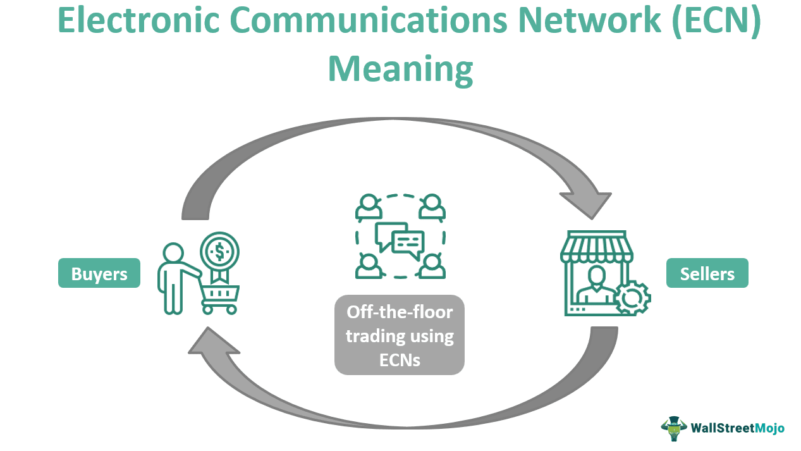

## Table of Contents

## What is an Electronic Communication Network (ECN)?

An Electronic Communication Network (ECN) is a type of computer system that helps people buy and sell stocks and other financial products. It works by connecting buyers and sellers directly, without needing a traditional stock exchange or a broker in the middle. This means that traders can trade at any time, even when the main stock markets are closed, because ECNs operate 24 hours a day.

ECNs are popular because they can offer better prices and faster trades. They do this by showing the best available prices from different sources and letting traders see all the current buy and sell orders. This transparency can help traders make better decisions and save money on fees that they might have to pay to brokers. Overall, ECNs make trading easier and more efficient for everyone involved.

## How does an ECN differ from traditional stock exchanges?

An ECN differs from traditional stock exchanges mainly in how they handle trading. Traditional stock exchanges, like the New York Stock Exchange, have a physical location where brokers and traders come together to buy and sell stocks during specific hours. They rely on intermediaries like brokers to match buyers and sellers. On the other hand, an ECN is an electronic platform that operates without a physical location and allows direct trading between buyers and sellers. This means that with an ECN, you can trade anytime, even outside the regular trading hours of traditional exchanges.

Another key difference is in the way prices are set and transactions are executed. Traditional exchanges often use an auction-like system where the highest bid and lowest ask prices are matched during trading sessions. This can sometimes lead to delays and higher costs due to the involvement of intermediaries. ECNs, however, provide real-time visibility of all buy and sell orders, enabling traders to see the best available prices and execute trades instantly. This transparency and speed can result in better prices and lower costs for traders, making ECNs a more efficient and cost-effective option for trading.

## What are the main benefits of using an ECN for trading?

One big benefit of using an ECN for trading is that you can trade at any time. Traditional stock exchanges have specific hours when they are open, but ECNs let you buy and sell stocks 24 hours a day. This is great for people who can't trade during the normal market hours or want to react quickly to news that happens outside of those times. Also, ECNs connect you directly with other traders, so you don't need a middleman like a broker. This can save you money on fees that you might have to pay to a broker.

Another benefit is that ECNs show you all the current buy and sell orders. This means you can see the best prices available and make better decisions about when to trade. Because everything is transparent, you can find the best deal and execute your trades faster. This can lead to better prices and lower costs overall. In short, ECNs make trading easier, faster, and often cheaper than using traditional stock exchanges.

## Who can use an ECN and what are the requirements?

Anyone who wants to trade stocks and other financial products can use an ECN. You don't have to be a professional trader; even regular people can use it. To get started, you need to open an account with a broker that offers access to an ECN. This broker will give you the tools and software you need to trade through the ECN.

There are a few requirements you should know about. First, you need to have enough money in your account to cover the trades you want to make. Some brokers might also ask you to keep a minimum amount of money in your account to use their ECN services. Second, you need to understand how to use the trading software and be comfortable making decisions on your own, since you'll be trading directly with other traders without a middleman.

## What types of securities are typically traded on an ECN?

ECNs are used for trading a variety of securities. The most common type of security traded on an ECN is stocks. These are shares in companies that people buy and sell to try to make money. Besides stocks, you can also trade other things like bonds, which are loans to companies or governments, and exchange-traded funds (ETFs), which are baskets of different investments that trade like stocks.

Another type of security you might find on an ECNs is options. Options give you the right, but not the obligation, to buy or sell a stock at a certain price before a certain date. Some ECNs also let you trade currencies, like dollars and euros, and even commodities, like gold and oil. So, ECNs offer a wide range of securities for traders to choose from, making them a versatile tool for different kinds of trading.

## How does an ECN facilitate after-hours trading?

An ECN makes after-hours trading possible by staying open all the time, even when traditional stock exchanges are closed. This means that if you want to trade stocks or other securities outside of normal market hours, you can still do it through an ECN. This is really helpful for people who can't trade during the day or want to react quickly to news that happens after the market closes.

When you use an ECN for after-hours trading, you can see all the buy and sell orders from other traders in real time. This lets you find the best prices and make trades right away, without waiting for the next trading day. This can be a big advantage because you don't have to wait to act on important information, and you can keep trading whenever you want.

## What are the typical fees associated with using an ECN?

When you use an ECN, you usually have to pay some fees. One common fee is the commission fee, which is what you pay to the broker for using their ECN services. This fee can be a fixed amount per trade or a percentage of the total value of your trade. Another fee you might see is the ECN fee, which is charged by the ECN itself for matching your buy and sell orders. This fee is often very small, sometimes just a few cents per share.

There can also be other costs to think about. For example, if you're trading after hours, you might have to pay a higher fee because there are fewer traders active, and it can be harder to match orders. Some brokers might also charge extra for using advanced trading tools or for accessing real-time data. It's a good idea to check with your broker to understand all the fees you might have to pay when using an ECN.

## How does an ECN match buy and sell orders?

An ECN matches buy and sell orders by connecting traders directly through its electronic platform. When you want to buy or sell a stock, you place an order on the ECN. The system then looks at all the other orders from other traders to find the best match. If you want to buy a stock, the ECN will try to find someone who wants to sell that stock at a price you're willing to pay. If it finds a match, the trade happens right away.

This process happens very quickly because the ECN shows all the current orders in real time. This means you can see all the buy and sell prices from other traders and make your decision based on the best available prices. The ECN keeps updating the list of orders, so as soon as a new order comes in that matches yours, the trade can be completed. This makes trading fast and efficient, and you don't need a middleman like a broker to help match the orders.

## What role do ECNs play in market liquidity and price discovery?

ECNs help make the market more liquid by connecting more buyers and sellers. When more people can trade at any time, there are more chances for trades to happen. This means that stocks and other securities can be bought and sold more easily, which is what [liquidity](/wiki/liquidity-risk-premium) is all about. If you want to sell your stock, it's easier to find someone who wants to buy it when there are more people trading. This can also help keep the market running smoothly because there's always someone ready to trade.

ECNs also help with price discovery, which is how the market figures out what a stock is worth. Because ECNs show all the current buy and sell orders, everyone can see the best prices available. This transparency means that the price of a stock can change quickly based on what people are willing to pay or sell for. When everyone can see all the orders, the price that people agree on is more likely to be fair and accurate. This helps the market work better because prices reflect what people really think a stock is worth.

## How do regulations affect the operation of ECNs?

Regulations play a big role in how ECNs work. Governments and financial watchdogs set rules to make sure that ECNs are fair and safe for everyone using them. These rules can cover things like how ECNs show prices, how they handle orders, and how they protect the information of their users. For example, ECNs have to follow rules that make sure they don't give some traders special treatment or hide important information from others. This helps keep the market fair and stops people from cheating.

These regulations can also affect how much it costs to use an ECN and what services they can offer. Sometimes, new rules might mean that ECNs have to change how they do things or add new features to meet the requirements. This can lead to more costs for the ECNs, which might then be passed on to the traders in the form of higher fees. But, these rules are important because they help keep the market honest and protect traders from fraud and other bad practices.

## What are some of the leading ECNs currently operating in the market?

Some of the leading ECNs currently operating in the market include Instinet, which is one of the oldest and most well-known ECNs. Instinet was started in 1969 and is now part of a bigger company called Nomura. Another big ECN is Archipelago, which merged with the New York Stock Exchange in 2006 to form NYSE Arca. This ECN is known for trading stocks, options, and ETFs. BATS Global Markets is also a major player. It started in 2005 and now handles a lot of trading in stocks and ETFs.

Another important ECN is Direct Edge, which was created in 2007 and later merged with BATS to form BATS Global Markets. This ECN focuses on giving traders fast and cheap ways to trade. Lastly, there's Nasdaq's ECN, called the Nasdaq OMX. It's part of the bigger Nasdaq exchange and helps traders buy and sell stocks and other securities. These ECNs are important because they help make trading easier and more efficient for everyone.

## What advanced trading strategies can be employed using ECNs?

ECNs allow traders to use advanced strategies like high-frequency trading. This is where computers make a lot of trades very quickly, trying to make small profits from tiny changes in stock prices. Because ECNs show all the buy and sell orders in real time, these computers can see the best prices and trade very fast. This can be a good way to make money if you have the right technology and know how to use it well.

Another strategy is called [algorithmic trading](/wiki/algorithmic-trading). This is where traders use computer programs to follow a set of rules for buying and selling stocks. These programs can look at a lot of information and make trades based on what they find. ECNs help with this because they let traders see all the orders and make trades quickly. This can help traders find the best times to buy or sell and make more money.

Some traders also use ECNs for after-hours trading strategies. Since ECNs are open all the time, traders can react to news or events that happen outside of normal market hours. For example, if a company announces good news after the market closes, traders can use an ECN to buy the stock right away, hoping the price will go up when the market opens again. This can be a good way to take advantage of opportunities that other traders might miss.

## How can ECN and Algo Trading be integrated?

The fusion of Electronic Communication Networks (ECNs) with algorithmic trading platforms significantly enhances the execution quality of trades regarding both speed and cost. ECNs function as conduits for trade orders, facilitating the automation of algorithmic trading strategies by ensuring liquidity and offering real-time price transparency. This seamless integration is pivotal for precision trading, enabling traders to capitalize on ephemeral market opportunities that may last mere seconds.

ECNs ensure that traders have unfettered access to market data, which is critical for algorithmic trading strategies that rely on timely and accurate information. By bridging the gap between buyers and sellers directly, ECNs eliminate the need for intermediaries, thus reducing latency and transaction costs. This direct access is essential for executing high-frequency trading strategies where even microsecond delays can affect profitability.

For instance, consider an algorithm programmed to execute [arbitrage](/wiki/arbitrage) opportunities between two exchanges. Utilizing an ECN, the algorithm can swiftly assess and react to price discrepancies, executing trades almost instantaneously. The formula for potential profit $P$ from such arbitrage can be represented as:

$$
P = \sum_{i=1}^{n} (S_{i} - B_{i}) - C
$$

where $S_{i}$ and $B_{i}$ are the selling and buying prices across $n$ trades, and $C$ is the cumulative transaction cost. The efficiency of this process hinges on the ECN’s ability to provide immediate market information and execute orders with minimal delay.

Moreover, ECNs facilitate the dynamic adaptation of trading algorithms to fluctuating market conditions, enhancing their ability to optimize trade execution continually. This adaptability is particularly advantageous for strategies that require frequent recalibration based on market signals, such as dynamic hedging or [trend following](/wiki/trend-following).

By merging the direct market access provided by ECNs with algorithmic strategy execution, traders can achieve an optimized, streamlined trading operation. This synergy not only amplifies execution efficiency but also broadens the accessibility of sophisticated trading strategies, allowing individual traders to exploit technologies once limited to institutional players. 

In summary, the integration of ECNs with algorithmic trading results in an agile, cost-effective trading environment that enables rapid and precise responses to market dynamics, thus empowering traders to maximize their operational potential.

## References & Further Reading

[1]: Kirilenko, Andrei A., et al. "The Flash Crash: The Impact of High Frequency Trading on an Electronic Market." The Journal of Finance, vol. 68, no. 3, 2013, pp. 1370–1420.

[2]: Hasbrouck, J., & Saar, G. (2013). "Low-latency trading." *Journal of Financial Markets*, 16(4), 646-679.

[3]: Linton, O., O'Hara, M., & Zigrand, J. P. (2013). "The impact of high-frequency trading on market stability." *Journal of Financial Markets*.

[4]: Aldridge, I. (2013). ["High-Frequency Trading: A Practical Guide to Algorithmic Strategies and Trading Systems"](https://www.amazon.com/High-Frequency-Trading-Practical-Algorithmic-Strategies/dp/1118343506). Wiley.

[5]: Chaboud, A. P., Chiquoine, B., Hjalmarsson, E., & Vega, C. (2014). "Rise of the Machines: Algorithmic Trading in the Foreign Exchange Market." *The Journal of Finance*, 69(5), 2045–2084.

[6]: Lopez de Prado, M. (2018). ["Advances in Financial Machine Learning"](https://www.amazon.com/Advances-Financial-Machine-Learning-Marcos/dp/1119482089). Wiley.

[7]: Jansen, S. (2020). ["Machine Learning for Algorithmic Trading"](https://github.com/stefan-jansen/machine-learning-for-trading). Packt Publishing.

[8]: Mackenzie, D. (2007). "Is economics performative? Option theory and the construction of derivatives markets." *Journal of the History of Economic Thought*, 29(1), 29-52.