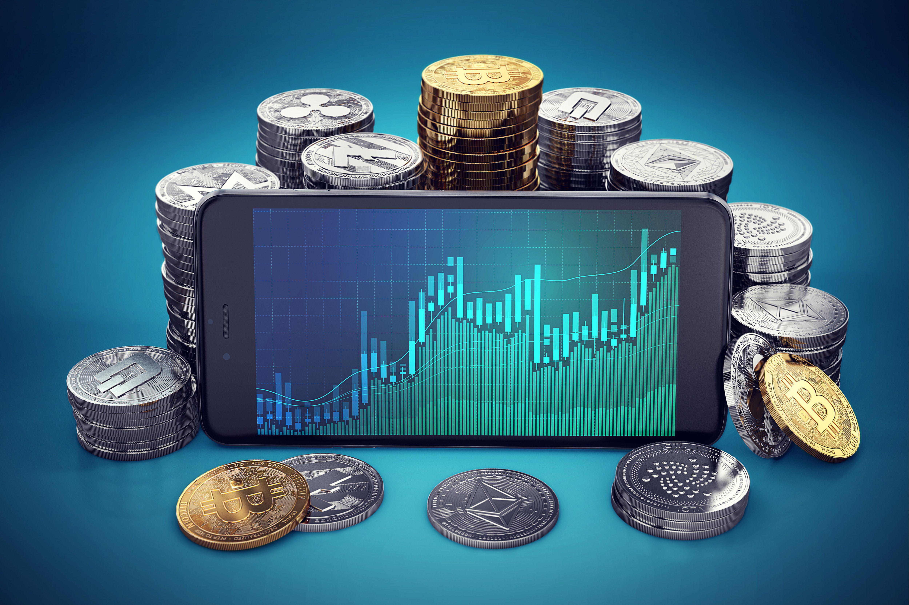

Electronic trading in financial markets has fundamentally transformed global finance by enabling faster and more efficient execution of trades (Chaboud et al., 2009). By moving away from traditional floor trading, electronic platforms now allow for seamless transactions across global markets, significantly reducing time and cost barriers. In particular, electronic trading has redefined currency trading, offering traders continuous access to the foreign exchange market. This development has given rise to unprecedented liquidity and market participation on a global scale.

Algorithmic trading further amplifies these benefits by employing advanced computational methods to execute trades based on pre-set parameters (Hendershott et al., 2011). This approach has led to the development of sophisticated trading strategies that can process vast amounts of market data faster than any human could, thereby optimizing trade outcomes. Algorithmic trading, which includes high-frequency trading (HFT), has become predominant in multiple asset classes, including currencies.



The growth of electronic and algorithmic trading presents both significant advantages and challenges. On one hand, traders benefit from lower transaction costs, wider market access, and improved trade execution. On the other hand, risks such as technological failures, increased market volatility, and potential market manipulation need to be carefully managed. Thus, understanding the intricacies of these trading systems is essential for both novice and experienced traders for navigating today's complex financial markets effectively.

References:
- Chaboud, A. P., Chiquoine, B., Hjalmarsson, E., & Vega, C. (2009). Rise of the Machines: Algorithmic Trading in the Foreign Exchange Market. FRB International Finance Discussion Paper, (980).
- Hendershott, T., Jones, C. M., & Menkveld, A. J. (2011). Does Algorithmic Trading Improve Liquidity? The Journal of Finance, 66(1), 1-33.

## Table of Contents

## What is Electronic Currency Trading?

Electronic currency trading involves the buying and selling of currencies via the internet through online brokers and trading platforms. This approach offers global and continuous access to the forex market, operating 24 hours a day, five and a half days a week. The online nature of electronic currency trading reduces the barriers to entry, granting traders from different geographic locations the opportunity to engage in the forex market at any time. 

The advantages of electronic currency trading are significant, primarily due to lower costs and increased market accessibility. Transaction costs are typically reduced because electronic trading eliminates many of the traditional fees associated with physical trading environments, such as brokerage commissions and transfer fees. Additionally, electronic trading platforms streamline the transaction process through efficient order matching and execution, thus saving time and improving the chances of capitalizing on favorable trades.

Currently, the majority of foreign exchange trading [volume](/wiki/volume-trading-strategy) is conducted electronically. Despite the dominance of electronic trading, not every currency pair is available for such transactions, especially those of emerging markets, which may require specific infrastructure or access through regional exchanges. Nonetheless, the efficiency and reduced cost structure of electronic trading have contributed to its ascendancy as the main form of trade in the [forex](/wiki/forex-system) market.

In conclusion, electronic currency trading has transformed the forex market by making it more accessible, cost-effective, and efficient, which benefits a broad range of traders from individual investors to large financial institutions.

## Understanding Algorithmic Trading

Algorithmic trading involves executing trades using pre-set computer programs or algorithms that consider a range of market factors such as price, timing, and volume. This sophisticated method employs computational power to execute trades more efficiently and swiftly than human traders. Its adoption is widespread across various financial markets, including stocks, derivatives, and currencies.

One of the prominent subsets of [algorithmic trading](/wiki/algorithmic-trading) is high-frequency trading ([HFT](/wiki/high-frequency-trading-strategies)), which is distinguished by its high turnover rates and rapid execution speeds. HFT strategies involve executing numerous trades at speeds measured in milliseconds or microseconds. The core benefits of HFT include the ability to capitalize on minute price discrepancies and the provision of [liquidity](/wiki/liquidity-risk-premium) to the markets.

Several strategies are implemented through algorithmic trading, each designed to exploit different market conditions. Arbitrage is a common strategy where algorithms seek to profit from brief price differences of a security across different markets or in different forms. For example, currency [arbitrage](/wiki/arbitrage) might involve buying a currency in one market at a lower price and simultaneously selling it in another market at a higher price.

Another strategy is [market making](/wiki/market-making), where algorithms provide liquidity by continuously quoting both buy and sell prices. By doing so, they profit from the bid-ask spread, which is the difference between the buying and selling prices. This strategy can stabilize markets by ensuring that trades can happen consistently.

Trend following is also widely used, where algorithms are programmed to detect and follow established market trends. These algorithms predict future price movements based on historical data trends, allowing traders to enter or [exit](/wiki/exit-strategy) positions at opportune times.

Python is often utilized in algorithmic trading to implement these strategies due to its extensive libraries and ease of use. A simple example of an algorithmic trading strategy in Python is:

```python
import numpy as np

def simple_moving_average(data, window_size):
    return np.convolve(data, np.ones(window_size)/window_size, mode='valid')

def execute_trade(prices, short_window, long_window):
    signals = np.zeros(len(prices))
    short_mavg = simple_moving_average(prices, short_window)
    long_mavg = simple_moving_average(prices, long_window)

    for i in range(len(short_mavg)):
        if short_mavg[i] > long_mavg[i]:
            signals[i + long_window - 1] = 1  # Buy signal
        elif short_mavg[i] < long_mavg[i]:
            signals[i + long_window - 1] = -1  # Sell signal

    return signals

# Example usage
prices = [100, 102, 101, 105, 110, 115, 120, 125]
signals = execute_trade(prices, short_window=3, long_window=5)
print(signals)
```

This code snippet demonstrates a simple moving average crossover strategy, where trades are triggered when a shorter-term moving average crosses a longer-term moving average. While elementary, such strategies can be significantly expanded and optimized, leveraging more complex mathematical models and data analytics for improved performance and profitability in the market.

## Currency Trading Strategies in Algorithmic Trading

Algorithmic trading has revolutionized currency trading by enabling the implementation of sophisticated strategies that leverage computational algorithms to execute trades with precision and speed. Among the most prominent strategies used in algorithmic trading are arbitrage, mean reversion, and [trend following](/wiki/trend-following).

Arbitrage in currency trading involves exploiting price discrepancies between different markets or financial instruments. By using these small differences in exchange rates, algorithms can execute trades rapidly to generate profit. An algorithm might, for instance, buy a currency on one platform where the price is lower and simultaneously sell it on another where the price is higher. This requires high-speed execution to capitalize on the fleeting nature of price discrepancies.

Trend following is another widely used strategy, which seeks to capitalize on established market patterns. These algorithms utilize historical data to anticipate future price movements based on observable trends. For example, if a particular currency pair shows a consistent upward trend, a trend following algorithm might initiate a buy order, hoping that the trend continues. This strategy banks on the persistence of market [momentum](/wiki/momentum).

Algorithmic trading also encompasses strategies focused on market timing. This involves predicting market movements to optimize buying or selling times, thereby maximizing returns. Algorithms equipped with predictive analytics can analyze massive datasets to identify market signals and decide the optimal time for trade execution.

Advanced algorithms are designed to process vast amounts of market data in real-time, enabling split-second decision-making. By employing techniques such as [machine learning](/wiki/machine-learning) and quantitative analysis, these algorithms continuously refine their strategies to maintain a competitive edge. This rapid processing capability allows traders to react swiftly to market changes and capitalize on emerging trends more effectively than human traders alone.

In summary, algorithmic trading facilitates the use of complex strategies such as arbitrage, trend following, and market timing by integrating computational power and data analytics, which result in more efficient trading and the potential for improved profitability in currency markets.

## Benefits and Challenges of Electronic and Algo Trading

Electronic and algorithmic trading have brought about significant advancements in the trading of financial instruments, particularly enhancing the speed and efficiency of trade execution. The automation inherent in these systems allows for trades to be completed in fractions of a second, which is notably beneficial in markets that demand quick decision-making, such as currency markets. This rapid execution capability is a cornerstone benefit that electronic trading offers, ensuring that traders can capitalize on fleeting market opportunities that would otherwise be missed with manual trading methods.

Algorithmic trading serves as a key contributor to market liquidity. By facilitating a continuous flow of automated transactions, it diminishes bid-ask spreads, thereby reducing transaction costs for participants. For instance, liquidity provision strategies, such as market making, use algorithms to quote buy and sell offers simultaneously, ensuring smoother market operations. This augmented liquidity not only aids traders by improving the ease of entry and exit but also enhances overall market efficiency.

However, the transition to electronic and algorithmic trading is not without challenges. One prominent risk is the potential for technological failures. System glitches or software bugs can lead to erroneous trades, impacting market dynamics significantly, as demonstrated during events like the "Flash Crash" of 2010.

Moreover, the very speed and complexity that benefit traders can also exacerbate market [volatility](/wiki/volatility-trading-strategies). Algorithms react to market movements based on predefined rules, which can lead to rapid and large-scale buy or sell orders, amplifying price swings in volatile markets. Such dynamics require traders and firms to exercise caution in their algorithm development and deployment strategies.

Market manipulation concerns also arise with algorithmic trading. The implementation of manipulative strategies, such as spoofing—a practice where traders place large orders intending to cancel them before execution to influence prices—is a potential threat. These actions can undermine market integrity, prompting increased scrutiny from regulatory bodies to enforce fair trading conditions.

Robust regulatory oversight is thus crucial. Regulators globally are implementing frameworks to manage the risks associated with algorithmic trading, ensuring that market practices remain ethical and transparent. These include regulations demanding rigorous testing of algorithms pre-deployment and monitoring their real-time market impact.

In conclusion, while the advantages of electronic and algorithmic trading systems—namely speed, efficiency, and cost reductions—are evident, traders must judiciously assess these benefits against the backdrop of technological risks and regulatory requirements. Maintaining a balanced perspective allows for the prudent use of these advanced trading mechanisms, ensuring they contribute positively to market operations and stability.

## The Future of Electronic and Algorithmic Trading

Advancements in technology are significantly shaping the future landscape of electronic and algorithmic trading. The integration of machine learning and [artificial intelligence](/wiki/ai-artificial-intelligence) (AI) into trading algorithms is a major trend. By enhancing predictive accuracy, these technologies enable traders to analyze vast datasets, identify patterns, and make informed trading decisions with unprecedented speed. For example, machine learning models can be trained to recognize complex market trends, adapt to new information, and optimize trading strategies in real-time.

The sophistication of trading systems is continually increasing, demanding constant adaptation from traders and financial institutions to maintain competitiveness. These systems can process large volumes of data with high efficiency, which necessitates the use of advanced computational techniques and extensive infrastructure. Computational finance often employs numerical methods and simulation techniques to model complex market phenomena. For instance, stochastic differential equations (SDEs) are frequently used to model the random behavior of asset prices over time. A typical form of an SDE used in financial modeling is:

$$
dS_t = \mu S_t dt + \sigma S_t dW_t
$$

where $S_t$ represents the asset price, $\mu$ is the drift term, $\sigma$ is the volatility, and $W_t$ is a Wiener process or Brownian motion.

As algorithmic trading becomes more complex, regulatory oversight and market scrutiny are also expected to increase. Regulators are tasked with ensuring that electronic trading systems operate fairly and do not disrupt market integrity. Regulatory changes may involve implementing safeguards against market manipulation, ensuring transparency, and promoting fair access to trading venues.

To thrive in this evolving market, traders and financial institutions must remain informed about new technological developments and regulatory changes. This may involve continuous learning and adaptation, as well as investing in research and development to refine trading algorithms and strategies. Additionally, risk management frameworks must be updated to accommodate the challenges posed by advanced trading technology and regulatory requirements.

In conclusion, the future of electronic and algorithmic trading is poised for significant transformation. By leveraging advancements in AI and machine learning, traders can enhance their predictive capabilities and maintain a competitive edge. However, this requires a commitment to ongoing adaptation in response to technological progress and regulatory evolution.

## Conclusion

Electronic and algorithmic trading have significantly transformed financial markets by enhancing the efficiency and accessibility of currency trading. The adoption of electronic trading platforms has led to faster trade execution and reduced costs, which have been pivotal in increasing market participation. However, alongside these advantages come challenges that traders must navigate carefully. The rapid technological advancements that drive these trading systems also introduce complexities, such as the risks associated with technological failures and market manipulation. These factors necessitate a balanced approach where traders weigh the benefits of speed and efficiency against the inherent risks in automated trading systems.

The continuing evolution of technology suggests that the trading landscape will only become more sophisticated and competitive. Traders who strategically harness algorithms and leverage technological tools will likely gain a significant edge in the market. Mastering algorithmic strategies can enable better prediction of market movements and more efficient execution of trades, which are critical in maintaining a competitive advantage.

Adapting to the ongoing changes in technology and regulation is crucial for all market participants. As machine learning and artificial intelligence become integral components of trading algorithms, being informed about these advancements and understanding their implications will be essential. Similarly, keeping abreast of regulatory developments ensures compliance and ethical trading practices. Ultimately, the ability to stay informed and adaptable will be key for traders and institutions aiming to thrive in an increasingly complex trading environment.

## References & Further Reading

[1]: Chaboud, A. P., Chiquoine, B., Hjalmarsson, E., & Vega, C. (2009). ["Rise of the Machines: Algorithmic Trading in the Foreign Exchange Market."](https://www.jstor.org/stable/43612951) FRB International Finance Discussion Paper, (980).

[2]: Hendershott, T., Jones, C. M., & Menkveld, A. J. (2011). ["Does Algorithmic Trading Improve Liquidity?"](https://onlinelibrary.wiley.com/doi/full/10.1111/j.1540-6261.2010.01624.x) The Journal of Finance, 66(1), 1-33.

[3]: Bergstra, J., Bardenet, R., Bengio, Y., & Kégl, B. (2011). ["Algorithms for Hyper-Parameter Optimization."](https://dl.acm.org/doi/10.5555/2986459.2986743) Advances in Neural Information Processing Systems 24.

[4]: ["Advances in Financial Machine Learning"](https://www.amazon.com/Advances-Financial-Machine-Learning-Marcos/dp/1119482089) by Marcos Lopez de Prado

[5]: ["Evidence-Based Technical Analysis: Applying the Scientific Method and Statistical Inference to Trading Signals"](https://www.amazon.com/Evidence-Based-Technical-Analysis-Scientific-Statistical/dp/0470008741) by David Aronson

[6]: ["Machine Learning for Algorithmic Trading"](https://www.amazon.com/Machine-Learning-Algorithmic-Trading-alternative/dp/1839217715) by Stefan Jansen

[7]: ["Quantitative Trading: How to Build Your Own Algorithmic Trading Business"](https://github.com/LucindaYa/quant-resources/blob/master/Quantitative%20Trading%20How%20to%20Build%20Your%20Own%20Algorithmic%20Trading%20Business.pdf) by Ernest P. Chan