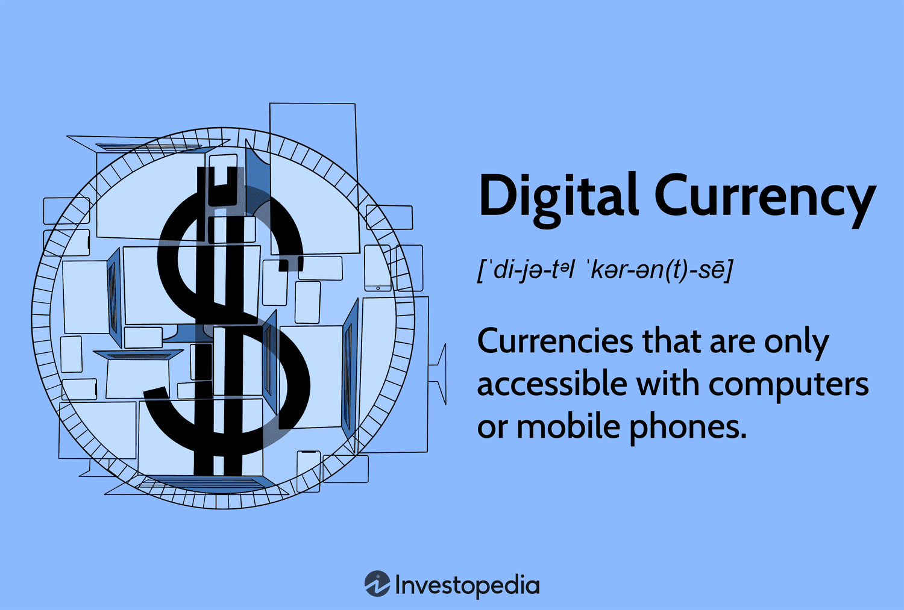

## Table of Contents

## What is electronic currency trading?

Electronic currency trading, also known as forex trading, is the buying and selling of different currencies using electronic platforms. It happens all over the world and all the time. People and big companies trade currencies to make money from changes in their values. They use computers and the internet to do this trading, which makes it fast and easy.

The main place where electronic currency trading happens is called the foreign exchange market, or forex market. This market is very big and active, with lots of money changing hands every day. Traders use special software and tools to watch the prices of different currencies and decide when to buy or sell. This kind of trading can be risky, but it can also be a way to make money if you know what you're doing.

## How does electronic currency trading differ from traditional currency trading?

Electronic currency trading and traditional currency trading are different mainly because of how they are done and how fast they can happen. In traditional currency trading, people used to go to a physical place, like a bank or a currency exchange office, to buy or sell different currencies. They would talk to someone in person or use a phone to make their trades. This way of trading could take more time and was not as easy to do from anywhere.

Electronic currency trading, on the other hand, uses computers and the internet. Traders can buy and sell currencies from anywhere in the world as long as they have a computer or a smartphone and an internet connection. This makes trading much faster and more convenient. With electronic platforms, traders can see real-time prices and make quick decisions, which is not possible with traditional methods. This speed and ease of access have made electronic trading very popular among traders.

## What are the basic steps to start trading electronic currencies?

To start trading electronic currencies, first you need to choose a reliable online broker. A broker is a company that lets you trade currencies on their platform. Look for a broker that is well-known, has good reviews, and is regulated by a financial authority. Once you pick a broker, you'll need to open an account with them. This usually involves filling out some forms with your personal information and maybe sending some documents to prove who you are.

After your account is set up, you need to put money into it. This is called making a deposit. You can usually do this with a bank transfer, a credit card, or other ways the broker accepts. Once you have money in your account, you can start trading. You'll use the broker's trading platform to watch the prices of different currencies and decide when to buy or sell. It's a good idea to start with small amounts of money until you get the hang of it. Trading electronic currencies can be risky, so it's important to learn as much as you can and maybe even practice with a demo account before using real money.

## What are the most popular electronic currency trading platforms?

Some of the most popular electronic currency trading platforms are MetaTrader 4 (MT4), MetaTrader 5 (MT5), and cTrader. MT4 is very popular because it's easy to use and has lots of tools that help traders make decisions. It's been around for a long time and many brokers offer it. MT5 is newer and has more features than MT4, like more types of orders and better charting tools. cTrader is also popular because it's fast and has a nice, easy-to-use design. It's good for traders who want to trade quickly and see what's happening in the market in real time.

Another well-known platform is TradingView, which is not just for currency trading but also for stocks and other investments. It's popular because it has a big community of traders who share ideas and strategies. It also has great charting tools that help traders see what's happening with different currencies. For people who want to trade on their phones, apps like eToro and Plus500 are popular. They let you trade from anywhere and have simple interfaces that are easy to understand. Each of these platforms has its own special features, so it's good to try a few to see which one you like best.

## What are the key factors to consider when choosing an electronic currency trading platform?

When choosing an electronic currency trading platform, one of the key factors to consider is the ease of use. The platform should have a clear and simple interface that you can understand easily. If it's too hard to use, you might make mistakes or miss out on good trading opportunities. Another important thing to look at is the tools and features the platform offers. Good platforms have tools like charts, indicators, and real-time data that help you make better trading decisions. It's also good if the platform lets you practice trading with a demo account before you start using real money.

Another factor to think about is the reliability and security of the platform. You want to make sure that your money and personal information are safe. Look for platforms that are regulated by financial authorities and have a good reputation. The platform should also work well and not have many technical problems, because any delay can affect your trading. Finally, consider the costs involved. Some platforms charge fees for trading or for keeping your account open. Make sure you understand all the costs so you can choose a platform that fits your budget and trading style.

## How do leverage and margin work in electronic currency trading?

Leverage and margin are important concepts in electronic currency trading. Leverage is like borrowing money from your broker to trade bigger amounts than you actually have. For example, if you have $1,000 and your broker gives you 100:1 leverage, you can trade as if you had $100,000. This can make your profits bigger if the trade goes well, but it can also make your losses bigger if it goes badly. So, leverage is a powerful tool, but it's also risky.

Margin is the amount of money you need to put down to open a leveraged position. It's like a deposit that you use to borrow the rest of the money from your broker. If you want to trade $100,000 with 100:1 leverage, you might only need to put down $1,000 as margin. But you have to be careful because if the trade goes against you and your losses get too big, your broker might ask for more money or close your position to cover the losses. This is called a margin call. So, understanding how leverage and margin work is really important for managing your risks in electronic currency trading.

## What are the common strategies used in electronic currency trading?

One common strategy in electronic currency trading is called the trend-following strategy. Traders using this strategy look at charts and other tools to see which way the price of a currency is moving. If they see that the price is going up, they will buy the currency hoping that it will keep going up so they can sell it later for a profit. If they see that the price is going down, they might sell the currency or "go short," hoping to buy it back later at a lower price. This strategy works well when the market is moving in a clear direction, but it can be risky if the trend suddenly changes.

Another strategy is called range trading. In this strategy, traders look for times when the price of a currency stays between two levels, called support and resistance. When the price gets close to the support level, traders might buy the currency, expecting it to go back up. When the price gets close to the resistance level, they might sell it, expecting it to go back down. This strategy can be good in markets that aren't moving much, but it can be hard to use if the price suddenly breaks out of the range.

A third strategy is called scalping. Scalpers make many small trades throughout the day, trying to make a little bit of money on each one. They use very high leverage to trade big amounts with small price movements. This strategy needs a lot of focus and quick decisions, and it can be very stressful. But if done right, it can add up to big profits over time. Each of these strategies has its own risks and rewards, so it's important for traders to pick the one that fits their style and goals.

## How can one manage risks in electronic currency trading?

Managing risks in electronic currency trading is very important because the market can be unpredictable and you can lose money. One way to manage risks is by using something called a stop-loss order. This is like setting a limit on how much you're willing to lose on a trade. If the price of the currency goes against you and hits your stop-loss level, the trade will close automatically, so you don't lose more than you planned. Another way is to not put all your money into one trade. This is called diversification. By spreading your money across different currencies or trades, you lower the chance that one bad trade will wipe out all your money.

Another important part of managing risks is to understand leverage and margin. Leverage can make your profits bigger, but it can also make your losses bigger. So, it's a good idea to use leverage carefully and not to trade with more money than you can afford to lose. Also, always keep an eye on your margin level. If your trades start losing money, you might get a margin call, which means you need to put in more money or your broker might close your trades. By keeping your leverage low and watching your margin, you can manage your risks better. Learning about the market and practicing with a demo account can also help you make better decisions and reduce risks.

## What are the regulatory considerations for electronic currency trading?

When you trade electronic currencies, you need to think about the rules and laws that govern this kind of trading. Different countries have different rules, and these rules are made to protect traders and keep the market fair. In many places, there are special organizations called financial regulators that watch over the brokers and trading platforms. These regulators make sure that the brokers follow the rules, treat their customers fairly, and keep their money safe. For example, in the United States, the Commodity Futures Trading Commission (CFTC) and the National Futures Association (NFA) are important regulators for forex trading.

It's a good idea to choose a broker that is regulated by a well-known financial authority. This can help make sure that your money is safe and that you're treated fairly. If you have any problems with your broker, you can go to the regulator for help. Also, you need to know about the rules in your own country because they might affect how you can trade. Some countries have strict rules about using leverage or trading certain currencies. By understanding and following these rules, you can trade more safely and avoid getting into trouble.

## How do global economic events impact electronic currency trading?

Global economic events can have a big impact on electronic currency trading. When something important happens in the world, like a change in interest rates by a big country's central bank, or a big political event like an election, it can make the value of currencies go up or down. Traders watch these events closely because they can create big changes in the market. For example, if a country's economy is doing well, its currency might become stronger because more people want to buy it. On the other hand, if there's bad news, like a country going into a recession, its currency might get weaker.

These events can also cause a lot of uncertainty in the market. When traders are not sure what will happen next, they might trade more carefully or try to protect themselves from big losses. This can lead to more trading and bigger price swings. For example, if there's a big meeting of world leaders and they can't agree on something important, it might make traders nervous and cause the prices of currencies to move a lot. So, understanding global economic events is really important for anyone who wants to trade electronic currencies successfully.

## What advanced tools and technologies are used by expert traders in electronic currency trading?

Expert traders in electronic currency trading use a lot of advanced tools and technologies to help them make better decisions and trade more effectively. One of these tools is algorithmic trading, where they use computer programs to buy and sell currencies automatically based on certain rules. These programs can analyze a lot of data very quickly and make trades faster than a human could. Another tool is technical analysis software, which helps traders look at charts and patterns to predict where the price of a currency might go next. This software often includes indicators and other tools that make it easier to see important information.

Another important technology is high-frequency trading (HFT), which lets traders make a lot of trades in a very short amount of time. This can be useful for strategies like scalping, where traders try to make small profits from tiny price changes. Expert traders also use risk management tools to help them keep their losses small. These tools can automatically close trades if they start losing too much money, which helps protect the trader's account. By using these advanced tools and technologies, expert traders can trade more efficiently and manage their risks better.

## What are the future trends and developments expected in electronic currency trading?

In the future, electronic currency trading is expected to keep growing and changing with new technology. One big trend is the use of artificial intelligence (AI) and machine learning. These technologies can help traders by looking at a lot of data and finding patterns that humans might miss. They can also make trading decisions automatically, which can be faster and sometimes more accurate than human traders. Another trend is the use of blockchain technology. Blockchain can make trading safer and more transparent because it keeps a record of all trades that can't be changed. This could help stop fraud and make the market more trustworthy.

Another important development is the rise of mobile trading. More and more traders are using their phones and tablets to trade currencies. This makes trading easier and more convenient because you can do it from anywhere. Also, there will be more focus on making trading platforms easier to use. This means that even people who are new to trading will be able to start more easily. Overall, these trends and developments will make electronic currency trading faster, safer, and more accessible to everyone.

## What is the Future of Electronic and Algorithmic Trading?

Advancements in technology are significantly shaping the future landscape of electronic and algorithmic trading. The integration of machine learning and [artificial intelligence](/wiki/ai-artificial-intelligence) (AI) into trading algorithms is a major trend. By enhancing predictive accuracy, these technologies enable traders to analyze vast datasets, identify patterns, and make informed trading decisions with unprecedented speed. For example, machine learning models can be trained to recognize complex market trends, adapt to new information, and optimize trading strategies in real-time.

The sophistication of trading systems is continually increasing, demanding constant adaptation from traders and financial institutions to maintain competitiveness. These systems can process large volumes of data with high efficiency, which necessitates the use of advanced computational techniques and extensive infrastructure. Computational finance often employs numerical methods and simulation techniques to model complex market phenomena. For instance, stochastic differential equations (SDEs) are frequently used to model the random behavior of asset prices over time. A typical form of an SDE used in financial modeling is:

$$
dS_t = \mu S_t dt + \sigma S_t dW_t
$$

where $S_t$ represents the asset price, $\mu$ is the drift term, $\sigma$ is the volatility, and $W_t$ is a Wiener process or Brownian motion.

As algorithmic trading becomes more complex, regulatory oversight and market scrutiny are also expected to increase. Regulators are tasked with ensuring that electronic trading systems operate fairly and do not disrupt market integrity. Regulatory changes may involve implementing safeguards against market manipulation, ensuring transparency, and promoting fair access to trading venues.

To thrive in this evolving market, traders and financial institutions must remain informed about new technological developments and regulatory changes. This may involve continuous learning and adaptation, as well as investing in research and development to refine trading algorithms and strategies. Additionally, risk management frameworks must be updated to accommodate the challenges posed by advanced trading technology and regulatory requirements.

In conclusion, the future of electronic and algorithmic trading is poised for significant transformation. By leveraging advancements in AI and machine learning, traders can enhance their predictive capabilities and maintain a competitive edge. However, this requires a commitment to ongoing adaptation in response to technological progress and regulatory evolution.

## References & Further Reading

[1]: Chaboud, A. P., Chiquoine, B., Hjalmarsson, E., & Vega, C. (2009). ["Rise of the Machines: Algorithmic Trading in the Foreign Exchange Market."](https://www.jstor.org/stable/43612951) FRB International Finance Discussion Paper, (980).

[2]: Hendershott, T., Jones, C. M., & Menkveld, A. J. (2011). ["Does Algorithmic Trading Improve Liquidity?"](https://onlinelibrary.wiley.com/doi/full/10.1111/j.1540-6261.2010.01624.x) The Journal of Finance, 66(1), 1-33.

[3]: Bergstra, J., Bardenet, R., Bengio, Y., & Kégl, B. (2011). ["Algorithms for Hyper-Parameter Optimization."](https://dl.acm.org/doi/10.5555/2986459.2986743) Advances in Neural Information Processing Systems 24.

[4]: ["Advances in Financial Machine Learning"](https://www.amazon.com/Advances-Financial-Machine-Learning-Marcos/dp/1119482089) by Marcos Lopez de Prado

[5]: ["Evidence-Based Technical Analysis: Applying the Scientific Method and Statistical Inference to Trading Signals"](https://www.amazon.com/Evidence-Based-Technical-Analysis-Scientific-Statistical/dp/0470008741) by David Aronson

[6]: ["Machine Learning for Algorithmic Trading"](https://www.amazon.com/Machine-Learning-Algorithmic-Trading-alternative/dp/1839217715) by Stefan Jansen

[7]: ["Quantitative Trading: How to Build Your Own Algorithmic Trading Business"](https://github.com/LucindaYa/quant-resources/blob/master/Quantitative%20Trading%20How%20to%20Build%20Your%20Own%20Algorithmic%20Trading%20Business.pdf) by Ernest P. Chan