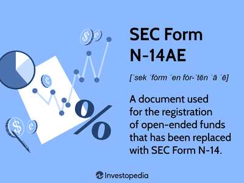

In today's fast-paced financial markets, data analysis and retrieval play a crucial role in algorithmic trading. With technology advancing rapidly, professionals in this domain are constantly seeking ways to gain a competitive edge. They leverage vast amounts of data to make informed and timely investment decisions. Algorithmic trading, which uses pre-programmed trading instructions to execute orders, benefits immensely from such data insights.

One of the primary sources of financial data for traders and analysts is the Electronic Data Gathering, Analysis, and Retrieval system (EDGAR). Managed by the U.S. Securities and Exchange Commission (SEC), EDGAR provides access to crucial corporate filings, which include a wealth of financial information. Public companies are obligated to submit reports and disclosures that are essential for maintaining transparency with investors and regulators. These documents, available through EDGAR, offer an extensive overview of a company's financial health and performance.



The integration of data analysis, data retrieval, and EDGAR is transforming algorithmic trading strategies by enabling traders to respond swiftly to new information. Traders rely on quantitative models that can process historical and real-time data to predict market trends and execute trades. EDGAR filings, which enrich these data sets, contribute to the development of robust trading algorithms capable of identifying investment opportunities faster than traditional methods.

This article will explore the intersection of data analysis, data retrieval, EDGAR, and algorithmic trading, illustrating how they collectively shape modern investment strategies. By understanding their synergies, one gains insight into the future of trading and the continued evolution of financial markets.

## Table of Contents

## Understanding EDGAR: A Key Data Source

The Electronic Data Gathering, Analysis, and Retrieval system (EDGAR) is a pivotal tool maintained by the U.S. Securities and Exchange Commission (SEC), designed to streamline the submission and retrieval of corporate filings. Public companies must submit a myriad of critical documents through EDGAR, including quarterly and annual reports (10-Q and 10-K forms), proxy statements, and various other filings mandated by the SEC regulations. These filings provide a wealth of detailed information about a company's financial health, governance structure, and strategic developments.

EDGAR serves as a comprehensive database that allows investors, analysts, and traders to access essential financial statements, including balance sheets, income statements, and cash flow reports, which are indispensable for informed financial analysis and decision-making. Analyzing these documents can yield crucial insights into a company’s operational performance, financial stability, and compliance with regulatory requirements. Since the data within EDGAR directly influences stock market dynamics, its comprehensive retrieval and analysis are vital for identifying investment opportunities and risks.

The role of EDGAR is further emphasized by the enforcement of transparency in financial markets, ensuring that investors have consistent access to relevant and reliable data. This transparency is essential for maintaining fair market practices and fostering investor confidence. Therefore, EDGAR not only facilitates compliance with regulatory requirements but also functions as a crucial resource for stakeholders aiming to make data-driven investment decisions.

Given the structured and extensive nature of the data available in EDGAR, it can be leveraged for comprehensive analyses and to identify trends that may affect market conditions. This system aids traders and analysts in modeling potential outcomes and adjusting their strategies accordingly, thus offering a significant edge in the fast-paced world of financial markets.

## The Role of Data Analysis in Algorithmic Trading

Data analysis is fundamental in [algorithmic trading](/wiki/algorithmic-trading), as it encompasses the utilization of quantitative models to examine financial data and produce trading signals. The core of algorithmic trading lies in the interpretation and analysis of large datasets, both structured and unstructured. These include historical prices, EDGAR filings, and a plethora of other market information that can be leveraged to make informed trading decisions.

Traders employ advanced analytical tools that rely on statistical models to discern patterns and predict future market movements. Techniques such as time-series analysis and regression models are commonly used to identify trends and correlation among financial instruments. Moreover, [machine learning](/wiki/machine-learning) algorithms have gained prominence in recent years, offering powerful methods to handle and analyze complex datasets, leading to more refined predictive models.

Machine learning enhances data analysis by enabling the creation of models that can adapt and improve over time with exposure to new data. For instance, an algorithmic trader might use supervised learning to train a predictive model on historical data, reinforcing it with features extracted from EDGAR filings, such as company earnings and financial ratios.

A typical implementation might involve using Python to preprocess data and create a predictive model. The following code snippet illustrates how Python's `scikit-learn` library can be used for a simple linear regression model, which is a common foundation in statistical analysis:

```python
import pandas as pd
from sklearn.model_selection import train_test_split
from sklearn.linear_model import LinearRegression

# Load dataset
data = pd.read_csv('financial_data.csv')

# Feature selection
X = data[['historical_price', 'financial_metric_1', 'financial_metric_2']]
y = data['future_price']

# Split dataset into training and testing
X_train, X_test, y_train, y_test = train_test_split(X, y, test_size=0.2, random_state=42)

# Initialize and train the model
model = LinearRegression()
model.fit(X_train, y_train)

# Predict on new data
predictions = model.predict(X_test)
```

This script demonstrates how key financial metrics derived from EDGAR filings and market data can be integrated into a model to predict future prices, thus forming the basis for trading signals.

Machine learning models in algorithmic trading are not limited to linear regression; more complex algorithms such as support vector machines (SVM), random forests, and [deep learning](/wiki/deep-learning) networks are also employed to capture non-linear relationships and interactions among data points.

Besides generating trading signals, data analysis aids in risk management, a crucial aspect of trading. By examining historical performance and [volatility](/wiki/volatility-trading-strategies), traders can estimate the risk associated with particular strategies and adjust their algorithms to mitigate potential losses.

In summary, the role of data analysis in algorithmic trading is pivotal, enabling traders to create sophisticated models that parse vast datasets to uncover meaningful insights, informing their strategies and enhancing their competitive edge in fast-moving markets.

## Leveraging EDGAR for Data Retrieval in Trading

Traders and analysts retrieve data from EDGAR to analyze a company's financial health, cash flow, earnings reports, and other financial metrics. This system provides a valuable resource for obtaining comprehensive financial information about publicly traded companies, with the aim of making informed investment decisions. EDGAR's data repository includes filings like 10-Ks, 10-Qs, and 8-Ks, which provide detailed insights into a company's financial condition and operational performance.

Searchable through the SEC’s website, EDGAR offers more than two decades of corporate filings data. This extensive database enables users to access historical and current company reports. The data can be preprocessed and parsed using programming languages such as Python, facilitating efficient analysis. Python libraries, like BeautifulSoup and Pandas, are commonly employed to scrape and process financial data from EDGAR. Below is a simplified code snippet demonstrating how to use Python for such tasks:

```python
import requests
from bs4 import BeautifulSoup
import pandas as pd

# Example: Fetch and parse EDGAR filing data for a specific company
cik_code = '0000320193'  # CIK code for Apple Inc.
url = f"https://www.sec.gov/cgi-bin/browse-edgar?action=getcompany&CIK={cik_code}&type=10-K&count=10"

response = requests.get(url)
soup = BeautifulSoup(response.content, 'html.parser')

# Parse and extract filing details
table = soup.find('table', class_='tableFile2')
rows = table.find_all('tr')

# Extract required data into a DataFrame
filings_data = []
for row in rows[1:]:
    cols = row.find_all('td')
    filings_data.append([col.text.strip() for col in cols])

filings_df = pd.DataFrame(filings_data, columns=['Filing Type', 'Filing Date', 'Film Number', 'Document Link'])
print(filings_df)
```

Efficient data retrieval from EDGAR allows traders to react swiftly to new financial information and earn strategic advantages. By leveraging automated data extraction techniques, analysts can ensure timely access to critical financial disclosures that may affect stock valuations and market movements. Rapid retrieval and analysis of this data enable traders to anticipate market shifts and adjust their trading strategies accordingly, thereby enhancing their ability to capitalize on emerging opportunities and mitigate risks.

## Integrating EDGAR Data in Algorithmic Trading Systems

Algorithmic trading systems can integrate EDGAR data by implementing automated processes to handle the retrieval and analysis of financial documents from the EDGAR database. Python, a versatile and widely-used programming language in data science and finance, is particularly effective for this purpose. The process typically involves the use of web scraping techniques or APIs to efficiently extract relevant data.

For automated data download, Python libraries such as `requests` and `BeautifulSoup` can be employed to access and parse HTML content from the EDGAR website. However, this method requires careful attention to the SEC's terms of use regarding web scraping. An alternative and more efficient method is using APIs; these provide a structured and controlled means to access EDGAR data. 

For instance, the SEC provides RESTful APIs that return data in JSON format, making it easier to programmatically navigate and retrieve relevant documents such as 10-Qs and 10-Ks. The code snippet below demonstrates how to use Python to access EDGAR data via an API:

```python
import requests

def fetch_edgar_data(cik, accession_number):
    base_url = "https://www.sec.gov/edgar/"
    endpoint = f"data/{cik}/{accession_number}/index.json"

    response = requests.get(base_url + endpoint)
    if response.status_code == 200:
        return response.json()  # Returns the data in JSON format
    else:
        raise Exception("Failed to retrieve data from EDGAR")

# Example usage
cik = "0000320193"  # Example CIK for Apple Inc.
accession_number = "0001193125-21-124798"
edgar_data = fetch_edgar_data(cik, accession_number)
print(edgar_data)
```

Once data is retrieved, it can be fed into algorithmic trading systems where it's processed and analyzed to extract actionable insights. APIs allow seamless integration of these datasets into trading platforms, facilitating real-time analysis and enabling traders to make informed decisions quickly. This capability is crucial for maintaining a competitive edge in the fast-paced world of financial markets.

Moreover, the integration of EDGAR data extends beyond simple retrieval. It involves utilizing advanced analytical techniques and machine learning models to parse and interpret the data. Traders can automate the detection of specific financial indicators or signals within the filings that can influence investment strategies. By leveraging Python and machine learning libraries such as `pandas`, `NumPy`, `scikit-learn`, and `TensorFlow`, traders are equipped to develop models that support their trading algorithms.

In summary, integrating EDGAR data into algorithmic trading systems involves a sophisticated blend of automation for data retrieval and advanced analytics for decision-making. With the ongoing advancements in machine learning and [artificial intelligence](/wiki/ai-artificial-intelligence), the seamless integration and real-time processing of EDGAR data continue to be pivotal in enhancing the effectiveness and efficiency of algorithmic trading strategies.

## Challenges in Using EDGAR for Algorithmic Trading

While EDGAR is a critical tool for acquiring financial data, its use in algorithmic trading is not without challenges. One of the primary issues is data overload. The system contains a vast archive of corporate filings stretching back over two decades, leading to massive volumes of data that traders and analysts must sift through. Extracting meaningful insights from this sea of information requires sophisticated filtering and processing techniques. Parsing the unstructured text within these filings adds complexity, as the data is not uniformly structured, demanding advanced natural language processing methods to convert it into a usable format for algorithmic models.

The timeliness of data is another significant challenge. There can often be a delay between when a company files a document and when it becomes available on EDGAR, which may impede timely decision-making. This time lag can affect algorithmic trading strategies, as traders rely on the most current information to execute trades and capitalize on market movements.

Additionally, errors or omissions in company filings can lead to misleading data analysis. Given the self-reported nature of these documents, inaccuracies can occur, necessitating rigorous validation processes. Traders and analysts must cross-reference EDGAR data with other reliable data sources to ensure accuracy and mitigate potential risks associated with faulty data inputs.

To address these challenges, financial analysts may use techniques like Python scripting to automatically download and preprocess data, ensuring it is clean and structured before integration into trading systems. However, even with robust automation, the sheer [volume](/wiki/volume-trading-strategy) and complexity of data necessitate careful management and strategic oversight to maintain a competitive edge in the fast-paced world of algorithmic trading.

## Future Developments and Trends

The SEC's ongoing efforts to enhance EDGAR are set to revolutionize the accessibility and usability of financial data. Key among these advancements is the potential integration of artificial intelligence (AI) to improve the platform's search capabilities. AI technologies, such as natural language processing (NLP) and machine learning algorithms, could significantly streamline the retrieval of relevant information from the vast repository of financial documents. Enhanced search functionalities would allow traders and analysts to extract insights more efficiently, reducing the latency between data retrieval and decision-making.

As technology and data analytics continue to evolve, they promise to enable more sophisticated trading strategies and tools. Predictive analytics, powered by advanced machine learning models, can analyze complex datasets more effectively, uncovering patterns and trends that were previously unnoticed. By utilizing vast amounts of historical data combined with real-time information, these models can generate more accurate trading signals, thus boosting the efficacy of algorithmic trading strategies.

Algorithmic trading stands to benefit immensely from improvements in data accuracy and integration capabilities. The ability to seamlessly incorporate diverse data sources, including real-time market information, social media sentiment, and economic indicators, will likely enhance the precision of trading models. This integration can be achieved through application programming interfaces (APIs) that allow different data streams to converge into the trading platform in real time. The resulting holistic view of the market can aid in making more informed trading decisions, thereby bolstering market efficiencies.

Moreover, future enhancements in blockchain technology may also contribute to the reliability and traceability of financial data. A decentralized ledger could provide an immutable record of corporate filings and market transactions, adding a layer of transparency and trust to the data used in trading algorithms.

In summary, the intersection of advanced data retrieval technologies, improved analytical tools, and more integrated trading systems is poised to redefine the landscape of algorithmic trading. As EDGAR evolves, it will likely continue to be a pivotal resource for traders seeking to harness the power of data-driven strategies, ensuring that they remain at the forefront of financial market innovation.

## Conclusion

EDGAR remains an indispensable source of financial data for traders and analysts leveraging algorithmic trading strategies. Its comprehensive repository of corporate filings offers critical insights that drive informed trading decisions. By integrating EDGAR data with advanced data analytics and real-time trading systems, traders can gain a strategic edge. Such integration involves automating the acquisition, processing, and analysis of data, often employing tools like Python and APIs to streamline operations. This capability allows traders to rapidly respond to market movements, ensuring a timely and strategic approach to investment.

As technology continues to evolve, EDGAR is expected to maintain its role as a vital component of data-driven investment strategies. Innovations in data analytics, machine learning, and AI promise to enhance the precision and efficiency with which EDGAR data is utilized, potentially increasing both market efficiency and predictability. The ongoing advancements in these technologies will augment traders' ability to harness and integrate vast datasets, thus reinforcing EDGAR's position as a cornerstone of algorithmic trading. By driving future developments in automated and data-centric trading strategies, EDGAR will continue to shape the landscape of modern investment.

## References & Further Reading

[1]: ["Advances in Financial Machine Learning"](https://www.amazon.com/Advances-Financial-Machine-Learning-Marcos/dp/1119482089) by Marcos Lopez de Prado

[2]: ["Quantitative Trading: How to Build Your Own Algorithmic Trading Business"](https://github.com/LucindaYa/quant-resources/blob/master/Quantitative%20Trading%20How%20to%20Build%20Your%20Own%20Algorithmic%20Trading%20Business.pdf) by Ernest P. Chan

[3]: Bryzgalova, S., Pelger, M., & Zhu, J. (2020). ["Deep learning in asset pricing."](https://pubsonline.informs.org/doi/full/10.1287/mnsc.2023.4695) Stanford University Graduate School of Business Research Paper.

[4]: ["Machine Learning for Algorithmic Trading"](https://github.com/stefan-jansen/machine-learning-for-trading) by Stefan Jansen

[5]: U.S. Securities and Exchange Commission. ["EDGAR - How Do I Use EDGAR?"](https://www.sec.gov/search-filings)