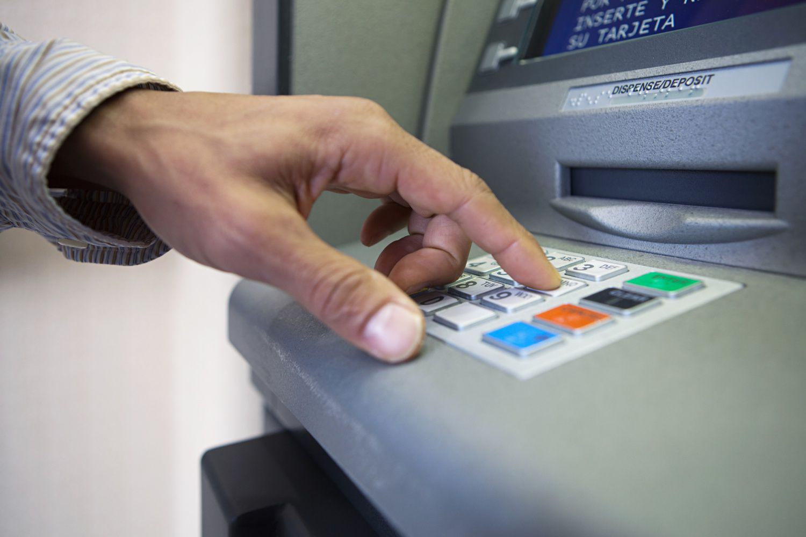

## Table of Contents

## What is the Electronic Fund Transfer Act (EFTA)?

The Electronic Fund Transfer Act (EFTA) is a law in the United States that protects people who use electronic ways to move money. This includes things like using ATMs, debit cards, and direct deposits. The law makes sure that banks and other financial places treat customers fairly when they use these services. It helps to stop mistakes and fraud, and it gives rules on what to do if something goes wrong.

One important part of the EFTA is that it limits how much money a person can lose if someone steals their debit card or ATM card. If you report a lost or stolen card before anyone uses it, you won't lose any money. If you report it within two business days of finding out it's gone, you can lose up to $50. If you wait longer than that, you could lose up to $500. And if you don't report it within 60 days of getting your bank statement, you could lose all the money that was taken out after those 60 days. This law helps to make sure people are not left without money if their card is stolen.

## When was the Electronic Fund Transfer Act enacted?

The Electronic Fund Transfer Act was enacted in 1978. This was a time when more and more people started using electronic ways to move their money around, like ATMs and direct deposits. The government saw that people needed protection when using these new services, so they made this law.

The EFTA helps make sure that banks and other financial places treat customers fairly. It sets rules on what to do if something goes wrong with an electronic transfer, like if there's a mistake or if someone steals your card. It's an important law that helps keep people's money safe when they use electronic services.

## What types of transactions are covered under the EFTA?

The Electronic Fund Transfer Act (EFTA) covers a lot of different ways people move money electronically. This includes when you use an ATM to take out or put in money, when you use your debit card to buy things, and when you get your paycheck put directly into your bank account. It also covers when you pay bills online, transfer money between your accounts, or use a phone to do banking.

The EFTA also protects you when you use point-of-sale terminals, which are the machines you use to pay with your debit card at stores. It includes transactions where you use your card to get cash back when you're shopping, and when you use your card to get money from a bank teller. All these ways of moving money are covered by the EFTA to make sure you're treated fairly and your money is safe.

## Who is protected by the Electronic Fund Transfer Act?

The Electronic Fund Transfer Act (EFTA) protects people who use electronic ways to move money. This includes anyone who has a bank account and uses things like ATMs, debit cards, or direct deposits. The law makes sure that banks and other places that handle money treat customers fairly and help them if something goes wrong.

The EFTA covers a lot of different people, like those who get their paychecks put directly into their bank accounts, people who use debit cards to buy things, and anyone who uses an ATM. It helps keep everyone's money safe when they use these electronic services. If someone's card is stolen or if there's a mistake with a transaction, the EFTA has rules to make sure the person doesn't lose too much money and gets help quickly.

## What are the key consumer rights provided by the EFTA?

The Electronic Fund Transfer Act (EFTA) gives people important rights when they use electronic ways to move money. One big right is the limit on how much money you can lose if someone steals your debit card or ATM card. If you tell your bank about a lost or stolen card before anyone uses it, you won't lose any money. If you report it within two days of finding out it's gone, you can lose up to $50. If you wait longer than two days, you could lose up to $500. And if you don't report it within 60 days of getting your bank statement, you could lose all the money taken out after those 60 days. This rule helps keep your money safe if your card gets stolen.

Another important right is that you can get your money back if there's a mistake with an electronic transfer. If you see a mistake on your bank statement, you have 60 days to tell your bank about it. Once you tell them, they have to look into it and fix any errors within a certain time. The EFTA also says that banks have to give you receipts for ATM transactions and point-of-sale purchases, and they have to send you a statement every month or every quarter if there are no transactions. These rules make sure you know what's happening with your money and can fix any problems quickly.

## What are the error resolution procedures under the EFTA?

If you see a mistake on your bank statement or if something goes wrong with an electronic transfer, the Electronic Fund Transfer Act (EFTA) has rules to help you fix it. You have 60 days from when you get your statement to tell your bank about the mistake. You need to give them your name, account number, and explain what the error is and why you think it's wrong. Once you tell them, they have to look into it and tell you what they find out within 10 business days.

If the bank needs more time to check things out, they can take up to 45 days, but they have to give you the money you say is missing while they look into it. This is called a provisional credit. If it turns out there was no mistake, you have to pay the money back. If the bank finds out there was a mistake, they have to fix it and give you back any money you lost because of it. These rules make sure you can get help quickly if something goes wrong with your electronic transfers.

## What are the liability limits for consumers under the EFTA if their card is lost or stolen?

If your debit card or ATM card is lost or stolen, the Electronic Fund Transfer Act (EFTA) has rules to limit how much money you can lose. If you tell your bank about the lost or stolen card before anyone uses it, you won't lose any money at all. If you report it within two business days of finding out it's gone, the most you can lose is $50. This helps protect you from losing a lot of money if someone steals your card.

If you wait longer than two business days to tell your bank, the most you can lose goes up to $500. It's important to report the loss quickly to keep your losses low. If you don't report it within 60 days of getting your bank statement, you could lose all the money that was taken out after those 60 days. So, it's a good idea to check your statements regularly and report any problems right away to stay protected under the EFTA.

## How does the EFTA regulate the disclosure of terms and conditions by financial institutions?

The Electronic Fund Transfer Act (EFTA) makes sure that banks and other places that handle money tell you clearly about the rules for using electronic services. They have to give you a written list of all the fees, charges, and limits that come with using things like ATMs, debit cards, and direct deposits. This list is called a disclosure. The bank has to give it to you when you open your account and whenever they change the rules.

The EFTA also says that banks have to tell you about any limits on how much money you can take out or transfer, and how long it takes for money to move from one place to another. They need to explain what happens if you make a mistake or if someone steals your card. All this information helps you understand what you're agreeing to when you use electronic services, and it helps you know what to do if something goes wrong.

## What are the requirements for preauthorized electronic fund transfers under the EFTA?

The Electronic Fund Transfer Act (EFTA) has rules about preauthorized electronic fund transfers, which are regular payments that come out of your account automatically. If you want to start one of these transfers, your bank has to give you a written notice about how it works. They need to tell you when the money will come out of your account, how much it will be, and how you can stop it if you want to. You have to agree to the transfer in writing or electronically, and the bank has to keep a record of your permission.

If you want to stop a preauthorized transfer, you need to tell your bank at least three business days before the next payment is supposed to happen. The bank has to follow your instructions and stop the payment. If they don't, and money comes out of your account anyway, they have to put it back. You can also ask for proof that the payment was stopped. These rules help make sure that you can control your money and stop payments if you need to.

## How does the EFTA address unauthorized electronic fund transfers?

The Electronic Fund Transfer Act (EFTA) helps protect you if someone uses your debit card or ATM card without your permission. If you tell your bank about a lost or stolen card before anyone uses it, you won't lose any money. If you find out it's gone and report it within two business days, the most you can lose is $50. But if you wait longer than two days to tell your bank, the most you can lose goes up to $500. If you don't report it within 60 days of getting your bank statement, you could lose all the money that was taken out after those 60 days. So, it's really important to tell your bank about a lost or stolen card as soon as you can.

The EFTA also says that if you see a mistake or an unauthorized transfer on your bank statement, you have 60 days to tell your bank about it. Once you tell them, they have to look into it and tell you what they find out within 10 business days. If they need more time, they can take up to 45 days, but they have to give you the money you say is missing while they look into it. This is called a provisional credit. If it turns out there was no mistake, you have to pay the money back. But if there was a mistake, the bank has to fix it and give you back any money you lost because of it. These rules help make sure you can get help quickly if something goes wrong with your electronic transfers.

## What are the penalties for non-compliance with the EFTA?

If a bank or financial place doesn't follow the rules of the Electronic Fund Transfer Act (EFTA), they can get in big trouble. The government can make them pay a lot of money as a penalty. This money is called a fine, and it can be up to $1,000 for each time they break the rules. The government can also make them pay back any money they took from people unfairly. This is to make sure banks and financial places follow the law and treat customers right.

People can also take the bank to court if they don't follow the EFTA. If someone wins the case, they can get back any money they lost, plus extra money for their trouble. This extra money is called damages, and it can be up to three times the amount of money they lost. The court can also make the bank pay for the person's lawyer fees. These rules help make sure that banks do what they're supposed to do and that people get help if they need it.

## How has the EFTA been amended or updated since its enactment, and what impact have these changes had?

Since the Electronic Fund Transfer Act (EFTA) was first made in 1978, it has been changed a few times to keep up with new ways of moving money. One big change came with the Dodd-Frank Wall Street Reform and Consumer Protection Act in 2010. This law added new rules to the EFTA to help protect people even more when they use electronic services. It made it so that banks have to tell people more clearly about fees and charges, and it gave people more time to report problems with their electronic transfers. These changes were important because they helped make sure the EFTA still worked well with all the new ways people were using to move money around.

Another important update to the EFTA came with the introduction of the Consumer Financial Protection Bureau (CFPB) in 2011. The CFPB took over the job of making sure banks followed the EFTA rules. They started doing more checks on banks and helped people understand their rights better. This change made the EFTA stronger because it gave people a place to go if they had problems with their bank. Overall, these updates have made the EFTA better at protecting people's money when they use electronic services, and they've helped keep up with new technology and ways of banking.

## References & Further Reading

[1]: Board of Governors of the Federal Reserve System. (2021). ["Electronic Fund Transfers (Regulation E)"](https://www.federalreserve.gov/publications/annual-report.htm) Compliance and Guidance Resources.

[2]: Consumer Financial Protection Bureau. (2013). ["Electronic Fund Transfers FAQs"](https://www.consumerfinance.gov/compliance/compliance-resources/deposit-accounts-resources/electronic-fund-transfers/electronic-fund-transfers-faqs/) Error Resolution Procedures.

[3]: European Central Bank. (2020). ["Algorithmic and High-Frequency Trading"](https://www.ecb.europa.eu/press/financial-stability-publications/fsr/focus/2016/pdf/ecb~1c31d95af7.fsrbox201605_03.pdf) Economic Bulletin, Issue 6/2020.

[4]: Securities and Exchange Commission. (2020). ["Office of Compliance Inspections and Examinations - Cybersecurity and Resiliency Observations"](https://www.sec.gov/files/OCIE%20Cybersecurity%20and%20Resiliency%20Observations.pdf) SEC Examination Insights.