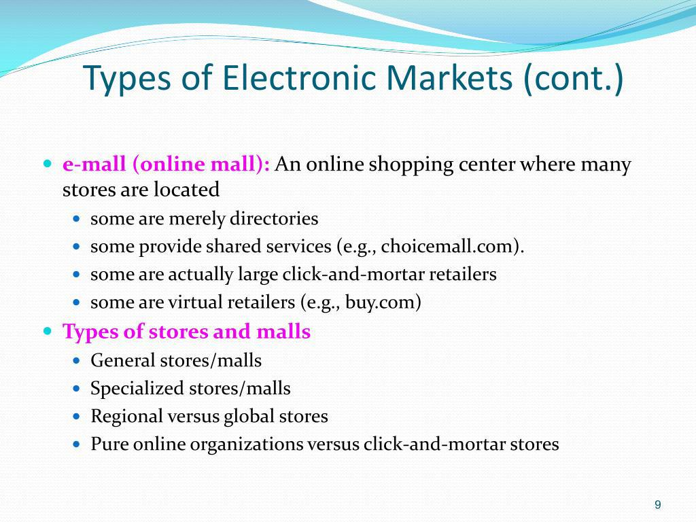

In algorithmic trading, electronic market making is a vital component in maintaining both market liquidity and efficiency. Market makers operate by providing simultaneous buy and sell quotes, which facilitates smoother transactions and aids in the process of price discovery. This seamless interaction not only enhances the ease with which trades are conducted but also significantly contributes to the overall stability of financial markets.

The focus of this article is to examine various aspects of electronic market making, specifically its core concepts, strategies employed, the benefits it offers, and the challenges it faces, all within the framework of algorithmic trading. As financial markets continue to evolve, gaining a comprehensive understanding of market making dynamics can offer traders a strategic advantage in executing trades that are not only profitable but also stable in nature.



Moreover, this discussion will extend to consider the future of market making, particularly as it is shaped by ongoing technological advancements and shifting market conditions. Recognizing these elements can be crucial for traders seeking to maintain competitiveness in a rapidly changing trading ecosystem.

## Table of Contents

## What is Electronic Market Making?

Electronic market making is a crucial function within financial markets, where market makers continuously provide bid and ask prices for various financial instruments. By standing ready to buy or sell at publicly quoted prices, market makers facilitate smoother transactions and enhance overall market liquidity. This continuous quoting reduces transaction costs and narrows the bid-ask spreads, making the trading environment more efficient for all participants.

A key source of profit for market makers lies in the bid-ask spread, which is the difference between the price at which they are willing to buy (the bid) and the price at which they are willing to sell (the ask). By capturing this spread, market makers can generate revenue while ensuring market stability. The constant presence of market makers allows traders to execute trades promptly, contributing to the overall efficacy of the market.

The evolution of technology has significantly transformed market making from a traditional, manual process to a highly automated and algorithm-driven procedure. Automation enables market makers to adjust their quotes in real-time, responding instantaneously to market conditions and information. This advancement allows for increased efficiency and precision in market making activities.

In mathematical terms, the market maker's bid-ask spread can be represented as:

$$
\text{Spread} = \text{Ask Price} - \text{Bid Price}
$$

Python code can be used to simulate simple market-making strategies, leveraging real-time data processing capabilities to maintain optimal spreads and quote management:

```python
class MarketMaker:
    def __init__(self, mid_price, spread):
        self.mid_price = mid_price
        self.spread = spread

    def calculate_quotes(self):
        bid_price = self.mid_price - self.spread / 2
        ask_price = self.mid_price + self.spread / 2
        return bid_price, ask_price

# Example:
market_maker = MarketMaker(mid_price=100, spread=1)
bid, ask = market_maker.calculate_quotes()
print(f"Bid Price: {bid}, Ask Price: {ask}")
```

This code snippet calculates the bid and ask prices based on a given mid-price and spread, an essential task in electronic [market making](/wiki/market-making) for adjusting quotes continuously to market conditions.

Overall, electronic market making functions as an invisible yet vital pillar of contemporary trading systems. Through technology and algorithm-driven strategies, it remains an indispensable element in ensuring efficient market operations and [liquidity](/wiki/liquidity-risk-premium) provision.

## Principles of Market Making

Market making operates on foundational principles essential for maintaining market fluidity and efficiency. These principles include liquidity provision, bid-ask spreads, order flow analysis, price discovery, and risk management.

Market makers are crucial in liquidity provision, ensuring there is enough liquidity by continuously quoting buy and sell prices. This constant presence allows traders to execute transactions without significant delay, thus aiding in market fluidity.

The bid-ask spread represents a central profit mechanism for market makers. By setting slightly higher selling prices compared to their buying prices, they exploit the difference, known as the spread, to generate profit. This requires a fine balance; maintaining competitive spreads is essential to attract participation while ensuring profitability.

Order flow analysis plays a vital role in effective market making. Market makers dynamically adjust their quotes by monitoring incoming transaction activities and order [books](/wiki/algo-trading-books). This process allows them to respond promptly to shifts in demand and supply, optimizing their buy-sell strategies and maintaining a competitive edge.

Price discovery is another critical aspect of market making. By being active participants, market makers contribute to determining fair market prices. The continual adjustment of quotes in response to market conditions helps reflect true value, ensuring transparency and price accuracy.

Lastly, risk management is indispensable in market making. Market makers leverage sophisticated risk management techniques to mitigate exposure, thus maintaining market stability. Strategies may include diversification, use of derivative instruments for hedging, and statistical models to predict and minimize adverse market movements. Effective risk control ensures that market makers can sustain operations even amidst volatile market conditions, safeguarding their capital and the broader market ecosystem.

## Market Making Strategies

Market making strategies are essential in maintaining liquidity and efficiency in financial markets. These strategies have evolved with technological advancements, allowing market makers to optimize their operations. Here, we explore the various strategies employed in electronic market making.

Traditional Market Making involves the manual adjustment of buy and sell quotes based on prevalent market conditions and demand-supply dynamics. This approach requires market makers to continually assess and interpret market signals, making discretionary decisions to provide liquidity and ensure competitive pricing. Although effective in certain market environments, it is labor-intensive and subject to human limitations.

Automated Market Making optimizes the traditional approach by employing algorithmic solutions for faster execution and continuous market condition monitoring. Algorithms are designed to react to real-time data inputs, facilitating immediate quote adjustments to accommodate changes in market dynamics. This enables market makers to efficiently manage a large number of transactions and reduce latency.

Statistical Arbitrage strategies focus on identifying and exploiting temporary price discrepancies between correlated financial instruments. By using statistical and quantitative models, market makers can spot mispricing opportunities and execute trades to capture profits. This approach relies heavily on data analysis and predictive modeling to identify entry and [exit](/wiki/exit-strategy) points.

Quote Management involves the use of sophisticated algorithms to maintain competitive bid-ask spreads and adapt to market changes. These algorithms continuously assess market depth, [volatility](/wiki/volatility-trading-strategies), and order flow to optimize quoting strategies. The primary goal is to ensure the market maker remains attractive to traders while minimizing risks associated with adverse selection.

Risk Hedging is crucial for mitigating potential losses due to adverse market movements. Market makers employ strategies such as stop-loss orders, which automatically sell a position once a set price is reached, limiting potential losses. Additionally, hedging techniques are employed to offset risk by taking positions in related instruments that are expected to move in opposite directions.

Together, these strategies enable market makers to provide essential services to financial markets, ensuring liquidity, stability, and efficient price discovery. As technology and markets evolve, so too will the strategies employed by market makers, emphasizing the need for continuous innovation and adaptation.

## Challenges and Risks

Execution risk is a critical concern in electronic market making, stemming primarily from latency and slippage. Latency refers to the delay between the execution of a market order and its corresponding network response time. Efficient latency management is crucial, as even microseconds can impact high-frequency trading strategies. Slippage, on the other hand, occurs when there is a difference between the expected price of a trade and the actual price at which the trade is executed. Both latency and slippage can significantly affect order execution timings and profitability, posing challenges for market makers.

High volatility presents another challenge for market makers, as it can lead to increased bid-ask spreads and erratic price movements. In periods of market instability, the risk of adverse price movements escalates, necessitating more dynamic and responsive market-making strategies to maintain profitability and mitigate potential losses.

The competitive environment in electronic market making is intensely fierce, contributing to narrower bid-ask spreads as numerous participants vie for advantage. This competition, while beneficial for market efficiency, places pressure on profit margins for individual market makers. As more algorithmic traders enter the market, distinguishing one's strategy and maintaining a competitive edge becomes increasingly challenging.

Regulatory compliance is a significant concern for market makers operating in multiple jurisdictions. Different regions impose distinct regulatory frameworks, requiring market makers to constantly adapt and ensure compliance with varying legal requirements. This necessitates a robust understanding of regional regulations and a flexible operational framework capable of addressing the dynamic regulatory landscape.

Finally, the dependence on advanced technology poses a continuous challenge. To remain competitive and efficient, market makers must invest in cutting-edge technology and infrastructure. This technological arms race requires constant upgrades and innovations, as well as ensuring the resilience and reliability of trading systems. The ability to harness the latest developments in technology is paramount for maintaining an edge in the fast-paced world of electronic market making.

## Benefits of Market Making

Electronic market making offers several benefits that significantly contribute to the efficiency and stability of financial markets. One of the primary advantages is the improvement of market liquidity. By continuously quoting buy and sell prices, market makers narrow the bid-ask spread, making it easier to trade instruments seamlessly. This continuous presence in the market ensures that traders can transact with minimal delays, thus facilitating a smoother trading experience.

Efficient price discovery is another significant benefit of market making. By reflecting real-time supply and demand dynamics, market makers help determine fair and accurate market prices. This transparency in pricing allows for better decision-making among traders and investors, ultimately enhancing market efficiency.

Market makers also contribute positively to risk management. The algorithms employed in electronic market making enable the effective control of risk exposure and inventory management. By dynamically adjusting quotes based on market conditions, market makers can limit potential losses and optimize their positions. The ability to hedge risks efficiently through stop-loss orders and other risk management tools is a crucial component of modern market making strategies.

Profit potential is a significant driver for market makers. The consistent capture of the bid-ask spread provides a steady revenue stream while contributing to broader market liquidity. By maintaining competitive spreads, market makers ensure that transactions happen at more favorable prices, which can attract more trading [volume](/wiki/volume-trading-strategy).

Market stability is another critical benefit brought about by active market making. By providing continuous quotes and engaging in regular trading, market makers help maintain an orderly trading environment. This activity reduces price volatility and prevents erratic price movements that can disrupt the market. In sum, electronic market making not only supports the functioning of financial markets but also enhances their robustness, making them more attractive to a diverse range of market participants.

## Future Outlook

The future of market making is poised for significant transformation driven by advancements in automation and increasingly precise algorithms. High-frequency trading ([HFT](/wiki/high-frequency-trading-strategies)) is expected to become more prevalent, capitalizing on ultra-fast execution speeds to optimize market making strategies. The core advantage of HFT lies in its ability to process vast amounts of market data in real-time, enabling market makers to adjust their positions and quotes almost instantaneously. This rapid execution capability is crucial for maintaining competitiveness in environments where market conditions can shift in milliseconds.

Another notable trend is the globalization of market making activities. As financial markets continue to integrate on a global scale, market makers are presented with opportunities to expand their operations across international markets and exchanges. This expansion is facilitated by advancements in technology, enabling market makers to operate seamlessly across different regulatory environments and time zones. The ability to navigate and leverage these diverse markets will be a key differentiator for successful market makers in the future.

Further innovations in technology are set to streamline execution processes and enhance operational efficiency. The integration of [machine learning](/wiki/machine-learning) and [artificial intelligence](/wiki/ai-artificial-intelligence) into market making algorithms holds the potential to refine decision-making processes, improve risk management, and optimize pricing strategies. For instance, [reinforcement learning](/wiki/reinforcement-learning) algorithms can be employed to adjust quoting strategies based on historical and real-time data, thereby maximizing profitability while minimizing risk.

Consider the Python code snippet below, which demonstrates a basic implementation of an algorithm that updates the quoting strategy based on real-time market conditions:

```python
import numpy as np

class MarketMaker:
    def __init__(self, initial_spread, learning_rate):
        self.spread = initial_spread
        self.learning_rate = learning_rate

    def update_quotes(self, market_data):
        # Simulate market data influence on spread
        spread_change = np.mean(market_data) * self.learning_rate
        self.spread += spread_change

    def get_quotes(self):
        # Calculate buy and sell prices based on spread
        buy_price = 100 - (self.spread / 2)
        sell_price = 100 + (self.spread / 2)
        return buy_price, sell_price

# Example usage
market_maker = MarketMaker(initial_spread=0.5, learning_rate=0.1)
market_data = np.random.normal(size=100)  # Simulating real-time market data
market_maker.update_quotes(market_data)
print(market_maker.get_quotes())
```

As the market landscape evolves, market makers are expected to maintain their pivotal role in preserving an efficient trading ecosystem. Despite the growing complexity and competition, the foundational principles of liquidity provision, efficient price discovery, and risk management will remain central to their operations. The continual enhancement of algorithms and technology will further empower market makers to adapt to changing market dynamics, ensuring their continued relevance in the financial markets.

In conclusion, the embrace of technological advancements and the strategic navigation of global market opportunities will define the future trajectory of market making. The integration of sophisticated algorithms, supported by state-of-the-art infrastructure, will allow market makers to enhance execution precision and capitalize on emerging market trends, thereby contributing to a more efficient and resilient financial trading environment.

## Conclusion

Electronic market making represents a crucial element of contemporary [algorithmic trading](/wiki/algorithmic-trading), ensuring the smooth functioning and operation of financial markets. By providing continuous buy and sell quotes, market makers facilitate efficient trading and enhance liquidity, which are essential for maintaining market stability and fairness. Understanding the fundamental principles, strategic approaches, and potential challenges of electronic market making is vital for traders who seek both profitability and market stability.

The trajectory of electronic market making is increasingly shaped by rapid advancements in technology and evolving trading practices. Automation and precision algorithms have revolutionized the speed and accuracy with which market makers operate, enabling them to respond swiftly to market changes and optimize their profit opportunities. As these technological progressions continue, market makers must adapt to remain effective in the evolving landscape of financial markets.

In an ever-changing market environment, market makers will continue to play a pivotal role in maintaining liquidity and ensuring efficient price discovery. Their ability to adapt to shifting market conditions and regulatory landscapes will be essential to their ongoing relevance and success. Ultimately, mastering the intricacies of market making can offer traders and financial institutions a strategic advantage, allowing them to navigate the complexities of today's dynamic trading environment with greater confidence and effectiveness.

## References & Further Reading

[1]: Kearns, M., & Nevmyvaka, Y. (2003). ["Machine Learning for Market Microstructure and High-Frequency Trading."](https://www.cis.upenn.edu/~mkearns/papers/KearnsNevmyvakaHFTRiskBooks.pdf) In JMLR: Workshop and Conference Proceedings.

[2]: Avellaneda, M., & Stoikov, S. (2008). ["High-frequency trading in a limit order book."](https://people.orie.cornell.edu/sfs33/LimitOrderBook.pdf) Quantitative Finance, 8(3), 217-224.

[3]: Harris, L. (2003). ["Trading and Exchanges: Market Microstructure for Practitioners."](https://www.amazon.com/Trading-Exchanges-Market-Microstructure-Practitioners/dp/0195144708) Oxford University Press.

[4]: Bouchaud, J. P., & Potters, M. (2003). ["Theory of Financial Risk and Derivative Pricing: From Statistical Physics to Risk Management."](https://www.cambridge.org/core/books/theory-of-financial-risk-and-derivative-pricing/5BBBA04CE72ED9E5E7C1C028D9A94FCB) Cambridge University Press.

[5]: Cartea, A., Jaimungal, S., & Penalva, J. (2015). ["Algorithmic and High-Frequency Trading."](https://assets.cambridge.org/97811070/91146/frontmatter/9781107091146_frontmatter.pdf) Cambridge University Press.

[6]: Özturan, C., & Tang, C. (2009). ["Market Making and Mean Reversion."](https://www.cis.upenn.edu/~mkearns/papers/marketmaking.pdf) Journal of Computational Finance. 

[7]: Kratz, P., Schöneborn, T., & Uhrig-Homburg, M. (2011). ["Market Making with Signals and Delta Hedging."](https://papers.ssrn.com/sol3/papers.cfm?abstract_id=1995421) Social Science Research Network (SSRN).

[8]: Gomber, P., Arndt, B., Lutat, M., & Uhle, T. (2011). ["High-frequency trading."](https://papers.ssrn.com/sol3/papers.cfm?abstract_id=1858626) In Annual Review of Financial Economics, 3(1), 467-497.

[9]: Aldridge, I. (2013). ["High-Frequency Trading: A Practical Guide to Algorithmic Strategies and Trading Systems."](https://www.amazon.com/High-Frequency-Trading-Practical-Algorithmic-Strategies/dp/1118343506) Wiley.

[10]: Lehalle, C. A., & Laruelle, S. (Eds.). (2013). ["Market Microstructure in Practice."](https://www.semanticscholar.org/paper/Market-Microstructure-in-Practice-Lehalle-Laruelle/2df52569ee044db799cc9ae865de4689847d6f83) World Scientific Publishing Company.