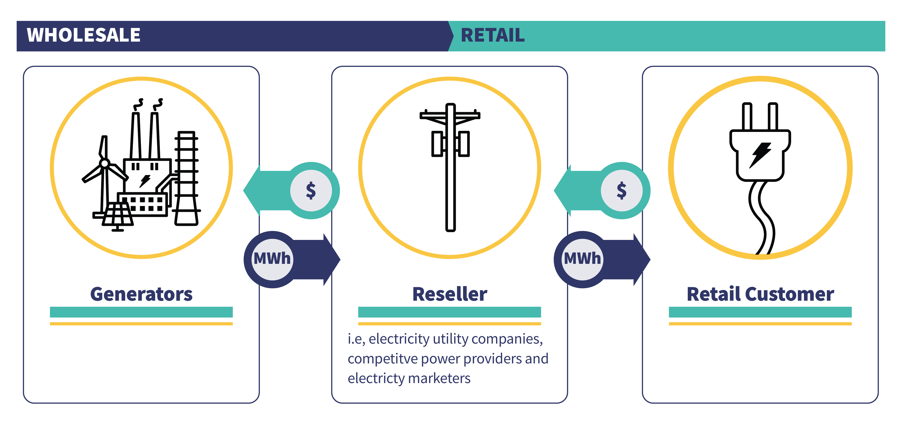

## Table of Contents

## What is Electronic Municipal Market Access (EMMA)?

Electronic Municipal Market Access, or EMMA, is a website run by the Municipal Securities Rulemaking Board (MSRB). It helps people find information about municipal bonds. These are bonds issued by states, cities, and other local governments to raise money for things like schools, roads, and hospitals. EMMA makes it easy for anyone to see details about these bonds, like how much they cost and when they will be paid back.

The website is very useful for investors who want to buy municipal bonds. They can use EMMA to look up bond prices, read official statements, and see if the bonds are a good investment. EMMA also shows important news and events that might affect the bonds, like rating changes or new financial reports. This helps people make smart choices about their investments.

## How does EMMA facilitate transparency in the municipal securities market?

EMMA helps make the municipal securities market more open and clear by giving people easy access to important information about municipal bonds. When you visit the EMMA website, you can see details like the bond's price, when it will be paid back, and how much interest it will earn. This means that anyone, not just big investors, can understand what they are buying. By showing all this information in one place, EMMA makes it easier for people to trust that the market is fair and honest.

EMMA also shares important updates and news about the bonds. If there are changes in the bond's ratings or new financial reports, EMMA will show these updates. This helps investors stay informed about any risks or changes that might affect their investments. By keeping everyone up-to-date, EMMA helps create a more transparent market where people can make better decisions based on the latest information.

## What types of documents and data are available on EMMA?

EMMA has a lot of different documents and data that you can look at. You can find official statements which tell you all about a bond, like how much it costs, when it will be paid back, and what the money will be used for. There are also continuing disclosures, which are updates that the bond issuers have to give about the bond's financial health. These can include things like yearly financial reports or notices about important events that might affect the bond.

You can also see trade data on EMMA. This shows you the prices at which bonds were bought and sold, which helps you understand what the bond is worth in the market. EMMA also has information about bond ratings from agencies like Moody's or Standard & Poor's, which tell you how safe the bond is considered to be. All of these documents and data help you make smarter choices about buying or selling municipal bonds.

## How can investors use EMMA to make informed decisions?

Investors can use EMMA to make smart choices by looking at all the information it offers about municipal bonds. They can see the official statements that tell them everything about a bond, like how much it costs and when it will be paid back. This helps them understand if the bond is a good fit for their investment goals. They can also check the trade data, which shows the prices at which bonds were bought and sold. This helps them know if the bond's price is a good deal or not.

EMMA also has continuing disclosures, which are updates from the bond issuers. These updates can include yearly financial reports or notices about important events that might change how safe the bond is. By keeping an eye on these, investors can stay informed about any risks or changes that might affect their investment. Plus, EMMA shows bond ratings from agencies like Moody's or Standard & Poor's, which help investors judge how safe the bond is. All this information together helps investors make better decisions about buying or selling municipal bonds.

## What are the steps to access and navigate the EMMA website?

To start using the EMMA website, open your web browser and go to emma.msrb.org. On the home page, you'll see a search bar at the top. You can type in the name of the bond or the issuer to find what you're looking for. If you're not sure what to search for, you can click on "Advanced Search" to use more options like the bond's CUSIP number or the state it's from. Once you've entered your search, hit the "Search" button and you'll see a list of results.

After you get your search results, you can click on a bond to see more details. On the bond's page, you'll find tabs like "Disclosure Documents," "Trade Activity," and "Credit Ratings." Click on these tabs to see the official statements, trade data, and ratings for the bond. If you want to learn more about how to use EMMA, there's a "Help" section at the top of the page where you can find guides and FAQs. This way, you can get all the information you need to make smart choices about municipal bonds.

## How does EMMA ensure the accuracy and timeliness of the information it provides?

EMMA works hard to make sure the information it shares about municipal bonds is correct and up-to-date. The Municipal Securities Rulemaking Board (MSRB) sets rules that make issuers and dealers send their documents and data to EMMA quickly. This means that when new information comes out, like financial reports or changes in bond ratings, it gets added to EMMA fast. By doing this, EMMA helps investors get the latest news without waiting.

To keep the information accurate, EMMA has systems in place to check the data that comes in. If there are mistakes or if something doesn't look right, EMMA can ask for fixes or more details. This way, the information stays reliable. EMMA also keeps a record of when documents were added, so investors can see how fresh the information is. All of this helps make sure that people using EMMA can trust the information they find.

## What role does the Municipal Securities Rulemaking Board (MSRB) play in EMMA's operation?

The Municipal Securities Rulemaking Board (MSRB) is very important for how EMMA works. The MSRB makes the rules that say what information has to be put on EMMA. They tell issuers and dealers of municipal bonds that they need to send their documents and data to EMMA quickly. This helps make sure that the information on EMMA is always up-to-date and useful for investors.

The MSRB also checks to make sure the information on EMMA is correct. They have ways to look at the data that comes in and can ask for changes if something is wrong. By doing this, the MSRB helps keep EMMA a trustworthy place for people to find out about municipal bonds. This makes it easier for everyone to make smart choices about their investments.

## How has EMMA evolved since its inception, and what future developments are anticipated?

Since it started in 2009, EMMA has changed a lot to make it easier for people to find information about municipal bonds. At first, it only showed official statements and some basic data. Over time, EMMA added more things like trade data, continuing disclosures, and bond ratings. They also made the website easier to use, with better search tools and a clearer layout. All these changes helped more people, not just big investors, use EMMA to learn about municipal bonds.

In the future, EMMA plans to keep getting better. They want to add more types of information and make the website even easier to use. They might also use new technology to help people find and understand bond information faster. The goal is to keep making the municipal bond market more open and easy for everyone to use, so people can make smart choices about their investments.

## What are the legal and regulatory requirements that issuers must follow when submitting data to EMMA?

When issuers submit data to EMMA, they have to follow certain rules set by the Municipal Securities Rulemaking Board (MSRB). These rules say that issuers need to send official statements and any updates about their bonds to EMMA. This includes things like yearly financial reports and notices about important events that might affect the bond. Issuers must do this quickly, so the information on EMMA stays fresh and useful for investors.

The MSRB also has rules to make sure the information is correct. If issuers make a mistake or if something doesn't look right, they might need to fix it or give more details. This helps keep the information on EMMA trustworthy. By following these rules, issuers help make the municipal bond market fair and open for everyone.

## How does EMMA integrate with other financial systems and databases?

EMMA works together with other financial systems and databases to help people get all the information they need about municipal bonds. It connects with systems like the Depository Trust & Clearing Corporation (DTCC) to get trade data. This means that when someone buys or sells a bond, that information can show up on EMMA quickly. EMMA also gets data from credit rating agencies like Moody's and Standard & Poor's, so investors can see how safe a bond is.

By pulling in information from these other places, EMMA makes it easier for people to understand the whole picture of a bond. It helps investors see not just the bond's price and when it will be paid back, but also how the bond is doing in the market and any new updates from the issuer. This way, EMMA gives a full view of the municipal bond market, making it a useful tool for anyone looking to invest in bonds.

## What advanced features does EMMA offer to professional traders and analysts?

EMMA has special tools that help professional traders and analysts do their jobs better. They can use something called the "Advanced Search" to find bonds quickly by using detailed filters like CUSIP numbers, bond types, or even the state where the bond was issued. This makes it easier for them to find exactly what they need without wasting time. They can also look at real-time trade data, which shows the latest prices at which bonds were bought and sold. This helps traders see market trends and make smart choices about when to buy or sell bonds.

Another useful feature for professionals is the ability to set up custom alerts. They can tell EMMA to send them a message when new information comes out about a bond they are interested in, like financial reports or changes in ratings. This keeps them up-to-date without having to check the website all the time. EMMA also has a tool called "Market Activity Reports," which gives detailed data about how the whole municipal bond market is doing. This helps analysts understand big trends and make better predictions about the future of the market.

## How can developers leverage EMMA's API for custom applications and data analysis?

Developers can use EMMA's API to make their own special tools and apps that help people learn about municipal bonds. The API lets them pull information from EMMA, like bond prices, official statements, and updates about the bonds. By using this data, developers can create apps that show bond information in new ways or help people keep track of their investments. For example, they might make an app that sends alerts when a bond's rating changes or shows graphs of bond prices over time.

To get started, developers need to sign up for an API key on the EMMA website. Once they have the key, they can use it to ask EMMA for the data they need. The API comes with instructions and examples that show how to use it, making it easier for developers to build their apps. By using EMMA's API, developers can help make the municipal bond market more open and easier to understand for everyone.

## References & Further Reading

[1]: ["EMMA: Your Access to the Municipal Securities Market"](https://emma.msrb.org/) - Municipal Securities Rulemaking Board

[2]: "Introduction to Municipal Bonds: The Investor's Guide to Municipal Securities" by Felix C. Frankfurter and Thomas W. Kenny

[3]: ["Quantitative Trading: How to Build Your Own Algorithmic Trading Business"](https://github.com/LucindaYa/quant-resources/blob/master/Quantitative%20Trading%20How%20to%20Build%20Your%20Own%20Algorithmic%20Trading%20Business.pdf) by Ernest P. Chan

[4]: ["Algorithmic Trading and DMA: An Introduction to Direct Access Trading Strategies"](https://www.amazon.com/Algorithmic-Trading-DMA-introduction-strategies/dp/0956399207) by Barry Johnson

[5]: ["Advances in Financial Machine Learning"](https://www.amazon.com/Advances-Financial-Machine-Learning-Marcos/dp/1119482089) by Marcos Lopez de Prado