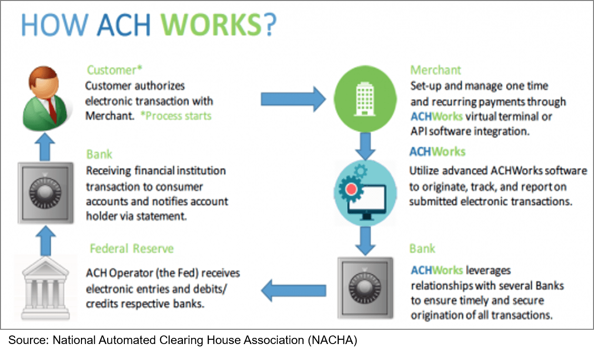

In the modern financial landscape, the Electronic Payments Network (EPN) is instrumental in facilitating seamless electronic fund transfers. As a critical component of the Automated Clearing House (ACH) system, EPN plays a vital role in enabling efficient, reliable, and secure transactions between financial institutions. This framework supports a wide array of financial transactions, helping businesses and individuals move money swiftly and securely.

The EPN’s relevance extends beyond basic transactions; it is pivotal in areas such as algorithmic trading and other electronic payment processes. In algorithmic trading, the speed and precision provided by EPN are crucial for executing high-frequency trades, where even a fraction of a second can impact trading outcomes. Similarly, for businesses managing large volumes of transactions, EPN ensures that money transfers are handled efficiently, minimizing delays and reducing transaction costs.



Understanding EPN's operations offers insights into its mechanisms and significance within the broader financial network. This includes a look at its compliance measures, which are essential for maintaining the integrity and reliability of the system. Furthermore, examining the future trends impacting EPN can reveal how it is evolving to meet the demands of the digital economy, particularly with innovations such as real-time payments and blockchain technology.

Overall, EPN supports businesses and the economy by reducing friction in transactions and enhancing financial stability. Its ability to adapt and incorporate emerging technologies ensures its continued relevance and utility in the rapidly changing financial services industry.

## Table of Contents

## Understanding the Electronic Payments Network (EPN)

The Electronic Payments Network (EPN) is a significant actor in the U.S. payment system, operating as a private-sector Automated Clearing House (ACH) operator. It specializes in processing electronic fund transfers for a wide array of financial institutions. By facilitating large-scale transactions such as payroll deposits, loan payments, and government benefits, EPN provides an essential platform for both credit and debit operations.

EPN's functionality is rooted in the concept of batch processing, a method that aggregates multiple payment transactions into a single batch for processing. This approach is significantly more efficient than processing each transaction individually, enabling significant cost savings and rapid processing times. Batch processing takes advantage of specific time windows to settle large numbers of payments simultaneously, thereby streamlining operations and ensuring that transactions are processed in an orderly and timely manner.

Moreover, EPN's role within the larger ACH network is fundamental. The ACH network is a nationwide system used for electronically transferring funds, and EPN acts as a pivotal component by facilitating the exchange and settlement of ACH transactions between different financial institutions. This network provides a reliable and uniform platform that standardizes transactions across the banking system, thereby ensuring interoperability among banks and financial organizations.

The EPN employs a sophisticated system that supports a variety of transaction types. By handling both bulk credits—including direct deposits—and debits—such as bill payments—it enhances financial operations across various sectors. The network's ability to process high volumes of transactions is instrumental for businesses that require dependable and efficient payroll and receivable solutions. 

Furthermore, the EPN's operations adhere to rigorous standards set by the National Automated Clearing House Association (NACHA), which oversees the ACH network and its transactions. This adherence ensures that EPN maintains high levels of reliability, security, and efficiency in all its operations. In essence, EPN's infrastructure and service offerings form a vital component of the financial ecosystem, ensuring smooth and secure financial transactions across the United States.

## History and Evolution of EPN

The Electronic Payments Network (EPN) emerged in the 1970s in response to the increasing demand for more efficient, reliable electronic payment methods. Initially, financial transactions were largely dominated by check-based systems, which posed challenges in terms of speed, cost, and security. EPN was conceived as a solution to streamline this process by facilitating electronic transfers, which marked a critical turning point in the financial sector.

The growth and transformation of EPN have been characterized by its shift from traditional methods to fully electronic environments. This evolution was driven by advancements in technology and growing consumer and business expectations for fast and secure transaction processing. EPN's adoption of batch processing methods allowed for the consolidation of numerous individual transactions into a single batch, which could then be processed more efficiently. This innovation not only improved the speed and reliability of payments but also offered cost savings to financial institutions and their clients.

A significant milestone in EPN's evolution was the introduction of same-day settlements. Prior to this advancement, electronic transactions often experienced significant delays, sometimes taking days to settle. The implementation of same-day settlement capabilities drastically reduced these delays, enabling real-time funds availability and improving [liquidity](/wiki/liquidity-risk-premium) for businesses and consumers alike. This enhancement aligned EPN with the rapid pace of modern financial markets, where the timely execution of transactions can be crucial.

Another pivotal development in EPN's history was the adoption of sophisticated encryption protocols. As electronic transactions grew in [volume](/wiki/volume-trading-strategy) and importance, ensuring the security and integrity of transaction data became paramount. EPN implemented advanced cryptographic techniques to safeguard sensitive data from unauthorized access and potential fraud. These security measures have become integral to EPN's operations, reflecting its commitment to maintaining the trust and confidence of its end users.

In conclusion, EPN's history is marked by strategic adaptations and technological innovations that have positioned it as a leader in electronic payment processing. Through milestones such as same-day settlements and enhanced security protocols, EPN has not only revolutionized how transactions are conducted but also set new standards in the industry.

## EPN and Algorithmic Trading

Algorithmic trading, which capitalizes on automated strategies and high-frequency transactions, gains substantially from the robustness of the Electronic Payments Network (EPN). EPN is structured to handle large volumes of transactions rapidly and reliably, which is essential for traders executing complex algorithms that demand quick decision-making based on market data.

EPN stands out due to its batch processing capabilities, enabling it to process numerous transactions simultaneously. This efficiency is crucial for [algorithmic trading](/wiki/algorithmic-trading) where transactions must be executed precisely at optimal times to exploit market inefficiencies. The network's capacity to process high volumes of transactions in short timeframes minimizes latency, a critical [factor](/wiki/factor-investing) impacting the performance of trading algorithms.

The technical infrastructure of EPN supports Standard Entry Class (SEC) codes, which include various types of transactions such as Web, Telephone-Initiated Entries (TEL), and Corporate Debit or Credit (CCD). These are integral to automated processes, allowing seamless integration with algorithmic trading systems. Python, often used in trading algorithms, can interface with APIs provided by financial institutions utilizing EPN, enabling automatic execution of trades based on pre-set conditions.

```python
import requests

def execute_trade(api_endpoint, trade_data):
    response = requests.post(api_endpoint, json=trade_data)
    if response.status_code == 200:
        print("Trade executed successfully")
    else:
        print("Trade execution failed")

# Example usage
trade_data = {
    "symbol": "AAPL",
    "quantity": 10,
    "action": "BUY"
}

execute_trade("https://api.tradingplatform.com/execute_trade", trade_data)
```

In algorithmic trading, data precision and reduced processing time are paramount. EPN's architecture supports these needs by ensuring secure and swift data travels between financial entities, facilitating the execution of high-frequency trading strategies that rely on millisecond-level transaction confirmations.

Moreover, EPN's commitment to security and compliance, such as adhering to Know Your Customer (KYC) and Anti-Money Laundering (AML) regulations, provides traders with a trustworthy platform for executing transactions. This trust is crucial for algorithmic trading, where any compromise in transaction integrity could result in significant financial losses.

EPN's ongoing enhancements, particularly in employing advanced encryption standards and real-time processing capabilities, align with the evolving demands of algorithmic trading. As the financial industry continues to innovate, EPN remains a pivotal infrastructure component, underpinning the execution of sophisticated trading strategies with speed and assurance.

## Comparing EPN with Other Payment Networks

The Electronic Payments Network (EPN) and the Federal Reserve's FedACH service are the two dominant operators in the Automated Clearing House (ACH) system in the United States. Both networks perform similar fundamental functions: processing high volumes of electronic transactions such as payroll, direct deposits, and vendor payments. Despite their shared role, there are significant differences between them, primarily stemming from EPN's status as a private-sector entity.

One of EPN's primary advantages is its ability to rapidly innovate and customize its services to meet the specific needs of its clients. As a private entity, EPN can implement advanced technological solutions and develop unique offerings without the constraints typical of public-sector organizations. This flexibility enables EPN to create tailored transaction solutions that can cater to more complex or specialized financial operations, offering businesses an edge in competitive markets.

On the other hand, FedACH, operated by the Federal Reserve, benefits from its integration with the broader network of Federal Reserve services and its robust infrastructure. FedACH provides a reliable and ubiquitous service across the country, ensuring that even the smallest financial institutions have access to the network. This universal reach is a defining strength of FedACH, making it an attractive option for processing nationwide transactions.

For businesses deciding between EPN and FedACH, several factors should be considered:

1. **Transaction Volume and Complexity**: Companies with high transaction volumes or those requiring specialized processing might benefit more from EPN's customizable services. 

2. **Geographical Coverage**: If a business primarily operates in remote or rural areas, FedACH's extensive reach might provide better service continuity and reliability.

3. **Cost Structure**: Each network has its pricing model, which may affect the overall costs depending on the transaction types and volumes processed.

4. **Innovation Needs**: Businesses looking for cutting-edge technological integration, such as real-time payments or blockchain applications, might find EPN's private-sector agility more conducive to innovation.

In conclusion, while both EPN and FedACH serve crucial roles in the ACH system, the choice between them depends largely on the specific operational demands and strategic goals of a business. By understanding the comparative strengths and limitations of these networks, companies can better align their transaction processing strategies with their broader financial objectives.

## Security and Regulatory Compliance

Security is integral to the operations of the Electronic Payments Network (EPN), where protecting transaction data and ensuring the authenticity of participants are paramount. EPN employs advanced encryption methodologies to secure electronic fund transfers against unauthorized access and cyber threats. These encryption protocols involve converting sensitive payment information into encoded formats, which can only be deciphered by authorized parties possessing the correct decryption key. The use of such encryption techniques minimizes the risk of data breaches and ensures that transaction details remain confidential.

In addition to encryption, EPN utilizes comprehensive fraud prevention mechanisms. These protocols are designed to detect and mitigate unauthorized activities by analyzing patterns in transaction data and identifying anomalous behavior indicative of fraudulent actions. Machine learning algorithms may be employed to enhance fraud detection accuracy, continuously learning from data patterns to improve anomaly detection capabilities.

EPN's operations are governed by stringent compliance standards, crucial for maintaining trust and reliability in electronic transactions. Key among these standards are Know Your Customer (KYC) and Anti-Money Laundering (AML) regulations. KYC protocols require financial institutions to verify the identities of their customers, curtailing fraudulent accounts and promoting transparency. AML regulations are implemented to prevent the flow of illicit funds within the system, mandating that financial transactions be scrutinized for suspicious activities that might indicate money laundering.

To ensure regulatory adherence, EPN collaborates with financial institutions and regulatory bodies, facilitating audits and compliance checks that uphold these standards. This collaboration aids in maintaining the integrity of the network, as it enforces accountability and ensures compliance with both domestic and international financial regulations.

By prioritizing sophisticated security measures and strict regulatory compliance, EPN reinforces the reliability and trustworthiness of its electronic payment services, safeguarding the financial stability of the institutions and individuals utilizing the network.

## The Economic and Business Impact of EPN

The Electronic Payments Network (EPN) significantly influences economic and business operations by offering a reliable and efficient platform for electronic transactions. As a cornerstone of the Automated Clearing House (ACH) network, EPN supports environments with high transaction volumes, which are essential for various business operations and overall economic stability. This involvement in the financial ecosystem showcases EPN's ability to enhance operational efficiency, minimize transactional costs, and improve cash flow management.

One of the primary benefits of EPN is its capability to streamline payroll processes. By automating bulk salary deposits through secure and timely transfers, businesses can ensure that employees receive their wages promptly. This automation reduces administrative overhead, mitigating errors associated with manual payroll processing. Consequently, employers can allocate resources more effectively, focusing on core business activities instead of routine payroll tasks.

Furthermore, EPN facilitates vendor and supplier payments, which is integral for maintaining smooth business operations. By using a reliable electronic platform to manage outbound payments, businesses can optimize their financial planning and execution. The prompt settlement of invoices reduces the risk of late payment fees and enhances vendor relationships, contributing to improved supply chain dynamics. This seamless payment process is crucial for businesses aiming to manage their accounts payable efficiently.

The cost-efficiency of EPN confers another significant advantage. Electronic transactions processed through EPN typically involve lower fees compared to traditional methods such as paper checks. This cost-effectiveness is particularly beneficial for businesses handling high volume transactions, where marginal savings per transaction can accumulate significantly. Additionally, electronic processing reduces the need for physical resources such as paper and postal services, aligning business practices with sustainable and eco-friendly initiatives.

EPN's role also extends to facilitating economic stability by supporting robust transaction volumes. By ensuring that funds are transferred securely and efficiently, EPN helps maintain liquidity in the financial system. This liquidity is crucial for economic activities as it enables continuous circulation of money, thus fostering business investments and consumer spending.

Overall, the capabilities of EPN contribute to economic efficiency by offering scalable, reliable, and secure transaction solutions. Its impact is evident in reduced operational costs, streamlined payment processes, and enhanced financial management for businesses. These benefits collectively foster a more dynamic and stable economic environment, underscoring EPN's critical role in contemporary finance.

## Future Directions and Trends

As digital technology progresses, the Electronic Payments Network (EPN) is poised to embrace several innovative trends that promise to reshape its service offerings and operational scope. One such trend is the advancement toward real-time payments. Real-time payments systems enable transactions to be completed almost instantaneously, providing significant benefits for businesses and consumers who require fast and reliable money transfers. By integrating real-time capabilities, EPN can enhance user experience, streamline financial operations, and meet the growing demand for rapid transactions.

The integration of blockchain technology also presents promising opportunities for EPN. Blockchain's decentralized ledger system offers greater transparency, security, and efficiency in transactions. By utilizing blockchain, EPN can mitigate risks of fraud and errors, bolster data integrity, and reduce transaction costs through the elimination of intermediaries. This can lead to increased trust among participants and potentially faster settlement times, transforming how electronic payments are conducted.

Furthermore, evolving consumer behaviors and technological advancements necessitate EPN's adaptation to maintain compliance with emerging regulatory standards. As digital payment methods become more prevalent, regulators may impose new guidelines to enhance security, privacy, and consumer protection. EPN's ability to swiftly incorporate these regulations ensures sustained reliability and trustworthiness in its operations, crucial for maintaining its competitive edge.

The advent of [artificial intelligence](/wiki/ai-artificial-intelligence) (AI) and [machine learning](/wiki/machine-learning) (ML) is another transformative aspect. These technologies can be leveraged to optimize transaction processes, detect fraudulent activities, and personalize user experiences. For instance, ML algorithms can analyze transaction patterns to identify anomalies, alerting financial institutions to potential threats in real-time.

As these trends continue to unfold, the potential impact on EPN's operations and its role in the future economy is substantial. The successful adoption of these technologies will not only improve efficiency and security but also solidify EPN's standing at the forefront of the financial services sector, ensuring it meets the demands of a rapidly changing digital landscape.

## Conclusion

The Electronic Payments Network (EPN) is integral to the Automated Clearing House (ACH) system, providing secure and efficient electronic payment processing. As financial activities increasingly rely on digital transactions, EPN's importance continues to grow, ensuring seamless operations across financial institutions. Its continuous evolution enables it to efficiently support a broad spectrum of transactions, from routine payroll deposits to complex trading operations. This adaptability makes EPN indispensable to both the financial industry and the wider digital economy.

The ongoing development of EPN is crucial for its future success. Embracing next-generation technologies such as artificial intelligence, real-time payments, and blockchain will likely enhance its capabilities. These advancements could lead to more efficient transaction processing, greater transparency, and improved security measures, which are crucial in addressing the demands of a rapidly changing financial landscape. Consequently, EPN's ability to integrate these innovations will ensure it remains at the forefront of the financial services industry, reinforcing its role as a vital component of a modern, dynamic economy.

## References & Further Reading

[1]: NACHA. ["Understanding ACH: The Basics of Automated Clearing House."](https://www.nacha.org/content/abcs-ach) NACHA - The Electronic Payments Association.

[2]: Mishra, S. (2021). ["Electronic Payment Systems: Security and Implications."](https://www.sciencedirect.com/science/article/pii/S2451958823000817) Journal of Banking and Finance.

[3]: Lopez de Prado, M. (2018). ["Advances in Financial Machine Learning."](https://www.amazon.com/Advances-Financial-Machine-Learning-Marcos/dp/1119482089) Wiley.

[4]: Federal Reserve Bank Services. ["FedACH Services."](https://www.frbservices.org/financial-services/ach/) Federal Reserve Bank Services.

[5]: Australia Payments Network. ["Chapter 6: Security and Privacy."](https://www.auspaynet.com.au/) Australia Payments Network.