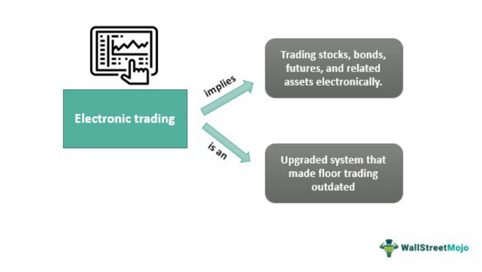

The world of trading has experienced significant transformation with the rise of algorithmic trading platforms, among which eSpeed stands out prominently. As a technologically advanced platform, eSpeed has substantially influenced the trading landscape, particularly in the bond market. It has become an integral component of NASDAQ OMX's suite of offerings, facilitating high-speed and efficient trading, crucial for modern financial markets.

Algorithmic trading platforms like eSpeed leverage advanced algorithms and technology to automate trade execution, significantly enhancing trade speed and reducing transaction costs. This technological evolution has redefined how trading is conducted, allowing for unprecedented levels of transaction throughput and market liquidity. eSpeed, specifically, is known for its capability to handle substantial trade volumes efficiently, which was notably observed in the period following the 9/11 attacks.



By integrating cutting-edge technological developments, eSpeed has advanced its trading capabilities, impacting the bond market profoundly. This platform not only supports the fast-paced trading demands of today's market participants but also underpins the shift towards electronic trading systems, away from traditional voice brokering methods.

In this article, we explore the history of eSpeed, its pivotal technological advancements, and its significant role in the current trading environment. Through these explorations, it becomes evident how eSpeed has consistently driven innovation in trading technology, contributing to the evolution of algorithmic trading and reinforcing its position in the financial industry.

## Table of Contents

## Understanding eSpeed

eSpeed is a significant entity within electronic trading platforms, primarily focusing on U.S. Treasury and fixed income markets. The platform emerged as a specialized venue for trading in these sectors, providing a robust infrastructure for handling high-frequency trading operations.

In 2013, eSpeed was acquired by Nasdaq OMX, marking a strategic expansion of Nasdaq's operations into the fixed-income market. This acquisition enabled Nasdaq to broaden its services and leverage eSpeed's established reputation and technology to strengthen its position in this area of financial markets. The move was part of a broader trend throughout the trading industry, where exchanges and financial platforms have increasingly sought to incorporate electronic trading technologies to enhance market reach and service efficiency.

eSpeed is renowned for its high-speed trading capabilities, which have consistently set benchmarks for trade execution times in the bond market. Its technological infrastructure is designed to manage vast trade volumes with minimal latency, a critical factor for market participants in high-frequency trading environments. This capability was notably demonstrated in the period following the 9/11 attacks. During this time, eSpeed played a crucial role in maintaining market stability and continuity by effectively managing the increased trading volumes that arose as markets sought liquidity and price discovery in a rapidly changing environment.

The platform's technology allows for efficient processing and matching of trades, enabling traders to execute transactions quickly and reliably. This is particularly important in the fixed income market, where shifts in interest rates and economic indicators can lead to rapid changes in market conditions. By providing a fast and efficient system, eSpeed supports traders in making timely decisions, which is essential for managing risk and capitalizing on market opportunities.

Overall, eSpeed's presence in the U.S. Treasury and fixed income markets and its ownership by Nasdaq OMX underscore its importance in the broader landscape of electronic trading. As trading technology continues to evolve, platforms like eSpeed remain central to facilitating efficient and transparent market operations.

## Historical Background and Development of eSpeed

eSpeed, an electronic trading platform, was established in 1996 under the leadership of Cantor Fitzgerald. This development marked a transformative period in the financial markets, shifting from traditional voice brokering systems to innovative electronic trading platforms. eSpeed rapidly became an industry leader due to its adoption of cutting-edge technology, enabling it to handle substantial trade volumes with increased efficiency and accuracy.

The creation of eSpeed was driven by the necessity to enhance the speed and transparency of trades. The platform successfully disrupted the conventional methods of trading by automating several aspects of the process, a crucial advancement in an era progressively leaning towards digital solutions. This transition minimized human errors, reduced transaction costs, and provided traders with seamless access to market data.

In subsequent years, eSpeed was a participant in several crucial technological and business developments, including its merger with BGC Partners. This merger represented a strategic consolidation aimed at unifying resources, enhancing market reach, and driving growth. Together, eSpeed and BGC Partners expanded their technological capabilities, allowing them to offer more comprehensive services in the trading of fixed-income securities.

The integration with BGC Partners further solidified eSpeed's prominence in the market, enhancing its infrastructure and expanding its client base. This merger not only reaffirmed eSpeed's position as a leading electronic trading platform but also demonstrated a commitment to innovation and technological excellence.

Overall, eSpeed's evolution from a groundbreaking tool in the late 1990s to a central player in today's trading environment highlights its pivotal role in transforming financial markets through electronic systems. Its continuous growth and adaptability have set a benchmark for future advancements in trading technology.

## Key Features and Services of eSpeed

eSpeed is recognized for supporting the complete lifecycle of global fixed income trading with a focus on minimizing latency. The platform is designed to facilitate high-speed trading exclusively within the U.S. Treasuries market, thereby enhancing overall trading efficiency. This is achieved through several key features and services tailored to meet the demands of modern electronic trading environments.

**Latency Reduction**: A crucial aspect of eSpeed's offering is its ability to significantly reduce latency, the time delay between the initiation of a trade order and its execution. By minimizing latency, eSpeed enhances the speed and accuracy of trade executions, which is particularly vital in the fast-paced market of U.S. Treasuries where even milliseconds can impact trading outcomes.

**Trading Solutions**: eSpeed provides specialized trading solutions tailored for U.S. Treasuries. These solutions are designed to handle high trading volumes and complex order types with precision, ensuring traders can execute their strategies effectively. The platform's robust infrastructure supports a variety of trading operations, making it an essential tool for traders focused on fixed income securities.

**Efficiency and Reliability**: By confining its high-speed trading capabilities to U.S. Treasuries, eSpeed ensures a level of focus and specialization that translates into greater efficiency and reliability. The platform's advanced algorithms and trading protocols are optimized for low-latency performance, empowering traders to capitalize on fleeting market opportunities.

These features collectively contribute to eSpeed's reputation as a leader in electronic trading, particularly within the fixed income markets. The platform's continuous advancements in latency reduction and trading capabilities position it as a pivotal component in the ongoing evolution of [algorithmic trading](/wiki/algorithmic-trading).

## eSpeed and Technological Innovations

eSpeed, a platform integral to algorithmic trading, has been a leader in adopting advancements that enhance trading performance. A major technological stride for eSpeed was its migration to the NASDAQ OMX Data Center. This move significantly improved trading performance by reducing latency and enhancing connectivity, attributes crucial for algorithmic trading.

Latency, the time delay experienced in a system, is critical in trading where milliseconds can impact financial outcomes. eSpeed's migration aimed to minimize this delay, thereby ensuring faster execution of trades. By leveraging the infrastructure and resources of the NASDAQ OMX Data Center, eSpeed benefited from robust data handling capabilities and superior connectivity. These enhancements facilitate algorithmic processes, allowing traders to make informed, rapid decisions based on real-time market data.

In terms of connectivity, the integration with the NASDAQ OMX Data Center links eSpeed users with a wide network of market participants, fostering efficient trade execution across multiple platforms. This connectivity allows algorithmic strategies to be deployed seamlessly, benefiting from the high-throughput and low-latency characteristics of the data center.

eSpeed's focus on performance engineering has also embraced modern software and hardware optimizations. Advanced algorithms, efficient data structures, and parallel processing techniques are employed to maximize computational resources and reduce processing times.

Here is a basic example of how parallel processing might be achieved in a Python algorithm:

```python
from concurrent.futures import ThreadPoolExecutor

def process_data(data_chunk):
    # Simulate data processing
    return sum(data_chunk)

data = [range(1000000), range(1000000, 2000000)]
results = []

# Using ThreadPoolExecutor to parallelize processing
with ThreadPoolExecutor() as executor:
    results = list(executor.map(process_data, data))

print(results)
```

This approach enables the handling of large datasets and rapid computations essential for algorithmic trading platforms like eSpeed. Through continuous innovations and engineering enhancements, eSpeed remains a pivotal player in the evolving landscape of electronic trading, aligning technological advancements with the needs of modern traders.

## Implications of Algorithmic Trading in the Market

Algorithmic trading, by leveraging advanced mathematical models and powerful computing, has indisputably transformed the financial markets. One of its primary benefits is the substantial enhancement of market efficiency. Algorithms can process vast amounts of data at unprecedented speeds, executing trades in milliseconds. This capability reduces [arbitrage](/wiki/arbitrage) opportunities, leading to fairer prices for all market participants. Moreover, algorithmic trading facilitates increased [liquidity](/wiki/liquidity-risk-premium), allowing for smoother and more stable market operations.

However, despite these advantages, algorithmic trading introduces several challenges. A significant concern is the potential reduction in fundamental research. Traders and investment firms focused on short-term gains facilitated by algorithms may deprioritize in-depth, qualitative analysis of assets. Fundamental research, which involves evaluating a company's financial statements, competitive position, and market conditions, is essential for understanding the intrinsic value of stocks. The shift towards algorithms can overshadow these long-term analytical strategies, potentially leading to a misallocation of capital in the financial markets.

The balance between high-speed trading and [fundamental analysis](/wiki/fundamental-analysis) presents both an opportunity and a challenge. For market participants who rely on fundamental analysis, algorithmic trading can offer enhanced tools for data analysis. By integrating [machine learning](/wiki/machine-learning) algorithms, traders can efficiently analyze vast datasets to identify fundamental trends and anomalies. However, the rapid pace of algorithmic trading can also lead to [volatility](/wiki/volatility-trading-strategies), which may obscure long-term investment signals derived from fundamental analysis.

Consider the Python code snippet below, which demonstrates a basic approach to integrating algorithmic and fundamental analysis using machine learning models:

```python
import pandas as pd
from sklearn.model_selection import train_test_split
from sklearn.ensemble import RandomForestRegressor

# Load financial data
data = pd.read_csv('financial_data.csv')
features = data[['metric_1', 'metric_2', 'metric_3']]
target = data['stock_price']

# Split data into training and testing sets
X_train, X_test, y_train, y_test = train_test_split(features, target, test_size=0.2, random_state=42)

# Train a machine learning model
model = RandomForestRegressor(n_estimators=100, random_state=42)
model.fit(X_train, y_train)

# Evaluate the model
accuracy = model.score(X_test, y_test)
print(f'Prediction Accuracy: {accuracy:.2f}')
```

This script utilizes a Random Forest model to predict stock prices based on fundamental financial metrics, illustrating how computational algorithms can aid traditional fundamental analysis.

Overall, while algorithmic trading offers substantial gains in efficiency and speed, it necessitates a careful approach to preserve the integrity of market analysis fundamentals. Maintaining a balance between quantitative techniques and qualitative assessments will be crucial for the sustained health and fairness of the financial markets.

## Future Prospects of eSpeed in Algo Trading

As technology continues to advance, eSpeed is poised to further enhance the electronic trading of bonds, bolstering its role as a leader in algorithmic trading. eSpeed leverages cutting-edge technology to offer rapid transaction processing, and ongoing improvements will likely fortify its stature within this competitive landscape. 

The integration of machine learning and [artificial intelligence](/wiki/ai-artificial-intelligence) (AI) is anticipated to propel eSpeed towards pioneering solutions that not only increase execution speed but also optimize trade efficiency and accuracy. These technologies could enable real-time analysis of market data, improve price prediction accuracy, and refine algorithmic strategies, offering traders a qualitative edge.

Moreover, cloud computing offers another avenue for innovation by enabling scalability and reducing infrastructure costs. By harnessing the power of cloud technology, eSpeed can provide its users with more robust and flexible trading platforms, facilitating greater access to high-performance computing resources and ensuring seamless trading experiences.

As regulatory landscapes evolve, eSpeed is likely to incorporate advanced compliance and reporting functionalities into its platform, ensuring adherence to complex regulatory requirements. This adaptability will ensure that the platform remains compliant, thus minimizing risk for traders and increasing market trust.

Lastly, enhanced network infrastructure and data analytics could further improve latency and throughput, crucial factors for competitive edge in high-frequency trading scenarios. This commitment to innovation will not only retain existing users but will also attract new clients seeking advanced trading solutions, thereby solidifying eSpeed's position in the financial trading arena.

Overall, eSpeed's continual adaptation to technological advancements promises a revolutionary future for electronic bond trading, setting new benchmarks in speed and efficiency that define modern algorithmic trading practices.

## Conclusion

eSpeed's evolution highlights the rapidly changing landscape of trading technology and its consequential impact on market operations. Throughout its development, eSpeed has demonstrated the substantial benefits associated with algorithmic trading, particularly in terms of speed and efficiency. This has not only streamlined processes within the trading ecosystem but also boosted operational capabilities, allowing for faster and more efficient execution of trades in the highly competitive financial markets.

Despite the inherent drawbacks of algorithmic trading, such as the potential neglect of fundamental market analysis and possible exacerbation of market volatility, platforms like eSpeed play a crucial role in facilitating the advancement of trading strategies. The high-speed nature of algorithmic platforms can process vast amounts of data and execute trades at a velocity far surpassing human capabilities, ultimately optimizing trading outcomes. For instance, by leveraging algorithmic strategies, traders can tap into enhanced liquidity and price discovery, benefiting from near-instantaneous responses to market movements.

As technologies continue to evolve, the future of algorithmic trading, bolstered by platforms like eSpeed, appears promising. Continuous technological advancements are expected to further refine the intricacies of electronic trading systems, keeping pace with emerging trends and market demands. This commitment to innovation and performance enhancement ensures that eSpeed and its counterparts will remain at the forefront of revolutionizing electronic bond trading. Consequently, eSpeed is well-positioned to reinforce its status within the financial trading landscape, contributing to the ongoing transformation and modernization of markets globally.

## References & Further Reading

[1]: Pattinson, P. (2013). ["Nasdaq OMX to Acquire eSpeed as Bond Trading Heats Up."](https://www.marketwatch.com/story/nasdaq-to-buy-espeed-for-up-to-123-billion-2013-04-02/) The Wall Street Journal.

[2]: Pozen, R. C., & Harrington, T. C. (2015). ["The Evolution of Trading: A History."](https://books.google.com/books/about/The_Fund_Industry.html?id=7yYhBgAAQBAj) McGraw-Hill Education.

[3]: Gomber, P., Arndt, B., Lutat, M., & Uhle, T. (2011). ["High-Frequency Trading"](https://papers.ssrn.com/sol3/papers.cfm?abstract_id=1858626). The Journal of Trading.

[4]: Chlistalla, M. (2011). ["High-Frequency Trading - Better than its Reputation?"](https://c.mql5.com/forextsd/forum/168/high-frequency_trading_-_better_than_its_reputation.pdf) Deutsche Bank Research.

[5]: Lopez de Prado, M. (2018). ["Advances in Financial Machine Learning"](https://www.amazon.com/Advances-Financial-Machine-Learning-Marcos/dp/1119482089) Wiley.