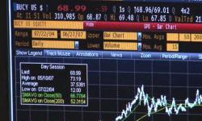

## Table of Contents

## What is an electronic trading system?

An electronic trading system is a computer-based platform that allows people to buy and sell things like stocks, bonds, and other financial products online. Instead of going to a physical place like a stock exchange, traders can use these systems from anywhere with an internet connection. This makes trading faster and more convenient because everything happens electronically.

These systems use special software that shows real-time prices and lets traders make quick decisions. They also have rules to make sure trading is fair and safe. Many big stock exchanges around the world use electronic trading systems, which has changed how trading works by making it more efficient and accessible to more people.

## How do electronic trading systems work?

Electronic trading systems work by connecting buyers and sellers through the internet. When you want to buy or sell something like a stock, you use the system's software to place an order. The system then matches your order with someone else's order. For example, if you want to sell a stock, the system will find someone who wants to buy that stock at the price you're asking. This all happens very quickly, often in just a few seconds.

Once the system matches the orders, it completes the trade automatically. The software keeps track of all the trades and updates the prices in real-time, so everyone can see the current value of stocks and other financial products. The system also has rules to make sure trading is fair and to prevent problems like fraud. This way, people can trade from anywhere and at any time, making trading much easier and faster than it used to be.

## What are the main components of an electronic trading system?

The main parts of an electronic trading system are the trading platform, the order matching engine, and the market data feed. The trading platform is like a website or app where traders can place their buy or sell orders. It's easy to use and shows all the important information, like the current prices of stocks and other things you can trade. The order matching engine is the part that looks at all the orders and matches buyers with sellers. It works really fast to make sure trades happen quickly and correctly.

The market data feed is another important part. It sends real-time information about prices and trades to the trading platform, so everyone can see what's happening in the market right now. Besides these main parts, there are also security features to keep the system safe from hackers and rules to make sure trading is fair. All these parts work together to make trading easy, fast, and safe for everyone using the system.

## What are the advantages of using electronic trading systems over traditional methods?

Electronic trading systems make trading much easier and faster than the old ways. Before, people had to go to a physical place like a stock exchange to trade. This could take a lot of time and was not always easy to do. With electronic systems, you can trade from anywhere with an internet connection. This means you can buy or sell things like stocks whenever you want, without waiting for the stock exchange to open. It's also much quicker because the computer matches buyers and sellers in just a few seconds, so you don't have to wait around for a trade to happen.

Another big advantage is that electronic trading systems are cheaper. When you trade the old way, there are a lot of costs, like paying for a place to trade and hiring people to help. Electronic systems cut down on these costs because everything is done by computers. This means that the fees for trading are usually lower, so you get to keep more of your money. Plus, the systems give you a lot of information about what's happening in the market right away, so you can make better decisions about when to buy or sell.

## What types of financial instruments can be traded using electronic systems?

Electronic trading systems let you trade many different types of financial instruments. You can trade stocks, which are shares in a company. You can also trade bonds, which are like loans to a company or government that pay you back with interest. Another type of instrument you can trade is currencies, like dollars or euros, which is known as [forex](/wiki/forex-system) trading. You can also trade futures and options, which are agreements to buy or sell something at a set price in the future. These are just a few examples, but electronic systems can handle a lot of different financial products.

In addition to these, electronic trading systems also allow trading of commodities, like gold or oil. These are physical goods that people buy and sell. There are also more complex instruments like exchange-traded funds (ETFs), which are baskets of different stocks or bonds that you can buy and sell like a single stock. Cryptocurrencies, like Bitcoin, are another type of financial instrument that can be traded on electronic systems. With so many options, electronic trading systems make it possible for people to trade a wide variety of financial products easily and quickly.

## How has the rise of electronic trading systems impacted the financial markets?

The rise of electronic trading systems has made a big difference in financial markets. Before, people had to go to a physical place to trade, like a stock exchange. This was slow and could be expensive. Now, with electronic systems, anyone can trade from anywhere with an internet connection. This has made trading much faster and easier. The markets are now open almost all the time, which means people can buy and sell things like stocks and bonds whenever they want, not just during certain hours. This has made the markets more active and lively.

Electronic trading has also changed how people make money from trading. Because everything happens so quickly, computers can now do a lot of the work. This has led to something called high-frequency trading, where computers make thousands of trades in just a few seconds. This can make the markets more efficient, but it can also make them more risky because prices can change very quickly. Also, because electronic systems are cheaper to use, more people can trade, which means there are more buyers and sellers in the market. This has made the markets bigger and more competitive.

## What are some popular electronic trading platforms available to individual traders?

Some well-known electronic trading platforms that individual traders use are Robinhood, E*TRADE, and TD Ameritrade. Robinhood is popular because it lets you trade stocks and other things without paying a fee. This makes it easy for people who are just starting to trade. E*TRADE is another big platform that has been around for a long time. It has a lot of tools to help you learn about trading and make good choices. TD Ameritrade is also very popular and has a lot of features, like the thinkorswim platform, which is great for people who want to do more advanced trading.

These platforms are easy to use and let you trade from your computer or phone. They show you real-time prices and let you place orders quickly. They also have a lot of information and tools to help you understand the market better. This makes it easier for anyone to start trading, even if they don't know a lot about it yet. With these platforms, you can buy and sell stocks, bonds, and other financial products without having to go to a physical place like a stock exchange.

## What security measures are in place to protect users of electronic trading systems?

Electronic trading systems use a lot of security measures to keep users safe. They use something called encryption to make sure that the information you send, like your orders to buy or sell stocks, is private and can't be read by anyone else. They also have firewalls to stop hackers from getting into the system. Firewalls are like a protective wall that keeps bad people out. Another important security feature is two-[factor](/wiki/factor-investing) authentication, which means you need to enter a special code, usually sent to your phone, to log in. This makes it much harder for someone else to use your account, even if they know your password.

Besides these technical measures, electronic trading systems also have rules and checks to make sure trading is fair and safe. They use something called surveillance systems to watch for any strange or suspicious trading activity. If they see something that doesn't look right, they can stop it before it causes problems. They also keep all your personal information and trading records safe, so you don't have to worry about your data being stolen. All these security measures work together to make sure that you can trade safely and with peace of mind.

## How can one get started with trading on an electronic platform?

Getting started with trading on an electronic platform is pretty easy. First, you need to choose a trading platform that you like. Popular ones include Robinhood, E*TRADE, and TD Ameritrade. Once you've picked one, you'll need to sign up for an account. This usually involves filling out some personal information and maybe sending in some documents to prove who you are. After your account is set up, you'll need to add some money to it. This is called funding your account, and you can usually do it by linking your bank account to the trading platform.

Once your account is funded, you're ready to start trading. Most platforms have a simple interface where you can see the current prices of stocks and other things you can trade. To make a trade, you just need to decide what you want to buy or sell, how much you want to trade, and at what price. You can place your order right from the platform, and the system will take care of the rest. It's a good idea to start small and maybe even practice with a demo account if the platform offers one, so you can get the hang of things without risking a lot of money.

## What are the common challenges faced by users of electronic trading systems?

One common challenge that people face when using electronic trading systems is dealing with technical problems. Sometimes the internet might be slow or the trading platform might not work right, which can make it hard to place orders quickly. This can be really frustrating, especially if you're trying to buy or sell something at a certain price. Another challenge is understanding all the different tools and information the platform gives you. There are a lot of charts, numbers, and other data to look at, and it can be confusing if you're new to trading. It takes time to learn how to use everything and make good decisions.

Another challenge is managing the risks of trading. The prices of stocks and other things you can trade can change very quickly, and if you're not careful, you could lose money. It's important to have a plan and know how much you're willing to risk. Also, some people might feel overwhelmed by all the choices they have. There are so many different things you can trade, and it can be hard to decide what to focus on. It's good to start small and learn as you go, so you can get better at trading without feeling too stressed out.

## How do advanced algorithms and AI enhance electronic trading?

Advanced algorithms and AI make electronic trading better by helping traders make smarter choices. These tools can look at a lot of data very quickly and find patterns that people might miss. For example, they can study how the prices of stocks have changed in the past and use that information to guess what might happen next. This can help traders decide when to buy or sell something. Also, algorithms can do something called high-frequency trading, where they make a lot of trades very fast. This can help traders make money by taking advantage of small changes in prices that happen in just a few seconds.

AI also helps make trading safer and more efficient. It can watch for any strange or suspicious trading activity and stop it before it causes problems. This helps keep the market fair for everyone. AI can also learn from what traders do and get better over time. This means that the more it's used, the better it can help traders make good decisions. Overall, advanced algorithms and AI make electronic trading faster, smarter, and safer, which is good for everyone using the system.

## What future trends are expected in the development of electronic trading systems?

In the future, electronic trading systems are expected to become even more advanced with the help of technology. One big trend is the use of [artificial intelligence](/wiki/ai-artificial-intelligence) and [machine learning](/wiki/machine-learning). These tools will get better at understanding market patterns and making predictions. This means that traders will have even more help in making smart decisions. Another trend is the growth of mobile trading. More and more people will use their phones and tablets to trade, so platforms will become easier to use on smaller screens. This will make trading even more convenient and accessible to everyone.

Another important trend is the focus on security. As electronic trading systems become more popular, they will need stronger protections against hackers and fraud. This means using even better encryption and other security measures to keep users' information and money safe. Also, there will be more emphasis on making trading fair for everyone. This could mean new rules and tools to stop things like high-frequency trading from giving some people an unfair advantage. Overall, these trends will make electronic trading systems faster, smarter, and safer for everyone using them.

## References & Further Reading

[1]: Bergstra, J., Bardenet, R., Bengio, Y., & Kégl, B. (2011). ["Algorithms for Hyper-Parameter Optimization."](https://proceedings.neurips.cc/paper/2011/file/86e8f7ab32cfd12577bc2619bc635690-Paper.pdf) Advances in Neural Information Processing Systems 24.

[2]: ["Advances in Financial Machine Learning"](https://www.amazon.com/Advances-Financial-Machine-Learning-Marcos/dp/1119482089) by Marcos Lopez de Prado

[3]: ["Evidence-Based Technical Analysis: Applying the Scientific Method and Statistical Inference to Trading Signals"](https://www.amazon.com/Evidence-Based-Technical-Analysis-Scientific-Statistical/dp/0470008741) by David Aronson

[4]: ["Machine Learning for Algorithmic Trading"](https://github.com/stefan-jansen/machine-learning-for-trading) by Stefan Jansen

[5]: ["Quantitative Trading: How to Build Your Own Algorithmic Trading Business"](https://www.amazon.com/Quantitative-Trading-Build-Algorithmic-Business/dp/1119800064) by Ernest P. Chan