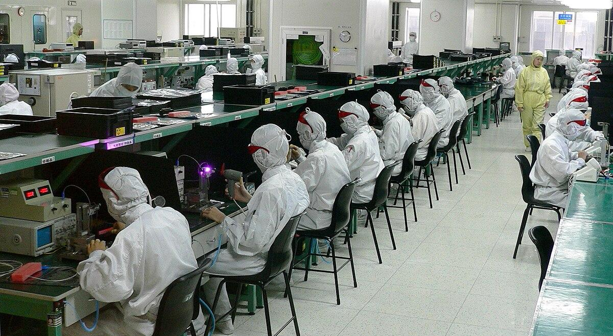

The intersection of manufacturing technology and electronics has catalyzed significant advancements across numerous sectors. This confluence has not only propelled technological growth but also revolutionized industries such as finance through algorithmic trading. Algorithmic trading, often referred to as algo trading, utilizes sophisticated computer algorithms to execute orders at speeds and efficiencies unmatched by human traders. It relies heavily on precise, rapid, and automated decision-making processes supported by robust electronics and computer systems.

This synergy among manufacturing technology, electronics, and financial trading systems plays a crucial role in enhancing trading methodologies. Manufacturing technology is the backbone of electronic production, providing the necessary infrastructure for creating advanced devices that facilitate high-frequency trading. These advancements ensure that trading platforms and financial institutions possess the necessary tools to stay competitive in a fast-paced market environment.



As these technologies continue to evolve, they contribute to more sophisticated trading algorithms capable of analyzing vast datasets in real time. Improvements in semiconductor technology, integral to electronics, allow for the handling of higher computation loads, further optimizing the efficiency of algorithmic trading systems. Thus, the combination of manufacturing technology, electronics development, and algorithmic trading not only drives progress in financial markets but also underscores the importance of these interrelated domains in shaping future economic landscapes.

## Table of Contents

## The Role of Manufacturing Technology in Electronics

Manufacturing technology is fundamental to the production of electronic components, playing an instrumental role in shaping the electronics sector. This relationship is particularly evident in the production of semiconductors, consumer electronics, and industrial equipment, which are essential for modern technological infrastructures.

**Semiconductors** are at the heart of electronic devices, serving as the critical components that enable the functioning of everything from smartphones to complex industrial machines. The manufacture of semiconductors requires precision engineering and cutting-edge technology. Advances in lithography, a manufacturing process used to etch semiconductor circuits, have allowed for the production of smaller and more efficient chips. Technologies such as extreme ultraviolet (EUV) lithography have further pushed the boundaries of chip miniaturization, increasing the capability of electronic devices while reducing energy consumption.

**Consumer electronics** benefit significantly from the improvements in manufacturing processes. Automation, driven by robotics and advanced software platforms, has revolutionized production lines, ensuring higher throughput and consistent quality. Robotics in assembly lines reduce human error and increase production speed, making it possible to meet the demands of a rapidly growing market. This automation not only enhances production efficiency but also allows for flexible manufacturing systems that can quickly adapt to new product designs and variations.

**Industrial equipment** also sees substantial benefits from advancements in manufacturing technology. The incorporation of smart manufacturing techniques, often referred to as Industry 4.0, integrates digital technologies with traditional manufacturing processes. This includes the use of Internet of Things (IoT) devices to monitor and manage production in real-time, leading to improved operational efficiency and quality control. Predictive maintenance, enabled by IoT data, minimizes downtime and extends the lifespan of industrial machines.

Emerging market economies contribute significantly to the electronics manufacturing landscape. Countries like China and India have become major hubs for electronics production, driven by lower labor costs and increasing consumer demand. The growth of these markets not only provides a vast consumer base but also encourages technological innovation and investment in manufacturing infrastructure. As a result, these economies have become integral to the global supply chain, influencing trends and pricing in the global electronics market.

In summary, the evolution of manufacturing technology is pivotal to the electronics industry, enhancing the production of complex components and systems. This synergy between manufacturing and electronics not only drives innovation but also supports the rapid growth of global markets, reflecting the sector's crucial role in economic development.

## Growth of Electronics and Its Impact on Trading

The electronics sector has witnessed remarkable growth, largely fueled by increased consumer demand and continuous innovation. Consumer electronics, such as smartphones, tablets, and wearable devices, have seen unprecedented adoption rates, contributing to the sector's expansion. This consumer-driven growth is mirrored by advancements in industrial electronics, including automation, communication systems, and medical devices, each pushing the boundaries of technological capability and market reach.

Semiconductors serve as the backbone of this digital revolution. They power a vast array of electronic devices, making them indispensable to modern technologies. Over the years, the semiconductor industry has emerged as one of the most lucrative segments within the electronics domain. This success can be attributed to ongoing innovation in semiconductor design and manufacturing processes, such as the development of smaller, more efficient chips that provide enhanced performance and energy savings. The industry's profitability is bolstered by its critical role in facilitating advancements in [artificial intelligence](/wiki/ai-artificial-intelligence) (AI), the Internet of Things (IoT), and high-performance computing.

The global expansion of electronics carries significant implications for financial markets. Firstly, it contributes to increased [liquidity](/wiki/liquidity-risk-premium). A thriving electronics industry implies frequent activity among associated stocks, including tech giants and chip manufacturers. This activity, in turn, boosts the trading [volume](/wiki/volume-trading-strategy) and enhances market liquidity, which is crucial for investors and traders seeking opportunities in rapidly evolving markets.

Secondly, the growth in the electronics sector provides diverse opportunities for trading, particularly within [algorithmic trading](/wiki/algorithmic-trading) strategies. As electronics companies innovate and expand globally, they exhibit stock price movements that can be analyzed and predicted by sophisticated algorithms. Algo trading, which relies on determining patterns from historical data, benefits from the [volatility](/wiki/volatility-trading-strategies) and opportunities presented by a thriving electronics market.

In conclusion, the electronics sector's growth driven by consumer demand and innovation has profound effects on financial markets. The focus on semiconductors as a profitable segment and the expansion of global electronics manufacturing elevate liquidity and open numerous trading opportunities. This interconnectivity emphasizes the importance of monitoring technological advancements for financial market participants.

## What is Algorithmic Trading and Its Advantages

Algorithmic trading, often referred to as algo trading, employs sophisticated computer algorithms to conduct trades at velocities and frequencies unattainable by human traders. These algorithms leverage mathematical models and statistical analysis to make trading decisions based on data patterns, ensuring rapid execution and precision. By incorporating pre-set conditions and parameters, algorithms can assess multiple market variables simultaneously, optimizing trade outcomes based on real-time data.

A primary advantage of algorithmic trading is its ability to mitigate the influence of human emotions, which are often detrimental to trading performance. The automated nature of algo trading minimizes behavioral biases, allowing for more logical and consistent decision-making strategies. Consequently, transaction costs are reduced since the quick execution of trades minimizes the bid-ask spread and slippage, thereby enhancing the cost-efficiency of executed trades.

Several prevalent strategies are utilized in algorithmic trading. Trend-following strategies capitalize on identifying and exploiting market trends by utilizing technical indicators such as moving averages to determine entry and [exit](/wiki/exit-strategy) points. For instance, a simple moving average crossover strategy might execute a buy order when a short-term moving average surpasses a long-term moving average, signaling an upward trend.

Arbitrage strategies seek to profit from price discrepancies between correlated financial instruments across different markets or exchanges. These opportunities, often fleeting, demand rapid detection and execution, a process ideally suited for algorithmic solutions. For example, if a stock trades at different prices on two exchanges, an algorithm could simultaneously buy at the lower price and sell at the higher price to lock in a risk-free profit.

Index fund rebalancing strategies involve adjusting the component weights of an index portfolio as per the fund's investment objectives. Algorithmic trading facilitates this process by calculating the necessary trades to maintain the portfolio's alignment with the benchmark index while minimizing market impact and transaction costs.

The efficacy of algorithmic trading systems depends critically on their ability to process real-time market data, necessitating robust computational infrastructure and data analysis capabilities. Additionally, the ability to backtest strategies using historical data is paramount to refining algorithms and ensuring their reliability under various market conditions. As trading platforms continue to evolve, leveraging automation and big data analytics, algorithmic trading remains a cornerstone of modern financial markets.

## Technical Requirements for Algorithmic Trading

To effectively engage in algorithmic trading, several technical requirements must be met to ensure optimal performance and successful trade execution. 

Firstly, access to real-time market data is crucial. This data is the foundation on which algorithms make informed decisions, enabling traders to capitalize on fleeting opportunities in the market. Any delay or inaccuracy can result in significant financial losses. Trading strategies heavily rely on the precision and timeliness of data, as minute-by-minute changes can influence trading outcomes. 

High-speed, reliable internet connectivity is equally essential. Due to the fast-paced nature of algorithmic trading, where transactions occur in fractions of a second, latency in data transmission can be detrimental. Low latency connections ensure that the information is relayed without delay, allowing trades to be executed at the most opportune moments.

Sophisticated trading platforms are required to facilitate the seamless operation of trading algorithms. These platforms provide the necessary tools for developing, testing, and deploying algorithms. They often support various programming languages, back-testing capabilities, and integration with key financial data providers. This allows traders to simulate strategies in historical or current market conditions, providing insights into potential performance before actual deployment.

Proficiency in programming is indispensable for those looking to personally develop and refine algorithmic trading strategies. Python is widely preferred due to its simplicity and the vast array of libraries available, such as NumPy for numerical computations, Pandas for data manipulation, and specialized libraries like TA-Lib and PyAlgoTrade for trading-specific functions. Here's a basic Python example illustrating the setup of a simple moving average crossover strategy:

```python
import pandas as pd

# Load historical market data
data = pd.read_csv('market_data.csv', index_col='Date', parse_dates=True)

# Calculate moving averages
data['SMA_50'] = data['Close'].rolling(window=50).mean()
data['SMA_200'] = data['Close'].rolling(window=200).mean()

# Identify buy and sell signals
data['Signal'] = 0
data['Signal'][50:] = np.where(data['SMA_50'][50:] > data['SMA_200'][50:], 1, 0)
data['Position'] = data['Signal'].diff()

# Plot signals
data[['Close', 'SMA_50', 'SMA_200']].plot(grid=True)
plt.scatter(data.index, data['Position'].where(data['Position'] == 1), color='g', label='Buy Signal', marker='^')
plt.scatter(data.index, data['Position'].where(data['Position'] == -1), color='r', label='Sell Signal', marker='v')
plt.show()
```

Algorithmic trading software is also available for those who may not possess the necessary coding skills. These platforms provide user-friendly interfaces that allow users to build strategies using customizable modules, effectively lowering the barriers of entry into algorithmic trading.

In summary, successful algorithmic trading is contingent upon obtaining real-time data, high-speed internet, and the appropriate technological infrastructure, including both hardware and software. Whether developing bespoke algorithms through programming or using pre-existing software solutions, meeting these technical requirements is essential for traders aiming to succeed in the highly competitive field of algorithmic trading.

## Challenges in the Electronics and Trading Intersection

Volatility in the electronics stock market is a significant challenge for traders. As the electronics industry continues to grow, it becomes fragmented with numerous new market entrants. This fragmentation can lead to increased volatility as new companies introduce innovative products, disrupt markets, or fail to deliver on expectations. Traders must account for this volatility by adjusting their strategies to mitigate risk while taking advantage of potential opportunities presented by price fluctuations. Price swings in the electronics market can affect the pricing of derivatives, options, and other financial instruments linked to electronic stocks, thus complicating trading strategies.

In algorithmic trading, latency is a critical technical challenge. The speed of trade execution is paramount, and any delay, even by milliseconds, can lead to missed opportunities or unfavorable prices. Latency issues arise from network delays, data transmission times, or processing lags in trading algorithms. To counteract latency, traders require access to high-speed internet connections, cutting-edge hardware, and co-location services that place their trading servers in close physical proximity to exchange servers. 

Technology dependence is another significant challenge. Algorithmic trading systems rely heavily on the accuracy and reliability of market data feeds, software, and hardware. A failure in any of these components can lead to improper trade executions, financial loss, or unauthorized trade activities. Regular maintenance, system upgrades, and robust testing ensure that these systems perform optimally under various market conditions.

Furthermore, algorithmic trading is susceptible to black swan events—unpredictable occurrences that have severe consequences. These events can lead to market anomalies or extraordinary price movements that trading algorithms are not equipped to handle. To mitigate the risk of black swan events, traders often incorporate risk management protocols, such as stop-loss limits and diversification strategies, to protect their capital from unforeseen downturns.

In summary, the intersection of electronics and trading presents both opportunities and challenges. Understanding and addressing the volatility in the electronics market, alongside resolving the technical difficulties inherent in algorithmic trading, is crucial for sustaining successful trading practices in this evolving landscape.

## Future Prospects and Innovations

The ongoing integration of artificial intelligence (AI) and [machine learning](/wiki/machine-learning) within algorithmic trading is set to revolutionize financial markets by enhancing both predictive capabilities and trade execution efficiency. AI and machine learning algorithms process vast amounts of data at extraordinary speeds, uncovering patterns and correlations that were previously impossible for human traders to detect. For instance, these technologies can analyze historical trade data, news feeds, and even social media sentiment to predict market trends, enabling more informed trading decisions.

One of the promising aspects of AI in algo trading is its ability to model complex, nonlinear relationships between variables, providing traders with sophisticated tools for risk assessment and strategy development. Machine learning models, such as artificial neural networks (ANNs) and [reinforcement learning](/wiki/reinforcement-learning) algorithms, are capable of improving their performance over time as they are exposed to more data. This continuous learning process helps traders adapt to changing market conditions swiftly.

Python, a favored language in quant finance, offers a rich ecosystem for developing AI-driven trading strategies. Libraries like TensorFlow and PyTorch facilitate building advanced machine learning models, while tools like pandas and NumPy are invaluable for data manipulation and analysis. An example of a simple regression model in Python that could be applied to stock price prediction is as follows:

```python
import pandas as pd
from sklearn.model_selection import train_test_split
from sklearn.linear_model import LinearRegression

# Sample data: historical prices
data = pd.read_csv('stock_prices.csv') 
X = data[['feature1', 'feature2']] # substitute with actual feature names
y = data['price']

# Train/test split
X_train, X_test, y_train, y_test = train_test_split(X, y, test_size=0.2, random_state=42)

# Model training
model = LinearRegression()
model.fit(X_train, y_train)

# Prediction
predictions = model.predict(X_test)
```

As manufacturing and electronic technologies continue to advance, their influence on algotrading systems becomes increasingly significant. Enhanced production methods and innovative material usage are leading to more powerful, efficient, and compact electronics. This trend facilitates the development of faster and more reliable trading platforms, which are essential for executing trades at the speeds required in today's market.

Moreover, innovations such as quantum computing present potential future advancements that could exponentially increase computational power, further enhancing the capabilities of both AI and traditional algorithmic trading systems. Quantum computers, with their ability to solve complex problems at unprecedented speeds, could transform strategy development by providing deeper insights into market behaviors and optimization potential.

These technological synergies highlight the future landscape of financial markets, where continuous innovation will pave the way for sophisticated trading methodologies. Traders and technologists must remain vigilant in embracing such advancements to exploit the full potential of these emerging technologies for strategic advantage and superior market performance.

## Conclusion

The synergy between manufacturing technology, electronics, and algorithmic trading is reshaping the financial markets by providing unprecedented opportunities for efficiency and growth. Manufacturing advancements have enabled the mass production of sophisticated electronic components, thereby expanding the capabilities of modern computing systems. These developments play a crucial role in supporting algorithmic trading, which relies on computational power to execute trades with precision and speed.

The relationship between these industries is symbiotic. As electronic components become more advanced and accessible, algorithmic trading systems can process complex market data more effectively. This not only reduces operational costs but also enhances the accuracy and speed of trade executions, yielding more efficient market behaviors. For instance, high-frequency trading, a subset of algorithmic trading, would not be feasible without the breakthroughs in semiconductor technologies and high-speed computing made possible by modern manufacturing techniques.

Given the relentless evolution of technology, it is imperative for traders and manufacturers to continuously update their systems and methodologies. This involves staying informed about cutting-edge developments in artificial intelligence, machine learning, and data processing. Embracing these technologies can significantly optimize trading strategies and manufacturing processes, ultimately driving higher returns and operational efficiencies.

In summary, the dynamic interaction between manufacturing technology, electronics, and algorithmic trading forms a cornerstone of contemporary financial markets. Continued innovation in these sectors promises to enhance market efficiency and offer considerable growth opportunities. Keeping pace with technological advancements ensures that stakeholders can maximize their performance outcomes, securing a competitive advantage in an ever-evolving landscape.

## References & Further Reading

[1]: Bergstra, J., Bardenet, R., Bengio, Y., & Kégl, B. (2011). ["Algorithms for Hyper-Parameter Optimization."](https://papers.nips.cc/paper/4443-algorithms-for-hyper-parameter-optimization) Advances in Neural Information Processing Systems 24.

[2]: ["Advances in Financial Machine Learning"](https://www.amazon.com/Advances-Financial-Machine-Learning-Marcos/dp/1119482089) by Marcos Lopez de Prado

[3]: ["Evidence-Based Technical Analysis: Applying the Scientific Method and Statistical Inference to Trading Signals"](https://www.amazon.com/Evidence-Based-Technical-Analysis-Scientific-Statistical/dp/0470008741) by David Aronson

[4]: ["Machine Learning for Algorithmic Trading"](https://github.com/stefan-jansen/machine-learning-for-trading) by Stefan Jansen

[5]: ["Quantitative Trading: How to Build Your Own Algorithmic Trading Business"](https://www.amazon.com/Quantitative-Trading-Build-Algorithmic-Business/dp/1119800064) by Ernest P. Chan

[6]: "Extreme Ultraviolet Lithography" (EUV) detailed in ["The Extreme Ultraviolet Lithography (EUV) Source Technology"](https://www.nature.com/articles/s43586-024-00361-z) in Proceedings Volume 5374, Emerging Lithographic Technologies VIII; Contributor(s): David Brandt et al. 

[7]: Bansal, T. (2020). ["Quantum Computing for Finance: A Primer."](https://bhaktavaschal.substack.com/p/title-quantum-computing-for-finance) JPMorgan Chase & Co. Insights

[8]: ["Python for Data Analysis"](https://wesmckinney.com/book/) by Wes McKinney

[9]: Malkiel, B. G., & Fama, E. F. (2021). ["Anomalies: A Reassessment."](https://onlinelibrary.wiley.com/doi/abs/10.1111/j.1540-6261.1970.tb00518.x) National Bureau of Economic Research Working Paper No. 7034

[10]: "Artificial Intelligence in Algorithmic Trading," available through ["The Journal of Portfolio Management."](https://www.mdpi.com/2227-7390/10/18/3302)