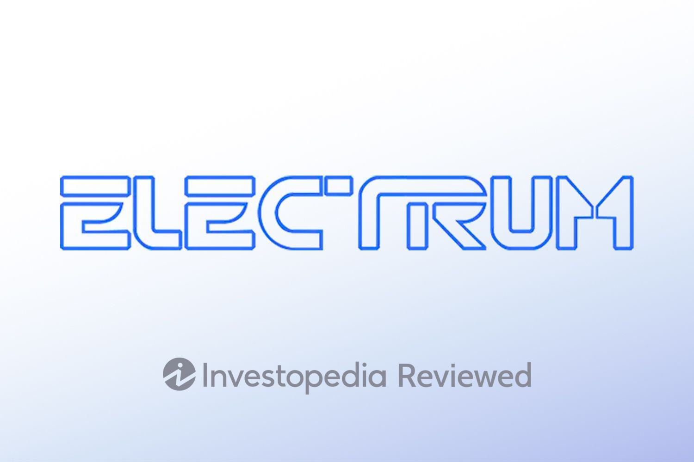

Cryptocurrency trading has gained significant momentum over recent years, driven by the allure of decentralization, potential for high returns, and advancements in blockchain technology. This surge in trading activity has accentuated the crucial need for secure and efficient digital wallets to safeguard assets and facilitate seamless transactions. Electrum, a well-known Bitcoin wallet, stands out due to its unwavering focus on security and user functionality. Launched in 2011 by Thomas Voegtlin, Electrum has solidified its reputation as one of the oldest and most reliable Bitcoin wallets in the industry.

Electrum's prominence stems from its robust security features and streamlined design, built for speed and efficiency. It has cemented its place in the crypto ecosystem by providing users with the essential tools to manage their Bitcoin holdings securely, offering compatibility with major hardware wallets, such as Ledger and Trezor, to enhance protection against online threats.



Simultaneously, the cryptocurrency market has witnessed a paradigm shift towards algorithmic trading—a method that employs mathematical models and computer programs to make trading decisions at ultra-fast speeds. Algorithmic trading in crypto markets increases liquidity and ensures more accurate price discovery while minimizing human errors in trading decisions.

Set against this backdrop, we will explore Electrum's features and capabilities, particularly how they serve the needs of algorithmic traders. This in-depth review will highlight why Electrum is a favorable choice for those employing algorithmic strategies in Bitcoin trading, focusing on its security, functionality, and potential integrations that allow for automated trading strategies. Electrum’s role in this evolving landscape demonstrates its utility, not only as a secure Bitcoin wallet but also as a tool capable of supporting advanced trading methodologies.

## Table of Contents

## Overview of Electrum Wallet

Electrum is a Bitcoin wallet that has been a cornerstone in the cryptocurrency ecosystem since its creation in 2011 by Thomas Voegtlin. As one of the earliest wallets available for Bitcoin, it has established a reputation for its reliability and enduring presence in the market. Its open-source nature has fostered continuous improvements and contributions from the developer community, ensuring that it remains a relevant and solid choice for Bitcoin users.

A noteworthy feature of Electrum is its compatibility with major hardware wallets such as Ledger and Trezor. This integration offers users the option to enhance their security by utilizing these hardware devices, which store users' private keys offline and reduce the risk of hacking or malware attacks. By combining Electrum's software capabilities with the robust security of hardware wallets, users enjoy a comprehensive security experience.

Electrum is designed with a focus on simplicity, speed, and security. Its lightweight nature means that it does not require users to download the entire Bitcoin blockchain, which can be cumbersome and time-consuming. Instead, Electrum uses a client-server protocol, allowing for fast access to the blockchain through decentralized servers that index the Bitcoin blockchain. This design choice facilitates quick setup and operation, making it ideal for users looking for a straightforward solution without sacrificing reliability.

Security is a primary consideration in Electrum's design. The wallet employs SPV (Simplified Payment Verification) technology, enabling users to verify transactions without needing the complete blockchain, balancing efficiency and security effectively. The deterministic key generation method used also ensures that users can restore their wallet from a secret phrase, enhancing the security and convenience of backup processes.

Electrum's interface reinforces its simplicity and user-centric design. While it offers sophisticated features for expert users, the user interface remains accessible to newcomers, accommodating a spectrum of users from beginners to seasoned traders. The wallet's continuous updates and improvements underscore its commitment to providing a streamlined yet powerful tool for managing Bitcoin holdings.

## Security Features

Electrum is a Bitcoin wallet that emphasizes its security features while maintaining ease of use. By default, Electrum operates as a hot wallet, meaning it remains connected to the internet, enabling prompt access to funds and quick transaction settlements. Despite this, Electrum facilitates seamless integration with cold storage solutions to enhance security, providing users with the ability to store cryptocurrencies offline when required. This capability is pivotal for those who wish to safeguard large sums against potential online threats.

One of Electrum's notable security features is its support for two-[factor](/wiki/factor-investing) authentication (2FA), which adds an extra layer of protection by requiring a second form of authentication beyond just a password. This can take various forms, such as a timed one-time password (TOTP) generated by an authenticator app. Additionally, Electrum offers multi-signature (multi-sig) addresses, which require multiple keys to authorize a transaction. This feature can be particularly useful for organizations or individuals who require multiple parties to agree before funds are spent.

Historically, Electrum has been the target of several security breaches. Notably, users have faced phishing attacks through malicious updates and Denial-of-Service (DoS) incidents aimed at disrupting its service. Following these events, Electrum implemented mandatory verifications for software updates and reinforced its servers' defenses. The importance of downloading updates from official sources and verifying their authenticity cannot be underestimated, as it protects users from fraudulent schemes designed to siphon off [cryptocurrency](/wiki/cryptocurrency) holdings.

Electrum’s commitment to continuous improvement in its security infrastructure, combined with user-centric features like 2FA and multi-sig capability, positions it as a secure option for managing Bitcoin, particularly as the landscape of cryptocurrency threats continues to evolve.

## Usability and User Interface

Electrum is known for its straightforward installation process, designed to accommodate both novice users and seasoned cryptocurrency traders. To begin using Electrum, users must download the client from the official Electrum website and ensure compatibility with their operating system, be it Windows, macOS, or Linux. Once downloaded, the installation process is guided by a step-by-step wizard that facilitates the creation of a new wallet or the restoration of an existing one through a recovery seed. This user-centered approach not only enhances usability but also reinforces security, as users are prompted to save their seed phrase securely.

The user interface of Electrum is minimalist yet efficient, favoring functionality over aesthetic complexity. The predominately grayscale design is intentionally simplistic to ensure rapid navigation and clarity of information. For experienced traders, the interface offers immediate access to advanced functions such as transaction history, address management, and detailed balance information. The interface integrates seamlessly with Electrum’s core features, including fee adjustment and transaction verification, appealing to those who prioritize expediency and precision in their cryptocurrency activities.

For new users, Electrum presents a moderate learning curve. While the interface is intuitive, understanding the intricacies of Bitcoin transactions, wallet operations, and security protocols may require time and effort. Nevertheless, Electrum provides extensive documentation and online resources, aiding users in familiarizing themselves with its functionalities.

In terms of flexibility, Electrum’s interface is highly customizable, allowing users to tailor their experience based on specific needs. Traders can adjust transaction fees to expedite processing times according to current network conditions. Additionally, the application supports plugins that expand its capabilities, thus accommodating a broad spectrum of user preferences and enhancing its appeal to technical users. Electrum’s emphasis on customization ensures that both casual users and professional algo traders can optimize their interactions with the wallet to suit their requirements, reinforcing its position as a versatile Bitcoin wallet solution.

## Trading Features

Electrum wallet provides an array of features that cater to the needs of traders, particularly those keen on fee control and [algorithmic trading](/wiki/algorithmic-trading). One of Electrum's standout features is its ability to allow users to adjust transaction fees dynamically. This is particularly beneficial in periods of network congestion, where traders can either expedite transactions by increasing fees or opt for slower confirmations with lower fees. This granular control over transaction fees can be crucial for traders aiming to optimize costs and transactional efficiency.

Despite being primarily recognized as a wallet, Electrum's compatibility with algorithmic trading platforms and tools opens up additional possibilities for traders. Electrum can be integrated with various algorithmic trading systems through its robust API. Traders and developers can create automated trading scripts that interface with Electrum to execute trades, leveraging Python or other programming languages compatible with scripting tools. For instance, Python's `ElectrumX` library can be used to interact with Electrum servers and execute functionalities such as checking balances, sending transactions, and handling addresses programmatically. Developers can utilize the following simplified snippet to illustrate a balance check:

```python
from electrumx.client import ElectrumXClient

async def fetch_balance(address):
    async with ElectrumXClient() as client:
        balance = await client.get_balance(address)
        return balance

# Example usage
address = "your_bitcoin_address"
balance = fetch_balance(address)
print(f"Balance: {balance}")
```

However, a significant limitation of Electrum is its exclusive support for Bitcoin. Unlike multi-currency wallets, Electrum does not provide native support for altcoins. This constraint means that traders dealing in a diverse cryptocurrency portfolio may need to employ additional wallets to manage non-Bitcoin assets. While Electrum excels as a Bitcoin wallet with advanced features and security, its singular focus on Bitcoin necessitates supplementary tools for broader cryptocurrency trading activities.

## Algo Trading Integration

Algorithmic trading with Electrum Wallet can be facilitated by leveraging external tools and APIs that bridge Electrum's capabilities with trading algorithms. While Electrum itself is primarily focused on being a secure Bitcoin wallet, its structure supports various integrations that can be utilized for automated trading strategies.

### Third-Party Integrations and APIs

Electrum supports a Python console, which can be a powerful tool for users seeking to integrate algorithmic trading strategies. Through Electrum's JSON-RPC interface, traders can programmatically access wallet functions, send transactions, check balances, and more. This interface allows developers to write custom scripts in Python or any language that supports HTTP communication, to automate interactions with the wallet.

Several third-party platforms provide APIs that can interact with Electrum. These platforms offer functionalities such as real-time data feeds, trade execution, and strategy [backtesting](/wiki/backtesting). By connecting these APIs to Electrum's JSON-RPC, traders can deploy automated trading strategies directly from their Electrum wallet.

### Example Strategies for Automation

1. **Arbitrage**: Utilizing the price differences of Bitcoin across multiple exchanges, an algorithm can be programmed to execute buy and sell orders through Electrum when profitable margins are detected. The script can connect to public API data feeds from exchanges, compare the prices, and use Electrum to facilitate quick transactions.

    ```python
    import requests

    def get_exchange_rate(exchange_api_url):
        response = requests.get(exchange_api_url)
        return response.json()['price']

    # Example of executing a trade with Electrum's JSON-RPC
    import json
    import requests

    url = "http://localhost:7777"  # Electrum RPC server URL
    headers = {'content-type': 'application/json'}

    # Bitcoin transfer function
    def transfer_btc(address, amount):
        payload = {
            "method": "payto",
            "params": [address, amount],
            "jsonrpc": "2.0",
            "id": 0,
        }
        response = requests.post(url, data=json.dumps(payload), headers=headers).json()
        return response
    ```

2. **Mean Reversion**: A mean reversion strategy assumes that the price of Bitcoin will revert to its mean or average level. By analyzing historical price data and pivotal statistical levels, algorithms can be set up to buy Bitcoin through Electrum when the price drops below a defined threshold and sell when it rises above the average.

3. **Momentum Trading**: Algorithms can be configured to capitalize on the strength of a market trend, buying Bitcoin during upward momentum and selling during downward momentum. This can be automated by analyzing indicators such as moving averages and executing Electrum transactions when pre-determined conditions are fulfilled.

The flexibility of Electrum's integration options allows traders to implement a variety of strategies tailored to their risk appetite and market outlook. However, users must ensure they understand the risks associated with algorithmic trading, such as market [volatility](/wiki/volatility-trading-strategies) and technical disruptions, and should continually monitor their strategies to adjust to market changes.

## Comparison with Alternatives

Electrum is often compared to other well-known Bitcoin wallets such as Wasabi and Exodus, each of which has its own set of features and drawbacks. While Electrum stands out for its simplicity, speed, and robust security features, it's essential to understand how it stacks up against these alternatives, especially for algorithmic traders.

Wasabi Wallet is a popular choice among privacy-focused users due to its implementation of the CoinJoin protocol, which enhances transaction privacy by allowing users to mix their coins with others. This focus on privacy is a unique feature compared to Electrum, which, while secure, does not inherently offer such privacy-enhancing tools. However, Wasabi's singular focus on privacy may not align with the specific needs of algo traders looking for integration and flexibility.

Exodus, on the other hand, is known for its user-friendly design and support for a wide variety of cryptocurrencies beyond Bitcoin. Unlike Electrum, which is Bitcoin-exclusive, Exodus provides a broader spectrum for those interested in trading multiple cryptocurrencies. This diverse currency support is beneficial for traders looking for an all-in-one solution. However, Electrum's specialization in Bitcoin can be viewed as an advantage for traders focused solely on Bitcoin, allowing for more comprehensive support and features tailored to this cryptocurrency.

When it comes to the technical considerations for algo traders, Electrum’s lightweight client design and compatibility with major hardware wallets like Ledger and Trezor offers significant security benefits without sacrificing ease of use. The wallet's open-source nature also enables integration with algorithmic trading tools and platforms through available APIs, allowing traders to automate strategies effectively. While both Wasabi and Exodus provide security features, Electrum's dedicated focus on speed and minimalistic design without unnecessary bloat makes it an appealing choice for traders who prioritize efficiency.

One drawback of Electrum, however, is its somewhat steep learning curve for those unfamiliar with Bitcoin-specific wallets, especially compared to the more intuitive interfaces of Exodus. Wasabi also has a learning curve, primarily due to its advanced privacy features which require some understanding of its transaction anonymization processes.

In summary, algo traders considering Electrum against Wasabi and Exodus should prioritize Electrum if their focus is narrow on Bitcoin with a need for speed, advanced security integration, and algorithmic trading capabilities. For those who value privacy above all, Wasabi offers unparalleled anonymization tools, whereas Exodus presents a broader yet more generalized approach to cryptocurrency management with its user-friendly design and multi-currency support. Each wallet offers unique attributes, and the choice depends heavily on the specific requirements and priorities of the trader.

## Conclusion

Electrum stands out as a robust and secure Bitcoin wallet, highly regarded for its simplicity and powerful suite of features. Its longstanding presence in the cryptocurrency ecosystem since 2011 underscores its reliability and community trust. One of Electrum's primary strengths lies in its advanced security measures. Despite using hot storage by default, it provides compatibility with major hardware wallets, like Ledger and Trezor, offering an additional layer of cold storage security. The wallet also supports two-factor authentication and multi-signature transactions, enhancing protection against unauthorized access.

For algorithmic traders, Electrum offers significant advantages. Its lightweight design prioritizes speed, allowing for rapid execution of transactions—a crucial factor in algorithmic trading where timing is pivotal. The wallet's compatibility with various algorithmic trading platforms through APIs facilitates seamless integration, making it a valuable tool for traders looking to automate their strategies. Electrum's fee control features provide traders the flexibility to adjust transaction fees based on their urgency and budget, optimizing cost efficiency during high-frequency trades.

However, Electrum's limitation to only support Bitcoin may be seen as a drawback for traders interested in diverse cryptocurrency portfolios. Nonetheless, for Bitcoin-centric strategies, its stability and security are unmatched. With a focus on continual improvement and adaptation to emerging security challenges, Electrum remains a top recommendation for cryptocurrency trading, particularly for those who prioritize security and efficient algorithmic trading capabilities.

## FAQs About Electrum Wallet

Electrum Wallet has long been a popular choice for cryptocurrency enthusiasts due to its focus on security and usability. Below are answers to frequently asked questions regarding its safety, transaction fees, and additional security measures for algorithmic trading.

### Electrum's Safety and Usability

**Is Electrum Wallet safe to use?**

Electrum is considered relatively safe for storing and managing Bitcoins, thanks to its robust security features. It uses two-factor authentication (2FA) to add an additional layer of security to the wallet login process. Furthermore, Electrum supports multi-signature wallets, allowing multiple keys to sign a transaction, which enhances security.

That being said, like any software, it is not immune to vulnerabilities. Past security breaches have occurred, mainly due to phishing attacks and malicious software imitating Electrum’s wallet. To mitigate these risks, users should always download Electrum from its official website and verify the software's authenticity using cryptographic signatures.

### Insights on Electrum’s Transaction Fees

Electrum offers flexibility when it comes to transaction fees. Users can set custom fees depending on how quickly they want their transactions to be confirmed. Higher fees typically result in quicker confirmations, which is crucial for traders who need to execute time-sensitive transactions.

For those interested in low-cost transactions, Electrum allows users to select lower fees, although this may slow down transaction confirmations. Electrum visually estimates transaction fees and waiting times, allowing users to make informed decisions.

### Steps to Secure the Wallet Further During Algorithmic Trading

Algorithmic trading often involves integrating wallets with trading bots or third-party platforms, increasing potential security risks. Here are recommended steps to secure Electrum during algorithmic trading:

1. **Cold Storage Integration**: For long-term storage of Bitcoin, consider integrating Electrum with hardware wallets (cold storage) such as Ledger or Trezor. This setup keeps private keys offline, reducing vulnerability to online threats.

2. **Regular Software Updates**: Ensure that both the Electrum wallet and any third-party trading tools are up-to-date. Software updates often include security patches that protect against newly discovered vulnerabilities.

3. **Use of Secure APIs**: If interacting with Electrum via an API for automation purposes, ensure the API is secure. Regularly audit API keys and permissions, and disable any keys that are no longer needed.

4. **Network Security**: Ensure that the system running Electrum is protected by firewalls and antivirus software. Using a Virtual Private Network (VPN) can also help secure internet communications against potential threats.

By following these best practices, users can maximize the security of their Bitcoin investments while enjoying the flexibility and functionality of algorithmic trading through Electrum.

## References & Further Reading

[1]: Miller, D. (2020). ["Mastering Bitcoin: Unlocking Digital Cryptocurrencies"](https://books.google.com/books/about/Mastering_Bitcoin.html?id=IXmrBQAAQBAJ). O'Reilly Media.

[2]: Narayanan, A., Bonneau, J., Felten, E., Miller, A., & Goldfeder, S. (2016). ["Bitcoin and Cryptocurrency Technologies: A Comprehensive Introduction"](https://press.princeton.edu/books/hardcover/9780691171692/bitcoin-and-cryptocurrency-technologies). Princeton University Press.

[3]: ["Mastering Bitcoin: Programming the Open Blockchain, 2nd Edition"](https://www.amazon.com/Mastering-Bitcoin-Programming-Open-Blockchain/dp/1491954388) by Andreas M. Antonopoulos

[4]: Voegtlin, T. (2013). ["Electrum: Secure, Lightweight, Bitcoin Client"](https://electrum.org/).

[5]: ["Algorithmic Trading and DMA: An Introduction to Direct Access Trading Strategies"](https://www.amazon.com/Algorithmic-Trading-DMA-introduction-strategies/dp/0956399207) by Barry Johnson