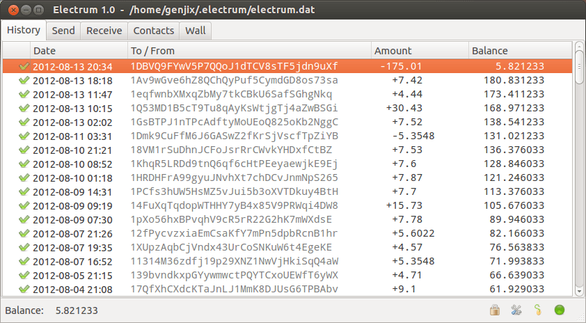

## Table of Contents

## What is Electrum Wallet and what are its main features?

Electrum Wallet is a type of software that helps you store, send, and receive Bitcoin. It is known for being easy to use and fast. You can use it on your computer or phone, and it works well even if you have a slow internet connection. Electrum Wallet keeps your Bitcoin safe by using something called a "private key," which is like a secret password that only you know.

One of the main features of Electrum Wallet is that it lets you use something called "cold storage." This means you can keep your Bitcoin on a device that is not connected to the internet, which makes it even safer. Another feature is that it supports "multi-signature" wallets. This means that you can set it up so that more than one person needs to agree before you can spend your Bitcoin. This is useful if you want to share control of your Bitcoin with others, like in a business.

Electrum Wallet also has a feature called "transaction history," which lets you see all the Bitcoin transactions you have made. This can help you keep track of your money. Another useful feature is that it supports "hardware wallets," which are special devices that store your private keys securely. Overall, Electrum Wallet is a good choice for anyone who wants a simple, secure way to manage their Bitcoin.

## How do I download and install Electrum Wallet?

To download and install Electrum Wallet, first go to the official Electrum website. Look for the download section and choose the version that matches your computer or phone, like Windows, Mac, or Android. Click on the download link and save the file to your device. Once the file is downloaded, open it to start the installation process. Follow the instructions on the screen, which might ask you to agree to terms and choose where to install the program. After the installation is done, you can open Electrum Wallet and start using it.

When you first open Electrum Wallet, it will ask you to create a new wallet or restore an existing one. If you're new, choose to create a new wallet. You'll be given a "seed phrase," which is a list of words that you need to write down and keep safe. This seed phrase is very important because it can help you recover your wallet if you lose access to your computer or phone. After setting up your wallet, you can start sending and receiving Bitcoin. Remember to always download Electrum from the official website to make sure it's safe and not a fake version.

## What are the system requirements for running Electrum Wallet?

Electrum Wallet is not too hard on your computer or phone. It needs about 30 MB of space on your device to install. It works on many different systems like Windows, macOS, and Linux. For Windows, you need at least Windows 7, and for macOS, you need at least version 10.12. If you use Linux, it should work with most versions. Your computer should have at least 1 GB of RAM to run it smoothly, but more is better.

For phones, Electrum Wallet has versions for Android and iOS. On Android, you need at least version 5.0, and it takes about 10 MB of space. For iOS, you need at least version 12.0, and it also takes about 10 MB. The app works well on most phones, but if your phone is very old, it might be a bit slow. Overall, Electrum Wallet is easy to use and does not need a lot from your device.

## How do I set up a new wallet in Electrum?

To set up a new wallet in Electrum, first open the Electrum application on your computer or phone. When you start it for the first time, you will see a screen that asks if you want to create a new wallet or restore an existing one. Choose "Create a new wallet." Electrum will then ask you to pick a name for your wallet. You can type any name you like. After that, you will be asked to choose a type of wallet. For most people, the standard wallet is the best choice, so select that one.

Next, Electrum will show you a seed phrase, which is a list of words. This seed phrase is very important because it can help you recover your wallet if you lose your device. Write down these words carefully and keep them in a safe place, like a locked drawer or a secure note on your phone. Do not share these words with anyone. After you have written down the seed phrase, Electrum will ask you to confirm it by typing the words back in the correct order. Once you do that, your wallet is set up, and you can start using it to send and receive Bitcoin.

## What are the different types of wallets available in Electrum?

In Electrum, you can choose from several types of wallets depending on what you need. The most common type is the "Standard Wallet," which is simple and good for most people. It lets you keep your Bitcoin on your device and use it easily. Another type is the "Multi-signature Wallet," which is useful if you want more than one person to have control over the wallet. This type requires multiple people to agree before any Bitcoin can be spent, which is good for businesses or groups.

There is also the "Watch-only Wallet," which is useful if you want to keep an eye on your Bitcoin without having the power to spend it. This type of wallet is good for checking your balance or transactions without risking your private keys. Lastly, Electrum supports "Hardware Wallets," which are special devices that store your private keys securely offline. This type is very safe because your Bitcoin is not connected to the internet, making it harder for hackers to steal it. Each type of wallet has its own benefits, so you can pick the one that fits your needs best.

## How does Electrum Wallet ensure the security of my bitcoins?

Electrum Wallet keeps your bitcoins safe in a few important ways. It uses a private key, which is like a secret password that only you know. This key is needed to spend your bitcoins, so keeping it secret is very important. Electrum also lets you use something called cold storage, where you keep your bitcoins on a device that is not connected to the internet. This makes it much harder for hackers to steal your bitcoins because they can't get to your private key if it's not online.

Another way Electrum Wallet helps keep your bitcoins secure is by supporting multi-signature wallets. This means you can set it up so that more than one person needs to agree before any bitcoins can be spent. This is useful if you want to share control with others, like in a business, and it adds an extra layer of security. Electrum also works well with hardware wallets, which are special devices that store your private keys safely offline. Using a hardware wallet with Electrum gives you the best protection because your private key stays off the internet, making it very hard for anyone to steal your bitcoins.

## What is the process for sending and receiving bitcoins using Electrum?

To send bitcoins using Electrum, first open the wallet and click on the "Send" tab. You will see a box where you need to enter the address of the person you want to send bitcoins to. This address is like their bank account number for bitcoins. After entering the address, type in the amount of bitcoins you want to send. You can also add a message if you want. When everything looks right, click on "Send" and enter your password to confirm the transaction. Electrum will then send the bitcoins to the address you entered. It's important to double-check the address because if you make a mistake, you can't get your bitcoins back.

To receive bitcoins with Electrum, open the wallet and go to the "Receive" tab. You will see a list of addresses that you can use to receive bitcoins. Click on one of these addresses to copy it, or you can generate a new one if you prefer. Share this address with the person who wants to send you bitcoins. They will use this address to send the bitcoins to your wallet. Once they send the bitcoins, you will see them appear in your Electrum wallet. It's a good idea to use a new address for each transaction to keep your wallet more private and secure.

## How can I back up my Electrum Wallet and why is it important?

Backing up your Electrum Wallet is easy and very important. To back up, open your wallet and go to the "Wallet" menu, then choose "Seed." You will see your seed phrase, which is a list of words. Write these words down carefully and keep them in a safe place, like a locked drawer or a secure note on your phone. You can also save a backup file by going to "File" and choosing "Save Copy." This file will have all your wallet information, so keep it safe too.

It's important to back up your Electrum Wallet because if something happens to your computer or phone, you might lose your bitcoins. The seed phrase and the backup file let you recover your wallet on a new device. Without a backup, you could lose all your bitcoins if your device breaks or gets stolen. So, always make sure to back up your wallet and keep the backup safe.

## What are the fees associated with using Electrum Wallet?

When you use Electrum Wallet to send bitcoins, you have to pay a fee. This fee is not set by Electrum, but by the Bitcoin network. The fee depends on how fast you want your transaction to be confirmed. If you want it to be fast, you pay a higher fee. If you can wait longer, you can choose a lower fee. Electrum lets you pick the fee, so you can decide how much you want to pay based on how quickly you need the bitcoins to arrive.

Electrum itself does not charge any fees for using the wallet. You only pay the network fee when you send bitcoins. This means that receiving bitcoins or just storing them in your Electrum Wallet is free. It's good to check the fee before you send bitcoins because it can change depending on how busy the Bitcoin network is. Always make sure you have enough bitcoins in your wallet to cover the fee, or your transaction might not go through.

## How does Electrum handle transaction privacy and can I use it anonymously?

Electrum Wallet helps keep your transactions private by using a new address for each transaction you receive. This means that it's harder for others to track all your transactions because they don't all link back to one address. Also, Electrum lets you use Tor, which is a way to hide your internet activity. If you use Tor with Electrum, it's harder for people to see where your transactions are coming from.

Using Electrum anonymously is possible, but it takes some effort. You need to be careful not to link your real identity to your wallet. This means not using your real name or personal information when you use the wallet. Also, always use a new address for each transaction and consider using Tor to hide your internet activity. Remember, while Electrum helps with privacy, staying completely anonymous depends on how you use it and other steps you take to protect your identity.

## What advanced features does Electrum offer for experienced users?

Electrum has some cool features for people who know a lot about Bitcoin. One of these is the ability to use the command line. This means you can control your wallet using text commands, which can be faster and more powerful than using the regular program. Another feature is that you can set up your own server to connect to the Bitcoin network. This can make your transactions faster and more private because you don't have to use someone else's server.

Electrum also lets you do something called "coin control," which means you can pick exactly which bitcoins you want to spend. This can be useful if you want to keep some bitcoins private or if you want to manage your money in a special way. Plus, Electrum has a feature called "Replace by Fee" (RBF), which lets you speed up a transaction by paying a higher fee after you've already sent it. This can be helpful if you need your bitcoins to arrive faster than you first thought.

## How can I integrate Electrum Wallet with other cryptocurrency services or hardware wallets?

Electrum Wallet can work well with other [cryptocurrency](/wiki/cryptocurrency) services and hardware wallets. To use it with other services, you can use something called an API, which is like a special way for different programs to talk to each other. For example, if you want to use Electrum with a trading platform, you can set up the API to send and receive information between Electrum and the platform. This way, you can manage your bitcoins on Electrum and still use the trading features of the other service.

For hardware wallets, Electrum supports many popular ones like Ledger and Trezor. To connect your hardware wallet, just plug it into your computer and open Electrum. Electrum will recognize the hardware wallet and let you use it to keep your private keys safe. This means you can use Electrum to send and receive bitcoins, but your private keys stay secure on the hardware wallet, which is not connected to the internet. This makes your bitcoins much safer from hackers.

## References & Further Reading

[1]: Miller, D. (2020). ["Mastering Bitcoin: Unlocking Digital Cryptocurrencies"](https://books.google.com/books/about/Mastering_Bitcoin.html?id=IXmrBQAAQBAJ). O'Reilly Media.

[2]: Narayanan, A., Bonneau, J., Felten, E., Miller, A., & Goldfeder, S. (2016). ["Bitcoin and Cryptocurrency Technologies: A Comprehensive Introduction"](https://press.princeton.edu/books/hardcover/9780691171692/bitcoin-and-cryptocurrency-technologies). Princeton University Press.

[3]: ["Mastering Bitcoin: Programming the Open Blockchain, 2nd Edition"](https://www.amazon.com/Mastering-Bitcoin-Programming-Open-Blockchain/dp/1491954388) by Andreas M. Antonopoulos

[4]: Voegtlin, T. (2013). ["Electrum: Secure, Lightweight, Bitcoin Client"](https://electrum.org/).

[5]: ["Algorithmic Trading and DMA: An Introduction to Direct Access Trading Strategies"](https://www.amazon.com/Algorithmic-Trading-DMA-introduction-strategies/dp/0956399207) by Barry Johnson