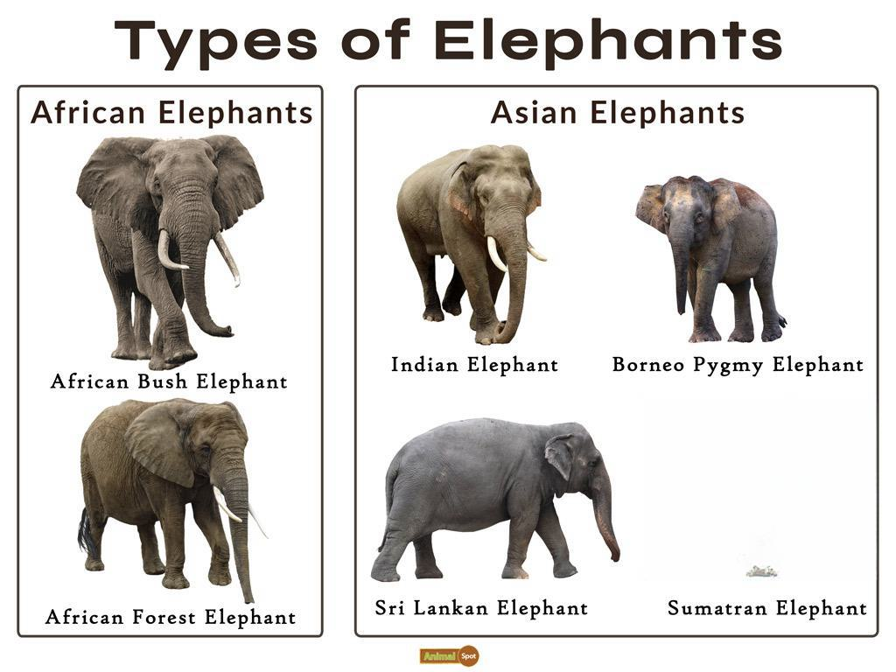

Elephants, the largest land animals on Earth, are renowned for their grandeur and distinct attributes. This article examines the multifaceted nature of elephants, focusing on their physical and behavioral traits, various species, and an intriguing analogy with algorithmic trading, highlighting parallels in their roles and impacts. The term 'elephant' is also employed in financial contexts to describe substantial institutional investors with the prowess to influence markets significantly. This comprehensive analysis will investigate both the biological and metaphorical applications of the term 'elephant'. We invite readers to explore the rich dynamics of the animal kingdom alongside the dynamic complexities of financial markets.

## Table of Contents

## Physical Characteristics of Elephants

Elephants are recognized as the largest terrestrial animals, showcasing impressive physical attributes that are crucial for their survival. Adult male elephants can weigh up to 7.5 tons, which is a testament to their massive build and strength. This sheer size plays a vital role in deterring predators and is integral to their dominant presence in various ecosystems.

One of the most distinctive features of elephants is their elongated trunk, a versatile appendage that serves a multitude of purposes. Functionally, the trunk is both a tactile and olfactory organ, allowing elephants to forage for food, drink water, and interact within their social groups. Additionally, the trunk is a powerful tool for communication, enabling elephants to express emotions and intentions through touch and gestures.

Elephants have large, fan-like ears that are vital not only for auditory perception but also for thermoregulation. These expansive ears help dissipate heat by increasing the surface area through which blood flows, cooling the elephants in their often hot and arid habitats. The unique vascular structure of the ears, coupled with ear flapping, facilitates effective temperature regulation.

The tusks of elephants, which are essentially elongated incisors, add to their impressive arsenal. These tusks serve several purposes, including digging for water and minerals, stripping bark from trees for food, and as weapons for defense and dominance battles. They also play a role in social interactions within herds, underscoring the importance of these physical features in elephant societies.

Elephants are further protected by their thick, wrinkled skin, which is about 2.5 centimeters (1 inch) thick. This dense skin provides a formidable barrier against environmental challenges, such as the harsh sun and insect bites. The wrinkles in their skin increase the surface area, aiding in moisture retention and temperature regulation, as mud and water trapped in these creases evaporate slowly, providing a cooling effect.

Overall, the physical characteristics of elephants are intricately linked to their ecological roles and behaviors, enabling them to thrive in diverse environments ranging from savannas to forests. These adaptations underscore not only their survival capabilities but also their ecological significance as keystone species in their respective habitats.

## Behavioral Characteristics of Elephants

Elephants exhibit complex social behaviors, living in matriarchal groups led by an experienced female. This structure is pivotal for their survival, providing a cohesive support system. Each member plays a specific role, contributing to the unity and effectiveness of the herd.

Their cognitive abilities are notable, showing signs of empathy, self-awareness, and tool use. Empathy in elephants is demonstrated through comforting behaviors when a member is distressed, such as touching or vocalizations. Self-awareness has been observed through mirror tests, where elephants recognize themselves and not another individual. This high level of cognitive function is comparable to that seen in primates and dolphins.

Communication among elephants is sophisticated and multi-faceted, incorporating a range of vocalizations, body language, and seismic signals. Infrasound, a low-frequency sound below the human hearing range, plays a significant role in their long-distance communication, transmitting through ground vibrations. Elephants use these sounds to coordinate movements, alert others of danger, and maintain contact over long distances.

The memory of elephants is another exceptional behavioral trait. It allows them to remember specific individuals, environmental landmarks, and crucial survival information like water sources, even after many years. This capability is crucial for their migratory patterns and survival in varying landscapes.

The social structures and behaviors of elephants mirror successful organizational strategies in human societies. These include the importance of leadership, cohesive teamwork, and efficient communication. In human organizations, a matriarchal approach can be seen in contexts where experienced individuals lead and mentor younger members, emphasizing the parallels between elephant groups and effective human social systems. Understanding the dynamics of elephant societies offers insights into the functioning and organization of successful human enterprises.

## Types of Elephants

Elephants are fascinating creatures with three recognized species: the African bush elephant, the African forest elephant, and the Asian elephant. These species are distributed across different habitats and regions, each exhibiting distinct characteristics that have evolved to suit their environments.

The African bush elephant (Loxodonta africana) is the largest of the species. It is notable for its immense size with males sometimes weighing over 6 tons and a height reaching up to 4 meters at the shoulder. A defining feature of the African bush elephant is its large ears, which facilitate heat regulation by fanning and dissipating body heat. Additionally, this species has a concave back and is usually found in the savannas and forests of sub-Saharan Africa. Its extensive range requires adaptability to both woodlands and grasslands.

The African forest elephant (Loxodonta cyclotis) is smaller than its bush counterpart with a more compact build adapted to dense rainforest life in West and Central Africa. These elephants have relatively smaller, rounded ears and straighter, downward tusks, which help navigate through thick underbrush. African forest elephants play a crucial role in their ecosystems, influencing forest structure and promoting biodiversity by dispersing seeds over vast distances.

The Asian elephant (Elephas maximus), found across South and Southeast Asia, is known for its smaller, rounded ears compared to the African species, which is an adaptation to the more temperate climate of its range. Asian elephants are generally smaller than African elephants, but they display remarkable intelligence and social structure. These elephants are highly revered in various cultures and are often domesticated for labor or ceremonial purposes. 

Each elephant species is uniquely adapted to its environment, contributing significantly to the biodiversity and ecological balance of their habitats. Their roles within their ecosystems are vital, from maintaining forest openings to enriching soil fertility, demonstrating their indispensable contribution to the natural world.

## Elephants in Finance: Institutional Investors

In the financial context, 'elephants' are synonymous with large institutional investors, such as banks, hedge funds, insurance companies, pension funds, and mutual funds. These entities hold substantial amounts of capital and possess the ability to execute trades in volumes that can significantly influence market dynamics. This influence is akin to the way physical elephants impact and shape the ecosystems they traverse.

Institutional investors are central in setting market trends due to their considerable purchasing power. By engaging in large [volume](/wiki/volume-trading-strategy) trades, these financial behemoths can push asset prices up or down, effectively dictating market trends. Their strategies and investments have the potential to alter the financial landscape, much like a herd of elephants transforming a savannah.

For example, when a large [hedge fund](/wiki/hedge-fund-trading-strategies) decides to invest heavily in a particular sector, it can lead to a ripple effect, encouraging other investors to follow, thereby driving up stock prices in that sector. Conversely, if an institutional investor decides to pull out, it might cause panic selling among smaller investors, triggering a market downturn. This is why they are often considered bellwethers of market sentiment and trends.

The movements and strategies of these institutional investors offer valuable insights into future economic conditions. Analysts and market participants often scrutinize their public disclosures, such as 13F filings in the United States, which provide details about the holdings of institutional investment managers. By understanding where these financial giants allocate their resources, investors can gain foresight into potential market movements.

For individual investors, understanding the behavior of institutional investors is crucial. By tracking their investment patterns, individual investors can better navigate the complexities of financial markets. Tools and platforms that analyze institutional trading data are increasingly popular, aiding individuals in making informed investment decisions.

In summary, the metaphor of elephants in finance aptly highlights the power and influence of institutional investors within markets. Their strategic maneuvers shape economic trends and movements, much like elephants dictate the flow of their natural habitats. Understanding these financial giants is essential for investors seeking to thrive in today's dynamic market environment.

## Parallels between Elephants and Algorithmic Trading

Algorithmic trading, often referred to as 'algo trading', involves the use of computer algorithms to execute trades at optimal times and prices. These algorithms process vast amounts of market data to identify trading opportunities and automate the execution of trades according to predefined criteria. This approach mirrors how elephants utilize their intellect to navigate complex environments efficiently, making strategic decisions to optimize their survival and social interactions.

In the wild, elephants demonstrate remarkable intelligence and strategic thinking. They assess their surroundings to find the best routes, utilize their trunks for multifaceted purposes such as food gathering and greetings, and communicate with their herd using sophisticated vocalizations. Similarly, [algorithmic trading](/wiki/algorithmic-trading) systems analyze extensive datasets to determine optimal entry and [exit](/wiki/exit-strategy) points in financial markets. This analysis often includes variables such as historical prices, trading volume, and timing, allowing traders to achieve desired outcomes without direct human intervention.

Both elephants and algo trading rely on systematic strategies. Elephants maintain structured social orders and adhere to established migratory patterns to ensure the safety and prosperity of the herd. This level of organization and social efficiency can be seen in the way algo trading systems execute trades. Predefined rules and parameters guide decision-making, minimizing human error and allowing for rapid response to market changes.

The speed of algorithmic trading mirrors the swift communication observed in elephant herds. Elephants use low-frequency sounds to communicate over long distances, coordinating movements and ensuring group cohesion. Similarly, algorithms can execute thousands of trades each second, responding to market shifts faster than any human trader possibly could. This near-instantaneous execution can be crucial in volatile markets, where timing often dictates success.

Leveraging 'elephantine wisdom' in financial analysis involves applying the lessons of strategy and adaptability seen in elephants to trading decisions. For instance, traders can design algorithms to adjust to varying market conditions, much like how elephants adapt their foraging techniques based on availability and competition. By strategically analyzing market trends and systematically executing trades, investors can achieve improved investment outcomes. 

Thus, the parallels between elephants and algorithmic trading highlight the importance of strategic planning, adaptability, and rapid execution, whether navigating the savannas of Africa or the complex landscape of global financial markets.

## Conclusion

Elephants, whether in their natural habitats or within financial systems, represent an amalgam of power, strategic prowess, and influence. Their distinctive characteristics garner respect and prompt strategic emulation across different fields. In the natural world, elephants demonstrate remarkable physical and cognitive abilities, from their communication skills to their complex social structures. These traits are mirrored in the financial markets by large institutional investors, often referred to as "elephants," whose decisions and movements can significantly impact market dynamics.

By understanding the ecological and financial behaviors of these elephants, we gain valuable insights into sustainable practices and economic forecasts. The way elephants navigate their environments with intelligence and adaptability can teach us valuable lessons applicable to strategic planning and risk management in financial markets. Recognizing the metaphorical application of elephants in finance helps us adopt strategies that mirror their natural inclinations—such as cooperation, long-term planning, and the ability to adapt to new challenges.

Ultimately, the enduring charm and profound wisdom of elephants continue to captivate and inspire us across various domains. Whether it is fostering conservation efforts in their natural ecosystems or developing strategic financial models, the lessons drawn from elephants encourage innovation and resilience in our interconnected world. In appreciating these magnificent creatures, we find guidance to navigate both wild jungles and complex market landscapes with greater adeptness.

## References & Further Reading

[1]: ["Elephants: A Cultural and Natural History"](https://www.amazon.com/Elephants-Cultural-Natural-Karl-Groning/dp/3829017529) by Nigel Rothfels

[2]: ["Social Organization in Male African Elephants, Loxodonta africana: A Model for Understanding Social Evolution"](https://www.savetheelephants.org/wp-content/uploads/2016/11/2007Hierarchyandsocialorganizationineles.pdf) by Connie Allen and colleagues

[3]: ["Elephants on the Edge: What Animals Teach Us about Humanity"](https://www.jstor.org/stable/j.ctt1npr32) by G.A. Bradshaw

[4]: ["Hearing in Elephants: Relative Sensitivity, Isoamplitude, Isoresponse, and Coefficients of Normal Equal Loudness"](https://pubmed.ncbi.nlm.nih.gov/7153389/) by Ronald R. Fay

[5]: ["Introduction to Algorithmic Trading"](https://www.investopedia.com/articles/active-trading/101014/basics-algorithmic-trading-concepts-and-examples.asp) by Edward Leshik and Jane Cralle

[6]: ["High-Frequency Trading: A Practical Guide to Algorithmic Strategies and Trading Systems"](https://www.ahmetbeyefendi.com/wp-content/uploads/2020/07/High-Frequency-Trading-Irene-Aldridge.pdf) by Irene Aldridge