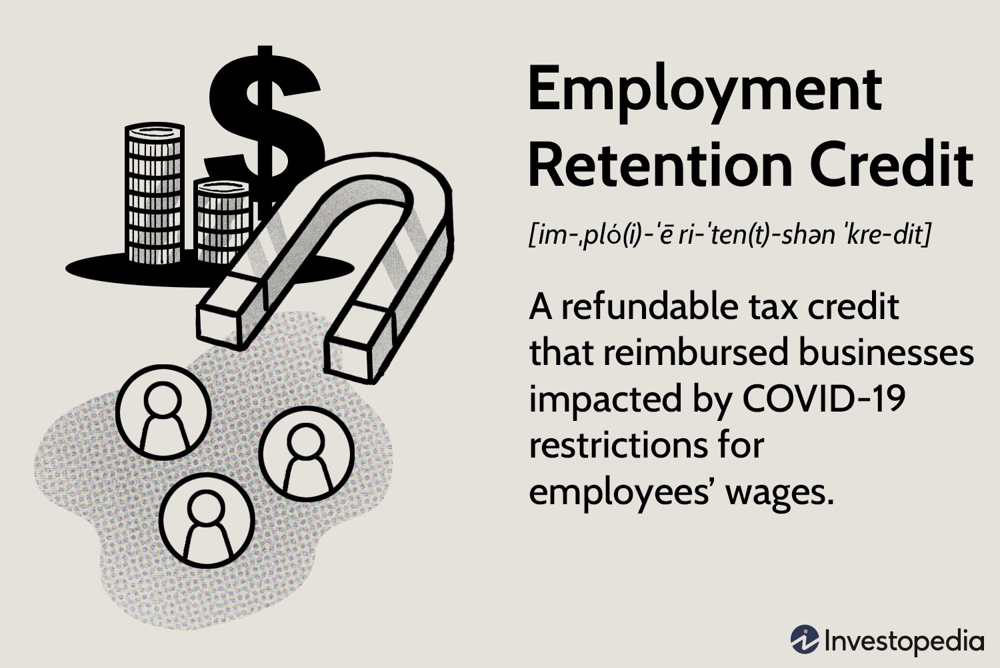

In the aftermath of the COVID-19 pandemic, businesses across the globe encountered a myriad of operational challenges that threatened their economic stability. The sudden shift in market conditions, coupled with mandated closures and health guidelines, pushed many organizations to the brink of financial distress. Amid these trials, the Employee Retention Credit (ERC) emerged as a crucial support mechanism. Established under the Coronavirus Aid, Relief, and Economic Security (CARES) Act, the ERC provided a refundable tax credit aimed at incentivizing employers to retain their workforce during periods of financial uncertainty and fluctuating demand.

The ERC has been instrumental for businesses striving to maintain employment levels and avoid costly layoffs. By offering significant financial relief, this tax credit has helped stabilize companies, providing them with the resources needed to navigate an uncertain economic landscape. The process of claiming this credit, however, involves understanding specific eligibility criteria and correctly assessing tax credit claims to avoid potential pitfalls.



Additionally, in recent years, a robust development within financial strategies involves algorithmic trading innovations, which have transformed the manner in which businesses approach financial decisions, including tax strategies. These technological advancements leverage sophisticated algorithmic models to assess and optimize financial outcomes, including those related to tax credits like the ERC. The integration of such technologies into financial planning underscores the ongoing evolution of fiscal strategies in addressing current challenges while preparing for future economic uncertainties.

As businesses continue to adapt to the evolving landscape, understanding the nuances of the ERC along with the strategic application of algorithmic trading can significantly enhance their financial resilience. This article will further examine these aspects, offering insights into the eligibility criteria for the ERC, the process of claiming the credit, and the future implications of tax credit strategies post-pandemic.

## Table of Contents

## Understanding the Employee Retention Credit (ERC)

The Employee Retention Credit (ERC) was introduced as a crucial component of the Coronavirus Aid, Relief, and Economic Security (CARES) Act, enacted in 2020. This refundable tax credit was designed to encourage businesses to retain employees during the economic disruptions caused by the COVID-19 pandemic. By offsetting the cost of wages, the ERC provided financial relief to employers who otherwise might have faced difficult decisions regarding layoffs or furloughs.

First and foremost, the ERC operates by reducing the amount of payroll taxes that employers are required to deposit with the federal government. Specifically, eligible employers can claim a credit against the Social Security tax, equaling a percentage of qualified wages they pay to their employees. For the year 2020, the credit was 50% of up to $10,000 in qualified wages per employee. In contrast, for 2021, the credit was increased to 70% of up to $10,000 in qualified wages per employee per quarter, significantly enhancing its potential benefit.

The refundability of the ERC is particularly advantageous, as it allows businesses to receive a refund if the credit exceeds their total payroll tax liability. This aspect makes the ERC especially appealing to businesses severely impacted by the pandemic, providing them with liquid capital to sustain operations and payroll.

From a financial standpoint, businesses stand to gain significantly from the ERC. By claiming the credit, companies can preserve cash flow, which is critical during periods of reduced revenue. Additionally, the ERC serves as an effective tool for maintaining workforce stability, helping businesses minimize the costs and disruptions associated with rehiring once economic conditions improve.

In summary, the ERC plays a pivotal role in the financial strategy of pandemic-era businesses. It not only aids in managing payroll expenses but also supports the broader goal of economic recovery by fostering employee retention and business continuity.

## Eligibility Criteria for ERC

The Employee Retention Credit (ERC) was introduced to assist businesses during the economic disruptions caused by the COVID-19 pandemic. To qualify for the ERC, businesses must meet specific eligibility requirements which were primarily centered around significant declines in gross receipts and government-mandated shutdowns. These eligibility criteria were outlined for specific periods in 2020 and 2021, each with its own set of rules.

### Core Eligibility Requirements

1. **Significant Decline in Gross Receipts**: 
   - In 2020, a business could qualify if its gross receipts for a calendar quarter were less than 50% of gross receipts for the same quarter in 2019. 
   - In 2021, eligibility was broadened, allowing businesses to qualify if gross receipts for a quarter were less than 80% of those in the corresponding quarter of 2019.

2. **Government-Mandated Shutdowns**:
   - Businesses that were either partially or fully suspended due to government orders related to COVID-19 during the specific periods could also qualify.

3. **Size of the Business**:
   - For 2020, businesses with 100 or fewer full-time employees could claim the ERC for wages paid to all employees during eligible periods.
   - For 2021, this threshold was increased to 500 or fewer full-time employees, providing broader eligibility for businesses.

### Common Misconceptions and Importance of Correct Assessments

There are several misconceptions about qualifying for the ERC. A prevalent one is the belief that all businesses that remained operational or did not experience a direct government mandate for shutdown are ineligible. However, eligibility can also hinge on significant declines in gross receipts, which do not necessarily correlate with shutdowns.

Accurate eligibility assessments are crucial because incorrect claims can result in penalties. Businesses are encouraged to thoroughly evaluate their financial records against the criteria stated. Consulting with tax professionals can prevent errors in eligibility determination and ensure compliance with regulations.

### Critical Periods: 2020 and 2021

- **2020**: The credit was originally applicable to wages paid after March 12, 2020, and before January 1, 2021. It was a key period as many businesses faced initial waves of COVID-19-related disruptions.

- **2021**: The Consolidated Appropriations Act extended the ERC, allowing claims for wages paid through the first three quarters of the year, with further flexibility in the eligibility criteria lesser known in 2020. 

The delineation of these periods is vital for businesses when assessing qualification, as the requirements evolved with the changing economic environment. Understanding these timelines helps ensure proper credit claims and maximizes potential financial recovery through the ERC. Businesses need to keep abreast of such criteria changes to fully benefit from them, highlighting the importance of regular consultation with financial and tax experts.

## How Algorithmic Trading Plays a Role

Algorithmic trading has significantly impacted financial decision-making and tax strategies, including optimizing outcomes related to tax credits such as the Employee Retention Credit (ERC). This technological advancement utilizes complex mathematical models and algorithms to analyze vast amounts of financial data, execute trades, and manage investments with precision and speed. Its application extends beyond trading, offering businesses insights and efficiencies in fiscal management, particularly in optimizing tax credit claims.

One of the primary influences of [algorithmic trading](/wiki/algorithmic-trading) in financial strategies is its ability to process and analyze large datasets to identify patterns and opportunities. For example, to optimize financial outcomes in claiming tax credits like the ERC, businesses can develop predictive models that assess historical performance data, economic indicators, and tax policy changes. These models help identify the optimal timing and strategies for filing claims, maximizing the benefits received.

Specific algorithmic models, such as those utilizing [machine learning](/wiki/machine-learning) techniques, have been particularly effective in this domain. Machine learning algorithms can be trained to predict eligibility and potential value of tax credits by analyzing historical company data against eligibility criteria defined by tax legislation. For instance, a supervised learning model could be used to predict the likelihood of ERC eligibility based on a company's financial performance during the pandemic years. The algorithm processes features such as revenue reduction, operational scale, and workforce retention rates to make these predictions.

```python
from sklearn.ensemble import RandomForestClassifier
import numpy as np

# Example: Predicting ERC eligibility
# Features: Revenue reduction %, workforce retention rate, operational scale
data = np.array([
    [30, 0.9, 500],  # Company A
    [20, 0.8, 300],  # Company B
    # more data
])

# Labels: 1 for eligible, 0 for not eligible
labels = np.array([1, 0])

# Initialize the model
model = RandomForestClassifier()

# Train the model
model.fit(data, labels)

# Predict eligibility for a new company
new_company = np.array([[25, 0.85, 450]])
eligibility_prediction = model.predict(new_company)
print("Eligibility:", "Eligible" if eligibility_prediction[0] == 1 else "Not Eligible")
```

In integrating financial algorithms to evaluate ERC claims and other tax credit opportunities, companies can enhance accuracy and efficiency. Algorithms can process compliance requirements and financial data to ensure precise and timely claims submissions, reducing the risk of errors and associated penalties. Additionally, these algorithms can simulate various scenarios to optimize tax liability by strategically timing the claiming of credits.

Furthermore, sophisticated algorithms can manage the risks and uncertainties associated with tax claims. By simulating different economic environments and policy changes, these tools assist companies in developing robust strategies that account for potential fluctuations in eligibility or credit value, ultimately leading to informed and data-driven decision-making processes. 

The continued advancement in algorithmic trading and computational finance will likely lead to even more detailed and customized solutions for managing tax credits, positioning businesses to maximize financial returns while maintaining compliance with evolving tax regulations.

## Claiming the ERC: Steps and Considerations

To claim the Employee Retention Credit (ERC), businesses must follow a systematic approach to ensure accuracy and compliance with IRS guidelines. Below is a step-by-step guide outlining the claim process, necessary documentation, and considerations to avoid common pitfalls.

### Step-by-Step Guide to Claiming the ERC

1. **Determine Eligibility:** 
   - Verify that your business meets the eligibility criteria for the relevant tax periods. This involves assessing either a full or partial suspension of operations due to government orders or a significant decline in gross receipts.

2. **Calculate Eligible Wages:**
   - For each eligible quarter, calculate the qualified wages paid to employees. Include any health plan expenses. The calculation must adhere to IRS specifications, which differ for large and small employers.

3. **Prepare Necessary Documentation:**
   - Gather supporting documents, including payroll records, employee records, and financial statements that validate a decline in gross receipts. Specific documentation may include:
     - Copies of government orders mandating shutdowns.
     - Financial records showing gross receipts for each quarter.

4. **Complete IRS Form 941:**
   - Use Form 941, the Employer’s Quarterly Federal Tax Return, to claim the credit. Adjustments can be made on this form to reflect the credit against payroll taxes.

5. **Amend Past Returns if Necessary:**
   - If claiming the ERC retroactively, file an amended Form 941-X for the respective quarters. This involves recalculating liabilities and ensuring accuracy in reported figures.

6. **Submit the Claim:**
   - Ensure that all forms are thoroughly reviewed and submitted within the deadlines. Late submissions may lead to penalties or forfeiture of the credit.

### Common Pitfalls and Considerations

- **Incomplete or Incorrect Documentation:**
  - Inadequate documentation can result in rejection of the claim. To mitigate this, maintain comprehensive and organized records that clearly substantiate the eligibility and calculation of the credit.

- **Inaccurate Calculations:**
  - Miscalculating qualified wages or tax credits is a frequent error. Double-check calculations and ensure compliance with IRS definitions and limits. Consider using accounting software or consulting a tax professional to enhance accuracy.

- **Misinterpretation of Eligibility Criteria:**
  - Misunderstanding the eligibility criteria, especially regarding decline in gross receipts or business suspension, can lead to improper claims. Regularly consult IRS guidelines and updates to ensure compliance.

### Implications of Incorrect Claims

Submitting an incorrect ERC claim can result in various consequences, including penalties, interest on back taxes, and potential audits by the IRS. To rectify incorrect claims:

- **Amend Returns Promptly:**
  - If errors are identified post-submission, promptly file amended returns using Form 941-X. Correct both the errors and any resultant discrepancies in tax liabilities.

- **Consult Legal or Tax Advisors:**
  - Engage with tax professionals or legal advisors to guide corrective measures and communication with the IRS. This can alleviate potential penalties and assist in handling complex issues that may arise during audits.

By diligently following these steps and being mindful of the associated considerations, businesses can effectively claim the ERC and secure the financial benefits designed to support workforce retention during challenging economic periods.

## The Future of ERC and Tax Credit Claims

The Employee Retention Credit (ERC) has served as a significant financial mechanism for businesses navigating the post-pandemic economy. Looking ahead, potential changes to the ERC may emerge as policymakers reassess economic support strategies to fortify businesses against future fluctuations. The cyclical nature of economic challenges suggests that credits like the ERC could be revived or restructured to address new forms of financial adversity. Their flexibility in mitigating employment reduction risks will likely influence future financial policies aimed at preserving workforce stability.

Tax credits, including the ERC, remain pertinent during economic recovery phases as they provide substantial relief, encouraging businesses to retain their employees. These incentives reduce operational costs, thereby freeing up capital for other essential business activities. Consequently, as future fiscal policies evolve, the concept of sustainable tax credits may emerge, reinforcing businesses’ capability to withstand economic shocks without resorting to personnel layoffs.

The integration of technology in finance, particularly algorithmic tools, is set to progressively influence tax credit claims. Algorithmic systems offer businesses the ability to make precise and optimized financial decisions by processing vast data sets quickly. These tools can streamline the evaluation of eligibility criteria for tax credits, ensuring accuracy in claims. For instance, businesses can deploy machine learning models to predict and adjust financial strategies according to changing eligibility rules, thus maximizing their potential tax credits.

Python libraries such as Pandas and SciPy can facilitate this process by handling data analysis and optimization tasks. An example Python snippet for checking eligibility thresholds might be:

```python
import pandas as pd

# Sample data with financial metrics
data = {'Quarter': ['2020 Q1', '2020 Q2', '2020 Q3'],
        'Revenue': [50000, 30000, 60000],
        'Threshold': [55000, 55000, 55000]}

df = pd.DataFrame(data)

# Check if revenue met the threshold for ERC
df['Eligible'] = df['Revenue'] < df['Threshold']
print(df)
```

As businesses increasingly rely on data-driven solutions, the comprehensive integration of such algorithms will not only refine the claims process but also aid in strategic decision-making, aligning financial activities with broader business goals. This evolution will, in turn, embed technological insight into fiscal policy considerations, ensuring that tax credit systems like the ERC adapt effectively to future landscapes.

## Conclusion

The Employee Retention Credit (ERC) has proven to be an essential instrument for ensuring business stability in the wake of the economic challenges prompted by the COVID-19 pandemic. By offering a refundable tax credit, the ERC has enabled countless businesses to maintain their workforce and continue operations despite financial uncertainty.

It is crucial for businesses to stay informed and up-to-date on tax credit opportunities like the ERC, as these measures can significantly impact financial health and operational continuity. Leveraging technological advancements, such as algorithmic trading models, can enhance the accuracy and efficiency of tax credit claims, ultimately optimizing financial outcomes.

As economic conditions evolve, businesses must reassess their strategies to adapt to new challenges and opportunities. In doing so, they should consider the potential resurgence of the ERC and similar financial tools in future policy landscapes, ensuring they are well-positioned to take full advantage of such opportunities for sustained growth and stability. Businesses should remain vigilant, proactively adjusting their financial strategies to navigate the complexities of a recovering global economy.

## References & Further Reading

[1]: ["Coronavirus Aid, Relief, and Economic Security (CARES) Act."](https://www.congress.gov/bill/116th-congress/house-bill/748) United States Congress.

[2]: ["Employee Retention Credit under the CARES Act: Frequently Asked Questions."](https://www.irs.gov/coronavirus/frequently-asked-questions-about-the-employee-retention-credit) Internal Revenue Service.

[3]: ["Algorithmic Trading: Winning Strategies and Their Rationale"](https://www.wiley.com/en-us/Algorithmic+Trading%3A+Winning+Strategies+and+Their+Rationale-p-9781118460146) by Ernie Chan

[4]: ["The Role of Technology in Managing the COVID-19 Pandemic: Evidence from the Blockchain."](https://onlinelibrary.wiley.com/doi/10.1155/2021/4860704) Tezel, A., et al. Expert Systems with Applications, 164, 113806. 

[5]: ["Python for Data Analysis: Data Wrangling with Pandas, NumPy, and IPython"](https://wesmckinney.com/book/) by Wes McKinney