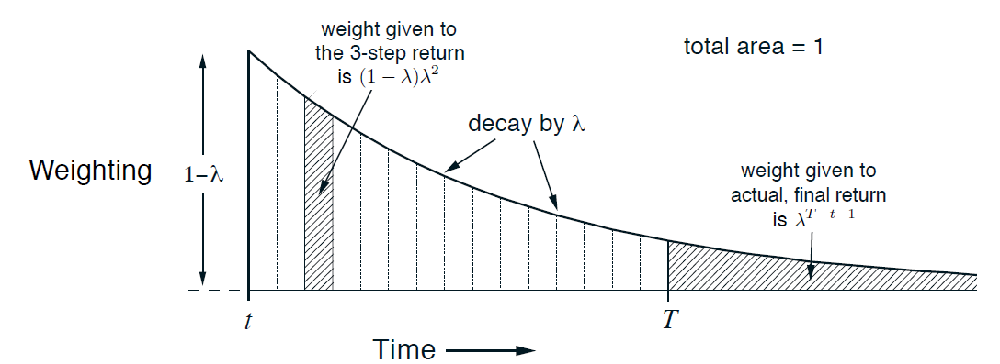

## Table of Contents

## What are eligibility traces in the context of machine learning?

Eligibility traces are a concept used in reinforcement learning, a type of machine learning where an agent learns to make decisions by interacting with an environment. They help the agent remember which actions were taken in the past and how important those actions were in leading to a reward or penalty. Think of them as a way to keep track of the "credit" for a reward, so the agent can learn from its past actions more effectively.

In simpler terms, eligibility traces act like a memory mechanism. When the agent receives a reward, it can use the eligibility trace to figure out which of its past actions contributed to that reward. This helps the agent adjust its behavior more accurately over time. For example, if an action taken several steps ago led to a good outcome, the eligibility trace ensures that action is still considered important when updating the agent's learning model.

To illustrate, consider a scenario where an agent navigates a maze. If it takes a correct turn early on and then receives a reward at the end, the eligibility trace helps the agent understand that the early turn was crucial. This way, the agent can strengthen its preference for taking that turn in future attempts, improving its overall performance in the maze.

## How do eligibility traces contribute to reinforcement learning algorithms?

Eligibility traces help [reinforcement learning](/wiki/reinforcement-learning) algorithms by keeping a record of past actions and their relevance to future rewards. Imagine you're playing a game where you need to remember which moves helped you win. Eligibility traces act like a scorecard, showing which moves were good or bad based on the rewards you get later. This helps the algorithm learn better because it can adjust its behavior not just based on immediate results, but also on what happened before. For example, if an action taken several steps ago led to a big reward, the eligibility trace makes sure that action is remembered and valued when the algorithm updates its learning model.

In technical terms, eligibility traces are used in algorithms like Temporal Difference (TD) learning and Q-learning. They add a memory component to these algorithms, allowing them to consider the impact of actions over time. A common way to implement eligibility traces is through a method called TD(λ), where λ is a parameter that controls how much past actions influence the current learning update. The formula for updating the value function using eligibility traces can be written as $$V(s) \leftarrow V(s) + \alpha \cdot \delta \cdot e(s)$$, where $$V(s)$$ is the value of state $$s$$, $$\alpha$$ is the learning rate, $$\delta$$ is the temporal difference error, and $$e(s)$$ is the eligibility trace for state $$s$$. This formula shows how the value of a state is updated based on both the immediate feedback (δ) and the historical importance of the state (e(s)).

## What is the difference between an accumulating eligibility trace and a replacing eligibility trace?

An accumulating eligibility trace and a replacing eligibility trace are two ways to keep track of how important past actions were in reinforcement learning. An accumulating eligibility trace adds up the importance of each action over time. So, if an action is taken multiple times, its importance keeps growing. This means that if you do something a lot, the algorithm will remember it more and more. Imagine you're playing a game and you keep using the same move; an accumulating trace would make that move seem more and more important each time you use it.

On the other hand, a replacing eligibility trace sets the importance of an action to a fixed value each time it's taken, instead of adding to it. If you do the same action again, it doesn't keep getting more important; it just stays at that fixed level. This can be useful if you want to make sure that no single action gets too much credit just because it's used a lot. For example, in the same game, if you keep using the same move, a replacing trace would keep its importance at a steady level, not letting it grow too much.

## Can you explain the concept of the Dutch eligibility trace?

The Dutch eligibility trace is a type of eligibility trace that combines the ideas of accumulating and replacing traces. It's called "Dutch" because it's a compromise between the two, much like the Netherlands is geographically between other countries. In the Dutch trace, when an action is taken, its importance is increased, but not as much as in an accumulating trace. If the same action is taken again, its importance is bumped up a bit, but it's not reset to a fixed value like in a replacing trace.

Imagine you're playing a game and you keep using the same move. With a Dutch trace, the importance of that move will grow, but more slowly than with an accumulating trace. This means the move won't get too much credit just because you use it a lot, but it will still be remembered as important. The Dutch trace can be useful because it balances remembering past actions without letting any single action become too dominant in the learning process.

## How does the use of eligibility traces affect the learning process in temporal difference learning?

Eligibility traces help make temporal difference (TD) learning better by keeping track of past actions and how important they were. In TD learning, the algorithm learns from the difference between what it expected and what actually happened. When you add eligibility traces, the algorithm can remember which actions led to good or bad outcomes, even if those outcomes happened a while after the action. This makes the learning process more accurate because the algorithm can adjust its understanding based on a longer history of actions and rewards.

For example, in TD(λ) learning, the parameter λ controls how much the algorithm remembers past actions. If λ is 0, the algorithm only cares about what just happened, like a replacing trace. If λ is 1, it remembers everything like an accumulating trace. The formula for updating the value function using eligibility traces is $$V(s) \leftarrow V(s) + \alpha \cdot \delta \cdot e(s)$$. Here, $$V(s)$$ is the value of state $$s$$, $$\alpha$$ is how fast the algorithm learns, $$\delta$$ is the difference between what was expected and what happened, and $$e(s)$$ is how important state $$s$$ was in the past. By using eligibility traces, TD learning can learn from a wider range of experiences, making it smarter over time.

## What are the advantages of using eligibility traces in reinforcement learning?

Eligibility traces help reinforcement learning algorithms learn better by remembering which actions were important in the past. Imagine you're playing a game and you need to remember which moves helped you win. Eligibility traces act like a scorecard, showing which moves were good or bad based on the rewards you get later. This helps the algorithm learn not just from what happens right away, but also from what happened before. For example, if an action taken a while ago led to a big reward, the eligibility trace makes sure that action is remembered and valued when the algorithm updates its learning model.

Using eligibility traces can make learning faster and more accurate. They allow the algorithm to consider the impact of actions over time, not just immediately. This is especially useful in situations where the reward comes after many steps, like navigating a maze. The formula for updating the value function using eligibility traces is $$V(s) \leftarrow V(s) + \alpha \cdot \delta \cdot e(s)$$, where $$V(s)$$ is the value of state $$s$$, $$\alpha$$ is the learning rate, $$\delta$$ is the temporal difference error, and $$e(s)$$ is the eligibility trace for state $$s$$. By considering past actions, the algorithm can adjust its behavior more effectively, leading to better performance in the long run.

## What are the potential drawbacks or challenges associated with using eligibility traces?

Using eligibility traces can make learning more complex. They add more steps to how the algorithm figures things out, which can slow down the learning process. Also, if the eligibility traces are not set up right, they can make the algorithm remember things too much or not enough. For example, if an action taken a long time ago is still considered very important, it might confuse the algorithm about what really led to a reward. This is called the "credit assignment problem," where it's hard to know which actions really deserve credit for the outcome.

Another challenge is choosing the right type of eligibility trace. There are different kinds, like accumulating, replacing, and Dutch traces, and each one works differently. The choice depends on the specific problem you're trying to solve. For instance, if you use an accumulating trace when a replacing trace would be better, the algorithm might focus too much on actions that are repeated a lot, even if they're not that important. This can lead to the algorithm learning the wrong things and making worse decisions over time.

## How can the parameters of eligibility traces be tuned for optimal performance?

Tuning the parameters of eligibility traces for optimal performance involves adjusting the learning rate (α) and the trace decay parameter (λ). The learning rate controls how much the algorithm changes its understanding based on new information. If α is too high, the algorithm might forget what it learned before too quickly, making it hard to learn from past experiences. If α is too low, the algorithm might learn too slowly, missing out on important lessons. The trace decay parameter λ decides how much the algorithm remembers past actions. A high λ means the algorithm remembers a lot, which can be good for tasks where past actions are important, but it might also cause the algorithm to focus too much on old information. A low λ makes the algorithm focus more on recent actions, which can be better for tasks where the most recent actions are the most important.

To find the best values for α and λ, you can try different settings and see which ones work best for your specific problem. This might involve running the algorithm many times with different combinations of α and λ and measuring how well it performs. For example, you might use a formula like $$V(s) \leftarrow V(s) + \alpha \cdot \delta \cdot e(s)$$ to update the value function, where $$V(s)$$ is the value of state $$s$$, $$\delta$$ is the temporal difference error, and $$e(s)$$ is the eligibility trace for state $$s$$. By carefully adjusting α and λ, you can help the algorithm learn more effectively and make better decisions over time.

## In what types of reinforcement learning scenarios are eligibility traces most beneficial?

Eligibility traces are most helpful in reinforcement learning scenarios where the reward comes after many steps. Imagine playing a game where you need to make a series of moves before you find out if you did well or not. In such cases, eligibility traces help the algorithm remember which moves were important, even if the reward comes much later. For example, if you're navigating a maze and you take a correct turn early on, but only get a reward at the end, eligibility traces make sure that early turn is still considered important when the algorithm updates its learning model. This helps the algorithm learn better over time by connecting past actions to future rewards.

They are also beneficial in situations where the same action might be taken multiple times, but its importance should not grow too much. Think of a game where you keep using the same move, but you don't want that move to become too important just because you use it a lot. Eligibility traces can be set up to remember the move without letting its importance grow too much, like with a replacing or Dutch trace. This helps the algorithm focus on what really matters for getting a good outcome, rather than just repeating the same action over and over. By using eligibility traces, the algorithm can learn more accurately and make better decisions in the long run.

## Can you provide a simple example of how an eligibility trace updates values in a reinforcement learning scenario?

Imagine you're playing a game where you move around a grid to reach a goal. Each move you make is an action, and you get a reward only when you reach the goal. Let's say you start at the bottom left corner and the goal is at the top right corner. You take a few steps: first, you move right, then up, then right again. Finally, you reach the goal and get a reward. Without eligibility traces, the algorithm would only learn from the last move that led to the reward. But with eligibility traces, the algorithm can remember that the first move to the right was important too, because it helped you get closer to the goal.

Here's how it works: When you take an action, the eligibility trace for that action starts to build up. If you move right and then up, the trace for "move right" increases a bit, and then the trace for "move up" starts to increase. When you finally get the reward, the algorithm uses the eligibility traces to update the value of each action. The formula for updating the value function is $$V(s) \leftarrow V(s) + \alpha \cdot \delta \cdot e(s)$$. In this formula, $$V(s)$$ is the value of the action you took, $$\alpha$$ is how fast the algorithm learns, $$\delta$$ is the difference between what the algorithm expected and the actual reward, and $$e(s)$$ is how important that action was according to the eligibility trace. This way, the algorithm can learn that moving right early on was a good move, even though the reward came much later.

## How do eligibility traces interact with other reinforcement learning techniques such as Q-learning?

Eligibility traces can be used with Q-learning to help the algorithm learn better by remembering which actions were important in the past. In Q-learning, the algorithm learns to estimate the value of taking an action in a certain state. It does this by updating a Q-value, which is the expected reward for taking that action. When you add eligibility traces to Q-learning, the algorithm can remember past actions and their importance over time. For example, if an action taken a while ago led to a big reward, the eligibility trace helps the algorithm remember that action and update its Q-value accordingly. The formula for updating the Q-value using eligibility traces in Q-learning is $$Q(s, a) \leftarrow Q(s, a) + \alpha \cdot \delta \cdot e(s, a)$$, where $$Q(s, a)$$ is the Q-value for state $$s$$ and action $$a$$, $$\alpha$$ is the learning rate, $$\delta$$ is the temporal difference error, and $$e(s, a)$$ is the eligibility trace for that state-action pair.

Using eligibility traces with Q-learning can make the learning process more accurate because the algorithm can consider the impact of actions over a longer period. Imagine playing a game where you need to make a series of moves before you get a reward. Without eligibility traces, Q-learning would only learn from the last move that led to the reward. But with eligibility traces, Q-learning can remember that earlier moves were important too. This helps the algorithm adjust its Q-values based on a wider range of experiences, leading to better decision-making in the long run. By balancing the immediate feedback with the historical importance of actions, Q-learning with eligibility traces can learn more effectively and make better choices in complex environments.

## What are some advanced strategies for implementing eligibility traces in complex environments?

In complex environments, one advanced strategy for implementing eligibility traces is to use a variable trace decay parameter, λ. Instead of using a fixed λ value, you can adjust it based on the specific situation. For example, in a maze where some areas are more important than others, you could increase λ in critical areas to make sure the algorithm remembers actions taken there more strongly. This can help the algorithm focus on the most important parts of the environment and learn more effectively. The formula for updating the value function using a variable λ is $$V(s) \leftarrow V(s) + \alpha \cdot \delta \cdot e(s)$$, where $$e(s)$$ is influenced by the variable λ.

Another strategy is to use different types of eligibility traces for different parts of the environment. For example, you might use an accumulating trace in areas where repeated actions are important, and a replacing trace in areas where you want to avoid overvaluing repeated actions. This can help the algorithm adapt to different parts of the environment more effectively. By carefully choosing the right type of trace for each part, you can make sure the algorithm learns the right lessons from each area. This approach can be especially useful in environments with diverse challenges, where a single type of trace might not work well everywhere.