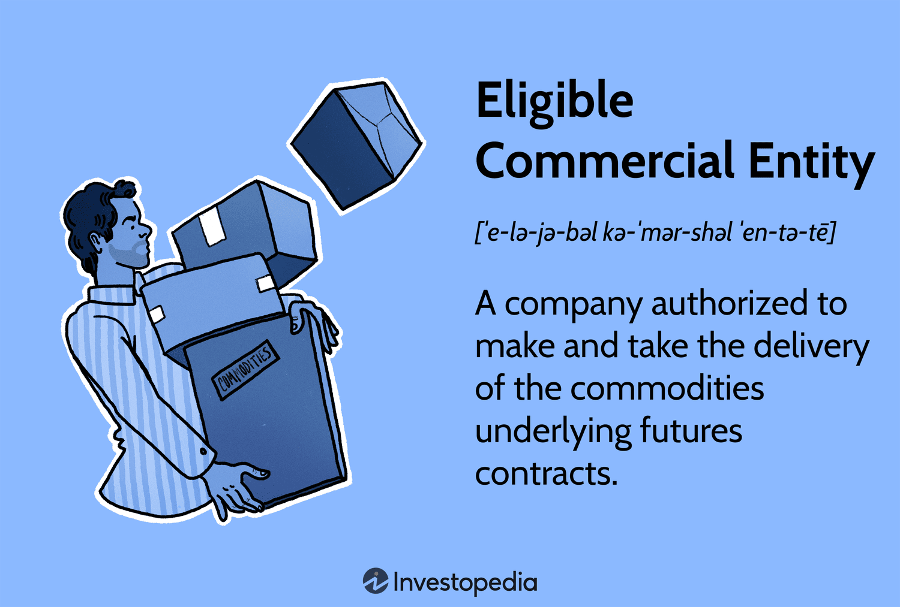

## Table of Contents

## What is an Eligible Commercial Entity (ECE)?

An Eligible Commercial Entity (ECE) is a type of business that can use special trading rules in the United States. These rules are set by the Commodity Futures Trading Commission (CFTC). ECEs can trade in certain financial markets without following all the usual regulations that other businesses have to follow. This makes it easier for them to do their trading activities.

To be an ECE, a business needs to meet certain requirements. These include having a certain amount of money, being involved in certain types of business activities, or being approved by a federal regulatory agency. ECEs can include big companies, banks, and other financial institutions. Being an ECE allows these businesses to have more freedom in how they trade, which can help them manage risks and do business more efficiently.

## What are the basic requirements to qualify as an Eligible Commercial Entity?

To qualify as an Eligible Commercial Entity (ECE), a business must meet certain basic requirements set by the Commodity Futures Trading Commission (CFTC). One of the main requirements is that the business must have a certain amount of money, known as net worth. This means the business's assets minus its liabilities must be above a specific threshold. Another requirement is that the business must be involved in certain types of activities. These activities can include producing, processing, or merchandising commodities, or being a dealer in securities or swaps.

In addition to these financial and activity-based requirements, a business can also qualify as an ECE if it is approved by a federal regulatory agency. This approval shows that the business meets the necessary standards to be trusted with more flexible trading rules. Being an ECE allows businesses to trade in certain financial markets without having to follow all the usual regulations. This can help them manage risks and operate more efficiently in their trading activities.

## How does an organization apply to become an Eligible Commercial Entity?

To become an Eligible Commercial Entity (ECE), an organization needs to meet certain requirements set by the Commodity Futures Trading Commission (CFTC). The organization must have a certain amount of money, called net worth. This means their assets minus their liabilities should be above a specific threshold. They also need to be involved in certain types of business activities, like producing, processing, or selling commodities, or being a dealer in securities or swaps. Another way to qualify is if the organization is approved by a federal regulatory agency, which shows they meet the necessary standards.

If an organization thinks they meet these requirements, they don't need to apply in a formal way. They just need to make sure they can show proof of their net worth and their business activities if asked. Being an ECE allows the organization to trade in certain financial markets with fewer regulations. This can help them manage risks and do their business more efficiently. It's important for the organization to keep up with the CFTC rules and make sure they continue to meet the requirements to stay an ECE.

## What are the benefits of being recognized as an Eligible Commercial Entity?

Being recognized as an Eligible Commercial Entity (ECE) gives a business more freedom in trading. It means they don't have to follow all the usual rules that other businesses do. This can make it easier for them to trade in certain financial markets. They can manage their risks better and do their business more smoothly. It's like getting a special pass that lets them move faster and more easily in the trading world.

Another benefit is that ECEs can save time and money. Without so many regulations to follow, they can focus more on their trading activities. This can help them be more efficient and make more money. It also means they can react quickly to changes in the market. Being an ECE can really help a business grow and succeed in the financial world.

## Can an Eligible Commercial Entity participate in certain financial markets that others cannot?

Yes, an Eligible Commercial Entity (ECE) can participate in certain financial markets that other businesses cannot. This is because ECEs are allowed to use special trading rules set by the Commodity Futures Trading Commission (CFTC). These rules give ECEs more freedom to trade in markets like commodities, securities, and swaps without having to follow all the usual regulations.

This special access helps ECEs manage their risks better and do their business more efficiently. They can trade in these markets more easily and quickly, which can lead to more profits and growth for their business. Being an ECE is like having a special key that opens doors to markets that are harder for other businesses to enter.

## What types of businesses typically qualify as Eligible Commercial Entities?

Eligible Commercial Entities (ECEs) are usually big businesses that have a lot of money and do certain kinds of work. These businesses can include companies that make things, like factories that produce goods. They can also be companies that process things, like turning raw materials into finished products. Another type of ECE is a business that sells a lot of commodities, like a big farm that sells crops or a mining company that sells minerals. These businesses need to have a certain amount of money, called net worth, to qualify as an ECE.

Other types of businesses that can be ECEs are banks and other financial institutions. These businesses deal with securities and swaps, which are special kinds of financial products. They use these products to help manage their money and make profits. To be an ECE, a business also needs to be approved by a federal regulatory agency. This approval shows that the business meets the necessary standards to be trusted with more flexible trading rules. Being an ECE helps these businesses trade more easily and manage their risks better.

## How does the status of an Eligible Commercial Entity affect tax obligations?

Being an Eligible Commercial Entity (ECE) does not directly change a business's tax obligations. The rules for paying taxes are set by the tax authorities, like the Internal Revenue Service (IRS) in the United States, and these rules apply to all businesses, including ECEs. So, an ECE still needs to follow the same tax laws and pay the same kinds of taxes as other businesses.

However, being an ECE can affect a business's financial activities, which might indirectly impact its taxes. For example, because ECEs can trade in certain markets with fewer regulations, they might be able to make more money or save on costs. This could mean they have more income to report on their taxes or different kinds of income and expenses to consider. But the way they calculate and pay their taxes would still follow the standard tax rules.

## What are the regulatory implications for an Eligible Commercial Entity?

Being an Eligible Commercial Entity (ECE) means a business can follow fewer trading rules set by the Commodity Futures Trading Commission (CFTC). This gives ECEs more freedom to trade in certain financial markets like commodities, securities, and swaps. They don't have to follow all the usual regulations that other businesses do, which can make their trading activities easier and faster. However, ECEs still need to make sure they meet the requirements to be an ECE, like having enough money and doing certain types of business activities.

Even though ECEs have fewer trading rules to follow, they are still under the watch of the CFTC. This means they need to be careful and make sure they are following the rules that do apply to them. If they don't, they could face penalties or lose their ECE status. So, while being an ECE gives a business more freedom, it also comes with the responsibility to keep up with the CFTC's requirements and stay in good standing.

## How does the status of an Eligible Commercial Entity influence its ability to engage in hedging activities?

Being an Eligible Commercial Entity (ECE) helps a business a lot when it comes to hedging. Hedging is like buying insurance for the business's risks. It means they can trade in certain markets more easily to protect themselves from price changes. Because ECEs don't have to follow all the usual rules, they can do their hedging faster and more efficiently. This can save them time and money, and help them manage their risks better.

For example, a big farming company that is an ECE can use the special trading rules to hedge against changes in crop prices. They can buy and sell futures contracts more easily, which helps them lock in prices and avoid big losses if prices drop. This freedom to trade without so many restrictions makes it easier for ECEs to protect their business from ups and downs in the market.

## What are the potential risks associated with being an Eligible Commercial Entity?

Being an Eligible Commercial Entity (ECE) comes with some risks. One big risk is that if an ECE doesn't follow the rules set by the Commodity Futures Trading Commission (CFTC), they could face penalties. These penalties could be fines or even losing their ECE status. Losing ECE status would mean they have to follow all the usual rules again, which could slow down their trading and make it harder to manage risks.

Another risk is that with more freedom to trade, ECEs might take on too much risk. They might start trading in ways that could lead to big losses if the market doesn't go their way. This is especially true in markets like commodities and swaps, where prices can change a lot. ECEs need to be careful and have good plans to manage these risks, or they could end up losing a lot of money.

## How do international regulations impact the status and operations of an Eligible Commercial Entity?

International regulations can affect how an Eligible Commercial Entity (ECE) operates, even though the ECE status is given by the U.S. Commodity Futures Trading Commission (CFTC). If an ECE wants to trade in markets outside the U.S., they need to follow the rules of those countries too. These rules might be different from the U.S. rules, and sometimes they can be stricter. This means an ECE might have to follow more rules than they do in the U.S., which could make their trading activities more complicated and costly.

On the other hand, some countries might have agreements with the U.S. that make it easier for ECEs to trade there. These agreements can help ECEs work in international markets without facing too many extra rules. But, ECEs still need to keep up with changes in international laws and make sure they are following all the right rules. If they don't, they could face penalties or lose their ability to trade in those markets.

## What advanced strategies can Eligible Commercial Entities employ to optimize their market position?

Eligible Commercial Entities (ECEs) can use advanced strategies to make their position in the market better. One way is by using hedging more effectively. Because ECEs can trade with fewer rules, they can hedge against price changes more easily. They can use futures contracts and other financial tools to lock in prices and protect themselves from big losses if the market goes down. This helps them keep their costs steady and plan better for the future.

Another strategy is to take advantage of [arbitrage](/wiki/arbitrage) opportunities. Arbitrage means buying something in one market and selling it in another to make a profit from the price difference. ECEs can use their special trading rules to do this faster and more often. They can also use sophisticated trading algorithms to find these opportunities quickly. By doing this, they can make more money and improve their market position.

Lastly, ECEs can use their status to diversify their trading activities. They can trade in different markets like commodities, securities, and swaps without facing as many restrictions. This diversification can help them spread their risks and find new ways to grow their business. By carefully managing these different trading activities, ECEs can strengthen their market position and be more resilient to changes in the market.

## References & Further Reading

[1]: ["Commodity Futures Trading Commission (CFTC)"](https://www.cftc.gov/), Official website.

[2]: ["Commodity Exchange Act (CEA)"](https://www.cftc.gov/LawRegulation/CommodityExchangeAct/index.htm), U.S. Code, Legal Information Institute.

[3]: Aldridge, I. (2013). ["High-Frequency Trading: A Practical Guide to Algorithmic Strategies and Trading Systems."](https://www.amazon.com/High-Frequency-Trading-Practical-Algorithmic-Strategies/dp/1118343506) Wiley Finance.

[4]: Cartea, Á., Jaimungal, S., & Penalva, J. (2015). ["Algorithmic and High-Frequency Trading."](https://assets.cambridge.org/97811070/91146/frontmatter/9781107091146_frontmatter.pdf) Cambridge University Press.

[5]: Johnson, B. R. (2010). ["Algorithmic Trading & DMA: An Introduction to Direct Access Trading Strategies."](https://archive.org/details/algorithmictradi0000john) 4Myeloma Press.