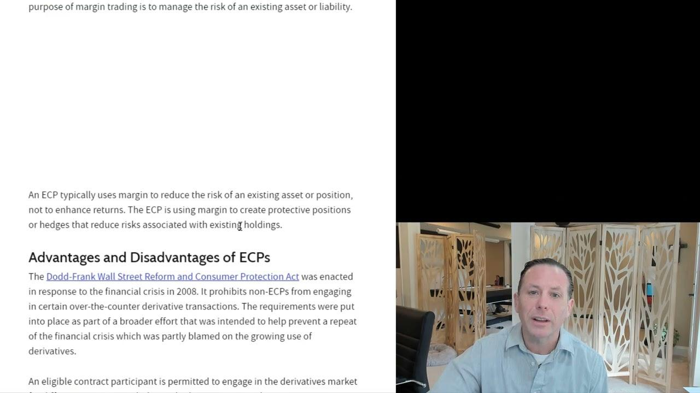

## Table of Contents

## What is an Eligible Contract Participant (ECP)?

An Eligible Contract Participant (ECP) is a term used in the financial world to describe individuals or entities that are allowed to participate in certain types of financial transactions that are not available to the general public. These transactions often involve derivatives, swaps, and other complex financial instruments. The reason for this restriction is to protect less experienced investors from the risks associated with these sophisticated products.

To qualify as an ECP, an individual must meet specific financial thresholds, such as having a certain amount of assets or income. For example, an individual might need to have at least $10 million in total assets or $5 million if they are entering into the transaction to manage risk. Companies and other entities can also be ECPs if they meet similar financial criteria or if they are involved in certain types of financial activities, like managing investments for others.

## Why is ECP status important in financial trading?

ECP status is important in financial trading because it allows people and companies to take part in special kinds of financial deals that are not open to everyone. These deals can be very complex, like swaps and derivatives, and they can be risky. By making sure only ECPs can do these trades, the rules help protect people who don't know much about these products from getting into trouble.

Having ECP status means you have shown that you have enough money or the right kind of business to handle these complex trades. This can open up more ways to invest and manage money, which might not be available to others. It's a way to make sure that only those who really understand the risks and have the resources to handle them can participate in these markets.

## Who qualifies as an Eligible Contract Participant?

An Eligible Contract Participant, or ECP, is someone or a company that can do certain special financial trades that not everyone can do. These trades include things like swaps and derivatives, which can be tricky and risky. To be an ECP, a person needs to have a lot of money, like at least $10 million in total assets, or $5 million if they are using the trade to manage risk. This makes sure that only people who really understand these financial products and can handle the risks are allowed to use them.

Companies and other groups can also be ECPs if they have enough money or if they do certain kinds of financial work, like managing other people's investments. This rule helps keep the financial markets safe by making sure that only those with the right knowledge and resources can get involved in these complex trades. By limiting these activities to ECPs, the rules protect less experienced investors from getting into financial trouble.

## How can an individual become an ECP?

To become an Eligible Contract Participant (ECP), an individual needs to have a certain amount of money. For most people, this means having at least $10 million in total assets. If someone is using the financial deal to manage risk, they might only need $5 million. This money rule is there to make sure that only people who can handle the risks of these special financial products can use them.

Besides money, there are other ways for a person to become an ECP. If someone works for a company that is already an ECP, they might be able to do these special trades through their job. Companies can be ECPs if they have enough money or if they do certain kinds of financial work, like managing investments for others. This helps make sure that only people with the right knowledge and resources can get involved in these complex financial deals.

## What are the differences between an ECP and a non-ECP?

An Eligible Contract Participant (ECP) and a non-ECP are different because of the kinds of financial deals they can do. ECPs can do special trades like swaps and derivatives, which are complex and can be risky. To be an ECP, a person needs to have a lot of money, like at least $10 million in total assets, or $5 million if they're using the trade to manage risk. This rule helps make sure that only people who understand these financial products and can handle the risks are allowed to use them.

On the other hand, non-ECPs are not allowed to do these special trades. They don't have enough money or the right kind of business to be considered ECPs. This keeps them safe from the risks of these complex financial products. The difference between ECPs and non-ECPs helps protect less experienced investors from getting into financial trouble by limiting who can participate in these markets.

## What types of transactions require ECP status?

ECP status is needed for special kinds of financial deals that not everyone can do. These deals include things like swaps and derivatives, which are very complex and can be risky. Swaps are when two people agree to exchange cash flows or other financial things in the future. Derivatives are financial products that get their value from something else, like a stock or a commodity. These kinds of deals are only for people who have a lot of money and know what they're doing.

If you want to do these special trades, you need to be an ECP. That means you need to have at least $10 million in total assets, or $5 million if you're using the trade to manage risk. This rule makes sure that only people who can handle the risks of these deals can do them. It keeps less experienced investors safe from getting into financial trouble with these complex products.

## Can a corporation be classified as an ECP? If so, how?

Yes, a corporation can be classified as an Eligible Contract Participant (ECP). To be an ECP, a corporation needs to meet certain financial requirements or be involved in specific types of financial activities. For example, a corporation can be an ECP if it has a net worth of at least $1 million, or if it has total assets of at least $10 million. This makes sure that only companies with enough money can handle the risks of complex financial deals like swaps and derivatives.

Also, a corporation can be an ECP if it is a financial institution or if it regularly deals in financial instruments, like managing investments for others. This includes banks, insurance companies, and investment firms. By being an ECP, a corporation can participate in special financial transactions that are not available to everyone, helping them manage risk and invest in more sophisticated ways.

## What documentation is needed to prove ECP status?

To prove that you or your company are an Eligible Contract Participant (ECP), you need to show some documents that prove you meet the financial requirements. For individuals, this means showing bank statements, investment account statements, or other financial documents that add up to at least $10 million in total assets. If you're using the trade to manage risk, you might only need to show $5 million in assets. These documents need to be recent and clearly show your financial situation.

For a corporation, you need to provide financial statements that show the company's net worth or total assets. This can include balance sheets, income statements, or other financial reports that prove the company has at least $1 million in net worth or $10 million in total assets. If the corporation is a financial institution or regularly deals in financial instruments, you might also need to provide documents that show this, like business licenses or records of financial activities. These documents help prove that the corporation can handle the risks of complex financial deals.

## Are there any exemptions or special cases for ECP eligibility?

Yes, there are some special cases and exemptions for becoming an Eligible Contract Participant (ECP). For example, if you work for a company that is already an ECP, you might be able to do these special financial deals through your job. This is because the company's status as an ECP can cover you when you're acting on behalf of the company. Also, some people who manage investments for others can be ECPs even if they don't have the usual amount of money, as long as they're doing it as part of their job.

Another exemption is for certain types of financial institutions. Banks, insurance companies, and investment firms can be ECPs even if they don't meet the usual money requirements, as long as they are involved in managing investments or other financial activities. These exemptions make sure that people and companies with the right knowledge and experience can participate in these complex financial markets, even if they don't have a lot of money themselves.

## How does ECP status affect regulatory compliance in derivatives trading?

ECP status is important for regulatory compliance in derivatives trading because it sets rules about who can do these special financial deals. Only people and companies that are ECPs can trade in swaps and derivatives, which are very complex and risky. This rule helps keep the financial markets safe by making sure that only those who understand these products and can handle the risks are allowed to trade them. If you're not an ECP, you can't do these trades, which helps protect less experienced investors from getting into trouble.

Regulators keep a close eye on ECPs to make sure they follow the rules. ECPs need to show that they have enough money or the right kind of business to be allowed to trade in derivatives. They might need to provide financial statements or other documents to prove their status. By limiting these trades to ECPs, regulators can better manage the risks in the financial markets and make sure that everyone follows the rules.

## What are the potential risks and benefits of being an ECP?

Being an ECP can bring some big benefits. It lets you do special financial deals like swaps and derivatives that not everyone can do. These deals can help you manage risk better and find new ways to invest your money. If you're a company, being an ECP can also help you grow your business and work with other big companies in the financial world. It's like having a special key that opens up more doors in the world of finance.

But there are also risks to being an ECP. These special financial deals can be very complex and risky. If you don't understand them well, you could lose a lot of money. Also, being an ECP means you have to follow strict rules and show that you have enough money to handle these deals. If you don't follow the rules, you could get in trouble with regulators. So, it's important to really know what you're doing before you become an ECP.

## How have regulations regarding ECP status evolved over time?

The rules about who can be an Eligible Contract Participant (ECP) have changed over time to keep up with the financial world. When the rules first started, they were mostly about making sure only people with a lot of money could do special financial deals like swaps and derivatives. This was to protect less experienced investors from the risks of these complex products. Over the years, the rules have been updated to include more kinds of people and companies, like financial institutions and investment managers, even if they don't have the usual amount of money.

These changes have made the rules more flexible but also more complicated. Now, there are special cases where someone can be an ECP even if they don't meet the usual money requirements, like if they work for a company that is already an ECP. Regulators have also added more checks and balances to make sure that ECPs follow the rules and can handle the risks of these special financial deals. This helps keep the financial markets safe and fair for everyone.

## References & Further Reading

[1]: Commodities Futures Trading Commission. ["Commodity Exchange Act."](https://www.cftc.gov/LawRegulation/CommodityExchangeAct/index.htm)

[2]: United States Government Publishing Office. ["Dodd-Frank Wall Street Reform and Consumer Protection Act."](https://www.congress.gov/111/plaws/publ203/PLAW-111publ203.pdf)

[3]: Aldridge, I. (2013). ["High-Frequency Trading: A Practical Guide to Algorithmic Strategies and Trading Systems."](https://www.amazon.com/High-Frequency-Trading-Practical-Algorithmic-Strategies/dp/1118343506) Wiley Finance.

[4]: Lopez de Prado, M. (2018). ["Advances in Financial Machine Learning."](https://www.amazon.com/Advances-Financial-Machine-Learning-Marcos/dp/1119482089) Wiley.

[5]: Chan, E. (2008). ["Quantitative Trading: How to Build Your Own Algorithmic Trading Business."](https://github.com/ftvision/quant_trading_echan_book) Wiley Trading.

[6]: Securities and Exchange Commission. ["Algorithmic Trading."](https://www.sec.gov/files/Algo_Trading_Report_2020.pdf)

[7]: Aronson, D.R. (2007). ["Evidence-Based Technical Analysis: Applying the Scientific Method and Statistical Inference to Trading Signals."](https://onlinelibrary.wiley.com/doi/book/10.1002/9781118268315) Wiley Trading.