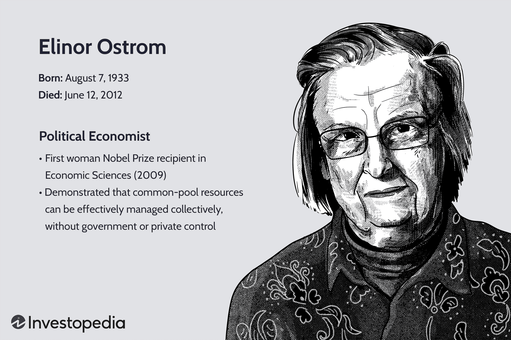

Common pool resources (CPRs) are natural or man-made resources where one person's use reduces the availability for others, and it is challenging to exclude individuals from using them. Examples include fisheries, water systems, forests, and the atmosphere. These resources play a critical role in both economic and environmental contexts, providing essential goods and services that sustain human life and economic activity. The main challenge with CPRs is managing their use to prevent overuse and depletion, a situation famously described as the "tragedy of the commons."

Elinor Ostrom, a pioneering political economist, made groundbreaking contributions to our understanding of how communities can successfully manage common pool resources without relying on centralized regulation or privatization. Her work earned her a Nobel Prize in Economics in 2009, making her the first woman to receive this honor. Ostrom's research demonstrated that local communities could create durable institutions and rules tailored to their specific environmental and social contexts, thereby avoiding resource depletion. Her principles emphasized the importance of collective decision-making, localized governance, and adaptability in managing CPRs.



Simultaneously, we have witnessed the rise of algorithmic trading in financial markets, which employs complex computer algorithms to study market data and execute trades at high speeds. This technology revolutionizes financial markets by enhancing speed and efficiency but also introduces risks such as market instability and flash crashes. Algorithmic trading's reliance on digital infrastructure presents challenges akin to managing CPRs, such as maintaining fair access, preventing resource depletion, and ensuring sustainable use.

This intersection presents an intriguing opportunity to apply Ostrom's principles to algorithmic trading within the context of digital common pool resources. By adopting her ideas of self-regulation, community governance, transparency, and accountability, we could manage and regulate algorithmic trading more effectively. This approach may foster a more sustainable and equitable digital trading ecosystem, addressing modern challenges such as market manipulation and uneven resource distribution. As we explore this synergetic relationship, Ostrom's work could offer valuable insights into designing innovative governance models for today's rapidly evolving technology-driven markets.

## Table of Contents

## Understanding Common Pool Resources

Common pool resources (CPRs) are natural or human-made resources where one person's use subtracts from another's use, and excluding people from using them is difficult. These resources include fisheries, freshwater systems, grazing lands, and the atmosphere. Managing these resources poses significant challenges due to their non-excludable but rivalrous nature. 

Overuse and depletion are primary issues in managing CPRs. When individuals act according to their self-interest regarding a shared resource, it leads to overconsumption and eventual depletion—a situation termed the "tragedy of the commons," first described by ecologist Garrett Hardin in 1968. This occurs when individuals, acting independently in their self-interest, deplete a shared resource, despite understanding that depleting it is not in the group's long-term interest. The tragedy of the commons is profoundly relevant in contexts like overfishing, air pollution, and water scarcity, where the inability to restrictively allocate usage rights leads to unsustainable resource extraction or degradation.

In addressing these challenges, Elinor Ostrom, a renowned political economist, introduced an institutional approach that emphasizes sustainable management of common resources through collective action. Ostrom's research, which earned her the Nobel Prize in Economic Sciences in 2009, fundamentally challenged the conventional wisdom that common resources could only be effectively managed through privatization or government intervention. Instead, she argued for a decentralized approach where communities self-organize to manage shared resources sustainably.

Ostrom identified several key principles for the effective management of common pool resources. These principles include clearly defined boundaries for the resource, collective-choice arrangements allowing resource users to participate in decision-making processes, effective monitoring by accountable parties, graduated sanctions for rule violators, conflict-resolution mechanisms, minimal recognition of rights to organize, and nested enterprises for larger common-pool resources. By emphasizing local governance, Ostrom demonstrated that resource users could develop sophisticated mechanisms for managing their resources more sustainably than was previously thought possible.

Her principles underscore the importance of community-based management, flexibility, adaptability, and the significance of local knowledge in crafting effective governance structures for CPRs. In summary, Ostrom's work highlights that sustainable management of common pool resources requires institutional arrangements that align with the ecological and social contexts of resource use, promoting cooperation and discouraging selfish exploitation.

## Elinor Ostrom's Contributions

Elinor Ostrom's body of work significantly altered prevailing notions on managing common pool resources, [earning](/wiki/earning-announcement) her the Nobel Prize in Economics in 2009. Ostrom, born in Los Angeles in 1933, devoted her career to studying resource management, particularly how communities can self-organize to manage shared resources sustainably. Her extensive empirical studies were groundbreaking, providing a counter-narrative to the established wisdom which largely followed Garrett Hardin's concept of the 'tragedy of the commons'. Hardin's theory suggested that individuals acting in their self-interest inevitably lead to the depletion of shared resources. In contrast, Ostrom demonstrated through empirical evidence that communities could effectively manage resources without the need for top-down regulation.

Ostrom's research identified eight design principles that characterize successful management of common pool resources. These principles include:

1. Clearly defined boundaries: Resources and the individuals or groups authorized to access them must be clearly defined.

2. Proportional equivalence between benefits and costs: Rules regarding the appropriation and provision of common resources should be congruent with local conditions and participants' contributions should be proportional to the benefits they receive.

3. Collective-choice arrangements: Most individuals affected by the operational rules can participate in modifying these rules.

4. Monitoring: Monitors, who actively audit resource conditions and appropriate behavior, should be accountable to the appropriators or be the appropriators themselves.

5. Graduated sanctions: Violators of community rules should face graduated sanctions depending on the severity and context of the offense.

6. Conflict-resolution mechanisms: Local and low-cost arenas must exist to resolve conflicts between resource users.

7. Minimal recognition of rights to organize: External authorities should recognize users' rights to devise their own institutions.

8. Nested enterprises: In systems with multiple layers of nested enterprises, governance activities should be organized in multiple layers with small, local units at their core.

These design principles not only challenged existing theories but also emphasized Ostrom's vision of polycentric governance systems. Such systems are characterized by multiple overlapping decision-making centers that operate independently but are linked to each other. Ostrom argued that polycentric systems are more flexible and adaptive, allowing for experimentation and learning at various levels, which are crucial for effective resource management.

Ostrom's work profoundly impacted economic theories, especially those concerning collective action. Her research demonstrated that cooperation could emerge under the right conditions, without centralized control or privatization. This challenged the classic dichotomy of market versus state solutions, proposing that community-based management could be a viable third way.

In summary, Elinor Ostrom's contributions provided a robust framework for understanding how cooperative behavior can be sensible and effective in managing common pool resources. Her principles continue to influence a range of disciplines, offering insights into governance, sustainability, and the economics of shared resources.

 to Algorithmic Trading

Algorithmic trading, often referred to as algo-trading, involves the use of computer algorithms to automate the trading process in financial markets. These algorithms are designed to execute trades based on predefined criteria, which may include timing, price, quantity, or any mathematical model. This method is a stark departure from traditional trading, where human traders would manually execute buy and sell orders.

### Definition and Role in Modern Financial Markets

Algorithmic trading has come to play a crucial role in the modern financial landscape, primarily due to its ability to process vast amounts of data and execute orders at speeds unachievable by human traders. By employing high-frequency trading ([HFT](/wiki/high-frequency-trading-strategies)), algorithms can perform numerous trades in fractions of a second, leveraging micro-fluctuations in market prices to generate profit.

### Mechanism of Algorithmic Trading

At its core, [algorithmic trading](/wiki/algorithmic-trading) uses sophisticated mathematical models and formulas to make decisions. A simple pseudocode representation of an algorithm might look like this:

```python
def trading_strategy(market_data):
    if market_data['price'] < predefined_threshold:
        execute_trade('BUY', quantity)
    elif market_data['price'] > predefined_threshold:
        execute_trade('SELL', quantity)

while market_open:
    data = fetch_market_data()
    trading_strategy(data)
```

Here, the algorithm fetches market data continuously and triggers buy or sell orders when specific conditions are met.

### Advantages of Algorithmic Trading

One of the primary advantages of algorithmic trading is **speed**. Algorithms can scan multiple markets and exchanges in real-time, making lightning-fast decisions. This speed is complemented by **efficiency**, as algorithms can manage and optimize a large portfolio of trades, ensuring precision and accuracy in execution without the influence of human emotions like fear or greed.

Moreover, algorithmic trading enables market participants to engage in **high-frequency trading**, executing vast numbers of orders rapidly to capitalize on small price divergences. This practice increases market [liquidity](/wiki/liquidity-risk-premium) and can contribute to more stable prices.

### Challenges and Risks

Despite its benefits, algorithmic trading presents several challenges and risks. One of the significant concerns is the occurrence of **flash crashes**. These are instances where markets experience drastic drops in a very short period, often caused by algorithms reacting to market conditions in unexpected ways. An example is the infamous flash crash of May 6, 2010, when the Dow Jones Industrial Average plunged roughly 1,000 points within minutes before rebounding.

Additionally, algorithmic trading can lead to **market instability**. With algorithms designed to respond instantaneously, they can create self-reinforcing feedback loops that amplify price swings. This interconnectivity of trading algorithms across markets raises systemic risks.

### Ethical and Regulatory Considerations

Ethically, algorithmic trading raises concerns around **transparency** and **fair access**. With firms possessing formidable computational resources gaining significant informational advantages, there is debate about whether these practices create inequitable trading conditions.

Regulatory bodies have responded with guidelines to curb potential abuses and promote market stability. Measures like circuit breakers and order limits are designed to pause trading in case of extreme [volatility](/wiki/volatility-trading-strategies), providing a buffer against automated trades spiraling out of control.

In conclusion, while algorithmic trading represents a revolutionary shift in financial markets, offering unprecedented speed and efficiency, it brings along significant risks and ethical considerations. The continued evolution of its regulatory landscape aims to ensure that these technological advancements contribute positively to market integrity and stability.

## Applying Ostrom's Principles to Algorithmic Trading and Common Resources

Applying Elinor Ostrom's principles to algorithmic trading requires careful consideration of her concepts within the digital ecosystem of modern financial markets. Ostrom's work emphasized sustainable management of common pool resources (CPRs), such as fisheries or forests, by fostering cooperative governance structures. Algorithmic trading, though not traditionally classified as a CPR, shares similarities in its need for sustainable management among multiple stakeholders, akin to the stakeholders involved in CPR governance.

### Parallels between Common Pool Resource Management and Algorithmic Trading

Algorithmic trading systems operate within a shared environment, akin to a digital commons, where shared market infrastructure and information are utilized by multiple participants. These systems rely on rapid execution and substantial data flow, akin to resources that need collective management. Just as fisheries require balanced harvesting to prevent depletion, financial markets necessitate mechanisms to avoid market instability, such as flash crashes, which can result from high-frequency algorithmic trades.

### Self-Regulation and Community Governance

Applying Ostrom's principles implies encouraging self-regulation and community governance among financial market participants. One potential adaptation involves creating a decentralized governance framework where traders, market regulators, and technology providers collaborate. This could involve forming consortia or organizations where stakeholders work together to develop trading standards and best practices. Such a model encourages participatory decision-making, much like Ostrom's advocacy for local decision-making processes in managing CPRs.

### Transparency, Accountability, and Rule-Making

Transparency in algorithmic trading can be bolstered by clear rule-making and accountability measures, which resonate with Ostrom’s principles. Implementing standardized disclosure requirements for algorithms can increase visibility into trading activities, reducing the risk of market manipulation. This parallels Ostrom’s focus on accountability measures within community-driven management systems, ensuring that rule violators face consequences, thus maintaining trust and cooperation.

### Benefits and Challenges of Adapting Ostrom’s Principles

Adapting Ostrom’s principles to algorithmic trading could improve both sustainability and efficiency. By fostering a cooperative ecosystem, traders can mitigate systemic risks and enhance market robustness. Benefits include reducing the likelihood of destabilizing events and fostering innovation through shared knowledge and practices.

However, challenges remain. Algorithmic trading operates in diverse regulatory environments, complicating the establishment of uniform governance structures. Additionally, striking a balance between regulation and innovation is crucial; excessive regulation may stifle technological advancements.

In conclusion, while Ostrom's principles were originally designed for natural resource management, their core tenets hold valuable insights for the digital commons of algorithmic trading. Creating frameworks that emphasize transparency, community governance, and shared rule-making can lead to a more stable and efficient trading environment.

## Case Studies and Examples

Elinor Ostrom's principles for managing common pool resources have been successfully adapted beyond traditional environmental contexts, notably in areas related to finance and algorithmic trading. This section explores case studies and examples demonstrating the application of these strategies in financial environments and analyzes their broader implications.

One prominent example in the financial industry is the development and management of currency trading platforms, where Ostrom's principles can guide decentralized governance. The foreign exchange market, with its decentralized nature, involves participants ranging from central banks to individual traders, creating a complex ecosystem akin to a common pool resource where over-exploitation and market manipulation are potential risks.

### Case Studies in Financial Markets

1. **Decentralized Autonomous Organizations (DAOs):**
   Decentralized Autonomous Organizations, or DAOs, represent digital communities operating through smart contracts on blockchain platforms. These systems exhibit parallels to Ostrom's governance principles by allowing collective rules and self-imposed regulations, fostering transparent accountability among members. DAOs can be conceptualized as digital analogs to Ostrom's commons, where stakeholders vote on proposals and resource allocations, effectively mimicking collective decision-making processes she advocated.

2. **Community-driven Regulatory Frameworks:**
   Certain trading platforms have adopted community-based regulatory frameworks to self-govern without relying on traditional financial oversight bodies. For example, blockchain-based financial systems like Ethereum employ informational symmetry and transparency to prevent exploitative practices. These frameworks mirror Ostrom's emphasis on clear rules and transparent governance structures.

### Lessons Learned and Policy Implications

Analyzing these examples highlights several lessons relevant to policymakers and regulators. The adoption of decentralized governance models encourages higher transparency and accountability among stakeholders, reducing the incidence of regulatory capture and fostering innovation. However, these systems also spotlight the need for robust security mechanisms to handle complex, dynamic environments susceptible to vulnerabilities like hacks or market manipulation—a concern reflective of the "tragedy of the commons."

These implementations underscore the potential efficacy of self-regulation, drawing from Ostrom's principles, in maintaining sustainable trading environments. Nonetheless, challenges persist, such as ensuring equitable access and preventing consolidated power within participant groups—a stage set for future empirical study and policy development.

### Prospects for Future Research and Exploration

The success and challenges of these examples suggest promising avenues for future exploration in applying Ostrom's principles to algorithmic trading platforms. Research could explore more intricate self-regulating models or hybrid approaches blending decentralized and centralized elements to optimize security and efficiency. Additionally, investigation into the impacts of these governance models on market stability and participant behavior is crucial.

Innovations could arise from utilizing [machine learning](/wiki/machine-learning) algorithms to enhance decision-making in these community-driven systems. Python, for example, can be employed to analyze trading patterns and help identify optimal governance configurations:

```python
import pandas as pd
from sklearn.cluster import KMeans

# Example: Analyze trading patterns
data = pd.read_csv('trading_data.csv')
kmeans = KMeans(n_clusters=3)
data['Cluster'] = kmeans.fit_predict(data[['Feature1', 'Feature2']])

# Determine the most effective governance configuration
optimal_config = data.groupby('Cluster').mean()
print(optimal_config)
```

Such analyses allow researchers to identify patterns and behaviors that inform governance strategies aligned with Ostrom's principles. As these technologies and systems continue evolving, the application of Ostrom's governance framework offers a fertile ground for enhancing algorithmic trading and broader financial ecosystems.

## Conclusion

The intersection of Elinor Ostrom's principles and algorithmic trading offers compelling insights into managing modern challenges in technology and finance. Ostrom's foundational work, which emphasized community-based management and self-regulation in the sustainable governance of common pool resources, finds a pertinent application in today's rapidly evolving digital markets. Her principles, including the importance of clear boundaries, collective decision-making, and accountability, underscore the potential for managing algorithm-driven environments where resources appear infinite but are in fact limited by technological and ethical constraints.

Modern financial markets, characterized by the pervasive influence of algorithmic trading, face analogous challenges to traditional common pool resources. These challenges include the risk of depletion in terms of trust, transparency, and equitable resource distribution among market participants. As algorithmic trading grows, the need for robust, adaptive governance frameworks becomes paramount, underscoring the applicability of Ostrom's insights.

Further research and adaptation of Ostrom’s ideas could drive innovation in governance models that embrace flexibility while ensuring market stability and inclusivity. This could involve fostering community governance structures that prioritize transparency and accountability, essential elements derived from Ostrom’s work. Algorithmic trading systems could innovate by adopting decentralized decision-making processes, mirroring the community-centric approaches advocated by Ostrom.

The interdisciplinary integration of Ostrom's principles into digital ecosystems holds significant promise. By adopting these principles, the financial industry and technology sectors can harness community wisdom and decentralized governance to mitigate risks associated with algorithmic trading, including market volatility and ethical lapses.

In conclusion, the application of Ostrom’s work to algorithmic trading not only enriches the conversation around sustainable resource management but also highlights the importance of innovative governance models. Such models are vital in navigating the complexities of an increasingly digital and interconnected economy, ensuring a balance between technological advancement and ethical stewardship.

## References & Further Reading

[1]: Ostrom, E. (1990). ["Governing the Commons: The Evolution of Institutions for Collective Action"](https://archive.org/details/governingcommons0000ostr). Cambridge University Press.

[2]: Hardin, G. (1968). ["The Tragedy of the Commons"](https://pages.mtu.edu/~asmayer/rural_sustain/governance/Hardin%201968.pdf). Science, 162(3859), 1243-1248.

[3]: Ostrom, E. (2009). ["A General Framework for Analyzing Sustainability of Social-Ecological Systems"](https://www.science.org/doi/10.1126/science.1172133). Science, 325(5939), 419-422.

[4]: Lo, A. W. (2016). ["Adaptive Markets: Financial Evolution at the Speed of Thought"](https://www.jstor.org/stable/j.ctvc77k3n). Princeton University Press.

[5]: Patterson, S. (2012). ["Dark Pools: High-Speed Traders, A.I. Bandits, and the Threat to the Global Financial System"](https://books.google.com/books/about/Dark_Pools.html?id=LIoNSKUEn24C). Crown Business.