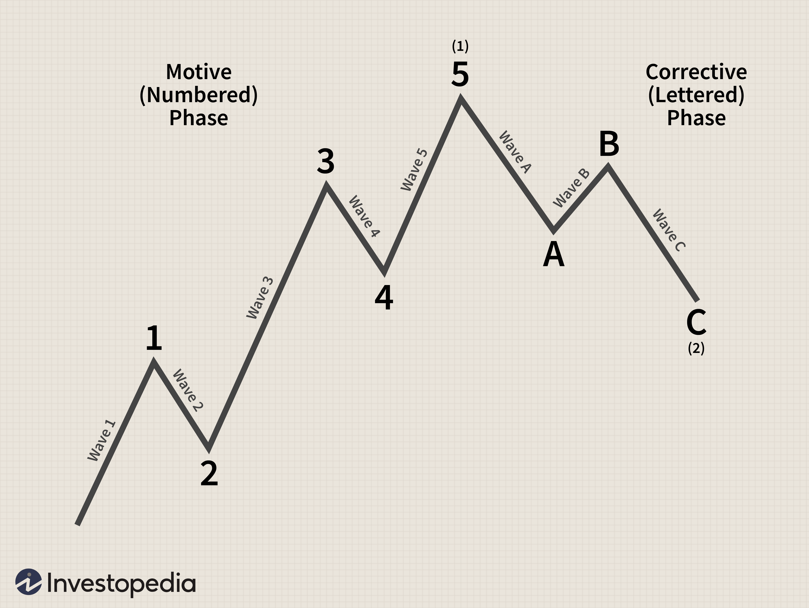

Algorithmic trading has transformed financial markets through the application of computational algorithms, providing traders with strategic advantages in efficiently analyzing and executing trades. Among the various analytical tools available, Elliott Wave Theory stands out as a distinctive method based on the idea that markets move in predictive wave patterns influenced by investor psychology. This theory, developed by Ralph Nelson Elliott in the late 1930s, suggests that financial markets exhibit recurring price wave patterns, which are determinants of collective investor behavior.

Elliott Wave Theory can be exceptionally useful when incorporated into algorithmic trading strategies. By encoding the rules and patterns of the theory into algorithms, traders can automate the identification and analysis of potential wave patterns, allowing for more timely and data-driven decision-making. This approach not only enhances trading precision but also aids in forecasting potential market turning points, which can be crucial for optimizing entry and exit strategies.



Understanding the core elements of Elliott Wave Theory is beneficial for both novice and seasoned traders, as it can significantly refine trading strategies by interpreting market trends more accurately. This article aims to offer insights into the essential components of Elliott Wave Theory, its implementation in trading algorithms, and its practical applications. Through exploring these aspects, traders can better integrate this powerful tool into their trading arsenal, capitalizing on historical patterns to inform future trading decisions.

## Table of Contents

## Understanding Elliott Wave Theory

Elliott Wave Theory is predicated on the observation that market movements are not purely random but instead follow specific, repetitive patterns that can be analyzed and used to predict future market behavior. This concept is rooted in the psychological tendencies of market participants and the collective crowd behavior that influences price movements. 

The primary structures identified by Elliott in these patterns are 'waves,' which can be classified into impulsive and corrective waves. Impulsive waves, also known as motive waves, drive the market in the direction of the prevailing trend and are typically composed of five distinct sub-waves. These sub-waves themselves are divided into three waves in the direction of the main trend (often numbered as 1, 3, and 5) and two intervening corrections (typically labeled as 2 and 4). This structure reflects the continuation of the primary trend, punctuated by brief periods of retracement. 

Corrective waves, on the other hand, move counter to the trend and are composed of three sub-waves, commonly labeled as A, B, and C. These waves represent a deviation against the dominant [momentum](/wiki/momentum), often serving to consolidate the previous gains or losses before the primary trend resumes.

Elliott Wave Theory's [fractal](/wiki/fractal-indicators) nature allows these wave formations to manifest across various time frames—ranging from minutes to decades. This characteristic makes the waves scalable and applicable to different trading strategies and time horizons. For example, a trader analyzing daily charts might identify larger wave patterns whereas a high-frequency trader might focus on micro wave movements occurring within minutes.

The identification and understanding of these wave patterns are critical for traders seeking to apply Elliott Wave Theory in their strategies. By recognizing the completion of a five-wave impulsive sequence or the correction of a three-wave pattern, traders can make informed decisions and anticipate potential market reversals or continuations. This structured approach contrasts with other analytical methods, providing a comprehensive framework for interpreting market dynamics based on the inherent psychological principles it reflects.

## Elliott Wave Theory in Algorithmic Trading

In [algorithmic trading](/wiki/algorithmic-trading), Elliott Wave Theory serves as a foundational tool that can be programmed to automate the identification of wave patterns in financial markets. Python, a language commonly used within the finance sector, enables the development of sophisticated algorithms that are capable of spotting these wave patterns in price data. This is achieved by employing core functions within the algorithm to recognize potential maxima and minima, which are crucial in forming a structured wave formation.

A key aspect of automating Elliott Wave analysis is the identification of these maxima and minima. This involves algorithmically processing time series data to detect peaks and troughs that align with the theoretical wave structure, enabling the trader to define impulsive and corrective waves. To this end, Python libraries such as NumPy play an instrumental role by enhancing the algorithm's performance through efficient handling and computation of large datasets. NumPy provides an array object and an assortment of functions that allow for the manipulation of numerical data, making it an essential component for real-time data processing.

The sample Python code to identify local maxima and minima might look like the following:

```python
import numpy as np

# Sample price data
prices = np.array([1, 3, 7, 12, 9, 10, 11, 7, 5, 6, 4, 8, 3, 2])

# Function to detect maxima or minima
def detect_extremes(prices, order=1):
    maxima = []
    minima = []
    for i in range(order, len(prices) - order):
        # Detect maxima
        if all(prices[i] > prices[i - j] and prices[i] > prices[i + j] for j in range(1, order + 1)):
            maxima.append((i, prices[i]))
        # Detect minima
        if all(prices[i] < prices[i - j] and prices[i] < prices[i + j] for j in range(1, order + 1)):
            minima.append((i, prices[i]))
    return maxima, minima

max_points, min_points = detect_extremes(prices)

print("Maxima:", max_points)
print("Minima:", min_points)
```

Automating wave identification is advantageous as it allows traders to rapidly discern potential trading opportunities based on historical patterns, minimizing the lag time required for manual analysis. This process significantly enhances the decision-making framework by systematically evaluating recurring market structures, thus ensuring a more efficient trading strategy. However, this automation must be integrated with comprehensive testing and validation, ensuring that the predicted wave patterns align accurately with real market movements. By leveraging computational resources efficiently, traders can gain a systematic edge in identifying unique patterns and executing trades based on these insights.

## Developing an Elliott Wave Algorithm

To develop an Elliott Wave algorithm, understanding key components such as monowaves, wavepatterns, and waverules is essential. Monowaves are defined as single directional price movements from one extremum to another, either from a local minimum to a local maximum or vice versa. These are the building blocks of more complex wave structures.

Wavepatterns emerge from sequences of monowaves and are pivotal in predicting future price movements. Typically, an impulsive wave pattern consists of five monowaves that move in the direction of the trend, while corrective wave patterns comprise three monowaves moving against the trend. The identification of these patterns involves discerning the progression and regression of price movements to fit them into established wave types.

Waverules serve as the conditions that need to be satisfied for a pattern to be valid. These rules enforce the correct identification of wave counts by dictating the relationships and lengths of monowaves within a pattern. For instance, one common rule is that wave 3 cannot be the shortest among waves 1, 3, and 5 in an impulsive sequence.

Furthermore, crucial algorithmic functions such as `next_max()` and `next_min()` are implemented to trace the maxima and minima in time series data. These functions are foundational for identifying extrema critical for constructing monowaves. They scan through price data to find local peaks and troughs that may signify the start or end of a monowave.

Here is a simple example of what these functions might look like in Python:

```python
import numpy as np

def next_max(data, start):
    for i in range(start, len(data) - 1):
        if data[i-1] < data[i] > data[i+1]:
            return i
    return -1

def next_min(data, start):
    for i in range(start, len(data) - 1):
        if data[i-1] > data[i] < data[i+1]:
            return i
    return -1
```

The algorithm iteratively tests combinations of monowaves against defined waverules to identify valid wave counts. By integrating these functions into an iterative framework, the algorithm can automatically analyze historical price data to detect wave formations. The iterative process involves adjusting and validating the sequences of monowaves against waverules to ascertain whether they form a recognized wavepattern.

Success in implementing an Elliott Wave algorithm hinges on accurate data analysis and rule enforcement, allowing traders to automate complex pattern recognition tasks. Such algorithms significantly enhance the speed and precision of trading decisions based on the underlying market dynamics encoded in wave structures.

## Practical Use Cases and Examples

Implementing Elliott Wave strategies in real market scenarios necessitates rigorous testing and validation to ensure reliability and accuracy. In a practical example involving Ethereum daily data from 2021, an algorithm was deployed to identify a valid Elliott Wave pattern, emphasizing the significance of parameter adjustment according to the existing market structure. This ability to fine-tune parameter settings is crucial because market conditions are dynamic and can radically influence pattern recognition.

An example script might start by loading Ethereum's daily price data using Python libraries like `pandas` and `NumPy`. After preprocessing the data, functions to detect local maxima and minima such as `next_max()` and `next_min()` are employed. These functions aid in constructing the basic structure of monowaves, which are individual market movements forming the building blocks of wave patterns. 

```python
import pandas as pd
import numpy as np

# Load the Ethereum price data
data = pd.read_csv('ethereum_2021.csv')
prices = data['Close'].values

def next_max(prices):
    # Example logic to find the next local maximum
    ...

def next_min(prices):
    # Example logic to find the next local minimum
    ...

# Main loop to construct waves
for i in range(len(prices)):
    # Identify potential changes for wave formation
    max_point = next_max(prices[i:])
    min_point = next_min(prices[i:])
    ...
```

After detecting these essential points, the algorithm tests sequences of monowaves against predefined wave rules to recognize valid wave patterns. The flexibility to adjust and backtest different parameters allows traders to dynamically calibrate wave identification processes and refine counting accuracy. Such calibration is conducted by exploring historical data to train the system to better fit anticipated scenarios, a critical procedure known as [backtesting](/wiki/backtesting).

Despite inherent challenges, such as the intricate and fractal nature of financial markets, successful pattern recognition has the potential for enhanced decision-making in trading. Automated systems can highlight profitable entry and [exit](/wiki/exit-strategy) points by continually scanning for patterns that align with Elliott Wave Theory. Hence, traders who intelligently adapt their systems to market structures can gain a competitive edge, reinforcing the value of updating and validating these strategies regularly.

## Challenges and Considerations

The fractal nature of financial markets presents significant challenges in consistently identifying valid wave patterns across different timeframes. This complexity arises because markets exhibit self-similar patterns that can vary significantly in scale, making the precise detection of Elliott Waves challenging. Traders often face difficulties in distinguishing between genuine wave formations and random market noise, necessitating a robust analytical framework to enhance wave detection accuracy.

One of the primary challenges faced by practitioners is the lack of standardized tools or datasets for automating wave labeling. While some software solutions and custom scripts exist, many traders and analysts still rely on manual validation to ensure the accuracy of Elliott Wave counts. This manual intervention can lead to inconsistencies and subjective interpretations, posing a risk to the reliability of trading strategies that depend heavily on precise wave identification.

Moreover, market dynamics are not static and can vary significantly based on macroeconomic factors, geopolitical events, and market sentiment. This variability necessitates constant updates and refinements to the algorithms used for wave detection. An algorithm suitable for a trending market might not perform well in a ranging market, highlighting the need for adaptive systems that can adjust to changing market conditions.

Elliott Wave algorithms, while powerful, should not be used in isolation. They are best employed as part of a broader trading strategy that includes other technical indicators and market analytics. By integrating Elliott Wave analysis with tools like the Relative Strength Index (RSI), Moving Averages, or Fibonacci retracements, traders can improve the predictive accuracy of their strategies. This multi-faceted approach helps mitigate the inherent risks of relying solely on wave theory and provides a more comprehensive view of market behavior.

Ultimately, the implementation of Elliott Wave Theory in algorithmic trading requires a nuanced understanding of both its advantages and limitations. Traders must remain aware of the theory's interpretative nature and complement it with empirical data and other analytical methods to optimize their trading outcomes.

## Conclusion

Elliott Wave Theory offers substantial insights and potential predictive advantages when successfully incorporated into algorithmic trading frameworks. By automating the analysis of historical data patterns, traders can systematically utilize these recurring formations to guide their trading decisions. This not only saves time but also enhances accuracy in market forecasting, making it a valuable tool for those who can master it.

Implementing Elliott Wave Theory into trading algorithms necessitates a comprehensive understanding of wave structures and their inherent limitations. Recognizing the difference between impulsive and corrective waves, as well as their respective configurations, is crucial for accurate wave identification and application. Moreover, it's important to acknowledge that while Elliott Wave Theory can offer robust insights, it is not infallible and should be complemented with other analytical indicators to improve its reliability and effectiveness.

The challenges associated with deploying Elliott Wave algorithms include dealing with the fractal and subjective nature of wave patterns across different timeframes. Additionally, without standardized tools for wave labelling, continuous manual assessment and adjustments are necessary to ensure accuracy. However, advancements in computational tools, such as [machine learning](/wiki/machine-learning) and enhanced data processing capabilities, hold promise for improving these algorithms' efficacy. Collaborations among traders, data scientists, and software developers can further drive innovation in this field.

As computational technologies continue to evolve, so too does the potential for refining the use of Elliott Wave Theory in algorithmic trading. Such refinement can lead to more precise pattern recognition and, therefore, more informed trading strategies. This ongoing development can unlock additional capabilities for both individual traders and institutional investors, enhancing their ability to navigate increasingly complex markets. The integration of Elliott Wave Theory, combined with other market analysis tools, can significantly bolster trading strategies and offer a competitive edge in the financial markets.

## References & Further Reading

[1]: Prechter, R. R. (1999). ["Elliott Wave Principle: Key To Market Behavior."](https://www.amazon.com/Elliott-Wave-Principle-Market-Behavior/dp/1616040459) New Classics Library.

[2]: Frost, A. J., & Prechter, R. R. (2005). ["Elliott Wave Principle: Key to Market Behavior."](https://www.amazon.com/Elliott-Wave-Principle-Market-Behavior/dp/0932750753) John Wiley & Sons.

[3]: Pardo, R. (1992). ["Design, Testing, and Optimization of Trading Systems."](https://onlinelibrary.wiley.com/doi/book/10.1002/9781119196969) John Wiley & Sons.

[4]: Minsky, L. (2016). ["Successful Algorithmic Trading: Automated Trading Strategies."](https://www.wallstreetzen.com/blog/algorithmic-trading-strategies/) Tech Trader.

[5]: Neely, C. J., Rapach, D. E., Tu, J., & Zhou, G. (2014). ["Forecasting the Equity Risk Premium: The Role of Technical Indicators."](https://pubsonline.informs.org/doi/abs/10.1287/mnsc.2013.1838) Management Science.