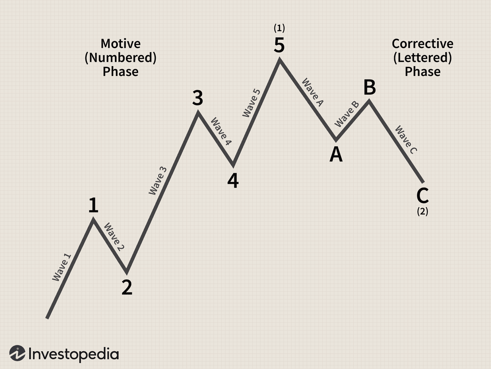

The wave strategy in algorithmic trading is a method employed by traders to analyze and forecast market trends by identifying and interpreting wave patterns. Rooted in the principles of technical analysis, this approach provides traders with insights into the cyclical nature of financial markets, enabling them to predict possible future price movements. As market dynamics become increasingly complex, understanding wave strategies becomes essential for traders seeking to leverage such trends effectively.

This article seeks to elucidate the concept and practical application of wave strategies within algorithmic trading. By focusing on both the benefits and challenges associated with these strategies, the goal is to equip traders with the knowledge needed to enhance trading outcomes. Recognized primarily for its capacity to provide a structured approach to market analysis, the wave strategy aids in discerning potential entry and exit points, which are critical for maximizing trading efficiency.



The wave strategy's foundation lies in the systematic analysis of market data, where patterns are categorized and interpreted to forecast price trajectories. Mastering this technique requires both a keen understanding of wave formations and a disciplined approach to their application. This strategic insight is particularly valuable in today's trading environment, where rapid information processing and decision-making are paramount.

Through this guide, readers will gain a comprehensive understanding of how wave strategies can be integrated into trading operations, creating a robust framework for improved trading results.

## Table of Contents

## What is the Wave Strategy?

Wave strategies are a method of analyzing financial markets by identifying recurring wave patterns in price movements. These patterns form the basis for traders to forecast potential future price actions and make strategic trading decisions. A significant influence on wave strategies is the Elliott Wave Theory, formulated by Ralph Nelson Elliott in the 1930s. This theory posits that market prices unfold in specific patterns, or "waves," which can be used to predict future movements.

The Elliott Wave Theory suggests that market prices progress in five-wave patterns in the direction of the main trend, known as impulse waves, and are corrected by three-wave patterns in the opposite direction, called corrective waves. These wave patterns can manifest across various timeframes, making wave strategies applicable to both short-term and long-term trading approaches.

For practical application, wave strategies are employed by traders to determine optimal market entry and [exit](/wiki/exit-strategy) points. By examining wave formation and structure, traders can align their trades with the underlying trend, thereby attempting to maximize gains. This approach is versatile and can be utilized across multiple asset classes, including stocks, [forex](/wiki/forex-system), and commodities.

Successful implementation of wave strategies often requires a keen understanding of market psychology, as Elliott Waves are believed to reflect collective investor sentiment. Identifying and interpreting these patterns, although subjective, can provide traders with an edge in an increasingly competitive trading environment. By analyzing these wave formations, traders aim to anticipate where price movements are likely headed, thereby making informed trading decisions based on technical analysis principles.

## Understanding the Structure of Impulse and Corrective Waves

Impulse and corrective waves form the backbone of wave strategies utilized in [algorithmic trading](/wiki/algorithmic-trading). These wave structures are instrumental in understanding and predicting market trends, a skill crucial for traders aiming to maximize the efficacy of their strategies.

Impulse waves, characterized by a five-wave pattern, move in the trend's direction. These waves consist of five distinct components:

1. **Wave 1**: An initial small price movement, often difficult to discern in its early stages.
2. **Wave 2**: A retracement that corrects the first wave, usually exhibiting lower volume, setting the stage for a stronger continuation.
3. **Wave 3**: Typically the most robust and extended wave, driven by fundamental factors and characterized by high volume, indicating a strong market direction.
4. **Wave 4**: Another corrective wave, generally shallower than Wave 2, often marking a pause rather than a reversal.
5. **Wave 5**: The final wave in the impulse sequence, displaying a final push parallel to the trend. Although not as powerful as Wave 3, it indicates the trend's exhaustion.

Traders can use these impulse wave structures to gauge the market's strength and determine strategic entry and exit points.

Corrective waves, contrastingly, comprise a three-wave pattern moving against the trend. These are labeled as:

1. **Wave A**: This initial wave commences the correction, often against the significant trend, causing many traders to erroneously anticipate a trend reversal.
2. **Wave B**: A counter movement to Wave A, frequently mistaken for a continuation of the primary trend but typically lacks the volume and momentum seen in real impulse waves.
3. **Wave C**: Completes the correction pattern, usually longer and more decisive than Wave A, signaling the end of the counter-trend movement.

The ability to correctly identify and interpret these corrective waves can enable traders to pinpoint optimal timing for market re-entry in anticipation of the trend's resumption.

Recognizing and capitalizing on impulse and corrective waves require substantial practice and expertise. The precise identification of wave patterns involves a deep understanding of market behavior, price action, and the application of technical analytical tools. This proficiency can significantly enhance trading strategies by allowing traders to align with market psychology, more precisely forecast future price actions, and manage risks effectively.

## Types of Traders Using Wave Strategies

Wave strategies are employed by various categories of traders, each using these strategies to enhance their trading outcomes across different time frames and market conditions. Technical traders, such as day traders, swing traders, and long-term investors, frequently adopt wave strategies due to their ability to interpret market dynamics and predict potential price movements.

Day traders, who engage in multiple trades within a single trading day, use wave strategies to identify short-lived market trends and execute quick trades. The minute-by-minute fluctuations in stock, forex, and commodity prices are analyzed to capture small profits that accumulate over time. By applying wave patterns, day traders can discern potential reversal points or [breakout](/wiki/breakout-trading) opportunities, aligning their trades with the anticipated market direction.

Swing traders, who hold positions for several days to weeks, leverage wave strategies to capitalize on medium-term market trends. They seek to benefit from the natural movement between impulse and corrective waves. By recognizing these wave patterns, swing traders can time their entries and exits more effectively, aiming to maximize profits from short- to medium-term price movements.

Long-term investors, who focus on holding assets for extended periods like months or years, also find value in wave strategies. These investors use wave patterns to confirm long-term trend directions and make informed decisions about accumulating or liquidating assets. In the context of a sustained upward trend, long-term investors may use wave strategies to reinforce their confidence in maintaining their positions over the long haul.

Furthermore, wave strategies are not limited to standalone use; they can be combined with other technical indicators to enhance trade analysis. For instance, traders may integrate moving averages, Relative Strength Index (RSI), or Bollinger Bands into their wave-based analysis to improve signal accuracy and reduce the risk of false predictions. By doing so, traders enhance their ability to identify valid trading opportunities and filter out noise from the markets.

The versatility of wave strategies across different markets makes them a valuable tool for traders involved in stocks, forex, and commodities. Each market exhibits distinct characteristics, but wave theories offer a universal method of interpreting price movements. As traders apply wave strategies, they must tailor their approach to suit the specific [volatility](/wiki/volatility-trading-strategies) and trend patterns of the market in which they are trading.

Overall, wave strategies hold a significant place among various trading approaches, allowing traders to exploit market trends effectively. By understanding how different types of traders utilize wave strategies, individuals can better position themselves within the market landscape and potentially enhance their trading success.

## Benefits and Challenges of Wave Strategies in Algo Trading

Wave strategies are a significant tool in algorithmic trading, enabling traders to predict possible future price movements by analyzing price waves. This ability offers traders a distinct advantage, as accurate predictions of market trends can lead to more informed and successful trading decisions. The application of wave strategies across various markets—including stocks, foreign exchange, and commodities—further increases their utility by allowing traders to identify potential buying and selling opportunities, regardless of the asset class.

One of the core benefits of wave strategies is their adaptability. Traders can apply these strategies not only to different markets but also utilize them alongside other technical indicators such as moving averages or the Relative Strength Index (RSI) to enhance the precision of their trading signals. This flexibility helps traders craft robust trading systems tailored to their specific trading styles and objectives.

Despite their advantages, the use of wave strategies involves certain challenges. The first major challenge lies in the subjective nature of interpreting wave patterns. Unlike some quantitative methods, where indicators provide clear buy or sell signals, wave analysis requires the trader to recognize and interpret wave patterns correctly. This subjectivity can lead to varying results among traders, as different individuals may perceive different patterns, trends, and market implications.

Further complicating matters, successful implementation of wave strategies demands a considerable level of skill and practice. Traders must develop their ability to recognize impulse and corrective waves consistently and accurately. Mastering wave strategies often requires the use of advanced analytical tools and algorithmic systems. Software tools, such as Pine Script on TradingView or custom scripts in Python, can aid in automating the detection and [backtesting](/wiki/backtesting) of wave patterns, making it easier to derive empirical insights from historical data. Here is a basic example of how you might begin automating wave analysis in Python:

```python
import numpy as np
import pandas as pd

def detect_impulse_corrective(wave_data):
    # Assume wave_data is a pandas DataFrame with columns ['date', 'price']
    # Implement a simple rule-based detection of waves
    wave_data['direction'] = np.sign(wave_data['price'].diff())
    wave_data['wave'] = (wave_data['direction'] != wave_data['direction'].shift(1)).cumsum()

    impulse_waves = wave_data.groupby('wave').apply(lambda x: x if len(x) == 5 else None).dropna()
    corrective_waves = wave_data.groupby('wave').apply(lambda x: x if len(x) == 3 else None).dropna()

    return impulse_waves, corrective_waves

# Example usage:
# df = pd.read_csv('market_data.csv')  # Your market data file
# impulse, corrective = detect_impulse_corrective(df)
```

In conclusion, while wave strategies present certain challenges, particularly concerning the subjective interpretation of patterns, their ability to forecast market movements provides a crucial trading edge. Traders who invest time in mastering these strategies and incorporate the necessary analytical tools can significantly enhance their algorithmic trading systems. Through dedicated practice and continuous refinement, traders can leverage wave strategies to improve their trading outcomes effectively.

## How to Implement Wave Strategies in Algorithmic Trading

To implement wave strategies in algorithmic trading, traders must begin by gaining a comprehensive understanding of wave analysis principles. This knowledge forms the foundation for effectively identifying wave patterns and thereby forecasting market trends.

One of the critical tools for automating and backtesting wave patterns is Pine Script, a domain-specific language used within TradingView. Pine Script enables traders to develop and refine custom trading strategies based on wave analysis. Here is a basic structure in Pine Script for detecting waves:

```python
//@version=4
study("Wave Strategy Example", overlay=true)

// Example of a simple moving average crossover
shortTermMa = sma(close, 5)
longTermMa = sma(close, 20)

plot(shortTermMa, color=color.blue, title="Short Term MA")
plot(longTermMa, color=color.red, title="Long Term MA")

// Signal generation based on moving average crossover
longSignal = crossover(shortTermMa, longTermMa)
shortSignal = crossunder(shortTermMa, longTermMa)

plotshape(series=longSignal, location=location.belowbar, color=color.green, style=shape.triangleup, size=size.small)
plotshape(series=shortSignal, location=location.abovebar, color=color.red, style=shape.triangledown, size=size.small)
```

Incorporating additional technical indicators such as moving averages and [volume](/wiki/volume-trading-strategy) metrics can significantly enhance the reliability of trade signals derived from wave strategies. Moving averages help in smoothing price data, thus making it easier to identify trends and potential wave patterns. For instance, a crossover of a short-term moving average above a long-term moving average can be used to signal a bullish trend, complementing the insights provided by wave patterns.

Risk management plays a crucial role in the successful application of wave strategies. Implementing stop-loss and take-profit levels is vital in managing risk effectively. Stop-loss orders limit potential losses by closing a trade when the market moves against the trader by a specified amount. Conversely, take-profit orders lock in profits by closing a trade once the market moves in the trader's favor by a certain extent. These risk management tools can be set based on the trader's tolerance and the volatility of the market being traded.

By combining wave analysis with automation tools like Pine Script and reinforcing strategies with risk management techniques, traders can harness wave strategies to potentially enhance their trading performance.

## Common Mistakes and Criticisms

One prevalent mistake among traders implementing wave strategies is adhering too rigidly to wave counts without allowing room for flexibility. The market is inherently unpredictable, and patterns can evolve unexpectedly, necessitating a more adaptable approach. Strict adherence can lead to missed opportunities or premature exits, which could adversely impact trading outcomes.

Moreover, the success of wave strategies often hinges on the integration of complementary analytical methods. Traders who ignore other technical or fundamental indicators may miss out on broader market insights that could enhance their decision-making process. A robust risk management plan, encompassing diversified strategies and protective measures like stop-loss orders, is essential to mitigate potential losses and manage trading risks effectively.

Critics of wave strategies argue that they are inherently subjective, as different traders might interpret the same market conditions differently. This subjectivity can result in inconsistent trading outcomes, making it challenging to achieve reliable predictive accuracy. The lack of empirical testing in wave analysis compounds this issue, as many concepts are based on theoretical frameworks rather than statistically validated models.

Despite these criticisms, wave strategies remain popular among algorithmic traders due to their potential to uncover trends and forecast future price movements. When combined with other analytical tools and risk management techniques, wave strategies can be a valuable component of a sophisticated trading system, provided traders maintain a degree of flexibility and adaptability in their approach.

## Conclusion

Wave strategies are a powerful tool for algorithmic traders, providing valuable insights into market trends and potential price movements. These strategies, grounded in the principles of wave patterns such as those proposed by the Elliott Wave Theory, facilitate the identification of market entry and exit points. The ability to forecast market behavior by analyzing wave structures offers traders a substantial advantage, especially when combined with other technical indicators like moving averages or volume analysis.

While wave strategies can greatly enhance trading systems, mastering them is not without challenges. The interpretation of wave patterns requires significant expertise and practice, given their subjective nature. Traders must develop a keen understanding of both impulse and corrective waves to harness their full potential effectively. This requires an ongoing refinement of skills and strategies to adapt to the dynamic conditions of the financial markets.

Combining wave strategies with other technical indicators can lead to more robust and reliable trading systems. For instance, integrating wave-based signals with trend-following indicators or [momentum](/wiki/momentum) oscillators can improve the accuracy of trade decisions. Moreover, these strategies can be incorporated into algorithmic trading systems, where predefined rules and algorithms can help mitigate the limitations of subjective interpretation.

Traders are encouraged to continuously practice and refine their understanding of wave patterns. Developing a solid grasp of these patterns will enable them to better anticipate market movements and optimize their trading outcomes. Furthermore, leveraging trading platforms that support backtesting can allow traders to evaluate the efficacy of their wave strategies under historical market conditions, ensuring a more comprehensive and informed approach to trading.

## Frequently Asked Questions

What is the wave strategy in algorithmic trading?
- The wave strategy in algorithmic trading is a technique that analyzes and forecasts market trends by identifying wave patterns within price movements. This methodology is inspired by the Elliott Wave Theory, which postulates that market prices unfold in repetitive cycles driven by the collective psychology of traders. The wave strategy is utilized to determine optimal entry and exit points by distinguishing between impulse waves, which move in the direction of the main trend, and corrective waves, which move against it.

How can traders apply wave strategies in their trading?
- Traders can apply wave strategies by first mastering the principles of wave analysis. They identify wave patterns within historical price data to forecast future market behavior. Algorithmic traders frequently automate this process using scripting languages such as Pine Script, integrating wave analysis with other technical indicators like moving averages and volume. This automation helps in consistently applying wave analysis rules and efficiently backtesting strategies to refine their validity and applicability across different market conditions.

What are the advantages and disadvantages of wave strategies?
- Advantages of wave strategies include the potential to accurately predict future price movements, offering traders a substantial competitive edge. They are flexible and applicable to various markets, including stocks, forex, and commodities, and can be combined with other technical indicators to enhance their robustness. However, interpreting wave patterns can be subjective, and different traders might arrive at different conclusions based on the same data. This subjectivity may lead to inconsistent trading results. Moreover, successful implementation demands a high degree of skill, extensive practice, and sometimes advanced tools to handle complex calculations and pattern recognitions.

Can wave strategies be backtested in algorithmic trading systems?
- Yes, wave strategies can be backtested in algorithmic trading systems. Backtesting involves testing a trading hypothesis using historical data to assess the potential effectiveness of the trading strategy. Programming languages like Python can be used to automate the identification and analysis of wave patterns, incorporating them into backtesting frameworks. By simulating wave strategy trades against historical data, traders can evaluate the strategy's performance metrics, such as hit rate, risk-reward ratio, and drawdown, to fine-tune their approach and optimize system parameters for live trading conditions.

## References & Further Reading

[1]: Prechter, R. R., & Frost, A. J. (2005). ["Elliott Wave Principle: Key to Market Behavior"](https://www.amazon.com/Elliott-Wave-Principle-Market-Behavior/dp/0932750753). John Wiley & Sons.

[2]: Neely, C. J., Weller, P. A., & Dittmar, R. (1997). ["Is Technical Analysis in the Foreign Exchange Market Profitable? A Genetic Programming Approach."](https://www.jstor.org/stable/pdfplus/2331231.pdf) Journal of Financial and Quantitative Analysis, 32(4), 405-426.

[3]: Murphy, J. J. (1999). ["Technical Analysis of the Financial Markets: A Comprehensive Guide to Trading Methods and Applications"](https://www.amazon.com/Technical-Analysis-Financial-Markets-Comprehensive/dp/0735200661). New York Institute of Finance.

[4]: Pardo, R. (2008). ["The Evaluation and Optimization of Trading Strategies"](https://onlinelibrary.wiley.com/doi/book/10.1002/9781119196969). Wiley Trading.

[5]: Elder, A. (2002). ["Come Into My Trading Room: A Complete Guide to Trading"](https://www.amazon.com/Come-Into-My-Trading-Room/dp/0471225347). John Wiley & Sons.