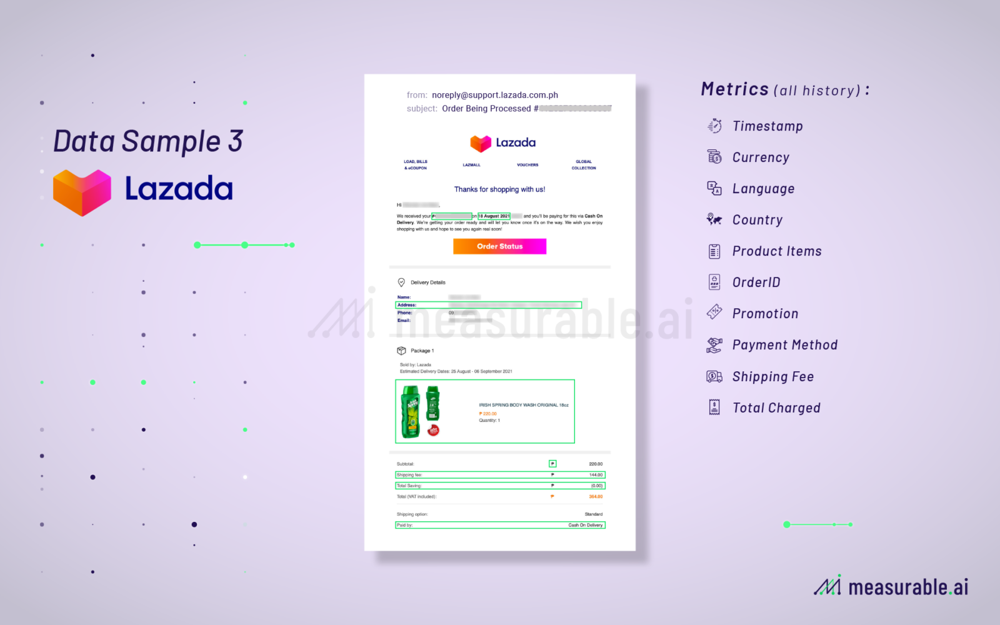

## Table of Contents

## What is alternative data?

Alternative data refers to information that is used by investors and companies to gain insights that are not available through traditional sources like financial statements or market reports. This type of data can come from many different places, such as social media posts, satellite images, credit card transactions, or even weather reports. By looking at this data, people can learn about trends, consumer behavior, and other important details that can help them make better decisions.

Using alternative data can give businesses and investors an edge because it often provides a more complete picture of what is happening in the market. For example, by analyzing satellite images, a company might see how busy a competitor's parking lot is, which can tell them about the competitor's sales. Or, by looking at social media, investors can see what people are saying about a product before it is officially released. This kind of information can be very useful for making smart choices about where to invest money or how to run a business.

## How do email and consumer receipts contribute to alternative data?

Email and consumer receipts can be very helpful as alternative data. Emails often contain information about what people are interested in or planning to buy. Companies can look at emails to see trends, like if a lot of people are talking about a new product. This can help them understand what customers want before they even make a purchase. For example, if many emails mention a new type of phone, companies might decide to focus on selling that phone.

Consumer receipts are also important because they show what people are actually buying. When companies collect receipt data, they can see which products are popular and how much people are spending. This helps them make better decisions about what to sell and how to price things. For instance, if receipts show that a certain snack is selling well, a store might decide to stock more of that snack or even run a special promotion to boost sales even further.

## What industries benefit from analyzing email and consumer receipt data?

Many industries can learn a lot from looking at email and consumer receipt data. Retail stores use this information to see what people are buying and what they might want to buy in the future. By checking emails, they can see what products people are talking about, and by looking at receipts, they know which items are selling well. This helps them decide what to keep in stock and what to put on sale. For example, if a lot of people are talking about a new type of shoe in their emails, and the receipts show that these shoes are selling quickly, the store might order more of those shoes.

The finance and investment industry also benefits from this data. Investors look at emails to understand what people are interested in and use receipt data to see spending patterns. This helps them predict which companies might do well in the future. If emails show a lot of excitement about a new tech gadget, and receipts show that people are buying similar gadgets, investors might decide to invest in the company making that new gadget. This way, they can make smart choices about where to put their money.

## What are the common sources of email and consumer receipt data?

Email data often comes from companies that offer email services, like Gmail or Outlook. These companies can see what people are writing about in their emails. Sometimes, people sign up for newsletters or get marketing emails from stores, and these emails can also be used to learn about what people are interested in. Another way to get email data is by using special software that looks at emails without reading them directly, just to see what words or topics are common.

Consumer receipt data usually comes from stores and places where people shop. When someone buys something, the store keeps a record of the sale. Some stores share this information with companies that collect data. Credit card companies also have receipt data because they see what people buy with their cards. Sometimes, people use apps on their phones to keep track of their receipts, and this data can be shared too. All of these sources help companies understand what people are buying and how much they are spending.

## How is data from emails and consumer receipts collected and processed?

Data from emails and consumer receipts is collected in different ways. For emails, companies like Gmail or Outlook can see what people are writing about. Sometimes, people sign up for newsletters or get marketing emails from stores, and this information is also used. Special software can look at emails without reading them directly, just to see what words or topics are common. This helps companies understand what people are interested in. For consumer receipts, stores keep records of what people buy. Credit card companies also have this information because they see what people buy with their cards. Sometimes, people use apps on their phones to keep track of their receipts, and this data can be shared too.

Once the data is collected, it needs to be processed to be useful. This means cleaning the data to remove any errors or unnecessary information. For emails, this might mean looking at the words used and sorting them into categories, like 'electronics' or 'clothing'. For receipts, the data is often put into a database where it can be sorted by product type, price, or date of purchase. Special computer programs, called algorithms, then look at this data to find patterns and trends. For example, they might see that a lot of people are buying a certain type of shoe. This helps companies make better decisions about what to sell and how to market their products.

## What are the privacy concerns associated with using email and consumer receipt data?

Using email and consumer receipt data can raise big privacy concerns. People might not know that their emails and receipts are being looked at by companies. They might think their information is private, but it can be shared with others without them knowing. This can make people feel like their privacy is being invaded. Also, if this data is not kept safe, it can be stolen by hackers, which can lead to identity theft or other problems.

Another worry is that companies might use this data to make decisions about people without their consent. For example, if a company sees that someone often buys certain products, they might send them targeted ads or even change the prices they see online. This can feel unfair and can make people feel like they are being watched all the time. It's important for companies to be clear about how they use this data and to make sure it is used in a way that respects people's privacy.

## What are the legal and ethical considerations when using this type of alternative data?

When companies use email and consumer receipt data, they need to follow the law. Different places have different rules about what companies can do with this kind of information. In many places, there are laws that say companies must tell people how their data will be used and get their permission first. Companies also have to make sure the data is kept safe and not shared with people who should not see it. If they do not follow these rules, they can get in big trouble, like having to pay fines or even going to court.

There are also ethical things to think about. It is important for companies to use this data in a fair way. They should not use it to trick people or make them feel uncomfortable. For example, it would not be right to use someone's email data to send them ads for things they do not want or need. Companies should be honest about how they use the data and make sure it helps people instead of hurting them. Being open and fair about using this data can help build trust with customers.

## How can email and consumer receipt data be used to predict consumer behavior?

Email and consumer receipt data can help companies predict what people will do next. By looking at what people write in their emails, companies can see what products people are talking about and what they might want to buy. For example, if a lot of emails mention a new type of phone, the company might guess that people will want to buy that phone soon. This helps companies know what to sell and how to advertise their products.

Consumer receipts also give important clues about what people will buy in the future. When companies look at what people have bought in the past, they can see which products are popular and how much people are willing to spend. If receipts show that a certain snack is selling well, the company might predict that people will keep buying that snack. This information helps companies plan what to stock in their stores and how to set their prices.

## What are the challenges in analyzing and deriving insights from email and consumer receipt data?

Analyzing and deriving insights from email and consumer receipt data can be tricky. One big challenge is making sure the data is clean and correct. Emails and receipts can have mistakes or missing information, so companies need to spend time fixing these problems before they can use the data. Also, there is a lot of data to go through, which can take a long time and needs powerful computers to do it quickly. Sorting through all this data to find useful patterns can be hard work.

Another challenge is keeping the data private and safe. People might not like it if they find out their emails and receipts are being used without their permission. Companies have to follow strict rules to make sure they are not breaking any laws. They also need to protect the data from hackers who might try to steal it. If the data is not kept safe, it can lead to big problems like identity theft. Balancing the need to use the data with the need to keep it private is a big challenge for companies.

## How do machine learning and AI enhance the analysis of email and consumer receipt data?

Machine learning and AI make it easier and faster to look at email and consumer receipt data. They can sort through huge amounts of information quickly, finding patterns and trends that would take people a long time to see. For example, an AI can read thousands of emails and figure out that many people are talking about a new type of phone. This helps companies understand what people want without having to read each email themselves.

These technologies also help make the data more accurate. They can fix mistakes and fill in missing information, making the data cleaner and easier to use. Plus, [machine learning](/wiki/machine-learning) can learn over time, getting better at predicting what people will do next. If it sees that people often buy a certain snack, it can guess that they will keep buying it. This helps companies make smart choices about what to sell and how to advertise their products.

## What case studies demonstrate successful use of email and consumer receipt data in business?

One good example of using email and consumer receipt data is from a big store called Target. They used this data to guess when their customers were going to have babies. By looking at what people were buying, like certain vitamins or baby clothes, and what they were talking about in their emails, Target could send them ads for baby products right when they needed them. This helped Target sell more stuff and made their customers happy because they got useful ads at the right time.

Another example is from a company called Blue Apron, which sends people meal kits. They used email data to see what kinds of meals people were interested in and what they were saying about the meals they got. By looking at receipts, they could also see which meals people were buying the most. This helped Blue Apron make better meals and send out ads that people liked. As a result, they got more customers and made more money.

## What future trends can we expect in the use of email and consumer receipt data as alternative data sources?

In the future, we can expect more companies to use email and consumer receipt data to understand what people want and need. As technology gets better, it will be easier for companies to look at this data quickly and find useful patterns. They might use special computer programs that can learn from the data and make better guesses about what people will do next. This could help companies make smarter choices about what to sell and how to advertise their products. They might also use this data to make their stores and websites more personal, showing people things they are likely to like based on what they have bought or talked about in their emails.

There will also be more focus on keeping this data private and safe. As people learn more about how their data is used, they will want to make sure it is protected. Companies will need to be very clear about how they use email and receipt data and get people's permission before using it. They will also have to use strong security to keep the data safe from hackers. If companies can do this well, they can use email and consumer receipt data to help their business while still respecting people's privacy.

## References & Further Reading

[1]: Bergstra, J., Bardenet, R., Bengio, Y., & Kégl, B. (2011). ["Algorithms for Hyper-Parameter Optimization."](https://papers.nips.cc/paper/4443-algorithms-for-hyper-parameter-optimization) Advances in Neural Information Processing Systems 24.

[2]: ["Advances in Financial Machine Learning"](https://www.amazon.com/Advances-Financial-Machine-Learning-Marcos/dp/1119482089) by Marcos Lopez de Prado

[3]: ["Evidence-Based Technical Analysis: Applying the Scientific Method and Statistical Inference to Trading Signals"](https://www.amazon.com/Evidence-Based-Technical-Analysis-Scientific-Statistical/dp/0470008741) by David Aronson

[4]: ["Machine Learning for Algorithmic Trading"](https://github.com/stefan-jansen/machine-learning-for-trading) by Stefan Jansen

[5]: ["Quantitative Trading: How to Build Your Own Algorithmic Trading Business"](https://books.google.com/books/about/Quantitative_Trading.html?id=j70yEAAAQBAJ) by Ernest P. Chan