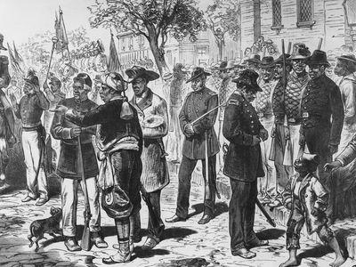

Emancipation Day, widely known as Juneteenth, holds a unique position in American history as a symbol of liberation and progress. Recognized annually on June 19th, Juneteenth commemorates the day in 1865 when Union General Gordon Granger announced General Order No. 3 in Galveston, Texas, effectively freeing the last remaining enslaved African Americans in the United States. This momentous event marked a pivotal point in the broader theme of emancipation, following President Abraham Lincoln's issuance of the Emancipation Proclamation in 1863, which declared the freedom of slaves within the Confederacy. However, it wasn't until General Granger's announcement that the promise of the Proclamation was fully realized across the entire nation, highlighting the protracted struggle for freedom and equality.

Similarly, in the modern financial sector, algorithmic trading represents a form of liberation from traditional trading constraints. Algorithmic trading employs advanced computer algorithms to execute trades at speeds and efficiencies that would be impossible for human traders. This technological advancement has democratized access to financial markets, enabling both institutional and individual investors to participate on more equal footing. By allowing for more precise and swift decision-making, algorithmic trading has metaphorically emancipated traders from the limitations of manned trading floors and manual transaction processes.

Though seemingly unrelated, both Juneteenth and algorithmic trading share the overarching themes of liberation and progress. Each represents a break from historical constraints—whether social or financial—ushering a path towards equality and innovation. Their juxtaposition underscores a fundamental drive in human endeavor: the relentless pursuit of freedom in all its forms, charting courses toward greater equity and potential.

This article will explore the historical significance of Juneteenth and draw parallels to the emancipation experienced in the world of algorithmic trading. By understanding how each event embodies themes of liberation, this examination will highlight the common pursuit of freedom as an essential catalyst for progress in society and finance alike.

## Table of Contents

## The History of Emancipation Day: Juneteenth

Juneteenth, also known as Emancipation Day, traces its roots back to June 19, 1865, when Union General Gordon Granger arrived in Galveston, Texas, to announce the enforcement of the Emancipation Proclamation. General Order No. 3 declared the freedom of all enslaved people in the state, marking a significant milestone in American history. Although President Abraham Lincoln had issued the Emancipation Proclamation on January 1, 1863, it wasn't until Granger's announcement that its directives were effectively implemented in Texas, then a remote Confederate state. This delay underscored the challenges of communication and enforcement during the Civil War era.

Juneteenth is significant not only as a day of liberation for enslaved African Americans but also symbolically marks the end of the Civil War and the abolition of slavery in the United States. The announcement in Texas represented one of the final phases in the nationwide enforcement of emancipation, making June 19, 1865, a pivotal date for freedom and equality. Important figures, such as Frederick Douglass and Abraham Lincoln, helped advance the abolitionist cause, setting the stage for events that led to Juneteenth.

Over time, Juneteenth evolved from a regional observance into a national symbol of freedom. Initially celebrated primarily in Texas, the day gained broader recognition throughout the United States as African Americans migrated to different parts of the country. Celebrations typically include community gatherings, educational events, and cultural activities that honor African American heritage and history. Modern Juneteenth celebrations often feature parades, historical reenactments, and the sharing of traditional foods, reflecting the diverse ways in which communities commemorate the day.

The cultural and historical impact of Juneteenth extends beyond the commemoration of emancipation. In the ongoing fight for civil rights, Juneteenth has become a powerful reminder of the struggles for racial equality and justice. It serves as a day to reflect on the progress made and the work that still lies ahead in achieving true equality. In 2021, Juneteenth was formally recognized as a federal holiday in the United States, a testament to its enduring significance as a symbol of liberation and resilience in the African American community.

Through its journey from a localized day of remembrance to a nationwide celebration, Juneteenth highlights both the historical challenges and triumphs in the pursuit of civil rights. Its recognition and celebration underscore the importance of honoring the past while inspiring continued efforts towards equality and justice.

## Understanding Emancipation in the Financial World

Financial emancipation refers to the liberation of individuals and institutions from traditional constraints in access to trading and investment opportunities. This concept has been greatly advanced by technological progress, notably in the rise of [algorithmic trading](/wiki/algorithmic-trading), which has played a crucial role in democratizing financial markets.

Algorithmic trading involves using computer programs to execute trades at speeds and frequencies that are impossible for human traders. Its origins can be traced back to the early development of electronic communication networks (ECNs) in the 1980s, which allowed traders to bypass traditional exchanges and trade directly with one another. Over time, these technologies have evolved, enabling algorithmic trading to become a dominant force in financial markets by leveraging advanced mathematical models and high-speed data analytics.

Historically, emancipation movements sought to dismantle systemic barriers and grant freedom and opportunity to marginalized communities. Similarly, algorithmic trading has broken down the gatekeeping often present in traditional trading systems. By allowing access to complex financial strategies and immediate market reactions, algorithmic trading has given individual investors tools once exclusive to large financial institutions, echoing the democratizing spirit of historical emancipation movements.

For individual investors, algorithmic trading offers the benefit of reduced costs and increased efficiency. Automated strategies can minimize human error and emotional bias, leading to more consistent investment outcomes. Institutional practices have also evolved: fund managers use algorithmic trading to execute large orders swiftly and discreetly, minimizing market impact and securing better prices.

However, challenges accompany these advancements. The sophistication of algorithms can widen the gap between tech-savvy investors and those who lack access to resources and education on algorithmic systems. Moreover, the speed and complexity of algorithmic trading can contribute to market [volatility](/wiki/volatility-trading-strategies), presenting risks such as the infamous "flash crash" events where markets plunge suddenly due to algorithmic errors.

Despite these challenges, algorithmic trading continues to be a powerful tool for achieving financial freedom and empowerment. Its ability to level the financial playing field supports greater market participation and offers new opportunities for economic advancement. As technology continues to innovate, understanding and navigating the complexities of algorithmic trading will be essential for investors aspiring to achieve true financial emancipation.

## Algorithmic Trading: A New Frontier of Liberation

Algorithmic trading, often referred to as algo trading, is revolutionizing the accessibility and dynamics of financial markets. By leveraging computer algorithms, traders can execute orders at speeds and frequencies that are impossible for human traders. This shift represents a new form of liberation in the financial world, where technology mitigates traditional barriers to entry, granting wider access to trading and investing opportunities.

**Role of Technology in Breaking Down Barriers**

Advancements in technology have democratized trading by reducing costs and increasing market access. Traditionally, trading was dominated by large financial institutions due to the substantial costs and infrastructure required. However, with algorithmic trading, individual and smaller investors now have tools that compete on a similar footing. Algorithms enable traders to process vast amounts of data in real-time, reacting swiftly to market changes and optimizing their trading strategies.

For example, retail trading platforms now offer algorithmic trading features, allowing users to backtest and deploy algorithms without significant capital investment. This technological shift has empowered a wider audience to participate in financial markets, thereby promoting financial inclusion.

**Case Studies of Financial Prosperity**

Numerous instances illustrate how algorithmic trading has facilitated financial prosperity. One notable example is Renaissance Technologies, an investment management firm known for its Medallion Fund, which employs complex mathematical models to drive trading decisions. Their success, yielding annual returns far surpassing industry norms, highlights the potential of algorithms in creating substantial financial gains.

Moreover, individual traders utilizing algorithmic strategies on platforms like QuantConnect or Alpaca have reported increased efficiency and profitability. By harnessing data analytics and [machine learning](/wiki/machine-learning), these traders can craft highly specialized strategies, leading to improved trading outcomes.

**Potential Risks and Ethical Considerations**

Despite its benefits, algorithmic trading is not without risks and ethical considerations. The reliance on automated systems can lead to unforeseen market disruptions, as evidenced by the Flash Crash of 2010, where the Dow Jones Industrial Average dropped nearly 1,000 points within minutes due to algorithmic trading errors. Such events underscore the need for robust risk management systems and regulatory oversight.

Additionally, ethical concerns arise regarding the transparency of algorithms and the potential for market manipulation. As algorithms become more sophisticated, discrepancies in market access could exacerbate existing inequalities, highlighting the importance of regulatory frameworks that ensure fairness and transparency in trading practices.

**Shaping the Future of Financial Markets**

Algorithmic trading continues to shape the future of global financial markets by fostering innovation and efficiency. As [artificial intelligence](/wiki/ai-artificial-intelligence) and machine learning technologies advance, trading algorithms are becoming more adept at predictive analytics, improving their ability to forecast market trends and adjust strategies accordingly.

This evolution promises to enhance market [liquidity](/wiki/liquidity-risk-premium) and stability, as well as create more personalized trading strategies tailored to individual risk profiles. However, the trajectory of algorithmic trading will depend on balancing innovation with the necessary safeguards to address risks and ethical considerations.

In conclusion, algorithmic trading is a transformative force in financial markets, offering new avenues of liberation for traders and investors. The ongoing advancements in technology will likely continue to democratize trading, promoting broader financial participation while necessitating vigilant oversight to mitigate associated risks.

## Connecting Historical and Financial Emancipation

The concept of emancipation transcends its historical roots, serving as a potent symbol of liberation and progress across multiple contexts, including both social and economic spheres. Emancipation Day, or Juneteenth, marks a pivotal moment in American history, representing the formal abolishment of slavery. This event embodies the struggle for freedom and equality, a journey that continues to resonate in the ongoing quest for civil rights and social justice. In parallel, the financial landscape has witnessed its own form of emancipation through the rise of algorithmic trading, democratizing access to markets and enabling new forms of financial empowerment.

The significance of emancipation is evident in both historical and modern contexts. Historically, emancipation has been a driving force behind social reform, challenging entrenched systems of oppression and paving the way for a more equitable society. Similarly, in the financial world, the advent of algorithmic trading represents a rebirth of sorts, dismantling traditional barriers that once limited market participation to a select few. This technological liberation allows individuals to engage in sophisticated trading strategies that were previously the exclusive domain of large financial institutions.

Understanding the past is crucial for informing future progress. The lessons learned from historical emancipation movements offer valuable insights into addressing current inequalities. For example, just as the abolition of slavery required collective action and perseverance, modern efforts to ensure equitable access to financial markets necessitate collaborative approaches and sustained advocacy. The historical context underscores the importance of vigilance and dedication in overcoming systemic obstacles and achieving lasting freedom.

Both historical and financial emancipation face ongoing challenges that must be addressed collectively. Persistent racial and economic disparities highlight the need for continued efforts towards equality. In the financial arena, challenges such as unequal access to technology, regulatory imbalances, and ethical considerations in algorithmic trading must be proactively managed. These issues require a concerted effort to ensure that technological advancements contribute positively to societal goals rather than exacerbating existing inequities.

Continuous progress and innovation are paramount in achieving complete emancipation. As history has shown, emancipation is not a one-time event but a dynamic process that evolves with societal advancements. The same holds true in the financial sector. Innovations in algorithmic trading and financial technologies present opportunities for further democratization and inclusion. However, they must be guided by ethical considerations and a commitment to equitable access.

In conclusion, the themes of liberation and progress underpin both historical and financial emancipation, serving as reminders of the ongoing journey toward equality and freedom. By connecting the lessons of the past with present-day challenges and innovations, we can strive for a future where social and economic emancipation are fully realized.

## Conclusion

In summarizing the exploration of emancipation, both historical and financial, we recognize the profound thematic link between Juneteenth and algorithmic trading as symbols of liberation. Juneteenth marks a pivotal moment in American history, highlighting the end of slavery and celebrating the pursuit of equality and civil rights. Its recognition continues to impart lessons on freedom and social justice, influencing modern cultural and societal values.

Similarly, algorithmic trading represents a transformative force in the financial sector, democratizing access to markets and enabling individual investors to participate alongside traditional financial entities. This technological advancement symbolizes financial emancipation, providing tools for economic empowerment and diversifying opportunities in global markets.

Recognizing historical events like Juneteenth helps us understand their lasting impacts on current societal dynamics. These events serve as powerful reminders of the continuous fight for equality and underscore the progress we've made. Simultaneously, examining financial emancipation through the lens of algorithmic trading offers insights into how technology can drive democratization and innovation.

Readers are encouraged to further explore these interconnected themes, acknowledging their significance and learning from past and present efforts toward emancipation. Reflecting on these topics enables us to identify how we can contribute to liberation in diverse contexts, whether through advocating for equity or leveraging technology for greater financial access and empowerment.

## SEO Best Practices and Keywords

Optimizing articles for search engines is crucial to ensure content reaches a broader audience and retains visibility among the vast resources available online. Effective use of SEO strategies enhances the discoverability of an article by aligning its content with what users are searching for and how search engines categorize and rank that content.

### Keywords and Their Importance

Choosing the right keywords is pivotal in the optimization process. Keywords should reflect the core themes and topics of the article while aligning with common search queries. For the current article, relevant keywords might include:

- Juneteenth history
- Emancipation Day
- Algorithmic trading freedom
- Financial emancipation
- Historical significance of Juneteenth

Strategically placing these keywords in the article improves search engine visibility. They should appear in:

- Titles and subtitles
- The introductory paragraph and conclusion
- Throughout the text at a natural frequency

### Keyword Placement

Keywords should be incorporated organically. A keyword-stuffed article not only diminishes readability but can also penalize the site in search engine rankings. An ideal density is about 1-2% of the total word count. For instance, in a 1,000-word article, each keyword might appear 10-20 times.

### Role of Meta Descriptions, Alt Tags, and Internal Linking

#### Meta Descriptions

Meta descriptions summarize the article's content in the search engine results. They do not directly influence rankings but play a crucial role in click-through rates. For instance, a meta description for this article could be:

"Explore the historical and financial themes of emancipation through Juneteenth and algorithmic trading, and discover effective SEO strategies for enhanced content visibility."

#### Alt Tags

Alt tags describe images in the content, aiding search engines in understanding the subject matter of the images. They are especially crucial for accessibility, allowing screen readers to convey image content to visually impaired users. Descriptive alt tags using relevant keywords can also improve image search rankings.

#### Internal Linking

Internal linking refers to hyperlinking related articles or pages within your site. This connects various parts of your content, enhancing user navigation and distributing page authority across your site. This practice can also guide search engines to better understand the structure and hierarchy of your content.

### Engaging and Informative Content

Lastly, engaging content naturally attracts readers and encourages longer visits, which positively affects SEO outcomes. High-quality, informative articles that offer value to the reader are more likely to be shared and linked by other content creators, further improving their search engine performance.

In conclusion, effectively leveraging SEO best practices with engaging content ensures that articles achieve greater reach and impact. By focusing on keyword relevance, strategic placement, and optimizing meta elements, authors can enhance their content's visibility and effectiveness.

## References & Further Reading

[1]: Blight, David W. (1989). ["Frederick Douglass's Civil War: Keeping Faith in Jubilee."](https://books.google.com/books/about/Frederick_Douglass_Civil_War.html?id=ABWQVKj00-8C) Louisiana State University Press.

[2]: Gates Jr., Henry Louis. (2013). ["Life Upon These Shores: Looking at African American History, 1513-2008."](https://www.amazon.com/Life-Upon-These-Shores-1513-2008/dp/0307593428) Alfred A. Knopf.

[3]: Lopez de Prado, Marcos. (2018). ["Advances in Financial Machine Learning."](https://www.amazon.com/Advances-Financial-Machine-Learning-Marcos/dp/1119482089) Wiley.

[4]: Chan, Ernest P. (2009). ["Quantitative Trading: How to Build Your Own Algorithmic Trading Business."](https://github.com/ftvision/quant_trading_echan_book) Wiley.

[5]: Jansen, Stefan. (2020). ["Machine Learning for Algorithmic Trading: Second Edition."](https://github.com/stefan-jansen/machine-learning-for-trading) Packt Publishing.