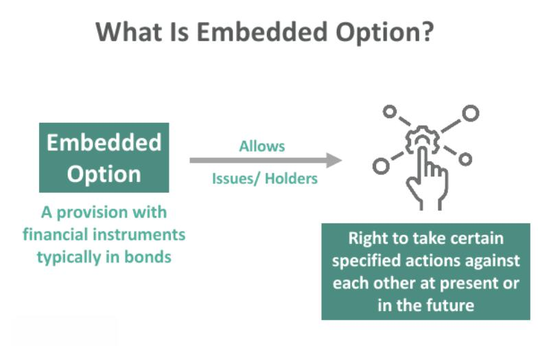

Financial derivatives, such as options, are pivotal tools in modern financial markets, empowering investors to hedge against risks, diversify portfolios, or engage in speculative activities. Options, futures, and swaps fall into a category that derives value from underlying assets, making them essential in strategies for risk management and profit maximization. The flexibility and variety offered by derivatives provide investors with numerous opportunities to tailor strategies to specific goals and market conditions.

Embedded options are features within securities that grant special rights to holders, influencing the security's valuation and presenting unique strategic opportunities. Common examples include callable and putable bonds, where the issuer has the option to call back or the holder to sell the bond back before maturity. These embedded choices impact the pricing and yield of securities, offering additional layers of strategy for investors. Recognizing and utilizing the effects of embedded options is crucial for those looking to maximize the potential of their portfolios.



Algorithmic trading emerges as a transformative force in this landscape, automating and optimizing complex trading strategies with precision and efficiency. By executing trades based on pre-established rules and algorithms, traders minimize human error and emotional bias, enabling the execution of sophisticated strategies across diverse market conditions. The rise of algorithmic trading is shifting paradigms within financial markets, significantly enhancing the speed and accuracy of trading operations.

This article will examine how financial derivatives, embedded options, and algorithmic trading can be synthesized to develop robust investment strategies. It will address fundamental concepts, practical applications, and the integration of these elements in creating sophisticated strategies in financial markets. The exploration will focus on defining the key elements, recognizing their impact and utilization, and examining real-world applications. Understanding these tools empowers investors to harness their full potential and achieve strategic investment objectives.

## Table of Contents

## Understanding Financial Derivatives and Embedded Options

Financial derivatives are financial instruments whose value is dependent on the performance of an underlying asset, index, or [interest rate](/wiki/interest-rate-trading-strategies). Common derivatives include options, futures, and swaps. These instruments play a crucial role in modern finance by allowing investors to hedge risks, speculate on asset price movements, or gain exposure to underlying assets without directly owning them.

Options are a prevalent form of derivatives. They are contracts that give the buyer the right, but not the obligation, to buy or sell an asset at a predetermined price within a specific period. There are two primary types of options: calls and puts. A call option allows the holder to purchase the underlying asset, while a put option grants the right to sell the asset. The price agreed upon in the option contract is called the strike price, and the time until the option expires is known as the expiration date.

Embedded options are provisions within financial securities that provide the holder with specific rights, potentially altering their overall value and appeal. These options are embedded or built into the security itself, such as bonds or stocks, and affect the security's cash flows. Common embedded options include callable, putable, and convertible features.

Callable bonds are debt securities that grant the issuer the right to redeem the bond before its maturity date, typically at a premium to the face value. This feature allows issuers to refinance the debt if interest rates decline, thus lowering their cost of borrowing.

Putable bonds provide bondholders the right to sell the bond back to the issuer at a specified price before maturity. This option protects investors against rising interest rates or declining credit quality of the issuer, as they can [exit](/wiki/exit-strategy) the investment early.

Convertible bonds give investors the right to convert their bonds into a predetermined number of shares of the issuer's stock. This feature offers the potential for participating in the equity upside while enjoying the fixed income characteristics of a bond.

Valuation and risk management of securities with embedded options are crucial for fully leveraging their potential benefits. Pricing models, such as the Black-Scholes model for options, take into account factors such as [volatility](/wiki/volatility-trading-strategies), interest rates, and time to expiration to determine the option's fair value. Embedded option pricing can be more complex due to their conditional nature, requiring sophisticated models like lattice models or Monte Carlo simulations to accurately project potential outcomes.

Understanding the mechanics and pricing of financial derivatives and embedded options allows investors to construct more informed and effective investment strategies, as these instruments provide alternative methods to manage risk, enhance portfolio returns, and optimize capital structure. Properly evaluating these securities often involves analyzing the underlying asset's characteristics and market conditions to ensure optimal risk-adjusted returns.

## Algorithmic Trading: Enhancing Precision and Efficiency

Algorithmic trading employs computer algorithms to make trading decisions, automating processes based on predefined strategies and market conditions. This automation is increasingly prevalent in the financial industry because it enhances precision and efficiency, significantly transforming how trading is conducted.

A primary advantage of [algorithmic trading](/wiki/algorithmic-trading) is the improvement in trade execution speed. Algorithms can execute trades within fractions of a second, much faster than a human trader could, thus exploiting market inefficiencies and capturing profitable opportunities that might otherwise be missed. This speed is crucial in fast-moving markets where price movements can be rapid and volatile.

Furthermore, algorithmic trading eliminates emotional biases. Human traders are subject to emotions such as fear and greed, which can impede objective decision-making. Algorithms, however, follow a set of rules without deviation, ensuring a consistent and rational approach. This consistency is beneficial for managing complex strategies and maintaining discipline over time.

In options markets, where precise timing is paramount, algorithmic trading proves highly effective. Options traders often need to execute trades at specific moments to optimize pricing, manage risk, or take advantage of market movements. Algorithms can swiftly analyze market data and trigger trades at ideal points, achieving optimal outcomes that manual trading might not facilitate.

Automating trades through algorithms allows the consistent application of sophisticated models and data analysis. Algorithms can process large volumes of data in real time, adapting strategies as market conditions shift. This dynamic adjustment is essential for maintaining competitive advantages. For example, a Python snippet to calculate the exponential moving average (EMA), which could be part of an algo trading strategy, is as follows:

```python
def calculate_ema(prices, days):
    # Calculate the exponential moving average for a list of prices over a given number of days
    ema = [sum(prices[:days]) / days]  # Start with a simple moving average
    multiplier = 2 / (days + 1)
    for price in prices[days:]:
        ema_today = (price - ema[-1]) * multiplier + ema[-1]
        ema.append(ema_today)
    return ema
```

This snippet demonstrates how algorithms utilize formulas to make calculations required for trading decisions. The ability to adjust strategies in real-time based on continuous data input underlines the significant efficiencies gained through algorithmic trading.

In summary, algorithmic trading provides strategic benefits, including enhanced execution speed, removal of emotional biases, and advanced data handling capabilities. It is a pivotal tool in finance, offering a robust method for navigating the complexities of modern markets with precision and efficiency.

## Investment Strategies Combining Derivatives, Embedded Options, and Algorithic Trading

Investment strategies can significantly benefit from integrating derivatives with embedded options, optimizing risk-reward profiles by leveraging functionalities inherent in each financial instrument.

**Delta Hedging and Risk Management**

One effective strategy is delta hedging, which involves dynamically adjusting the positions of derivatives, such as options, to hedge against directional risks. In a delta-neutral portfolio, the overall delta, or sensitivity to changes in the price of the underlying asset, is zero. This strategy minimizes exposure to asset price fluctuations, allowing investors to focus on other forms of risk or speculation. For example, if a portfolio has a long position in a call option, an investor could sell a proportionate amount of the underlying asset to achieve delta neutrality.

$$
\Delta_{\text{portfolio}} = \text{Quantity of Calls} \times \Delta_{\text{call}} - \text{Quantity of Underlying Asset}
$$

**Spread Trading and Pricing Inefficiencies**

Spread trading capitalizes on pricing inefficiencies between similar financial instruments by taking offsetting positions. Commonly, this involves long and short positions in derivatives of the same type or in derivatives with embedded options. An example is a calendar spread, where a trader might simultaneously buy a long-dated option and sell a near-term option with the same strike price. The embedded options can add layers of complexity and potential profit by exploiting differences in implied volatility and time decay.

**Arbitrage Opportunities with Embedded Features**

Arbitrage strategies take advantage of price discrepancies that exist for a limited time across different markets or financial instruments. Embedded options like callable or convertible bonds can create unique [arbitrage](/wiki/arbitrage) opportunities, particularly when the market misprices these features relative to similar instruments or market conditions. Traders can construct sophisticated algorithmic models to detect and exploit these discrepancies quickly and efficiently.

**Algorithmic Trading and Backtesting**

Algorithmic trading platforms are invaluable in these strategies by allowing for rigorous [backtesting](/wiki/backtesting) against historical data. This process involves simulating how a strategy would have performed in the past to gauge its potential effectiveness. Traders can evaluate various scenarios and adjust parameters to enhance strategy robustness before committing real capital.

```python
import pandas as pd
import numpy as np

# Example of simple backtesting for a delta hedging strategy
def delta_hedge_backtest(option_data, asset_data, initial_cash=100000):
    portfolio_value = initial_cash
    delta_hedge_position = 0

    for i in range(len(option_data)):
        # Simulate daily rebalancing based on option's delta
        current_delta = option_data['Delta'][i]
        asset_price = asset_data['Price'][i]

        # Calculate current value of delta hedge
        desired_hedge = -current_delta * option_data['Quantity'][i]
        hedge_difference = desired_hedge - delta_hedge_position
        portfolio_value += hedge_difference * asset_price

        # Update the hedge position
        delta_hedge_position = desired_hedge

    return portfolio_value

# Assuming option_data and asset_data are preloaded DataFrames
result = delta_hedge_backtest(option_data, asset_data)
print(f"Final Portfolio Value: {result}")
```

This code exemplifies the ability to simulate a delta hedging strategy to potentially uncover insights into risk management efficacy over time.

**Multifaceted Approaches**

Successful investment strategies often require a multifaceted approach. By mixing derivatives with embedded options and integrating algorithmic trading, investors can respond to diverse market conditions effectively. This blend not only offers potential profit maximization but also enhances flexibility in adjusting to volatile market dynamics. Such strategies must be rooted in comprehensive research, precise execution, and consistent oversight to exploit market conditions continually and efficiently.

## Implementing and Optimizing Algo-Trading Strategies

Developing an effective algorithmic trading strategy requires a systematic approach, beginning with the establishment of clear objectives, risk tolerances, and specific goals. These components form the foundation of a robust trading plan that aligns with an investor's financial targets and risk appetite. The process then involves selecting and implementing appropriate algorithmic techniques tailored to the desired strategy.

### Selecting Strategic Algorithms

Algorithm selection is a critical phase in strategy development. Several algorithmic approaches can be employed, each suited to different market conditions and objectives:

1. **Trend Following**: This strategy capitalizes on the movement of a security's price in a consistent direction. A trend-following algorithm might use moving averages to identify entry and exit points. For instance, an investor could implement a simple moving average crossover strategy, where a buy signal is generated when the short-term moving average crosses above a long-term moving average.

2. **Mean Reversion**: This approach assumes that asset prices will revert to their historical mean over time. Algorithms designed for mean reversion identify assets that have deviated significantly from their average price, indicating potential buy or sell opportunities. The use of Bollinger Bands or standard deviation channels is common for identifying these signals.

3. **Momentum-Based Strategies**: These focus on assets that show upward or downward price momentum. The assumption is that assets with significant momentum tend to continue moving in the same direction. An algorithm might use relative strength indicators to identify strong price momentum.

### Optimization of Trading Algorithms

Once a strategy is selected, optimization is crucial to enhance its performance. This involves rigorous testing and refinement:

- **Backtesting**: This method assesses the strategy's performance using historical data. It is essential for verifying if the parameters chosen in the algorithm yield profitable outcomes in past market conditions. For example, in Python, using a library such as Backtrader allows traders to simulate their strategies on historical data and analyze the results.

  ```python
  import backtrader as bt

  class MyStrategy(bt.Strategy):
      def next(self):
          pass  # Define trading logic here

  cerebro = bt.Cerebro()
  cerebro.addstrategy(MyStrategy)
  cerebro.run()
  ```

- **Simulation**: Beyond backtesting, simulating a strategy in a paper trading environment helps traders gain insights into real-time performance. This step provides a risk-free method of adjusting the strategy based on live market feedback without financial consequences.

- **Parameter Tuning**: Optimization also involves fine-tuning strategy parameters, such as entry/exit points or levels of risk exposure, to maximize profitability. Optimization tools often use techniques such as grid search or genetic algorithms to find optimal parameter settings.

### Continuous Performance Monitoring

The dynamic nature of financial markets necessitates ongoing performance evaluation and adaptation of trading strategies:

- **Adaptation to Market Changes**: Markets are continually evolving, influenced by economic events, regulatory changes, and technological advancements. It's crucial to monitor strategies and adapt them as necessary to ensure they remain effective.

- **Risk Mitigation**: Continuous monitoring also aids in identifying new risks or changes in market volatility, allowing traders to adjust their risk management protocols. Risk metrics, such as value at risk (VaR) or maximum drawdown, help in assessing strategy stability and making necessary adjustments.

Through meticulous planning, strategic algorithm selection, optimization, and continuous monitoring, traders can develop and maintain robust algorithmic trading strategies that capitalize on varying market conditions while managing associated risks effectively.

## Risk Management in Algorithmic Options Trading

Algorithmic trading, particularly in options markets, necessitates robust risk management strategies to safeguard against potential losses and market volatility. Despite its precision and efficiency, algorithmic trading carries inherent risks associated with system failures, market anomalies, and potential mispricing. To mitigate these risks, traders must employ stringent risk management protocols. 

One fundamental technique is the use of stop-loss orders, which automatically sell an asset when its price falls below a predefined threshold. This mechanism helps to limit potential losses and protect the investment portfolio against drastic market movements. Effective use of stop-loss orders requires careful calibration to avoid premature exits due to normal market fluctuations while ensuring protection from significant downturns.

Position sizing is another critical strategy, focusing on determining the optimal amount to invest in each trade relative to the total portfolio. By calculating position sizes based on risk tolerance and volatility, traders can better manage their exposure to loss. Common approaches involve the use of fixed fractional or fixed ratio methods, where investment sizes are adjusted according to predefined risk factors.

Diversification plays a vital role in spreading risk across different assets. By engaging in a mix of financial instruments and sectors, traders can reduce the impact of any single market movement on their overall portfolio. Diversification is particularly relevant in options trading, where distinct contracts offer varied risk-return characteristics.

The dynamic nature of financial markets necessitates regular reassessment of risk parameters and periodic updates to trading algorithms. This proactive adjustment process ensures that strategies remain aligned with current market conditions and volatility levels. For instance, alterations in volatility can require changes in option Greeks, such as delta or gamma adjustments, to maintain an optimal risk profile.

Performance metrics like the Sharpe ratio and Sortino ratio serve as valuable evaluation tools to guide risk management decisions. The Sharpe ratio measures the excess return per unit of risk, with a higher ratio indicating a more favorable risk-adjusted performance. The Sortino ratio refines this by considering only the downside volatility, offering a more focused view of the investment's downside risk. Utilizing these metrics can highlight areas for improvement and inform strategic adjustments to enhance capital protection and returns.

Overall, a disciplined approach to risk management is crucial for traders utilizing algorithmic trading in the options market. By integrating robust protocols and continuously refining strategies through performance evaluations, traders can better navigate the inherent risks and maximize their investment outcomes.

## Conclusion

The integration of financial derivatives, embedded options, and algorithmic trading offers a sophisticated approach to modern investment strategies. By understanding these complex financial instruments and using them in conjunction, investors can attain greater precision, efficiency, and potential profitability in the financial markets. The synergy of these tools allows for enhanced decision-making through automated processes, minimizing human biases and errors. This approach is particularly advantageous in volatile markets where timely and accurate execution is paramount.

Successful implementation, however, necessitates continuous learning and rigorous strategy testing. As the financial environment is inherently dynamic, traders must persistently evaluate their strategies, adapting to changes promptly to safeguard returns and mitigate risks. Mathematical models and backtesting play a pivotal role in this process, enabling the simulation of different scenarios and fine-tuning of strategies to optimize performance. Investors could implement these concepts in Python, using libraries such as NumPy and pandas for data manipulation and backtesting frameworks to evaluate historical performance.

Risk management remains a cornerstone of algorithmic and derivatives trading. It involves establishing protocols such as stop-loss orders, position sizing, and diversification to cushion against unexpected market swings. Performance metrics, including Sharpe or Sortino ratios, can be instrumental in assessing and refining these strategies to enhance capital protection.

As technology progresses and market dynamics shift, staying informed about the latest developments is crucial for traders aiming to employ these methods effectively. The landscape of financial markets continues to evolve, and with it, the tools and strategies that drive trading success. Embracing technological advancements and remaining agile and informed will help investors leverage these sophisticated financial instruments to their full potential.

## References & Further Reading

[1]: Hull, J. C. (2012). ["Options, Futures, and Other Derivatives,"](https://www.semanticscholar.org/paper/Options%2C-Futures%2C-and-Other-Derivatives-Hull/89bdee500c8623864fc9eb7a471546aa713acc44) (9th Edition). Pearson.

[2]: Black, F., & Scholes, M. (1973). ["The Pricing of Options and Corporate Liabilities."](https://www.cs.princeton.edu/courses/archive/fall09/cos323/papers/black_scholes73.pdf) The Journal of Political Economy, 81(3), 637-654.

[3]: Chincarini, L. B. (2010). ["The Crisis of Crowding: Quant Copycats, Ugly Models, and the New Crash Normal."](https://www.wiley.com/en-us/The+Crisis+of+Crowding%3A+Quant+Copycats%2C+Ugly+Models%2C+and+the+New+Crash+Normal-p-9781118250020) Wiley.

[4]: Aldridge, I. (2013). ["High-Frequency Trading: A Practical Guide to Algorithmic Strategies and Trading Systems."](https://www.amazon.com/High-Frequency-Trading-Practical-Algorithmic-Strategies/dp/1118343506) Wiley.

[5]: Kissell, R. (2014). ["The Science of Algorithmic Trading and Portfolio Management."](https://www.sciencedirect.com/book/9780124016897/the-science-of-algorithmic-trading-and-portfolio-management) Academic Press.