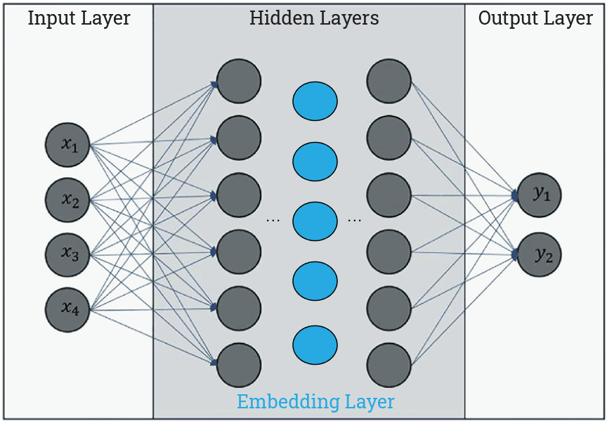

## Table of Contents

## What is an embedding layer in machine learning?

An embedding layer in machine learning is a type of layer used in neural networks, especially in tasks like natural language processing. It helps convert words or other discrete inputs into continuous vectors of real numbers, which are easier for the neural network to work with. Think of it like translating words into a language that the computer can understand better. For example, if you have a word like "cat," the embedding layer will turn it into a vector like $$[0.1, -0.2, 0.5, ...]$$, where each number represents a feature of the word.

These vectors, or embeddings, are learned during the training of the neural network. This means that the network adjusts the values in the vectors to better represent the relationships between words. For instance, words that are similar in meaning, like "cat" and "kitten," will have vectors that are close to each other in the vector space. This helps the model understand context and semantics better, making it more effective at tasks like text classification, translation, and more.

## Why are embedding layers important in neural networks?

Embedding layers are important in neural networks because they help the computer understand words and other discrete data better. Instead of treating each word as a separate, unique item, embedding layers turn words into numbers. These numbers, called vectors, are like coordinates in a space where similar words are close to each other. For example, the words "dog" and "puppy" would have vectors that are near each other, showing that they are related. This makes it easier for the neural network to see patterns and relationships in the data.

These vectors are learned by the neural network over time. As the network trains, it adjusts the numbers in the vectors to better represent the meaning of the words. This means that the embeddings become more accurate and useful as the network learns. By using embeddings, the neural network can handle large vocabularies more efficiently and perform better on tasks like understanding text, translating languages, and even generating new text. This ability to capture and use the nuances of language is what makes embedding layers so valuable in machine learning.

## How does an embedding layer convert categorical data into numerical data?

An embedding layer converts categorical data, like words or categories, into numerical data by turning each category into a vector of numbers. Imagine you have a list of words. Instead of using the words directly, the embedding layer changes each word into a set of numbers, like $$[0.1, -0.2, 0.5, ...]$$. These numbers are called embeddings, and they represent the word in a way that a computer can understand and process easily.

The process works by assigning a unique vector to each category. These vectors are not random; they are learned by the [neural network](/wiki/neural-network) during training. As the network sees more data, it adjusts the numbers in the vectors to better capture the relationships between categories. For example, if the categories are words, the network will make the vectors for similar words, like "dog" and "puppy," close to each other in the vector space. This helps the network understand the meaning and context of the data, making it more effective at tasks like text analysis or recommendation systems.

## What is the dimensionality of an embedding layer and how is it chosen?

The dimensionality of an embedding layer refers to the number of numbers (or dimensions) in each vector that represents a category. For example, if you have an embedding layer with a dimensionality of 100, each word or category would be represented by a vector of 100 numbers, like $$[0.1, -0.2, 0.5, ..., 0.9]$$. The choice of dimensionality is important because it affects how well the embeddings can capture the relationships between categories. A higher dimensionality can represent more complex relationships but might require more data and computational power to train effectively.

The dimensionality is usually chosen based on the specific task and the amount of available data. A common practice is to start with a moderate dimensionality, like 50 or 100, and then adjust based on how well the model performs. If the model is not capturing the relationships well, you might increase the dimensionality. However, if the model is overfitting (performing too well on the training data but not on new data), you might decrease it. The key is to find a balance that allows the model to learn useful representations without being too complex or too simple.

## Can you explain the process of training an embedding layer?

Training an embedding layer involves teaching the neural network to turn words or categories into numbers, called embeddings, that capture their meanings and relationships. When you start training, the embeddings might be random, like $$[0.1, -0.2, 0.5, ...]$$. As the network sees more data, it adjusts these numbers to make the embeddings more accurate. For example, if the network sees the words "dog" and "puppy" together often, it will move their embeddings closer together in the vector space to show they are related.

The training happens as part of the overall training of the neural network. The network uses the embeddings to make predictions, like classifying text or translating languages. If the predictions are wrong, the network adjusts not just the other parts of itself but also the embeddings. Over many rounds of training, the embeddings become better at representing the data, helping the network perform its task more effectively. This process of adjusting the embeddings to better fit the data is what makes the embedding layer so powerful in understanding and working with words and categories.

## How do embedding layers help in reducing the dimensionality of input data?

Embedding layers help reduce the dimensionality of input data by turning words or categories into smaller sets of numbers. Imagine you have a list of 10,000 words. Without embeddings, you might need to use a very large vector, like $$[0, 0, ..., 1, ..., 0]$$, where only one number is 1 to show which word it is. This vector would be as long as the number of words you have, which is 10,000 in this case. But with an embedding layer, each word can be turned into a much shorter vector, like $$[0.1, -0.2, 0.5, ...]$$, that might only have 100 numbers. This makes the data much smaller and easier for the computer to work with.

By using embeddings, the neural network can handle large amounts of data more efficiently. Instead of dealing with huge vectors for each word, the network works with smaller, more manageable vectors. These smaller vectors still capture the important information about the words, like their meanings and relationships. This not only saves space but also helps the network learn faster and perform better on tasks like understanding text or making predictions.

## What are some common applications of embedding layers in machine learning?

Embedding layers are used in many [machine learning](/wiki/machine-learning) tasks, especially in natural language processing. One common application is in text classification, where the goal is to sort text into different categories. For example, a neural network might use embedding layers to turn words into numbers, like $$[0.1, -0.2, 0.5, ...]$$, to understand the meaning of emails and sort them into spam or not spam. Another use is in sentiment analysis, where the network tries to figure out if a piece of text is positive, negative, or neutral. By turning words into embeddings, the network can see how words relate to each other and make better guesses about the sentiment.

Another important application is in machine translation, where embedding layers help translate text from one language to another. The network uses embeddings to understand the meaning of words in the source language and find the best words in the target language. This makes the translation more accurate and natural-sounding. Embedding layers are also used in recommendation systems, like those on streaming services or online stores. By turning items or user preferences into embeddings, the system can find patterns and suggest things that users might like based on what they've enjoyed before.

In addition to these, embedding layers are used in tasks like named entity recognition, where the goal is to identify and classify names of people, organizations, or locations in text. For example, the network might use embeddings to recognize that "Apple" refers to a company, not a fruit, based on the context. Embedding layers also help in generating new text, like in chatbots or automatic text completion. By understanding the relationships between words through their embeddings, the network can create more coherent and contextually appropriate text.

## How do embedding layers differ from one-hot encoding?

Embedding layers and one-hot encoding are two different ways to turn words or categories into numbers that a computer can use. One-hot encoding turns each word into a very long vector where only one number is 1, and all the others are 0. For example, if you have 10,000 words, the word "cat" might be turned into a vector like $$[0, 0, ..., 1, ..., 0]$$ where the 1 is in the position that stands for "cat." This vector is as long as the number of words you have, which can make it hard for the computer to work with if you have a lot of words.

Embedding layers, on the other hand, turn each word into a much shorter vector, like $$[0.1, -0.2, 0.5, ...]$$. These vectors are learned by the neural network during training, so they can capture the meaning and relationships between words. For example, the vectors for "cat" and "kitten" would be close to each other in the vector space because they are related. This makes the data easier for the computer to work with and helps the neural network understand the text better.

## What are the advantages of using pre-trained embeddings versus training from scratch?

Using pre-trained embeddings can save a lot of time and resources. When you use pre-trained embeddings, you start with vectors like $$[0.1, -0.2, 0.5, ...]$$ that have already been learned from a large amount of text. This means you don't have to train your own embeddings from scratch, which can take a long time and need a lot of data. Pre-trained embeddings are often made from huge datasets, so they can capture a lot of information about how words relate to each other. This can help your model work better, especially if you don't have a lot of data of your own.

Another advantage of pre-trained embeddings is that they can help your model understand language better right from the start. Because these embeddings are learned from a wide range of texts, they can capture general language patterns and meanings. This can be really helpful if your task is something common, like understanding sentiment or translating languages. By starting with these embeddings, your model can focus on learning the specific details of your task, rather than trying to learn everything about language from scratch.

## How can embedding layers be used to handle out-of-vocabulary (OOV) words?

Embedding layers can help with out-of-vocabulary (OOV) words by using a special token that stands for any word the model hasn't seen before. When the model meets a new word, it turns it into this special token, like $$[0.1, -0.2, 0.5, ...]$$, and uses its embedding to understand the word's meaning. This way, the model can still work with new words without getting confused.

Another way to handle OOV words is by using subword embeddings. Instead of treating each word as a whole, the model breaks words into smaller parts, like "un", "known", and "ness" for "unknownness". Each part gets its own embedding, so even if the model hasn't seen the whole word before, it can use the embeddings of the parts to guess its meaning. This makes the model more flexible and better at understanding new words.

## What are some advanced techniques for optimizing embedding layers?

One advanced technique for optimizing embedding layers is to use techniques like regularization. Regularization helps prevent the model from overfitting, which means it stops the model from getting too focused on the training data and not being able to handle new data well. One type of regularization used with embedding layers is called dropout. Dropout randomly turns off some of the numbers in the embeddings during training, like setting some numbers in $$[0.1, -0.2, 0.5, ...]$$ to zero. This makes the model more robust and better at understanding new words or categories.

Another technique is to use adaptive learning rates. This means the model changes how fast it learns based on how well it's doing. For example, if the model is making a lot of mistakes, it might speed up learning to fix the errors faster. If it's doing well, it might slow down to make smaller, more careful changes. This can help the model find the best embeddings more quickly and accurately. By using these techniques, the model can learn better embeddings and perform better on tasks like understanding text or making recommendations.

## How do you evaluate the effectiveness of an embedding layer in a model?

To evaluate the effectiveness of an embedding layer in a model, you can look at how well the model performs on its main task, like understanding text or making predictions. If the model does better when using the embedding layer compared to not using it, that's a good sign that the embeddings are helping. For example, if you're using the embeddings for a text classification task, you might see that the model's accuracy, like $$85\%$$, is higher with the embeddings than without them. This shows that the embeddings are capturing useful information about the words or categories.

Another way to evaluate the embeddings is by looking at how well they capture the relationships between words or categories. You can do this by checking if similar words have embeddings that are close to each other in the vector space. For example, if the embeddings for "dog" and "puppy" are close together, like $$[0.1, -0.2, 0.5, ...]$$ and $$[0.15, -0.18, 0.48, ...]$$, it means the embeddings are doing a good job of showing that these words are related. You can use tools like cosine similarity to measure how close the embeddings are to each other. If the embeddings are good at showing these relationships, it's a sign that they are effective.