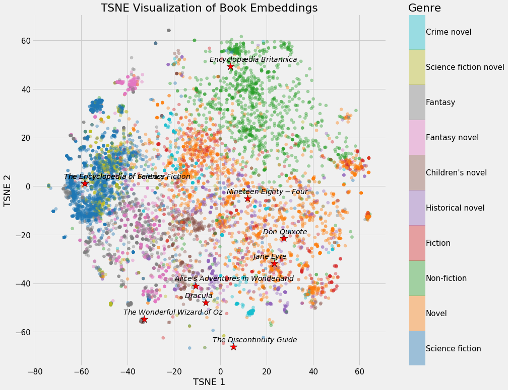

## Table of Contents

## What is an embedding space in machine learning?

An embedding space in machine learning is a way to represent data, like words or images, in a special kind of map where similar items are placed close to each other. Imagine you have a bunch of different fruits. In an embedding space, apples and pears might be close together because they are similar, while bananas might be further away. This map is usually created using math formulas that look at the features of the items and decide where to put them.

These spaces are very useful because they help computers understand and work with data better. For example, if you're using a computer to read and understand sentences, the words in the sentence can be placed in an embedding space. This helps the computer see which words are similar and how they relate to each other, making it easier to process language. The math behind creating these spaces can be complex, but the idea is simple: to make a map where similar things are near each other and different things are far apart.

## How does an embedding space transform data?

An embedding space transforms data by converting it into a format that makes it easier for machines to understand and work with. Imagine you have a collection of words. Each word starts as a simple label, but when you put it into an embedding space, it gets turned into a set of numbers. These numbers represent the word's position in a multi-dimensional space where similar words are placed close to each other. For example, the words "cat" and "kitten" might end up near each other because they are related, while "cat" and "ocean" would be far apart.

This transformation is done using mathematical formulas that look at the features of the data and decide where each item should go in the space. The goal is to create a map where the distance between points reflects how similar or different the items are. For instance, if you're working with images, the embedding space might use features like color, shape, and texture to decide where to place each image. By doing this, the computer can quickly see which images are similar and which are different, making tasks like image recognition or recommendation systems more efficient.

## What are the common applications of embedding spaces?

Embedding spaces are widely used in natural language processing (NLP). They help computers understand and work with text by turning words into numbers. For example, when you use a search engine, it uses embeddings to figure out what you're looking for and show you the best results. Chatbots and language translation tools also use embeddings to understand and generate human-like responses. By placing words in an embedding space, these tools can see which words are similar and how they relate to each other, making it easier to process and generate language.

Another common use of embedding spaces is in recommendation systems. When you watch a movie on a streaming service or buy something online, the system uses embeddings to suggest other movies or products you might like. It does this by placing items in an embedding space where similar items are close together. For example, if you like action movies, the system will find other action movies near your recent choices in the embedding space and recommend them to you. This makes the recommendations more accurate and personalized.

Embedding spaces are also important in image recognition and computer vision. When a computer needs to identify objects in a picture, it uses embeddings to turn the image into a set of numbers. These numbers represent the image's features like color, shape, and texture. By placing images in an embedding space, the computer can quickly see which images are similar and which are different. This is useful for tasks like facial recognition, where the computer needs to match a face in a photo to a database of known faces.

## How do you create an embedding space?

Creating an embedding space starts with choosing the data you want to represent, like words, images, or any other kind of information. You then need to decide what features of the data are important. For words, you might look at how often they appear near each other in sentences. For images, you might consider color, shape, and texture. Once you have these features, you use a mathematical formula to turn each piece of data into a set of numbers. These numbers represent the position of the data in the embedding space. A common way to do this is with a neural network, which learns how to place the data by looking at lots of examples.

After you have the numbers for each piece of data, you can put them into the embedding space. The goal is to make sure that similar items end up close to each other and different items are far apart. For example, if you're working with words, "cat" and "kitten" should be near each other because they're related. You can use different methods to check if your embedding space is working well, like seeing if the distances between points match how similar or different the items are in real life. By fine-tuning the math and the features you use, you can make your embedding space more accurate and useful for tasks like language understanding, image recognition, or recommendation systems.

## What is the difference between a feature space and an embedding space?

A feature space is like a map where each point represents an item based on its features. For example, if you're looking at houses, the features might be the number of bedrooms, the size of the garden, and the price. Each house gets a spot on the map based on these features. The feature space is created using the raw data you start with, and it helps you see how different items compare based on their features. It's like a simple way to organize data so you can see patterns and relationships.

An embedding space is a bit different. It's also a map, but it's created using more complex math to turn items into numbers in a way that makes similar items end up close together. For example, if you're working with words, an embedding space might use a neural network to learn how words relate to each other based on how they're used in sentences. The goal is to make a map where "cat" and "kitten" are near each other because they're related, even if they don't share the same raw features. Embedding spaces are often used in machine learning to help computers understand and work with data better, like in language processing or image recognition.

## How do dimensionality reduction techniques relate to embedding spaces?

Dimensionality reduction techniques are like tools that help us simplify complex data. They take a bunch of numbers that describe something, like an image or a word, and turn them into a smaller set of numbers. This makes it easier to work with the data because it's less complicated. Imagine you have a big map with lots of details. Dimensionality reduction is like zooming out to see just the important parts. Techniques like Principal Component Analysis (PCA) or t-SNE are often used to do this. They help us see patterns and relationships in the data that might be hard to spot when we're looking at all the details.

Embedding spaces use dimensionality reduction to create a map where similar things are close together. For example, if you're working with words, you might start with a lot of information about how often each word appears near other words. Dimensionality reduction helps turn this into a simpler set of numbers that still show how the words relate to each other. This makes it easier for computers to understand and work with the words. By using these techniques, we can create embedding spaces that help with tasks like language processing or image recognition, making them more efficient and accurate.

## What are word embeddings and how do they use embedding spaces?

Word embeddings are a way to turn words into numbers so that computers can understand and work with them better. Imagine you have a big list of words. Instead of just seeing them as letters, word embeddings put each word into a special map called an embedding space. In this map, words that mean similar things, like "cat" and "kitten," are placed close to each other. This makes it easier for computers to see how words relate to each other and understand sentences better.

To create word embeddings, computers use a lot of text to learn how words are used. They look at how often words appear near each other in sentences and use math to turn each word into a set of numbers. These numbers show where the word goes in the embedding space. For example, if you use a method called Word2Vec, the computer might use a formula like this to find the numbers for each word: $$v(w) = \text{embedding}(w)$$. By doing this, the computer can see that "king" and "queen" are related because they end up near each other in the embedding space, making tasks like language translation or text prediction easier.

## How can you visualize an embedding space?

Visualizing an embedding space helps us understand how items are placed in the map. One common way to do this is by using a technique called t-SNE, which stands for t-Distributed Stochastic Neighbor Embedding. This method takes the high-dimensional data, like the numbers that represent words or images, and turns it into a 2D or 3D picture. In this picture, you can see how similar items are placed close to each other. For example, if you're looking at word embeddings, you might see that "dog" and "puppy" are near each other because they're related.

To actually make this visualization, you can use a computer program. For instance, if you're working with Python, you might use a library like scikit-learn to apply t-SNE and then a library like matplotlib to draw the picture. Here's a simple example of how you might do this in Python:

```python
from sklearn.manifold import TSNE
import matplotlib.pyplot as plt

# Assume 'embeddings' is your data
tsne = TSNE(n_components=2, random_state=0)
embeddings_2d = tsne.fit_transform(embeddings)

plt.scatter(embeddings_2d[:, 0], embeddings_2d[:, 1])
plt.show()
```

This code takes your high-dimensional embeddings and turns them into a 2D picture where you can see the relationships between the items. By looking at this picture, you can get a better sense of how your embedding space works and how well it groups similar items together.

## What are the challenges in optimizing embedding spaces?

Optimizing embedding spaces is tricky because it involves finding the best way to represent data so that similar items are close together and different items are far apart. One big challenge is choosing the right features to use when creating the embeddings. For example, if you're working with words, you need to decide if you should look at how often words appear near each other or if you should consider other things like the meaning of the words. Getting this wrong can make the embedding space less useful because it might not show the right relationships between items. Another challenge is the size of the data. With a lot of data, it can take a long time to create and fine-tune the embedding space, and you need powerful computers to do it quickly.

Another difficulty is making sure the embedding space works well for the task you're trying to do. For example, if you're using embeddings for a recommendation system, you want the space to be good at grouping similar products together. But if you're using it for language translation, you need the space to show how words relate to each other in different languages. This means you might need to use different methods or formulas to create the embeddings depending on what you're trying to achieve. Finding the best way to do this can take a lot of trial and error, and it's not always clear what will work best until you try it out.

## How do different machine learning models utilize embedding spaces?

Different machine learning models use embedding spaces in unique ways to help them understand and work with data better. For example, in natural language processing, models like Word2Vec and GloVe turn words into numbers using embedding spaces. These models look at how often words appear near each other in sentences and use formulas like $$v(w) = \text{embedding}(w)$$ to create embeddings. This helps the model understand the relationships between words, making tasks like language translation or text prediction easier. By placing words in an embedding space, the model can see that words like "king" and "queen" are related because they end up near each other.

In recommendation systems, models use embedding spaces to suggest items that users might like. For instance, a model might take a user's past choices and turn them into embeddings. It then places these embeddings in a space where similar items are close together. If a user likes action movies, the model can find other action movies near their recent choices in the embedding space and recommend them. This makes the recommendations more accurate and personalized. By using embeddings, the model can quickly see which items are similar and which are different, making the recommendation process more efficient.

In computer vision, models like convolutional neural networks (CNNs) use embedding spaces to help with tasks like image recognition. These models turn images into numbers based on features like color, shape, and texture. By placing these numbers in an embedding space, the model can see which images are similar and which are different. For example, if the model needs to identify a cat in a photo, it can compare the photo's embedding to a database of known cat embeddings. If they're close in the embedding space, the model knows it's likely a cat. This makes tasks like facial recognition or object detection more accurate and efficient.

## What advanced techniques can be used to improve the quality of embedding spaces?

One advanced technique to improve the quality of embedding spaces is to use a method called "contextual embeddings." Unlike traditional embeddings that give each word a single set of numbers no matter where it appears, contextual embeddings change based on the other words around them. For example, a model like BERT (Bidirectional Encoder Representations from Transformers) looks at the whole sentence to understand how each word is used. This helps the model see that the word "bank" can mean different things depending on if it's used in a sentence about a river or about money. By doing this, the embedding space becomes more accurate and useful for understanding language.

Another technique is to use "contrastive learning" to make the embedding space better. This method works by pulling similar items closer together and pushing different items further apart in the embedding space. For example, if you're working with images, you might show the model pairs of images that are similar and pairs that are different. The model then learns to make the embeddings of similar images closer and the embeddings of different images further apart. This can be done using a formula like $$L = \sum_{\text{similar pairs}} d(x_i, x_j) - \sum_{\text{different pairs}} d(x_i, x_j)$$, where $$d$$ is a distance measure. By fine-tuning the embeddings this way, the model can create a more accurate map of the data, making it better at tasks like image recognition or recommendation systems.

## How can embedding spaces be used for transfer learning across different tasks?

Embedding spaces can help with transfer learning by letting you use the same set of numbers to understand different tasks. Imagine you've trained a model to understand words in one language. The numbers that represent those words can be used to help the model learn another language faster. This is because the embedding space already knows how words relate to each other, so the model can start with a good understanding and just needs to learn the new language's specifics. For example, if you're using a model like BERT, the embeddings it creates can be used to help with tasks like language translation or sentiment analysis, making the learning process quicker and more efficient.

Another way embedding spaces help with transfer learning is by letting you use what the model learned from one type of data to understand a different type. For instance, if you've trained a model to recognize objects in pictures, the numbers that represent those objects can be used to help the model understand videos. The embedding space can show how objects in pictures relate to each other, and this knowledge can be transferred to videos where objects move around. By using the same embeddings, the model can learn new tasks faster because it already knows a lot about how the data works. This makes transfer learning easier and more effective.