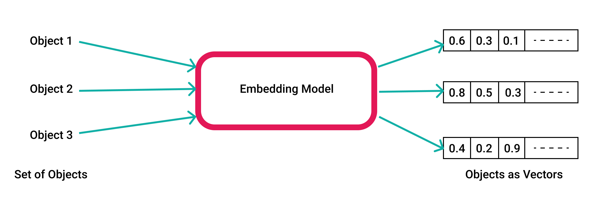

## Table of Contents

## What is an embedding vector in machine learning?

An embedding vector in machine learning is a way to represent data, like words or images, as a list of numbers. These numbers help computers understand and work with the data better. Imagine you have a word like "dog." Instead of the computer just seeing it as a word, it can turn "dog" into a list of numbers, like [0.2, -0.5, 0.8]. This list, or vector, captures what "dog" means in a way the computer can use.

These vectors are useful because they can show how similar different pieces of data are. For example, if "dog" and "puppy" both have similar lists of numbers, the computer can understand that they are related. This helps in tasks like searching for information or translating languages. By turning data into these vectors, machine learning models can find patterns and make better predictions.

## How are embedding vectors used in natural language processing?

In natural language processing (NLP), embedding vectors help computers understand and work with words and sentences. When you type a word, like "cat," the computer turns it into a list of numbers, called an embedding vector. This list, for example, might look like $$[0.3, -0.1, 0.7]$$. These numbers capture the meaning of "cat" in a way the computer can use. By using embedding vectors, the computer can see how similar words are to each other. For instance, "cat" and "kitten" might have similar lists of numbers, so the computer knows they are related.

Embedding vectors are very useful in tasks like translating languages or searching for information. When you ask a computer to translate a sentence from English to French, it uses the embedding vectors of the English words to find the best French words. Similarly, when you search for something online, the computer uses embedding vectors to find pages with similar meanings to your search terms. This makes the search results more accurate and helpful. By turning words into numbers, embedding vectors help computers understand and process language better.

## What is the difference between word embeddings and other types of embeddings?

Word embeddings are a specific type of embedding used to represent words in natural language processing. They turn words like "dog" into a list of numbers, like $$[0.2, -0.5, 0.8]$$, which captures the meaning of the word in a way that computers can understand. These vectors are useful because they can show how similar different words are. For example, if "dog" and "puppy" have similar lists of numbers, the computer can see that they are related. Word embeddings are commonly used in tasks like language translation, sentiment analysis, and text classification.

Other types of embeddings include sentence embeddings, which represent entire sentences as vectors, and image embeddings, which represent images as vectors. Sentence embeddings, like those produced by models like BERT, can capture the meaning of a whole sentence, not just individual words. This is useful for tasks like summarizing text or answering questions. Image embeddings, on the other hand, turn images into lists of numbers, allowing computers to understand and compare images. For instance, an image of a dog might be represented as $$[0.1, 0.3, -0.2]$$, and this vector can be compared to other image vectors to find similar images. Each type of embedding is designed to help computers process and understand different types of data effectively.

## How do you train an embedding vector model?

To train an embedding vector model, you start with a large set of data, like a collection of sentences or images. For word embeddings, you might use a big text file. The goal is to teach the computer to turn words into numbers that capture their meaning. You do this by feeding the text through a [machine learning](/wiki/machine-learning) model, like a [neural network](/wiki/neural-network). The model looks at how words are used together and tries to guess which words are likely to appear near each other. For example, if "dog" often appears with "bark," the model learns to put them close together in the number space. Over many rounds, the model adjusts the numbers to make its guesses better. This process is called training, and it's how the model learns to create useful embedding vectors.

Once the model is trained, you can use it to turn new words into embedding vectors. For instance, if you give it the word "cat," it will output a list of numbers like $$[0.3, -0.1, 0.7]$$. These numbers represent what "cat" means based on the patterns it learned from the training data. The same idea applies to other types of embeddings, like sentence or image embeddings. For sentence embeddings, the model learns to represent whole sentences as vectors, and for image embeddings, it learns to represent images as vectors. The key is always the same: use a lot of data to train the model, and then use the model to turn new data into meaningful numbers.

## What are some common algorithms used to create embedding vectors?

One common algorithm for creating word embedding vectors is Word2Vec. Word2Vec comes in two flavors: Continuous Bag of Words (CBOW) and Skip-gram. In CBOW, the model tries to predict a target word from the surrounding context words. For example, if you have the sentence "The cat sat on the mat," CBOW might try to predict "cat" from "The," "sat," "on," "the," and "mat." In Skip-gram, the model does the opposite: it predicts the surrounding context words from a target word. Both methods help the model learn to represent words as vectors like $$[0.2, -0.5, 0.8]$$, capturing their meanings based on how they are used in text.

Another popular algorithm is GloVe (Global Vectors for Word Representation). GloVe works by analyzing the co-occurrence of words in a large text corpus. It builds a matrix that counts how often words appear together, then uses this matrix to train the embedding vectors. The idea is that words that often appear together should have similar vectors. For example, if "dog" and "bark" often appear together, their vectors like $$[0.1, 0.3, -0.2]$$ and $$[0.15, 0.25, -0.15]$$ will be close to each other. This approach helps the model understand the relationships between words based on their overall usage patterns in the text.

For more advanced tasks, models like BERT (Bidirectional Encoder Representations from Transformers) are used. BERT creates embeddings that capture the context of words in a sentence, not just their standalone meanings. It does this by reading the entire sentence in both directions, which allows it to understand the nuances of language better. For example, the word "bank" could mean a financial institution or the side of a river, and BERT can tell the difference based on the surrounding words. BERT's embeddings are powerful because they can represent not just individual words but entire sentences, making them useful for tasks like question answering and text summarization.

## How can embedding vectors improve the performance of machine learning models?

Embedding vectors help machine learning models understand and work with data better. When you turn words or images into lists of numbers, like $$[0.2, -0.5, 0.8]$$ for the word "dog," the computer can see how similar different pieces of data are. This makes it easier for the model to find patterns and make predictions. For example, if a model is trying to guess what a user might search for next, it can use embedding vectors to find similar past searches and make better guesses.

By using embedding vectors, models can also handle more complex tasks, like translating languages or understanding whole sentences. For instance, when translating from English to French, the model can use the embedding vectors of English words to find the best French words. This makes the translation more accurate and natural. Embedding vectors also help with tasks like finding similar images or summarizing text, because they capture the meaning of the data in a way that computers can use effectively.

## What are the challenges associated with high-dimensional embedding spaces?

High-dimensional embedding spaces can be tricky because they have a lot of numbers, or dimensions, to keep track of. Imagine you have a word like "dog" turned into a long list of numbers like $$[0.2, -0.5, 0.8, 0.1, -0.3, ...]$$. With so many numbers, it's hard for the computer to find patterns and understand what the data means. This is called the "curse of dimensionality." It makes things slower and more complicated because the computer has to handle so much information at once.

Another challenge is that high-dimensional spaces can make it hard to tell if two things are similar. When you have a lot of dimensions, even small differences in the numbers can make things seem far apart. This is called the "distance concentration effect." It can make it tough for the computer to find and use the right patterns in the data. To deal with these challenges, people often try to reduce the number of dimensions, a process called "dimensionality reduction," to make the data easier to work with.

## How do you evaluate the quality of embedding vectors?

To evaluate the quality of embedding vectors, you can use different methods that check how well the vectors capture the meaning of words or images. One common way is to use a task like word analogy, where you see if the vectors can solve puzzles like "king is to man as queen is to woman." If the vectors are good, they should be able to find the right answer by doing simple math with the numbers. For example, if you take the vector for "king" and subtract the vector for "man," then add the vector for "woman," you should end up close to the vector for "queen." This shows that the vectors understand the relationships between words.

Another way to evaluate embedding vectors is to use them in a real task, like classifying text or searching for similar images. If the vectors help the computer do these tasks better, then they are probably good. For example, if you use the vectors to find similar words or images and the results make sense, that's a good sign. You can also use numbers to measure how well the vectors work, like accuracy or similarity scores. By trying out the vectors in different ways, you can get a good idea of how useful they are.

## What is the role of context in generating effective embedding vectors?

Context plays a big role in making embedding vectors work well. When you turn words into numbers, like $$[0.2, -0.5, 0.8]$$ for "dog," it's important to think about the words around it. For example, "bank" can mean a place where you keep money or the side of a river. If you just look at "bank" by itself, it's hard to know which meaning is right. But if you look at the words before and after "bank," like "I went to the bank to deposit money," it's clear it's about money. So, good embedding vectors need to use context to understand what words really mean.

Models like BERT are really good at using context. They read the whole sentence, not just one word at a time. This helps them make better embedding vectors that capture the meaning of words based on how they are used in different situations. For example, BERT can tell that "bank" means a financial place in "I went to the bank to deposit money" but means the side of a river in "We sat by the bank of the river." By understanding context, embedding vectors can help computers do a better job at tasks like translating languages or answering questions.

## How do embedding vectors handle out-of-vocabulary words?

Embedding vectors have a tough time with words they haven't seen before, called out-of-vocabulary (OOV) words. When a model is trained, it only learns about the words in its training data. So, if you give it a new word like "selfie" that wasn't in the training data, it won't know what to do. One way to deal with this is to use a special token, like "<UNK>" for unknown words. When the model sees an OOV word, it can use the vector for "<UNK>" instead. But this isn't perfect because all OOV words get the same vector, and that doesn't capture their different meanings.

To handle OOV words better, some models use techniques like subword embeddings. Instead of treating words as whole units, these models break words into smaller parts, like "self" and "ie" for "selfie." Each part gets its own vector, like $$[0.1, 0.3, -0.2]$$ for "self" and $$[0.2, -0.1, 0.5]$$ for "ie." When the model sees a new word, it can combine the vectors of its parts to make a new vector for the whole word. This way, even if the model hasn't seen "selfie" before, it can still guess what it means based on the parts it knows. This makes the model better at understanding new words and makes the embedding vectors more useful.

## What advancements have been made in embedding vector technology in recent years?

In recent years, embedding vector technology has seen big improvements, especially with the introduction of models like BERT and its successors. These models are really good at understanding the context of words in a sentence. Instead of just looking at words one by one, they read the whole sentence in both directions. This helps them create embedding vectors that capture the meaning of words based on how they are used. For example, the word "bank" could mean a place for money or the side of a river, and BERT can tell the difference based on the words around it. This makes the embedding vectors much more useful for tasks like translating languages, answering questions, and understanding whole sentences.

Another big advancement is in handling out-of-vocabulary (OOV) words. New techniques like subword embeddings have made it easier for models to understand words they haven't seen before. Instead of treating words as whole units, these models break them into smaller parts. For instance, a new word like "selfie" can be broken down into "self" and "ie." Each part gets its own vector, like $$[0.1, 0.3, -0.2]$$ for "self" and $$[0.2, -0.1, 0.5]$$ for "ie." When the model sees "selfie," it can combine these vectors to guess what it means. This makes the model better at understanding new words and improves the overall quality of the embedding vectors.

## How can embedding vectors be applied in domains other than text, such as images or audio?

Embedding vectors can be used in domains like images and audio to help computers understand and work with these types of data. For images, an embedding vector turns a picture into a list of numbers, like $$[0.1, 0.3, -0.2]$$. This list captures what the image is about, so the computer can compare it to other images. For example, if you have pictures of different dogs, their embedding vectors might be similar, helping the computer recognize that they are all dogs. This is useful for tasks like searching for similar images or organizing them into categories.

For audio, embedding vectors work in a similar way. They turn sounds into lists of numbers, like $$[0.2, -0.5, 0.8]$$, that represent what the audio is about. This can help computers understand and compare different sounds. For instance, if you have recordings of different people saying "hello," their embedding vectors might be similar, so the computer can recognize the word "hello" no matter who says it. This is helpful for tasks like voice recognition or organizing audio files by content. By using embedding vectors, computers can process and understand images and audio better, making them more useful in many applications.

## References & Further Reading

[1]: Mikolov, T., Chen, K., Corrado, G., & Dean, J. (2013). ["Efficient Estimation of Word Representations in Vector Space."](https://arxiv.org/abs/1301.3781) arXiv preprint arXiv:1301.3781.

[2]: Pennington, J., Socher, R., & Manning, C. D. (2014). ["GloVe: Global Vectors for Word Representation."](https://aclanthology.org/D14-1162/) In Proceedings of the 2014 Conference on Empirical Methods in Natural Language Processing (EMNLP).

[3]: Devlin, J., Chang, M. W., Lee, K., & Toutanova, K. (2018). ["BERT: Pre-training of Deep Bidirectional Transformers for Language Understanding."](https://aclanthology.org/N19-1423/) arXiv preprint arXiv:1810.04805.

[4]: Le, Q. V., & Mikolov, T. (2014). ["Distributed Representations of Sentences and Documents."](https://arxiv.org/abs/1405.4053) arXiv preprint arXiv:1405.4053.

[5]: Jurafsky, D., & Martin, J. H. (2020). ["Speech and Language Processing: An Introduction to Natural Language Processing, Computational Linguistics, and Speech Recognition."](https://www.researchgate.net/publication/200111340_Speech_and_Language_Processing_An_Introduction_to_Natural_Language_Processing_Computational_Linguistics_and_Speech_Recognition) Draft of 3rd edition.

[6]: Vaswani, A., Shazeer, N., Parmar, N., Uszkoreit, J., Jones, L., Gomez, A. N., ... & Polosukhin, I. (2017). ["Attention is All You Need."](https://arxiv.org/abs/1706.03762) arXiv preprint arXiv:1706.03762.