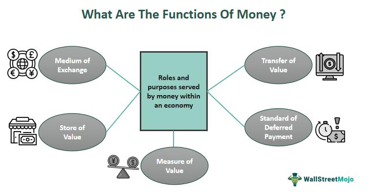

In today's interconnected landscape, where agriculture and real estate often overlap, a clear understanding of specific terminologies is essential for stakeholders. Among these, the concept of 'emblements' is pivotal in safeguarding tenant farmers' rights. Emblements are annual crops cultivated by a tenant on leased land, not owned by them. This ensures that tenant farmers retain the benefits of their labor, particularly when unforeseen circumstances lead to the end of their tenure or result in a change in land ownership.

The significance of this concept is rooted in its historical and legal implications. Originating from English common law, emblements have long provided a protective framework for tenant farmers, allowing them to harvest crops even when tenancy agreements are terminated prematurely or properties are sold. This legal protection is critical in maintaining stability for tenant farmers, ensuring they are not unfairly disadvantaged by changes that are beyond their control.



In parallel, technological advances such as algorithmic trading are increasingly influential in agricultural investment spheres. Algorithmic trading uses automated, pre-programmed instructions to execute trades efficiently and is becoming integral to optimizing agricultural investments. By applying these technologies, stakeholders can better capitalize on agricultural market trends, enhancing decision-making processes and boosting investment returns.

Understanding emblements, their origins, and their legal implications, alongside technological advancements like algorithmic trading, is critical for both tenant farmers and real estate professionals. As they navigate agricultural and property law complexities, these insights enable more informed decisions, promoting both economic security and investment profitability.

## Table of Contents

## Understanding Agricultural Rights: Emblements

Emblements, a term rooted in agricultural law, represent annual crops cultivated by a tenant on a landowner's property. These crops, once planted and nurtured by the tenant, are regarded as the personal property of the tenant, thereby safeguarding the farmer's hard work and investment in the event of an unexpected termination of their lease or a change in property ownership. This protection allows tenant farmers to harvest the crops they have sown, securing a return on their agricultural labor regardless of their tenure situation.

The concept of emblements has its origins in English common law, where it was established to provide a legal framework for tenant farmers, ensuring their right to reap what they have sown. Historically, emblements addressed the vulnerability of tenant farmers who might suddenly lose their right to cultivate land due to an abrupt lease termination or the sale of the land they were farming. The legal recognition of emblements as personal property—distinct from real property—ensures that these crops are shielded from claims by new landowners or competing interests.

English common law has played a significant role in shaping the legal mechanisms that govern emblements. The principle is based on the idea that since cultivation involves both the labor and investment of the tenant farmer, they should, therefore, retain rights to the harvest. This principle highlights the equitable treatment of tenant farmers by ensuring their labor does not go unrewarded due to factors beyond their control. 

As societies and legal systems evolved, this historical context laid the groundwork for modern interpretations and applications of emblements in contemporary agricultural and real estate practices. The continuity of protecting the rights of tenant farmers is vital in maintaining a fair and balanced economic and legal environment for agricultural operations.

In practice, emblements also influence current lease agreements and real estate transactions. They ensure that tenant farmers remain confident that their efforts and contributions to the land are acknowledged and protected, reducing the risk of financial loss due to legal ambiguities or disputes over crop ownership. Consequently, understanding emblements is paramount for tenant farmers and landowners to navigate the legal frameworks that secure their agricultural interests efficiently.

## Legal Framework and Implications of Emblements

The concept of emblements plays a significant role in agricultural law, particularly in defining the rights of tenant farmers. Emblements, which refer to annual crops grown by a tenant, are classified as personal property rather than real property. This classification has essential legal implications, especially when considering the rights of tenants and responsibilities of landowners in various scenarios.

One key legal consideration is the potential transfer of rights to emblements to the tenant's heirs if the tenant dies before the crops are harvested. In such circumstances, the law protects the interests of the deceased tenant's heirs, allowing them the opportunity to harvest and benefit from the crops, which are considered the tenant's personal property. This provision ensures continuity despite unforeseen personal circumstances affecting the tenant.

Another critical aspect of the legal framework around emblements is the obligation of landowners to allow tenants to harvest their crops, even if the tenancy has ended or the property changes ownership. This legal protection ensures that tenant farmers can complete the agricultural cycle they started, securing their labor's fruits. This is particularly relevant in cases where the land has been sold or the lease agreement is terminated. The doctrine of emblements gives tenant farmers the legal right to re-enter the land for harvesting purposes, a provision that mitigates potential conflicts between landowners and tenants.

In lease agreements and real estate transactions, considerations regarding emblements are typically addressed to ensure both tenant and landowner interests are protected. Lease agreements often include specific clauses detailing the tenant's rights to harvest crops if the lease is unexpectedly terminated. Such clauses help to prevent disputes and provide clarity on what is expected from both parties in these situations. Additionally, real estate transactions involving agricultural land may include stipulations about the transfer and harvesting of crops to prevent any legal disputes which might arise due to the change of land ownership.

Overall, the legal framework surrounding emblements serves to balance the interests of tenant farmers and landowners, providing a structured approach to resolving potential disputes around agricultural property and crop harvests. This framework emphasizes the importance of clearly defined rights and obligations in lease agreements and property transactions, ensuring that tenant farmers can reap the benefits of their labor and that landowners are informed of their responsibilities regarding tenant crops.

## The Role of Algorithmic Trading in Agricultural Investment

Algorithmic trading, using automated and pre-programmed trading instructions, has transformed the financial sector by providing tools for more precise and efficient investment execution. This technique can be particularly beneficial for agricultural investments, where market trends and volatilities greatly influence the returns on commodities like wheat and corn. Algorithmic trading helps optimize entries and exits in these markets, reducing the risk associated with manual trading methods and improving decision-making processes.

One primary advantage of [algorithmic trading](/wiki/algorithmic-trading) in agriculture is the ability to handle large datasets and identify patterns that may be invisible to human traders. Algorithms can analyze historical price data, weather patterns, and global economic indicators to forecast future movements in agricultural commodity prices. For instance, [machine learning](/wiki/machine-learning) models can be trained with historical data to predict the price trajectory of corn based on seasonal trends and current supply chain conditions.

To leverage algorithmic trading in agricultural markets efficiently, investors can utilize a variety of strategies. Trend-following, mean reversion, and [arbitrage](/wiki/arbitrage) are common strategies employed within algorithmic trading that can be adapted to agricultural commodities.

1. **Trend-following strategies** operate under the assumption that prices that have been moving in a certain direction will continue to do so. This can be particularly useful in agriculture, where trends are often influenced by predictable seasonal cycles.

2. **Mean reversion strategies** assume that prices will revert to a long-term mean or average over time. Given the cyclical nature of agricultural production and consumption, these strategies can help investors capitalize on short-term deviations from average pricing trends.

3. **Arbitrage strategies** seek to exploit price discrepancies between different markets or time frames. With algorithmic trading, these strategies can be executed within milliseconds, capturing small price differentials that are otherwise impractical to exploit manually.

Algorithmic systems can also perform [backtesting](/wiki/backtesting) to validate strategies before their application, minimizing risk. Here's a simple example of how a mean-reversion algorithm might be coded in Python, using basic libraries such as `pandas` and `numpy`:

```python
import pandas as pd
import numpy as np

# Load historical price data for a commodity, e.g., corn
data = pd.read_csv('corn_prices.csv')

# Calculate the moving average
data['moving_average'] = data['price'].rolling(window=30).mean()

# Implement a mean-reversion strategy
def mean_reversion_strategy(prices, moving_average, threshold=0.02):
    signals = []

    for p, ma in zip(prices, moving_average):
        if (p - ma) / ma > threshold:
            signals.append('sell')
        elif (ma - p) / ma > threshold:
            signals.append('buy')
        else:
            signals.append('hold')

    return signals

data['signals'] = mean_reversion_strategy(data['price'], data['moving_average'])

print(data.tail())
```

The code above calculates a 30-day moving average of corn prices and generates trading signals based on a 2% mean deviation threshold. This simplistic model shows how algorithmic strategies can be structured.

Incorporating such advanced technological tools into agricultural investments can significantly enhance portfolio management. By decreasing reliance on manual analysis and human intuition, investors and farmers can improve their chances of securing profitable outcomes. As technology continues to advance, algorithmic trading is poised to play an even more crucial role in agricultural markets, offering precision and efficiency in navigating the complexities of commodity trading.

## Case Studies: Navigating Emblements in Real Estate

### Case Studies: Navigating Emblements in Real Estate

Examining real-world legal cases can provide valuable insights into how emblements are handled within the spheres of tenant and landowner disputes. These case studies illustrate the practical applications of emblement rights and underscore the complexities involved in resolving conflicts related to agricultural rights and real estate transactions.

One notable case involved a tenant farmer who cultivated corn on leased land. The lease unexpectedly terminated due to the sale of the property. The tenant, relying on the doctrine of emblements, claimed the right to harvest the corn planted before the termination. The court upheld this claim, affirming that the annual crops were personal property of the tenant and should not be denied due to the change in land ownership. This case highlights the importance of understanding lease terms and the conditions under which emblements are recognized as personal property, ensuring tenant farmers can benefit from their labor despite unforeseen lease discontinuations.

In another case, a conflict arose when a landowner attempted to evict a tenant farmer before the harvest of a wheat crop. The court emphasized the tenant's right to the emblements, asserting that removing the tenant without provision to harvest the crop would unjustly deprive the farmer of the fruits of their labor. This situation underscores the necessity for landowners to acknowledge the agricultural investments made by tenants and ensure that eviction processes do not infringe on the rights to emblements.

Furthermore, the case of a deceased tenant farmer brought additional considerations to light. The tenant had planted soybeans, and after their passing, the question arose about who held the right to harvest. The court ruled that the tenant's heirs were entitled to the emblements, acknowledging that the original tenant's rights to the crops could be transferred to their successors. This decision underscores the protection offered to tenants and their families under the concept of emblements, ensuring continuity in agricultural practices.

These case studies collectively illuminate best practices for tenant farmers and landowners. For tenant farmers, understanding their legal rights and embedding clauses related to emblements in lease agreements is crucial. It is advised to explicitly state the tenant's right to harvest annual crops if the lease is terminated unexpectedly. Landowners should respect these provisions and avoid actions that could infringe on tenants' entitlements to emblements, thereby reducing the likelihood of legal disputes.

In conclusion, while the concept of emblements may seem straightforward, its application can be complex. Both tenant farmers and landowners must navigate this legal landscape carefully to safeguard their interests and maintain productive relationships. The examined cases provide a framework for understanding potential disputes and resolutions, encouraging proactive measures in lease and real estate negotiations to prevent conflicts and uphold agricultural rights.

## Conclusion: The Future of Emblements and Agricultural Investments

As agricultural practices advance, the paradigms governing them are undergoing significant transformation. Emblements, as a vital component of agricultural property law, must adapt to these changes. Technological advancements, particularly in the fields of data analytics and algorithmic trading, are likely to play an increasingly prominent role. These innovations promise to refine how tenant farmers and landowners understand and interact with their crops, protecting interests and enhancing returns.

Algorithmic trading introduces a quantitative approach to agricultural investments, enabling stakeholders to respond to market fluctuations with precision and speed. This has the potential to optimize decision-making processes, reduce trading costs, and mitigate risks associated with market [volatility](/wiki/volatility-trading-strategies). As technology becomes more integrated into agriculture, tenant farmers and investors alike will benefit from tools that can predict market trends, analyze weather patterns, and optimize yield projections, thereby maximizing profitability.

Yet, as we embrace these technological advances, it's crucial to remain cognizant of the legal structures that underpin agricultural investments. The evolving legal landscape surrounding emblements necessitates up-to-date knowledge of tenant rights and land ownership laws to ensure fair compensation and protection against abrupt changes in tenure. Such awareness will allow farmers and landowners to navigate the complexities of property law more effectively.

In summary, the future of emblements and agricultural investments lies at the intersection of technology, law, and traditional agricultural practices. Remaining informed about emerging legal developments and technological tools is not just beneficial; it's essential. By doing so, tenant farmers, landowners, and investors can safeguard their rights, optimize investment strategies, and thrive in an ever-evolving agricultural environment.

## References & Further Reading

[1]: White, J. (1977). ["Tenants' Rights to Emblements."](https://www.the-exclusive-estate.com/blog/emblements-real-estate-understanding-the-rights-and-implications-for-tenants-and-landlords) Villanova Law Review, 22(1), Article 7.

[2]: Simpson, A. W. B. (1986). ["A History of the Land Law."](https://archive.org/details/historyoflandlaw0000simp) Oxford: Clarendon Press.

[3]: de Prado, M. L. (2018). ["Advances in Financial Machine Learning."](https://www.amazon.com/Advances-Financial-Machine-Learning-Marcos/dp/1119482089) Wiley.

[4]: Chan, E. P. (2009). ["Quantitative Trading: How to Build Your Own Algorithmic Trading Business."](https://github.com/egorpe/EPChan-QuantitativeTrading/blob/master/example7_6.m) Wiley.

[5]: Jansen, S. (2018). ["Machine Learning for Algorithmic Trading."](https://github.com/stefan-jansen/machine-learning-for-trading) Packt Publishing.