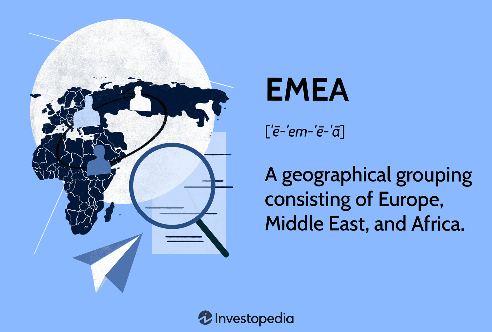

The EMEA region, encompassing Europe, the Middle East, and Africa, is increasingly recognized as a vital component of global business strategies. The diversity and dynamic nature of EMEA's markets present a wealth of opportunities for international businesses aiming to expand their reach and tap into emerging markets. As one of the most economically diverse regions in the world, EMEA offers access to established financial hubs, rapidly growing economies, and a rich mosaic of cultures and business environments.

The economic significance of EMEA stems from its unique geographical position, bridging the major business centers of Asia and the Americas. This strategic location has historically been a crossroads of trade and commerce, contributing to the region's economic vitality. With over a hundred countries included under its umbrella, EMEA hosts both mature economies like Germany and the United Kingdom and growing markets such as Nigeria and Saudi Arabia. Such a mix provides ample opportunities for growth, competitive advantages, and innovation.



In recent years, EMEA's role in financial markets, particularly algorithmic trading, has gained considerable attention. The region's developed financial centers, such as London and Frankfurt, host some of the world's largest stock exchanges, offering advanced infrastructure and a pool of financial expertise. Algorithmic trading, which utilizes complex mathematical models and systems to execute trades at speeds and volumes beyond human capability, thrives in such environments due to enhanced market efficiency and liquidity.

Understanding the EMEA region's intricate landscape and diverse opportunities is essential for businesses aiming to establish or expand their operations. Companies must recognize the differences in consumer behavior, regulatory environments, and economic conditions across the various countries within EMEA to craft localized strategies effectively. This article will provide a comprehensive overview of EMEA, detailing its definition, its relevance to corporate activities, and the considerable influence it exerts on global financial markets.

## Table of Contents

## Definition of EMEA

EMEA stands for Europe, Middle East, and Africa, serving as a key geographical classification for corporations. This designation is primarily utilized to streamline business operations by segmenting global activities. The term EMEA is employed to differentiate business strategies and practices from those in the Americas and Asia, two other significant commercial and economic regions.

The boundaries of EMEA are not strictly defined and may vary depending on the organization's specific goals and operations. While it universally includes the continents of Europe and Africa and the geopolitical region of the Middle East, the precise makeup of countries within EMEA can differ. This flexibility allows businesses to adopt a tailored approach depending on their industry, logistical needs, and strategic priorities.

In practice, EMEA facilitates targeted marketing, sales, and operational strategies by identifying critical regions that share common time zones, regulatory environments, and market characteristics. This segmentation is particularly useful for multinational companies seeking efficient resource allocation across distinct geographic territories. By grouping Europe, the Middle East, and Africa into a single region, companies can optimize decision-making processes, catering to local market specifics while maintaining global cohesion in operations.

## Countries Included in EMEA

EMEA includes all nations within Europe, the Middle East, and Africa, making it a vast and diverse region for business activities. The countries encompassed by EMEA range from the advanced economies of Western Europe to the developing nations in Africa, thereby representing a wide spectrum of economic stages and market potentials. The inclusion of countries in EMEA is often flexible and may vary depending on how a corporation defines its operational regions. This flexibility allows businesses to strategically tailor their market approach based on the characteristics and requirements of specific countries within the EMEA region.

The subdivision of EMEA into smaller regions is common practice to facilitate more focused business strategies. Some of the commonly recognized subregions include SEEMEA, CEMEA, and MENA. SEEMEA (South Eastern Europe, Middle East, and Africa) focuses on countries in the southeastern part of Europe, alongside the Middle Eastern and African countries. CEMEA (Central and Eastern Europe, Middle East, and Africa) emphasizes Central and Eastern European nations along with the Middle East and African regions. MENA, which stands for the Middle East and North Africa, is a particularly critical subregion due to its geopolitical and economic significance.

Understanding the countries involved in the EMEA region allows businesses to craft targeted strategies that exploit regional strengths and navigate regional challenges. For example, within Europe, business strategies might focus on innovation and technology hubs, while in Africa, the emphasis might be on accessing burgeoning markets and managing logistical considerations. In the Middle East, firms often seek to engage with rapidly developing economies and leverage financial centers such as Dubai.

This geographical delineation is crucial for businesses engaging in international strategy development. By recognizing the countries within EMEA that align with their business goals, companies can optimize their operations and expand effectively in a highly competitive and diverse global landscape.

## Business Importance of EMEA

The EMEA region, encompassing Europe, the Middle East, and Africa, represents a pivotal component in global business strategy due to its vast market expansion opportunities, diverse economies, and cultural diversity. This area's significance is amplified by its inclusion of some of the world's largest economies, such as Germany, the United Kingdom, and France, alongside rapidly growing emerging markets like Nigeria, Saudi Arabia, and Turkey. These countries offer substantial growth potential, making the EMEA a critical focus for businesses seeking international expansion.

Within EMEA, the economic landscape is defined by a wide range of development stages and market conditions. Established economies in Western Europe present sophisticated infrastructure, substantial consumer markets, and stable regulatory environments that are attractive to multinational corporations. Concurrently, emerging economies provide opportunities for high returns due to increasing consumer demand, urbanization, and industrialization. This duality necessitates a comprehensive understanding of varied economic environments and strategic adaptability to capitalize on available opportunities.

The region's cultural richness is another [factor](/wiki/factor-investing) contributing to its importance. With over a hundred languages spoken and a myriad of cultural traditions and practices, businesses must possess cultural sensitivity and awareness to effectively engage and build relationships within EMEA. This cultural diversity can influence consumer preferences, marketing strategies, and even product design, all of which are crucial for establishing a successful presence in the region.

Furthermore, navigating EMEA involves understanding and aligning with its diverse regulatory landscapes. Each country operates under its legal and economic systems, including variations in trade regulations, labor laws, and taxation policies, which require businesses to tailor strategies to individual national contexts. For instance, regulatory requirements in the European Union may differ significantly from those in the Middle East or Africa, necessitating bespoke compliance strategies.

Economic disparities across EMEA also pose unique challenges and opportunities. Some areas possess a wealth of natural resources, while others boast technological advancements. Strategic planning and investment decisions should consider these local strengths and weaknesses to achieve optimal market penetration and growth.

Overall, EMEA's strategic importance is undeniable, attributed to its vast and varied market potential. Businesses that understand and adapt to the region's complexities, from economic conditions to cultural landscapes and regulatory frameworks, are positioned to unlock its full potential for growth and innovation.

## Algorithmic Trading in the EMEA Region

Algorithmic trading in the EMEA region is a critical component of financial markets, driven by diverse economic settings and robust financial centers. This region encompasses vastly different markets, each with its own set of regulations and economic climates. Such variety enhances the richness of data and trading strategies that professionals can develop and deploy.

In [algorithmic trading](/wiki/algorithmic-trading), adaptability to evolving and diverse regulations is a cornerstone of success. Each country within EMEA may impose distinct regulatory requirements, ensuring adherence to local laws is paramount. This necessitates sophisticated algorithms capable of adjusting to these various regulatory landscapes while maintaining efficiency in trade execution. For instance, MiFID II, a regulatory framework in Europe, imposes stringent obligations on algorithmic trading and market transparency, requiring traders to adapt their algorithms accordingly.

The economic conditions across the EMEA region contribute to its attractiveness for algorithmic trading. The region hosts mature financial markets as well as emerging ones, offering a wide array of opportunities for [arbitrage](/wiki/arbitrage), algorithm testing, and deployment. This heterogeneity enables traders to leverage different market inefficiencies and enhance their trading models with rich and varied data inputs.

Major financial hubs such as London and Frankfurt play pivotal roles in the EMEA's algorithmic trading ecosystem. London, with its status as a global financial center, offers unparalleled access to international markets, sophisticated financial instruments, and cutting-edge trading technologies. Similarly, Frankfurt, as the financial heart of Germany, provides a gateway to the European financial markets, hosting several high-frequency trading firms and financial institutions that utilize algorithmic trading for competitive advantage. Both cities support a comprehensive infrastructure for trading, including high-speed data lines, co-location services, and proximity to major financial exchanges, all of which are crucial for reducing latency and enhancing the precision of algorithmic trades.

The combination of diverse economic environments, rigorous regulatory frameworks, and prominent financial hubs makes the EMEA region a fertile ground for algorithmic trading. As algorithms continue to evolve, leveraging these varied conditions will be essential for traders seeking to maximize profitability and maintain compliance in an ever-changing financial landscape.

## Operational and Economic Challenges

The EMEA region presents a myriad of operational and economic challenges that businesses need to navigate with caution and strategic foresight. Political instability is one of the primary concerns that can significantly impact business operations and investments. Several countries within the Middle East and Africa have faced political unrest and upheaval, which can create uncertain business environments. Companies operating in these regions must be prepared for potential disruptions in supply chains, changes in regulatory landscapes, and potential risks to personnel safety.

Economic disparities across the EMEA region necessitate tailored business strategies. The economic conditions vary greatly between countries; for instance, Western European nations may have stable and mature markets, whereas some African nations may present high growth potential but with greater economic [volatility](/wiki/volatility-trading-strategies). Businesses must adjust their objectives and strategies based on local economic indicators, consumer behavior, and market needs.

Cultural sensitivity and adaptation are pivotal components in successfully managing business operations across EMEA. The region's cultural diversity includes a vast array of languages, customs, and business etiquettes. Businesses need to engage with local customs and traditions to build strong relationships with local stakeholders. This sensitivity not only aids in smoother operations but also enhances brand reputation and consumer trust in the local markets.

For example, companies might use Python to model economic scenarios tailored to specific countries within EMEA. An example script could look like this:

```python
import numpy as np

# Define economic indicators for two hypothetical countries
country_A_growth = 2.5  # GDP growth rate in percentage
country_B_growth = 5.0
market_volatility_A = 1.2  # Volatility coefficient
market_volatility_B = 2.8

# Simulate market growth scenarios using numpy
np.random.seed(42) # Ensuring reproducibility

scenarios_A = np.random.normal(country_A_growth, market_volatility_A, 1000)
scenarios_B = np.random.normal(country_B_growth, market_volatility_B, 1000)

# Calculating average outcomes and printing
average_growth_A = np.mean(scenarios_A)
average_growth_B = np.mean(scenarios_B)

print(f"Average projected growth for Country A: {average_growth_A:.2f}%")
print(f"Average projected growth for Country B: {average_growth_B:.2f}%")
```

This type of scenario analysis can aid businesses in making informed decisions regarding investment strategies and market entry plans. Consequently, overcoming these operational and economic challenges requires businesses to adopt a nuanced and adaptable approach to ensure sustainable success within the EMEA region.

## Conclusion

The EMEA region, encompassing Europe, the Middle East, and Africa, holds a prominent position in global business strategies through its strategic location and rich market potential. As a crossroads of diverse cultures and economies, EMEA serves as a vital hub for international trade and commerce. This area's vast geographical expanse and population diversity present enormous opportunities for businesses seeking to expand their reach and capitalize on emerging markets. Large economies like Germany and the United Kingdom, alongside rapidly growing markets in Africa and the Middle East, make EMEA a critical target for global businesses.

Despite these opportunities, the EMEA region presents various challenges. Political instability and economic disparities across different countries can pose operational challenges and require businesses to use innovative strategies tailored to each unique market. Moreover, navigating varied regulatory landscapes demands a nuanced understanding and approach. Nonetheless, the rise of algorithmic trading in the region highlights the potential for technology-driven growth. Major financial centers such as London and Frankfurt facilitate sophisticated trading systems, allowing for more efficient and profitable financial activities.

To harness EMEA's full potential, businesses must develop a comprehensive understanding of its complexities. This includes appreciating the diversity in culture, politics, and economy throughout the region. Implementing strategies that integrate local insights and adapting to specific market conditions are essential for success. By leveraging innovative technologies and employing strategic foresight, businesses can transform EMEA's challenges into opportunities, ensuring long-term growth and competitiveness in the global market.

## References & Further Reading

[1]: López de Prado, M. (2018). ["Advances in Financial Machine Learning."](https://books.google.com/books/about/Advances_in_Financial_Machine_Learning.html?id=oU9KDwAAQBAJ) Wiley.

[2]: Aronson, D. R. (2006). ["Evidence-Based Technical Analysis: Applying the Scientific Method and Statistical Inference to Trading Signals."](https://www.amazon.com/Evidence-Based-Technical-Analysis-Scientific-Statistical/dp/0470008741) Wiley.

[3]: Jansen, S. (2020). ["Machine Learning for Algorithmic Trading."](https://github.com/stefan-jansen/machine-learning-for-trading) Packt Publishing.

[4]: Chan, E. P. (2009). ["Quantitative Trading: How to Build Your Own Algorithmic Trading Business."](https://github.com/ftvision/quant_trading_echan_book) Wiley.

[5]: Eschweiler, M., & Zocholl, M. (2021). ["Algorithmic Trading and DMA: An Introduction to Direct Access Trading Strategies."](https://www.amazon.com/Algorithmic-Trading-DMA-introduction-strategies/dp/0956399207) Harriman House.