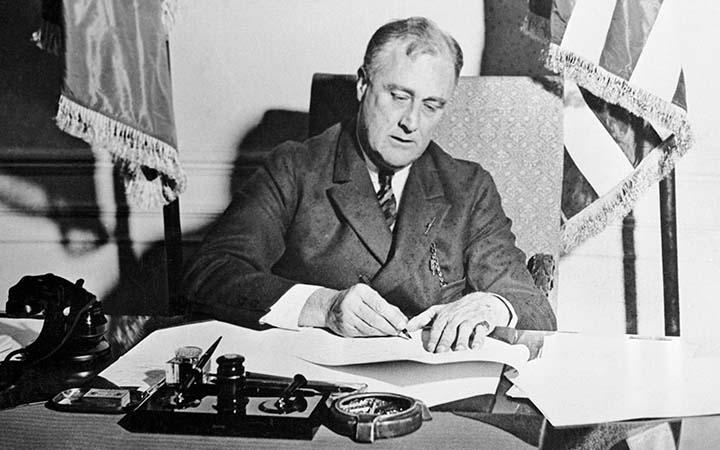

## Table of Contents

## What was the Emergency Banking Act of 1933?

The Emergency Banking Act of 1933 was a law passed by the United States Congress during the Great Depression. It was signed into law by President Franklin D. Roosevelt on March 9, 1933. The main goal of this act was to help stabilize the banking system, which was in crisis because many banks had failed and people were afraid to keep their money in banks.

The act allowed the government to take control of banks that were in trouble. It also gave the government the power to reopen banks that were financially sound. This helped restore public confidence in the banking system. By reassuring people that their money was safe, more people started to deposit their money in banks again, which helped the economy recover.

## Why was the Emergency Banking Act necessary in 1933?

The Emergency Banking Act was necessary in 1933 because the United States was in the middle of the Great Depression. Many banks had failed, and people were scared to keep their money in banks. They were taking their money out, which made the situation worse. This was called a bank run. When too many people take their money out at the same time, banks can run out of money and fail.

To stop this from happening, the government needed to do something quickly. The Emergency Banking Act helped by letting the government take control of banks that were in trouble. It also allowed the government to check which banks were safe and could reopen. This made people feel better about putting their money back into banks. By restoring trust in the banking system, the act helped to stabilize the economy during a very tough time.

## What were the main provisions of the Emergency Banking Act?

The Emergency Banking Act had several important parts that helped fix the banking problems during the Great Depression. One main part was that it let the government take over banks that were in trouble. This was important because it stopped more banks from failing right away. The government could then decide which banks were strong enough to open again. This helped make sure that only safe banks were open, which made people feel better about putting their money in them.

Another key part of the act was that it allowed the government to give banks emergency loans. This money helped banks stay open and keep working. By doing this, the act helped stop the panic that was making people take their money out of banks. It also made it easier for the government to check the financial health of banks. This way, they could make sure that the banks that were open were safe and could be trusted with people's money.

## How did the Emergency Banking Act aim to restore public confidence in banks?

The Emergency Banking Act aimed to restore public confidence in banks by allowing the government to take over banks that were in trouble. This was important because it stopped more banks from failing quickly. When the government took control, it could check which banks were strong enough to open again. By only letting safe banks open, people started to trust banks more. They felt that their money would be safe if the government was making sure the banks were okay.

Another way the act helped was by giving banks emergency loans. This money helped banks stay open and keep working. When people saw that the government was helping banks, they felt better about leaving their money in them. The act also made it easier for the government to look at the financial health of banks. This way, they could make sure that the banks that were open were safe and could be trusted with people's money. By doing all these things, the Emergency Banking Act helped people feel more confident in the banking system again.

## What was the immediate impact of the Emergency Banking Act on the banking system?

The Emergency Banking Act had a quick and big effect on the banking system. Right after it was passed, the government started checking all the banks. They closed the ones that were in trouble and let the strong ones open again. This made people feel better because they knew the government was making sure their money was safe. A lot of banks that were closed for a short time were able to open again after the government said they were okay.

Because of this, people started to trust banks more. They stopped taking their money out and started putting it back in. This helped stop the bank runs that were making things worse. The act also gave banks emergency loans, which helped them keep working. By doing all these things, the Emergency Banking Act helped the banking system get better fast and made people feel safer about their money.

## How did President Franklin D. Roosevelt use the Emergency Banking Act to address the banking crisis?

President Franklin D. Roosevelt used the Emergency Banking Act to fix the banking crisis by letting the government take control of banks that were in trouble. He signed the act into law on March 9, 1933, just days after he became president. The act allowed the government to check which banks were strong enough to open again. By doing this, Roosevelt made sure that only safe banks were open. This helped people feel better about putting their money back into banks because they knew the government was making sure their money was safe.

Roosevelt also used the act to give banks emergency loans. This money helped banks stay open and keep working. When people saw that the government was helping banks, they felt more confident about leaving their money in them. The act made it easier for the government to look at the financial health of banks. By doing all these things, Roosevelt helped stop the panic that was making people take their money out of banks. This helped the banking system get better fast and made people feel safer about their money.

## What role did the Federal Reserve play in the implementation of the Emergency Banking Act?

The Federal Reserve played a big part in making the Emergency Banking Act work. They helped the government check all the banks to see which ones were strong enough to open again. The Federal Reserve made sure that the banks that got to open were safe and could be trusted with people's money. They also helped give out the emergency loans that the act talked about. These loans helped banks stay open and keep working, which was really important during the banking crisis.

By working with the government, the Federal Reserve helped make sure that the Emergency Banking Act did what it was supposed to do. They helped stop the panic that was making people take their money out of banks. When people saw that the Federal Reserve and the government were working together to fix the problem, they started to trust banks more. This helped the banking system get better fast and made people feel safer about their money.

## How did the Emergency Banking Act contribute to the broader New Deal economic recovery efforts?

The Emergency Banking Act was a key part of President Franklin D. Roosevelt's New Deal plan to fix the economy during the Great Depression. It helped stop the banking crisis by letting the government take over banks that were in trouble. The government could then check which banks were strong enough to open again. This made people feel better about putting their money back into banks because they knew their money was safe. By fixing the banking system, the Emergency Banking Act helped make the economy more stable. This was important because a stable banking system is needed for the rest of the New Deal plans to work.

The act also helped the broader New Deal efforts by giving banks emergency loans. This money helped banks stay open and keep working, which was important for the economy to start getting better. When banks were working well, businesses could borrow money and people could save money safely. This helped create jobs and get the economy moving again. The Emergency Banking Act was one of the first steps in the New Deal, and it set the stage for other programs that aimed to help people and fix the economy. By making the banking system strong, it helped make the other parts of the New Deal more successful.

## What were the long-term effects of the Emergency Banking Act on the U.S. banking system?

The Emergency Banking Act had big long-term effects on the U.S. banking system. It helped make the banking system stronger and more stable. After the act, fewer banks failed because the government could take over banks that were in trouble and make sure only safe banks stayed open. This made people trust banks more, and they started putting their money back into them. The act also made it easier for the government to check the health of banks, which helped keep the banking system strong for a long time.

Another long-term effect was that the act helped the government learn how to help banks in the future. It showed that the government could step in and fix problems in the banking system. This idea was important for later laws that kept the banking system safe. The Emergency Banking Act was part of a bigger plan to fix the economy during the Great Depression, and it helped set the stage for other programs that made the economy better. By making the banking system stronger, it helped the whole country's economy recover and grow.

## How did the Emergency Banking Act influence subsequent banking legislation?

The Emergency Banking Act showed that the government could step in to help fix problems in the banking system. This idea was important for later laws that kept banks safe. After the act, the government passed other laws to make sure banks stayed strong. One big law was the Glass-Steagall Act, which was passed later in 1933. This law split up banks that did different kinds of business, like investment and regular banking. It also created the Federal Deposit Insurance Corporation (FDIC), which protects people's money if a bank fails. These changes made people trust banks more because they knew their money was safer.

The Emergency Banking Act also helped set up rules that banks had to follow. These rules made sure banks were being careful with people's money. Over time, more laws were passed to keep the banking system strong. For example, the Banking Act of 1935 gave more power to the Federal Reserve to control banks and help the economy. By showing that the government could fix banking problems, the Emergency Banking Act helped make these later laws possible. It made the whole banking system more stable and helped the country's economy recover and grow.

## What criticisms or controversies surrounded the Emergency Banking Act?

Some people did not like the Emergency Banking Act because they thought it gave the government too much power over banks. They worried that the government could take over any bank it wanted, even if the bank was doing okay. This made some people scared that the government might control too much of the economy. They also thought that the act was rushed through Congress without enough time for people to think about it and talk about it.

Others said that the act helped big banks more than small ones. They thought that the government was more likely to help big banks get back on their feet, while small banks might be left to fail. This made some people upset because they felt that the government was not treating all banks fairly. Even with these criticisms, the Emergency Banking Act helped fix the banking crisis and made people trust banks more.

## How is the Emergency Banking Act viewed by historians and economists today?

Historians and economists today see the Emergency Banking Act as a very important law that helped fix the banking crisis during the Great Depression. They think it was a quick and smart move by President Franklin D. Roosevelt to stop banks from failing and to make people trust banks again. The act let the government take over banks that were in trouble and check which banks were safe to open. This helped stop the panic that was making people take their money out of banks. By doing this, the act made the banking system more stable and helped the economy start to get better.

Some historians and economists also talk about the criticisms of the act. They say that some people were worried about the government having too much power over banks. Others felt that the act helped big banks more than small ones. But most agree that the Emergency Banking Act was a key part of the New Deal and helped set the stage for other laws that made the banking system stronger. Overall, the act is seen as a big success because it helped fix a big problem and made the economy more stable in the long run.

## References & Further Reading

[1]: ["The Banking Act of 1933 (Glass-Steagall Act),"](https://www.federalreservehistory.org/essays/glass-steagall-act) Federal Reserve Bank of St. Louis.

[2]: Kennedy, Susan Estabrook. ["The Banking Crisis of 1933"](https://archive.org/details/bankingcrisisof10000kenn). University Press of Kentucky, 1973.

[3]: Wigmore, Barrie A. ["The Crash and Its Aftermath: A History of Securities Markets in the United States, 1929-1933"](https://archive.org/details/crashitsafterma00wigm). Greenwood Press, 1985.

[4]: ["The Great Depression: An Overview,"](https://www.loc.gov/classroom-materials/united-states-history-primary-source-timeline/great-depression-and-world-war-ii-1929-1945/overview/) Federal Reserve History.

[5]: ["Regulation of Algorithmic Trading,"](https://www.sec.gov/files/Algo_Trading_Report_2020.pdf) New York Stock Exchange MIFID II Resources. 

[6]: ["Emergency Banking Act of 1933,"](https://www.federalreservehistory.org/essays/emergency-banking-act-of-1933) Encyclopedia.com.

[7]: Flandreau, Marc, and Juan H. Flores, ["Bonds and Brands: Foundations of Sovereign Debt Markets, 1820–1830,"](https://www.jstor.org/stable/40263939) Journal of Economic History, Vol. 69, No. 3, 2009.