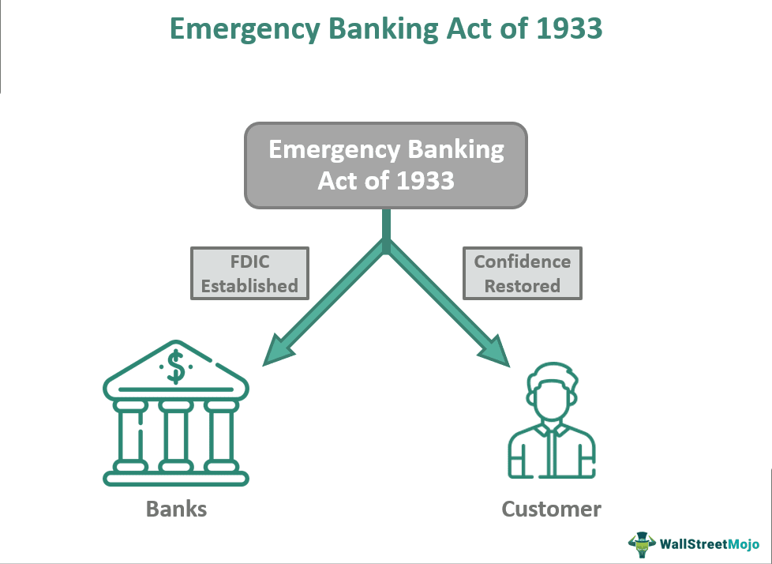

The Great Depression of the 1930s was marked by profound economic upheaval, which necessitated the formulation of innovative strategies to stabilize the U.S. economy. Among the pivotal responses to this crisis was the Emergency Banking Act of 1933. This legislative measure was instrumental in restoring public confidence in the financial system after the stock market crash of 1929, which had precipitated a series of bank failures and exacerbated economic instability.

Understanding the historical circumstances that led to the enactment of the Emergency Banking Act is crucial to appreciating its significance. By early 1933, the situation had become dire, with rampant bank runs and widespread closures threatening the very fabric of the American economy. In this context, the Emergency Banking Act emerged as a key legislative intervention designed to halt the crisis and pave the way for recovery.



The provisions of the Act involved several critical strategies such as authorizing federal inspections of banks, providing support for solvent institutions, and temporarily suspending banking operations to assess their viability. These measures were essential in regaining the public's trust and stabilizing the banking sector.

Furthermore, examining the lasting impacts of the Emergency Banking Act can yield insights into current financial reforms, particularly as we compare the challenges of the 1930s to today's digital banking and algorithmic trading environments. As financial systems continue to evolve, the lessons drawn from past reforms serve as valuable guidance for shaping effective modern policies designed to prevent economic disruptions and maintain systemic stability.

## Table of Contents

## The Great Depression and the Need for Reform

The stock market crash of 1929 marked the beginning of the Great Depression, a period of profound economic distress characterized by a succession of bank failures and a sharp decline in consumer confidence. The precipitous drop in stock prices on October 29, known as Black Tuesday, led to a loss of approximately $14 billion in market value in a single day. This downturn ushered in a widespread sense of financial insecurity, causing both individual and institutional investors to question the stability of the banking system.

As the crisis unfolded, a chain reaction of bank runs ensued. Depositors, anxious to secure their holdings, rushed to withdraw funds, resulting in a [liquidity](/wiki/liquidity-risk-premium) crisis for many banks. The lack of available currency to meet withdrawal demands forced numerous banks to close their doors, either temporarily or permanently. By the end of 1932, it is estimated that nearly 5,000 banks had failed, wiping out deposits and exacerbating the economic downturn. The ensuing bank failures further eroded trust in financial institutions, leading to a vicious cycle of economic contraction.

By early 1933, the banking crisis had reached a critical point. Public confidence in the financial system had eroded so significantly that widespread panic threatened the very stability of the U.S. economy. As banks continued to fail at alarming rates, the need for decisive legislative action became evident. The government recognized the urgency to restore public confidence and stabilize the banking sector, setting the stage for a series of sweeping financial reforms aimed at revitalizing the economy and preventing future crises.

Legislative measures were urgently required to address these challenges and reassure the public of the banking system's integrity. The complexity of the situation demanded a multifaceted approach, encompassing enhanced regulatory oversight, increased governmental intervention, and specific protections for depositors. This climate of urgency and necessity provided the impetus for the enactment of significant reforms, beginning with the Emergency Banking Act of 1933.

## Key Provisions of the Emergency Banking Act

Signed into law by President Franklin D. Roosevelt on March 9, 1933, the Emergency Banking Act was a critical legislative response to the banking crisis during the Great Depression. The Act's primary goal was to restore confidence in the nation's banking system and to stabilize the financial sector. One of its immediate actions was the authorization to temporarily close all banks for a "bank holiday," lasting four days. This suspension of banking activities allowed for a thorough evaluation of banks' financial health. 

During this period of closure, the government conducted inspections to determine which banks were financially sound and viable to reopen. This inspection process aimed to distinguish between solvent banks and those at risk of failure, ensuring that only stable institutions resumed operations. The provisions of the Act granted the President expanded authority during the financial crisis, allowing for swift and decisive action in managing the banking sector's instability.

Another significant aspect of the Emergency Banking Act was the provision of federal support for viable banks. This assistance was crucial in rebuilding public confidence, as government backing signaled stability and security to depositors. Furthermore, the Act laid the groundwork for the establishment of the Federal Deposit Insurance Corporation (FDIC), although the FDIC itself was created later in 1933 under the Banking Act. The FDIC was designed to insure deposits, protecting individual and business bank accounts from losses due to bank failures, which further contributed to restoring public trust in the financial system.

By addressing immediate banking issues and introducing measures for long-term stability, the Emergency Banking Act played a significant role in reviving the U.S. economy during one of its most challenging periods.

## Impact of the Emergency Banking Act

The impact of the Emergency Banking Act of 1933 was profound and immediate. As banks began to reopen following the temporary closure mandated by the Act, public confidence surged remarkably. Citizens, who had previously withdrawn their savings en masse due to fears of banking insolvency, began to redeposit their funds. This redepositing of money was a clear signal of the restored confidence in the banking system, shedding light on the essential role that trust plays in financial stability.

In addition to the public's positive response, the stock market demonstrated significant signs of recovery. Following the reopening of the banks, there was a marked rise in stock prices. This upward trajectory can be partly attributed to renewed investor confidence and the belief that the federal government had taken necessary steps to stabilize the economy. The psychological boost provided by the perception of government intervention and oversight cannot be overstated, as it reassured both the general public and the investor community that financial uncertainty was being addressed.

The long-term impacts of the Emergency Banking Act extended beyond immediate financial stabilization. One of its most significant outcomes was the increased governmental authority over monetary matters. This shift laid the foundation for more extensive regulatory measures and oversight, which would later include the establishment of the Federal Deposit Insurance Corporation (FDIC). The FDIC's creation, although not directly part of the Emergency Banking Act, was a subsequent reform inspired by the same ethos of safeguarding public funds and restoring trust in financial institutions.

Furthermore, the era marked a pivotal transition from the gold standard, albeit not immediately caused by the Emergency Banking Act itself. The gradual removal of the gold standard was a reflection of the broader monetary reforms of the period, aimed at providing the government with greater flexibility in managing the economy. By decoupling the dollar from gold, the United States had more leeway in addressing economic fluctuations without being constrained by gold reserves.

Overall, the Emergency Banking Act was not only a response to a specific crisis but also a catalyst for enduring change in the financial regulatory landscape. Its impact resonates even today, with the modern banking system continuing to rely on the principles of confidence and governmental oversight established during that critical period.

## Other Significant Financial Reforms of 1933

In the wake of the Emergency Banking Act, the United States implemented several other significant financial reforms in 1933 to strengthen the stability of its financial system. Among these was the Glass-Steagall Act, officially known as the Banking Act of 1933. This legislation was instrumental in transforming the banking landscape by mandating the separation of commercial and investment banking activities. The primary motivation behind this separation was to curtail the risks associated with combining these two types of banking operations. The enactment of the Glass-Steagall Act was a response to the excessive speculation and risk-taking that characterized the pre-Depression era, which had resulted in catastrophic bank failures.

The Glass-Steagall Act established four core provisions that aimed to safeguard the banking sector. Firstly, it prohibited commercial banks from engaging in the business of securities underwriting and brokeraging. Secondly, it forbade securities firms from taking deposits. The underlying idea was to prevent the conflicts of interest and risky speculation that had contributed to the financial meltdown. By segregating these activities, the Act aimed to create a more stable banking environment where commercial banks focused on traditional banking services like accepting deposits and providing loans, while investment banks dealt with more speculative activities like underwriting and trading securities.

Another pivotal reform in 1933 was the creation of the Federal Deposit Insurance Corporation (FDIC) under the Banking Act. This initiative was aimed at restoring public confidence in the banking system by insuring deposits. Initially, the FDIC insured deposits up to $2,500, which provided a safety net for depositors and helped deter bank runs, contributing to greater economic stability. 

These reforms significantly reshaped the American financial landscape and laid the groundwork for decades of regulatory practices designed to minimize systemic risk within the banking industry. Although the Glass-Steagall Act's separation between commercial and investment banking was later repealed in 1999 by the Gramm-Leach-Bliley Act, its introduction in 1933 marked a critical effort to mitigate the risks linked with speculative banking activities.

## Modern Parallels: Digital Solutions and Algo Trading

Today's financial markets are characterized by rapid technological advancements, with digital solutions and [algorithmic trading](/wiki/algorithmic-trading) fundamentally transforming traditional trading activities. Algorithmic trading, or algo trading, involves the use of computer algorithms to execute trading orders at speeds and frequencies that are unmanageable for human traders. This segment accounts for a substantial portion of total trading [volume](/wiki/volume-trading-strategy) on major exchanges, such as the New York Stock Exchange and NASDAQ. 

Algo trading is designed to maximize efficiency and profitability by implementing automated decision-making processes with minimal human interference. These processes often utilize advanced mathematical models and statistical analysis to determine the most favorable times to buy or sell securities. An example of a simple algorithm might be a moving average crossover strategy, where a short-term moving average crossing above a long-term moving average signals a buy signal:

```python
import numpy as np

def moving_average(data, window_size):
    return np.convolve(data, np.ones(window_size) / window_size, mode='valid')

def trading_strategy(prices, short_window, long_window):
    short_ma = moving_average(prices, short_window)
    long_ma = moving_average(prices, long_window)
    signals = np.where(short_ma > long_ma, 1, 0)  # 1 indicates a buy signal
    return signals
```

Much like the 1933 legislative reforms that restored confidence in a floundering financial system, modern regulations strive to ensure that the rapid executions and decision-making inherent in algo trading do not introduce unintended systemic risks. The emphasis is on preserving market integrity and protecting investors. For instance, the introduction of circuit breakers and the requirement for pre-trade risk assessments help mitigate flash crashes, which are precipitous and intense drops in security prices largely driven by algorithmic orders.

In recent years, regulatory bodies such as the U.S. Securities and Exchange Commission (SEC) and the European Securities and Markets Authority (ESMA) have intensified efforts to regulate algorithmic trading to safeguard against market abuse and systemic disruptions. Regulations like the Markets in Financial Instruments Directive II (MiFID II) in Europe require rigorous testing and authorization of trading algorithms before deployment. These measures are vital to maintaining orderly and fair markets.

By drawing parallels between the successful stabilization efforts of the past and the evolving regulatory frameworks of today, we recognize the necessity of adapting to a rapidly changing financial landscape. Effective oversight in the digital age is imperative to curtail risks akin to those that sparked the great financial crises of previous eras, ensuring stability and confidence in our modern financial systems.

## Conclusion

The Emergency Banking Act of 1933 was a crucial legislative measure in restoring stability and confidence during the Great Depression era. By addressing the immediate threats posed by widespread bank failures, the Act helped to re-establish public trust in the U.S. banking system. Its influence extends beyond its immediate aftermath, as it set the stage for federal oversight and regulatory frameworks that continue to shape modern financial systems.

The Act's introduction of mechanisms for federal control and support of banks laid the groundwork for future regulations. This includes the establishment of the Federal Deposit Insurance Corporation (FDIC), which insures deposits to maintain public trust in the banking system. Such measures have become cornerstones of financial stability, exemplifying the enduring impact of the 1933 reforms.

Understanding the Emergency Banking Act's strategies and their success in alleviating the economic chaos of its time offers valuable insights for contemporary economic policy-making. Modern financial challenges, such as those posed by digital banking and algorithm-driven markets, require robust regulatory oversight analogous to the initiatives of the 1930s. The historical precedent emphasizes the importance of adaptive yet foundational legislative frameworks to manage current and future economic uncertainties.

## References & Further Reading

[1]: ["The Banking Act of 1933 (Glass-Steagall Act),"](https://www.federalreservehistory.org/essays/glass-steagall-act) Federal Reserve Bank of St. Louis.

[2]: Kennedy, Susan Estabrook. ["The Banking Crisis of 1933"](https://archive.org/details/bankingcrisisof10000kenn). University Press of Kentucky, 1973.

[3]: Wigmore, Barrie A. ["The Crash and Its Aftermath: A History of Securities Markets in the United States, 1929-1933"](https://archive.org/details/crashitsafterma00wigm). Greenwood Press, 1985.

[4]: ["The Great Depression: An Overview,"](https://www.loc.gov/classroom-materials/united-states-history-primary-source-timeline/great-depression-and-world-war-ii-1929-1945/overview/) Federal Reserve History.

[5]: ["Regulation of Algorithmic Trading,"](https://www.sec.gov/files/Algo_Trading_Report_2020.pdf) New York Stock Exchange MIFID II Resources. 

[6]: ["Emergency Banking Act of 1933,"](https://www.federalreservehistory.org/essays/emergency-banking-act-of-1933) Encyclopedia.com.

[7]: Flandreau, Marc, and Juan H. Flores, ["Bonds and Brands: Foundations of Sovereign Debt Markets, 1820–1830,"](https://www.jstor.org/stable/40263939) Journal of Economic History, Vol. 69, No. 3, 2009.