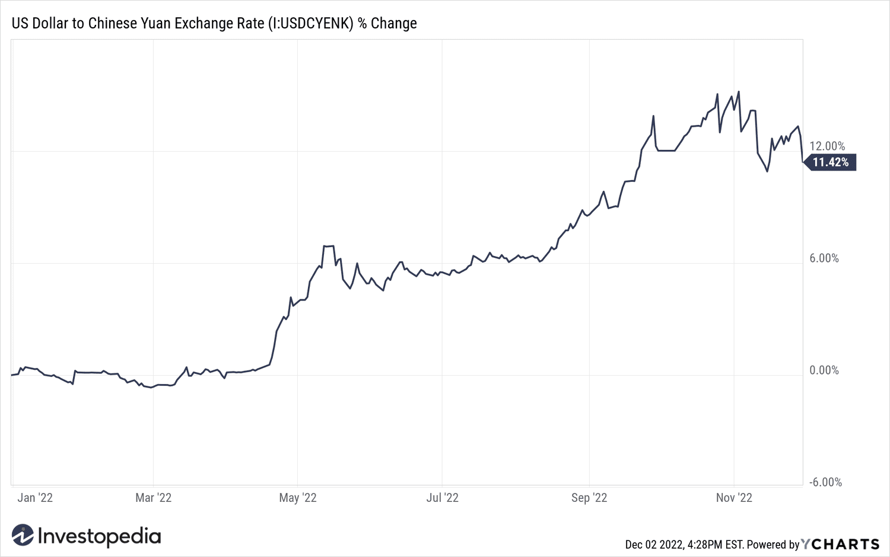

Economic development in South Asia is crucial in addressing global challenges and enhancing regional stability and progress. The region, comprising countries like India, Bangladesh, and Pakistan, has experienced significant economic growth in recent years, which is essential in alleviating poverty, reducing inequality, and improving living standards. However, these nations also face hurdles, including geopolitical tensions, population pressures, and environmental issues, all of which necessitate sustained economic development to ensure resilience and long-term stability.

In this context, technological advancements have emerged as pivotal in driving economic growth and efficiency. One notable innovation is algorithmic trading (algo trading), which has rapidly gained prominence in emerging economies. Algo trading refers to the use of computerized systems and algorithms to manage trading functions, allowing for faster and more precise trading than traditional methods. It enhances market liquidity and efficiency, reducing transaction costs and enabling market players to execute trading strategies with increased accuracy.

Algo trading's growth is particularly significant for South Asia, where financial markets are undergoing rapid transformation bolstered by technological integration. The increasing digitization of financial services provides a fertile ground for the implementation and expansion of algorithmic trading practices within the region. This interrelation between economic development and algo trading highlights two key aspects: the potential for enhanced market structures that contribute to the economic stability of South Asia, and the need for emerging economies within the region to adapt to evolving global financial landscapes.

This article examines the intricate relationship between economic development and algo trading in South Asia, emphasizing the transformative potential of technological innovations in shaping the future of the region. By fostering strategic investments and implementing supportive policies, South Asian economies can harness algo trading to not only address their internal economic challenges but also to attract foreign investments and strengthen their position in the global market.

## Table of Contents

## Overview of South Asia's Emerging Economies

South Asia, a subregion of Asia, encompasses a diverse array of cultures, languages, and economies, with key countries including India, Bangladesh, and Pakistan. This region collectively houses a significant portion of the world’s population, contributing substantially to global economic activities.

### Socio-economic Challenges and Economic Growth

South Asia faces several socio-economic challenges that impact its economic growth. High population density, poverty, and unemployment are prevalent issues. According to the World Bank, South Asia is home to nearly a quarter of the world's population, with significant portions residing in rural areas experiencing poverty. Despite these challenges, the region has experienced robust economic growth, driven by sectors such as technology, manufacturing, and services. India, the largest economy in the region, has witnessed an average growth rate of around 6-7% over the past decades, fueled by its IT and service sectors. Bangladesh has also shown remarkable growth, partly due to its burgeoning garment industry, which constitutes a major export sector. Pakistan, while facing macroeconomic challenges, continues to grow with a focus on infrastructure and energy sectors.

### Impact of Regional Political and Natural Events

Political stability is a crucial [factor](/wiki/factor-investing) influencing South Asia's economic prospects. The region has historically experienced political tensions both within and among countries, which can significantly affect economic activities. For example, India and Pakistan have longstanding political disputes, which have implications for regional trade and investment.

Natural events also pose significant threats to economic stability. South Asia is particularly vulnerable to natural disasters such as floods, cyclones, and earthquakes. These events can have devastating impacts on agriculture, infrastructure, and livelihoods, undermining economic progress. Climate change is expected to exacerbate these events, necessitating adaptive and resilient strategies to safeguard economic gains.

In summary, while South Asia's emerging economies are growing rapidly, they face challenges that require strategic policy interventions and sustainable practices to ensure long-term stability and prosperity.

## The Role of Technology and Innovation in Economic Growth

Technological advancements have substantially boosted economic growth in South Asia, particularly in India, which has emerged as a global technology powerhouse. These advancements have been instrumental in various sectors, driving efficiency, innovation, and economic resilience.

In recent years, India's technology sector has experienced significant growth, becoming a cornerstone of its economy. The rise of information technology (IT) and information technology-enabled services (ITES) have positioned India as a leader in software development, IT outsourcing, and digital services. Companies such as Tata Consultancy Services (TCS), Infosys, and Wipro have become key players on the global stage, contributing significantly to GDP and employment. According to the National Association of Software and Service Companies (NASSCOM), the Indian IT industry is projected to reach $194 billion in revenue in 2021, showcasing its robust expansion.[^1]

The implications of this growth extend beyond immediate economic benefits. The technology sector has spurred innovation across industries, fostering a startup ecosystem in cities like Bengaluru, Hyderabad, and Pune. These hubs have become breeding grounds for innovative companies and entrepreneurs, contributing to job creation and skill development. The proliferation of smartphones and internet connectivity has further accelerated digital inclusion, empowering individuals and small businesses to participate in the digital economy.

Digital transformation has played a crucial role in enhancing economic resilience. The adoption of digital technologies has streamlined operations and increased productivity across sectors. For example, in agriculture, precision farming technologies and data analytics have improved crop management and yield predictions. Financial services have also been revolutionized, with mobile banking and digital payment systems increasing financial inclusion and reducing transaction costs.[^2]

Moreover, e-governance initiatives have enhanced transparency and efficiency in public administration. Programs such as the Digital India initiative aim to transform India into a digitally empowered society and knowledge economy. These initiatives have improved service delivery, reduced corruption, and empowered citizens by providing access to information and services online.

In summary, technological advancements and digital transformation have been pivotal in driving economic growth in South Asia, particularly in India. As technology continues to evolve, it presents opportunities for further innovation and development, positioning the region for sustained economic progress.

[^1]: NASSCOM. "Indian IT Industry: NASSCOM Community." NASSCOM, https://community.nasscom.in.

[^2]: World Bank. "South Asia Economic Focus, Spring 2018: Budget Crunch." World Bank, https://www.worldbank.org.

 to Algorithmic Trading

Algorithmic trading, often abbreviated as algo trading, refers to the use of computer algorithms to automate the process of trading securities. These algorithms, which are sets of rules and instructions, are designed to execute trades at high speeds and frequencies, making decisions and transactions far beyond the capability of a human trader. A fundamental characteristic of [algorithmic trading](/wiki/algorithmic-trading) is its reliance on quantitative models and mathematical formulae to analyze data and determine optimal trading strategies. This method often incorporates historical and real-time data to predict asset price movements and execute trades when certain predefined conditions are met.

Globally, algorithmic trading has seen a significant rise due in part to its numerous advantages over traditional trading methods. One of the primary advantages is speed; algorithms can process massive amounts of data and make trading decisions in milliseconds. This high-speed execution reduces the risk of slippage, where the price of an asset changes between the order being placed and its execution. Additionally, algorithmic trading allows for systematic trading, devoid of human emotions such as fear and greed, leading to potentially more consistent outcomes. It also enables high-frequency trading ([HFT](/wiki/high-frequency-trading-strategies)), which leverages ultra-fast algorithms to exploit minute price discrepancies for profit, making it an attractive option for investment firms pursuing short-term gains.

The technological infrastructure required for algorithmic trading is sophisticated and involves several key components. High-speed internet connections are essential to ensure minimal latency in the execution of trades. Furthermore, powerful computing systems capable of performing complex computations at incredible speeds are necessary. These systems must be equipped with suitable trading software capable of running complex algorithms. Additionally, secure and reliable data feeds are critical for providing real-time market data and allowing algorithms to make informed decisions. Data storage solutions are also necessary to handle large volumes of historical and current data for analysis and model testing.

Moreover, risk management systems need to be integrated into the trading platforms to monitor and mitigate any potential trading risks, such as unexpected market changes or erroneous trades. As markets evolve, continuous development and optimization of these algorithms are required to maintain competitive performances in trading ventures.

As algorithmic trading continues to develop, its reliance on cutting-edge technology underscores its transformative impact on global financial markets, paving the way for enhanced market efficiencies and opportunities.

## Algorithmic Trading in South Asia

Algorithmic trading in South Asia has seen remarkable progress, particularly in India, which has emerged as a significant player in the region. Algo trading uses computer algorithms to execute trading orders with speed and precision, taking advantage of complex mathematical models and high-frequency data analysis. This form of trading can enhance market efficiency and [liquidity](/wiki/liquidity-risk-premium), thus offering substantial economic growth opportunities.

### Current State and Opportunities

India, as a tech hub, leads the advancement of algorithmic trading within South Asia. The country's robust IT sector, a well-established infrastructure, and a vast pool of skilled professionals have catalyzed this transformation. Approximately 50-60% of total trading volumes in Indian markets are attributed to algorithmic trading, highlighting its significance. With stock exchanges like the National Stock Exchange (NSE) and Bombay Stock Exchange (BSE) offering advanced trading platforms, India's financial ecosystem has become fertile ground for algo trading.

Bangladesh and Pakistan are also slowly integrating algorithmic trading, benefiting from the technological innovations and frameworks pioneered by India. These advancements create opportunities to modernize financial systems, improve transparency, and attract foreign investment. Economies that embrace such modern trading technologies can improve their market efficiency, reduce costs, and offer competitive returns to investors.

### Regulatory and Technological Barriers

Despite the growth prospects, several challenges temper the widespread adoption of algorithmic trading in South Asia. Regulatory frameworks across these countries often vary, with some being less flexible to accommodate the rapid pace of technological change. In India, regulatory bodies such as the Securities and Exchange Board of India (SEBI) have established guidelines for algo trading to maintain market integrity and protect against systemic risks. Ensuring compliance can be a complex task for firms wanting to deploy algorithmic solutions.

Technological infrastructure is another critical factor. While India has developed a resilient infrastructure, other countries like Bangladesh and Pakistan need to invest substantially in broadband connectivity and data management systems to support the high-speed demands of algorithmic trading. Moreover, small and mid-sized firms may find the initial cost intimidating, leading to slower adoption rates.

### India's Role in Advancing Algo Trading

India's progress in algorithmic trading serves as a model for its neighbors, highlighting the crucial role of technological advancement and innovation. The Indian Institute of Technology (IIT) and other premier institutions are incubating cutting-edge research that propels algorithmic and fintech technologies. Furthermore, the presence of global financial services firms and startups focusing on algorithmic solutions is driving innovation and creating a competitive landscape.

Companies such as Zerodha and Upstox have democratized access to trading platforms equipped for algorithmic operations, enabling retail investors to participate in algo trading. This democratization supports market participation's growth and integrates more market participants into the financial system, fostering economic stability and growth.

### Conclusion

The current state of algorithmic trading in South Asia demonstrates the potential for emerging markets to harness modern technologies for economic gain. With India at the forefront, the region is positioned to leverage its technological strengths, provided that regulatory and infrastructural challenges are addressed effectively. Continued investment in technology and supportive policy frameworks will be crucial to realizing the full benefits of algorithmic trading, thereby contributing substantially to the region's economic development.

## Economic Implications of Algo Trading in Emerging Markets

Algorithmic trading, often referred to as algo trading, has emerged as a significant force in financial markets, particularly in emerging economies. Its capacity to enhance market efficiency and potentially contribute to economic growth is becoming increasingly evident. Algo trading leverages mathematical models and high-speed data analysis to execute trades, offering a competitive edge over traditional trading by minimizing human intervention and increasing transaction speed.

### Impact on Economic Growth and Market Efficiency

Algo trading can contribute to economic growth by improving the liquidity and efficiency of financial markets. Enhanced liquidity ensures that investors can buy and sell securities with ease, which, in turn, can stabilize prices and reduce costs associated with buying and selling assets. This stability can foster investor confidence, leading to an influx of capital and stimulating broader economic activity.

Market efficiency is further boosted through algo trading by enabling faster price discovery. Algorithms can process vast amounts of information quickly, leading to more accurate reflections of an asset's value in real-time. This rapid response mechanism can minimize discrepancies between an asset’s market price and its intrinsic value, thereby enhancing the overall efficiency of financial markets.

### Potential for Attracting Foreign Investment

Algo trading's ability to create more efficient and liquid markets holds the potential to attract foreign investments. International investors are often attracted to markets where there is transparency, low transaction costs, and robust liquidity—conditions that are fostered by active algo trading platforms. For emerging markets, which typically suffer from higher [volatility](/wiki/volatility-trading-strategies) and lower liquidity, algo trading can serve as a catalyst to entice foreign participation, thereby injecting much-needed capital and fostering economic development.

### Risks: Volatility and Market Manipulation

However, the integration of algorithmic trading in emerging markets is not without risks. One of the primary concerns is the potential increase in market volatility. The high-speed nature of algorithmic trading can lead to abrupt market movements, particularly during periods of stress or unexpected news. Algorithms, especially those using similar strategies, can react simultaneously to new information, leading to sharp spikes or drops in asset prices. These rapid fluctuations can result in a phenomenon known as 'flash crashes,' which while typically short-lived, can erode market confidence.

Another significant risk is market manipulation. While algorithms are designed to operate within regulatory frameworks, they can also be exploited for unethical practices such as spoofing or layering. In these scenarios, orders are placed with the intent to deceive market participants about the supply or demand of a security, only to be canceled before execution. Such practices can distort prices and undermine market integrity, especially in less regulated environments.

### Conclusion

The economic implications of algorithmic trading in emerging markets are complex and multifaceted. While the potential for enhancing market efficiency and attracting foreign investment is evident, the risks associated with increased volatility and potential market manipulation are significant. It is crucial for regulatory bodies in these regions to establish a balanced framework that harnesses the benefits of algo trading while mitigating its inherent risks. By doing so, emerging economies can strategically leverage algo trading as a tool for sustainable economic growth and financial market advancement.

## Challenges and Future Projections

Emerging South Asian economies face several challenges in adopting algorithmic trading, which can hinder the full realization of its potential benefits. One of the foremost challenges is the lack of technological infrastructure. High-frequency trading, a subset of algorithmic trading, requires robust and low-latency communication networks to operate effectively. Many South Asian countries still grapple with outdated technology systems, which can hamper the seamless execution of trades. 

Another significant challenge is regulatory concerns. Different countries in the region have varied levels of regulatory frameworks concerning financial markets, and algorithmic trading might not be specifically covered or could be subject to restrictive measures. For instance, India's Securities and Exchange Board (SEBI) has established guidelines for algo trading, yet the regulatory environment across the region remains inconsistent [1]. Such inconsistencies can lead to a lack of investor confidence and can deter foreign investment necessary for the growth of algorithmic trading platforms.

Moreover, there is a considerable skills gap in these markets. The specialized skill set required for algorithmic trading—including expertise in financial markets, computer science, and quantitative analysis—is scarce. This deficiency not only restricts local talent development but also impedes the overall growth of the sector.

Despite these challenges, future trends indicate a promising expansion of algorithmic trading in South Asia. The steady digitization of the economy and increasing internet penetration can effectively bridge the technological gap over time. Machine learning and [artificial intelligence](/wiki/ai-artificial-intelligence), as integral components of algo trading systems, are gaining traction in the region's academic and business sectors, potentially addressing the skills gap.

To capitalize on these trends, collaborating with global technology players could be instrumental. Such partnerships could facilitate the transfer of technology and knowledge, assisting local firms in overcoming existing obstacles. For example, collaborations in developing high-frequency trading platforms, constructing regulatory frameworks, and training programs can help align South Asian markets with international standards.

Strategic alliances with global tech companies might also invoke adoption of innovative solutions like blockchain to enhance transparency and security, alleviating some regulatory concerns. By fostering such collaborative environments, South Asia can not only overcome present challenges but also establish itself as a thriving hub for algorithmic trading, leveraging this advanced trading method for substantial economic growth in the future.

[1] SEBI's Guidelines on Algorithmic Trading. Securities and Exchange Board of India.

## Conclusion

The interconnection between economic development and algorithmic trading in South Asia is becoming increasingly apparent and significant. As the region seeks avenues to fortify its economies against global challenges, including geopolitical tensions, climate change, and rapid technological shifts, the adoption and integration of algorithmic trading offer a promising pathway to enhanced market efficiency and economic resilience. 

Algorithmic trading, with its ability to process vast datasets and execute trades at previously unimaginable speeds, holds the potential to attract foreign investments and inject liquidity into South Asian markets. For this potential to be realized, however, strategic investments in technology infrastructure and supportive regulatory frameworks are essential. These investments can foster an ecosystem where innovation thrives and economic actors, from individual traders to large financial institutions, can leverage algorithmic solutions to optimize their trading strategies. 

Supportive policies will also be crucial to safeguard against the risks associated with algorithmic trading, such as increased market volatility and the potential for market manipulation. By ensuring that robust regulatory measures are in place, South Asian economies can mitigate these risks and promote a balanced approach that harnesses the benefits of algorithmic trading while protecting market integrity.

The strategic embrace of algorithmic trading can serve as a catalyst for sustained economic growth in the region. With India at the helm, owing to its burgeoning tech sector, South Asia has the opportunity to establish itself as a significant player in the global financial market. By fostering collaborations with global tech firms and investing in the necessary technological infrastructure, South Asia can not only embrace the innovations offered by algorithmic trading but also set the stage for broader economic development and stability.

In summary, algorithmic trading presents an avenue for South Asian economies to transition into modern, efficient marketplaces capable of withstanding global economic challenges. By prioritizing strategic investments and fostering an environment conducive to technological advancement and regulatory prudence, the region can capitalize on the potential of algorithmic trading to achieve long-term economic prosperity.

## References & Further Reading

[1]: Ghafari, H., Kangavari, M. R., Bafroui, H. Z., & Aryan, Y. (2020). ["Algorithmic Trading Using Machine Learning: A Detailed Survey."](http://yadda.icm.edu.pl/baztech/element/bwmeta1.element.baztech-417ef46d-5e51-4ae8-9b26-f30740b46bda) SAGE Open. 

[2]: Narang, R. K. (2013). ["Inside the Black Box: A Simple Guide to Quantitative and High-Frequency Trading."](https://onlinelibrary.wiley.com/doi/book/10.1002/9781118662717) John Wiley & Sons.

[3]: Patel, N., & Patel, M. (2020). ["Role of Algorithmic Trading in Emerging Stock Markets: A Case of India."](https://www.researchgate.net/profile/Naveen-Patel-4/publication/336578136_Emerging_Pollutants_in_Aquatic_Environment_Source_Effect_and_Challenges_in_Biomonitoring_and_Bioremediation-_A_Review/links/5e7fa52f458515efa0b51c19/Emerging-Pollutants-in-Aquatic-Environment-Source-Effect-and-Challenges-in-Biomonitoring-and-Bioremediation-A-Review.pdf?origin=publication_detail) Research Square Preprint.

[4]: Jain, P. K., & Jain, P. (2019). ["A Look Inside India's Nifty Index Algorithm Trading Market."](https://scholar.google.com/citations?user=rDUmycQAAAAJ&hl=en) Accounting Horizons.

[5]: Securities and Exchange Board of India (SEBI). (2013). ["Consultation Paper on Algorithmic Trading."](https://www.sebi.gov.in/sebi_data/attachdocs/1369137134098.pdf) SEBI.

[6]: Lopez de Prado, M. (2018). ["Advances in Financial Machine Learning."](https://www.amazon.com/Advances-Financial-Machine-Learning-Marcos/dp/1119482089) Wiley.