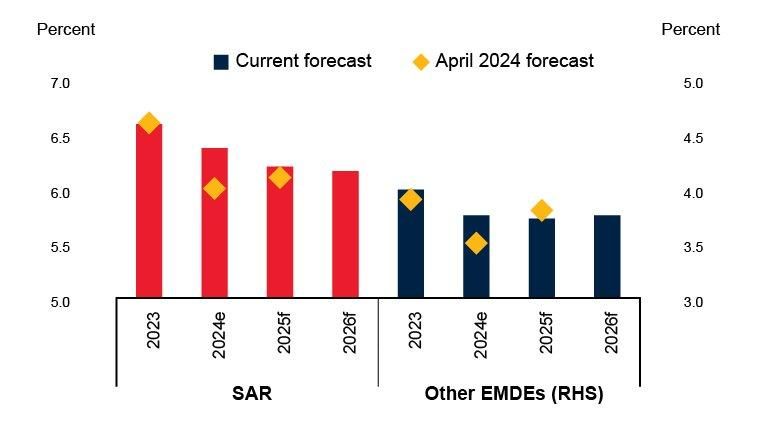

## Table of Contents

## What are emerging economies and why are they important?

Emerging economies are countries that are in the process of growing and developing their industries and economies. These countries are moving from being less developed to more developed, and they often have fast-growing populations and increasing levels of income. Examples of emerging economies include countries like Brazil, Russia, India, China, and South Africa, often referred to as the BRICS countries.

These economies are important because they play a big role in the global economy. As they grow, they create new markets for goods and services, which can help boost the economies of other countries. They also attract a lot of investment from around the world, which can lead to more jobs and higher standards of living in these countries. Because of their rapid growth and increasing influence, what happens in emerging economies can affect the whole world, making them key players in global economic stability and progress.

## Which countries in South Asia are considered emerging economies?

In South Asia, India, Pakistan, and Bangladesh are considered emerging economies. These countries are working to grow their industries and improve their economies. They have large populations and are trying to increase their income levels. India is the biggest of these and is often seen as a leader among emerging economies.

These countries are important because they are growing fast. As they grow, they create new places for people to buy and sell things. This can help other countries' economies too. They also get a lot of money from other countries that want to invest in them. This can create more jobs and better lives for people in these countries. What happens in these South Asian countries can affect the whole world because they are becoming more important in the global economy.

## What are the key economic indicators used to assess the growth of these economies?

Key economic indicators help us understand how well countries like India, Pakistan, and Bangladesh are growing. One important indicator is the Gross Domestic Product (GDP), which shows the total value of all goods and services produced in a country. When GDP grows, it usually means the economy is doing well. Another indicator is the GDP growth rate, which tells us how fast the economy is growing from one year to the next. A high growth rate means the economy is expanding quickly.

Other important indicators include the unemployment rate, which shows the percentage of people who want to work but can't find jobs. A low unemployment rate is good because it means more people are working and [earning](/wiki/earning-announcement) money. Inflation rate is also key, as it measures how much prices are going up. If inflation is too high, it can make things more expensive and hurt the economy. Lastly, foreign direct investment (FDI) shows how much money other countries are putting into the economy. More FDI can mean more growth and development.

These indicators together give a clear picture of how these emerging economies are doing. They help us see if the economy is strong, if people are finding jobs, if prices are stable, and if the country is attracting investment from around the world. By looking at these indicators, we can tell if these South Asian countries are on the right track to becoming more developed and prosperous.

## How has the GDP of South Asian emerging economies grown over the past decade?

Over the past decade, the GDP of South Asian emerging economies like India, Pakistan, and Bangladesh has grown a lot. India has been the fastest growing, with its GDP increasing by about 6-7% each year on average. This growth has made India one of the biggest economies in the world. Pakistan and Bangladesh have also seen good growth, with their GDPs growing by about 4-5% each year. This growth shows that these countries are getting stronger and more important in the global economy.

The growth in these countries has been helped by many things. More people are working and making things, which adds to the GDP. Also, these countries are getting more money from other countries that want to invest in them. This investment helps build new businesses and create jobs. Even though there have been some challenges, like the global health crisis, these countries have kept growing and are on their way to becoming even more developed.

## What are the main industries driving economic growth in South Asian emerging economies?

In South Asian emerging economies, a few main industries are pushing the growth forward. In India, the information technology (IT) and service sectors are big drivers. Many big companies around the world use Indian IT services, which creates a lot of jobs and brings in money from other countries. Manufacturing is also growing, especially in areas like cars and electronics. Agriculture is still very important too, as it employs a lot of people and helps feed the country.

Pakistan's economy is driven by agriculture, textiles, and manufacturing. The country grows a lot of cotton and makes clothes from it, which it sells to other countries. This helps the economy grow. Manufacturing, especially in things like cement and cars, is also getting bigger. In Bangladesh, the textile industry is the biggest driver of growth. The country makes a lot of clothes that are sold all over the world. Agriculture is important too, as it employs many people and helps with food.

These industries are key because they create jobs, bring in money from other countries, and help make the economies of India, Pakistan, and Bangladesh stronger. As these industries grow, they help lift more people out of poverty and make the countries more developed.

## What role do foreign investments play in the development of these economies?

Foreign investments are very important for the growth of South Asian emerging economies like India, Pakistan, and Bangladesh. When other countries put money into these economies, it helps them grow faster. This money can be used to build new factories, start new businesses, and create jobs. For example, in India, foreign companies often invest in the IT and service sectors, which helps these industries grow and creates a lot of jobs. In Bangladesh, foreign investment in the textile industry helps the country make more clothes to sell around the world.

These investments also bring new technology and skills to the countries. When foreign companies come to invest, they often bring new ways of doing things that can make local businesses better. This can help the local people learn new skills and improve how they work. For example, in Pakistan, foreign investments in manufacturing can help the country make better products. Overall, foreign investments are key to helping these South Asian countries grow and become more developed. They bring money, jobs, and new ideas that can make a big difference.

## How do government policies influence economic growth in South Asian countries?

Government policies have a big impact on how fast South Asian countries like India, Pakistan, and Bangladesh can grow their economies. These policies can help or hurt growth. For example, if the government makes it easy for businesses to start and grow, more people will want to invest and create jobs. This can make the economy stronger. Also, if the government spends money on things like schools and roads, it can help people get better education and move around more easily, which can help the economy grow.

On the other hand, if the government makes too many rules or taxes that are too high, it can slow down growth. For example, if it's hard for businesses to start because of too many rules, fewer people will want to invest. This can make it harder for the economy to grow. Governments in South Asia try to find a good balance so they can help their economies grow without causing problems. By making smart policies, they can help their countries become stronger and more prosperous.

## What are the major challenges faced by emerging economies in South Asia?

Emerging economies in South Asia face many challenges that can slow down their growth. One big challenge is poverty. Many people in these countries are very poor and don't have enough money to live well. This can make it hard for the economy to grow because poor people can't buy as many things. Another challenge is not having enough good jobs. Many people want to work, but there aren't enough jobs that pay well. This can keep people poor and make it hard for the economy to grow.

Another problem is that these countries often don't have good schools and hospitals. When people don't get good education, they can't get better jobs. And when they don't have good healthcare, they can get sick and not work as much. This can hurt the economy. Also, these countries can have problems with corruption. When leaders take money that should be used to help the country, it can make things worse for everyone. This can slow down growth and make it hard for the economy to get better.

Lastly, these countries can be affected a lot by what happens in other parts of the world. If the global economy has problems, it can hurt South Asian countries too. They might not be able to sell as many things to other countries, or they might not get as much money from other countries wanting to invest. This can make it harder for them to grow and become more developed.

## How do emerging economies in South Asia compare to other emerging markets globally?

South Asian emerging economies like India, Pakistan, and Bangladesh are growing fast, but they also face big challenges. These countries are working hard to make their economies bigger and better. India is doing especially well, with its economy growing a lot each year. It has strong industries like IT and services, which bring in money from other countries. Pakistan and Bangladesh are also growing, with their textile and agriculture sectors helping a lot. But these countries still have a lot of poor people and not enough good jobs. They also need better schools and hospitals to help their people.

Compared to other emerging markets around the world, South Asian economies have some things in common and some differences. Countries like Brazil, Russia, and China are also growing fast and trying to become more developed. Like South Asia, they face challenges with poverty and creating enough good jobs. But they also have their own unique problems. For example, China has a very big economy and a lot of industry, but it also has issues with too much debt. Brazil and Russia have natural resources that help their economies, but they also have problems with corruption and political issues. South Asian countries are trying to learn from these other emerging markets to grow their economies in the best way possible.

## What are the future projections for economic growth in South Asian emerging economies?

The future looks bright for the economies of South Asian countries like India, Pakistan, and Bangladesh. Experts think that these countries will keep growing over the next few years. India is expected to do especially well, with its economy growing by about 6-7% each year. This growth will be helped by strong industries like IT and services, which will keep bringing in money from other countries. Pakistan and Bangladesh are also expected to grow, with their economies getting bigger by about 4-5% each year. Their textile and agriculture sectors will play a big role in this growth.

But there are also challenges that could slow down this growth. One big problem is poverty. Many people in these countries are still very poor and don't have enough money to live well. This can make it hard for the economy to keep growing. Another challenge is not having enough good jobs. If more people can't find good jobs, it will be harder for the economy to get bigger. Also, these countries need better schools and hospitals to help their people. If they can solve these problems, the future could be even brighter for South Asian emerging economies.

## How do social and environmental factors impact economic development in these regions?

Social and environmental factors play a big role in how fast South Asian countries like India, Pakistan, and Bangladesh can grow their economies. One important social [factor](/wiki/factor-investing) is education. If more people can go to good schools and learn a lot, they can get better jobs and help the economy grow. But many people in these countries don't have access to good education, which can slow down growth. Another social factor is healthcare. When people are healthy, they can work more and help the economy. But if they get sick and can't work, it can hurt the economy. Also, social issues like poverty and inequality can make it hard for everyone to do well.

Environmental factors are also very important. For example, climate change can cause problems like floods and droughts, which can hurt farming and other industries. If farmers can't grow enough food because of bad weather, it can make food more expensive and hurt the economy. Pollution is another problem. When the air and water are dirty, it can make people sick and slow down growth. South Asian countries are trying to solve these problems by making better policies and getting help from other countries. If they can manage these social and environmental challenges, their economies can grow even faster in the future.

## What strategies can be implemented to enhance sustainable economic growth in South Asian emerging economies?

To help South Asian countries like India, Pakistan, and Bangladesh grow their economies in a way that lasts, they need to focus on a few important things. First, they should invest more in education and healthcare. When people are healthy and well-educated, they can work better and help the economy grow. This means building more schools and hospitals and making sure everyone can use them. Also, these countries should try to create more good jobs. This can be done by helping small businesses start and grow, and by making it easier for big companies to come and invest. If more people have good jobs, they can earn more money and spend it on things that help the economy.

Another important strategy is to take care of the environment. South Asian countries face big problems from climate change and pollution, which can hurt their economies. They should try to use less energy that comes from dirty sources like coal and more from clean sources like solar and wind. This can help stop climate change and make the air and water cleaner. Also, these countries should work on farming in ways that don't hurt the land. By doing these things, they can keep growing their economies without causing more harm to the environment. If they can balance these social and environmental needs, South Asian emerging economies can grow in a way that lasts for a long time.

## References & Further Reading

[1]: Ghafari, H., Kangavari, M. R., Bafroui, H. Z., & Aryan, Y. (2020). ["Algorithmic Trading Using Machine Learning: A Detailed Survey."](http://yadda.icm.edu.pl/baztech/element/bwmeta1.element.baztech-417ef46d-5e51-4ae8-9b26-f30740b46bda) SAGE Open. 

[2]: Narang, R. K. (2013). ["Inside the Black Box: A Simple Guide to Quantitative and High-Frequency Trading."](https://onlinelibrary.wiley.com/doi/book/10.1002/9781118662717) John Wiley & Sons.

[3]: Patel, N., & Patel, M. (2020). ["Role of Algorithmic Trading in Emerging Stock Markets: A Case of India."](https://www.researchgate.net/profile/Naveen-Patel-4/publication/336578136_Emerging_Pollutants_in_Aquatic_Environment_Source_Effect_and_Challenges_in_Biomonitoring_and_Bioremediation-_A_Review/links/5e7fa52f458515efa0b51c19/Emerging-Pollutants-in-Aquatic-Environment-Source-Effect-and-Challenges-in-Biomonitoring-and-Bioremediation-A-Review.pdf?origin=publication_detail) Research Square Preprint.

[4]: Jain, P. K., & Jain, P. (2019). ["A Look Inside India's Nifty Index Algorithm Trading Market."](https://scholar.google.com/citations?user=rDUmycQAAAAJ&hl=en) Accounting Horizons.

[5]: Securities and Exchange Board of India (SEBI). (2013). ["Consultation Paper on Algorithmic Trading."](https://www.sebi.gov.in/sebi_data/attachdocs/1369137134098.pdf) SEBI.

[6]: Lopez de Prado, M. (2018). ["Advances in Financial Machine Learning."](https://www.amazon.com/Advances-Financial-Machine-Learning-Marcos/dp/1119482089) Wiley.