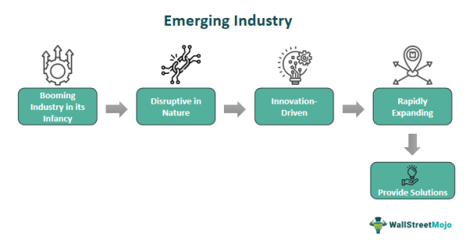

In the rapidly evolving landscape of global business, emerging industries are driving the next wave of innovation and economic growth. These industries, often characterized by novel technologies and groundbreaking approaches, are transforming the way businesses operate, offering both new opportunities and challenges. Technology plays a pivotal role, with algorithmic trading and artificial intelligence (AI) at the forefront of this transformation.

Algorithmic trading represents a convergence of finance and technology, automating complex trading strategies to improve efficiency and decision-making in financial markets. By leveraging vast datasets, algorithms optimize trading strategies in real time, minimizing human error and maximizing potential returns. Machine learning and AI further augment these capabilities, providing predictive analytics and advanced data processing tools, which redefine trading dynamics.

Emerging technologies extend beyond finance. Industries like biotechnology, virtual reality, and autonomous vehicles are redefining conventional paradigms, each with its unique set of challenges and potential. The integration of AI in these sectors is particularly noteworthy. In healthcare, AI-driven diagnostics can enhance patient outcomes, while autonomous vehicles promise to revolutionize transportation, impacting logistics and urban planning.

Understanding what constitutes an emerging industry is crucial. These sectors are typically in nascent stages, marked by innovation, and often tackling unaddressed needs. They are characterized by high growth potential but are accompanied by substantial risks due to market volatility and unproven technologies. Investing in such industries demands careful consideration, balancing potential returns against inherent risks.

Investing in emerging industries requires a keen understanding of market trends and technological advancements. While the potential for significant rewards exists, the risks are equally significant. Investors and businesses must stay informed, adapt strategies, and develop a nuanced understanding of these sectors to navigate the uncertainties and capitalize on the growth opportunities they present. Entrepreneurial vision, technological expertise, and agility are essential in harnessing the potential of these transformative industries, ensuring they contribute positively to global economic growth and innovation.

## Table of Contents

## Understanding Emerging Industries

Emerging industries are founded upon new concepts or products during their nascent phases, frequently centered on innovative technologies. These industries generally comprise a limited number of companies, each focused on pioneering technological advancements. Historically, the rapid expansion of the Internet in the mid-1990s exemplified an emerging industry that quickly transformed global commerce and communication, illustrating the potential of early-stage industries to drive significant change.

Currently, several sectors exemplify emerging industries that bear potential for substantial growth and innovation. Artificial Intelligence (AI) is one such field, wherein [machine learning](/wiki/machine-learning) and data-driven algorithms are altering various segments, from automation in manufacturing to advanced AI applications in healthcare diagnostics. Virtual reality (VR) is another burgeoning industry, offering immersive experiences across entertainment, education, and training sectors, thereby reshaping user interaction paradigms.

Self-driving cars represent a frontier where advances in autonomous vehicle technology promise to revolutionize transportation systems by enhancing safety, efficiency, and accessibility. Meanwhile, biotechnology, with its roots in the life sciences, continues to lead breakthroughs in genetic engineering, pharmaceuticals, and agricultural innovation, aiming to improve human health and environmental sustainability.

Investing in these emerging industries carries inherent high risk due to uncertainties regarding technological feasibility, regulatory acceptance, and market adoption. Nonetheless, such investments can yield substantial rewards, particularly for early adopters and investors who identify and support leading innovators. The potential for outsized returns stems from the transformative impact these industries can have on existing markets and the creation of entirely new markets. Thus, understanding and navigating the intricacies of emerging industries is crucial for stakeholders seeking to capitalize on future technological and economic trends.

## Trends in Business Innovation and Algorithmic Trading

Algorithmic trading has dramatically reshaped the financial trading landscape, offering enhanced efficiency and rationality in decision-making. By automating complex trading processes, it reduces human error and emotion-driven decisions, enabling traders to execute high-frequency orders with precision and speed. Central to this transformation is the integration of [artificial intelligence](/wiki/ai-artificial-intelligence) (AI) and machine learning, which has thoroughly revolutionized traditional financial mechanisms by rapidly processing and analyzing massive volumes of data. These technologies empower traders to identify patterns and predict market movements with heightened accuracy.

AI-driven predictive analytics provide traders with advanced tools to anticipate market trends. By employing machine learning algorithms, traders can develop models capable of identifying non-linear relationships within large datasets, thus improving the reliability of trading signals. Additionally, natural language processing (NLP) enhances the capability of algorithmic systems to interpret unstructured data, such as news articles and social media sentiment, further refining trading decisions.

The advent of blockchain technologies and decentralized exchanges has also played a pivotal role in redefining security and transparency. Distributed ledger systems ensure that transaction histories are immutable and transparent, reducing the risk of fraud and improving trust among participants. Decentralized exchanges enable peer-to-peer trading without the need for intermediaries, decreasing transaction costs and increasing market accessibility.

Moreover, the popularity of social trading platforms is growing, highlighting the influence of collaborative decision-making. Social trading leverages the wisdom of the crowd, allowing users to share insights and strategies for mutual benefit. Platforms facilitate this sharing of information, enabling traders, especially less experienced ones, to follow and replicate the strategies of successful peers. This community-based approach fosters democratization in financial markets and encourages collective intelligence.

Collectively, these trends underscore a dynamic shift in business innovation within financial markets, driven by technological advancement in [algorithmic trading](/wiki/algorithmic-trading). As these elements converge, they expand opportunities for both institutional and individual traders, creating a more inclusive and adaptable trading environment.

## Challenges and Barriers in Emerging Industries

Emerging industries, often centered on novel and transformative technologies, encounter several formidable challenges that can hinder their growth and sustainability. One of the primary obstacles is their inherently high barriers to entry. These industries typically demand specialized expertise and substantial research and development (R&D) investments. Such requirements often lead to significant initial costs, making it difficult for new entrants to compete without significant funding or unique innovations. For instance, the biotechnology sector, with its reliance on cutting-edge research and regulatory approvals, exemplifies an industry with prohibitive entry costs.

Moreover, emerging industries must often contend with established players who possess greater resources and market influence. To successfully compete, new companies need to not only focus on innovation but also engage in strategic business planning. Access to funding, whether through venture capital, private equity, or public markets, is critical. Without sufficient capital, even the most innovative startups can struggle to scale operations and achieve market penetration.

Regulatory issues present another significant challenge. As these industries often operate at the frontier of technology, existing legal frameworks may not adequately address the emerging technologies' nuances. The rapid pace of innovation can outstrip the ability of regulatory bodies to adapt, leading to periods of uncertainty that can impede growth. In addition, cybersecurity threats represent a critical barrier, especially in sectors like fintech, where protecting sensitive data is paramount. Ensuring robust cybersecurity measures is essential to build and maintain stakeholder trust.

Successfully navigating these challenges necessitates a delicate balance between fostering innovation and adhering to regulatory requirements. Companies must actively engage with policymakers to shape regulatory guidelines that encourage growth without compromising consumer protection. Equally, they should invest in cybersecurity infrastructure to safeguard their operations and maintain competitive advantage. Overall, the path to overcoming these barriers lies in strategic foresight, robust planning, and proactive engagement with both technological and regulatory landscapes.

## Investing in Emerging Industries

Investors seeking opportunities in emerging industries must approach with caution and a robust strategy. Emerging industries, while offering high growth potential, are often characterized by [volatility](/wiki/volatility-trading-strategies) and uncertainty. To navigate these investments effectively, due diligence is critical. 

One strategy to mitigate risks associated with direct stock investments in emerging companies is to consider exchange-traded funds (ETFs). ETFs pool resources to invest in a diversified portfolio of assets within a particular sector. By investing in sector-specific ETFs, investors can spread the risk across multiple companies, thereby reducing the impact of any single company's underperformance. For example, ETFs focused on artificial intelligence or biotechnology can provide exposure to a broad range of companies leading innovations in these fields.

Understanding market dynamics is crucial for identifying potential winners in emerging industries. This entails analyzing economic indicators, technological advancements, and consumer trends that could signal a company's growth potential. For instance, innovators in AI are developing increasingly sophisticated algorithms that promise to revolutionize industries from finance to healthcare. Similarly, advances in biotechnology are opening new frontiers in medical treatments and sustainability, offering significant potential for those positioned to capitalize early.

Given the inherent volatility of emerging industries, diversification is a vital strategy for managing investment risk. A well-diversified portfolio may include a mix of high-growth companies in emerging sectors alongside more stable investments in established industries. This approach helps balance the portfolio's overall risk and reward profile.

Investors should remain vigilant and informed, continuously monitoring developments within targeted sectors. Staying updated on regulatory changes, technological disruptions, and market fluctuations is essential for making informed investment decisions. By combining careful analysis with strategic diversification, investors can effectively navigate the complexities of emerging industries and potentially achieve superior returns.

## Conclusion

Emerging industries and technological advancements, notably in algorithmic trading and artificial intelligence (AI), are reshaping the landscape of business innovation. These sectors are characterized by their potential to transform market dynamics, providing investors and businesses with substantial opportunities. To leverage these opportunities effectively, entities must embrace these technological changes and integrate them into their strategic planning.

The benefits of engaging with these advancements are considerable. For investors, algorithmic trading offers the potential for improved market efficiency and potentially higher returns through data-driven decision-making. Businesses, on the other hand, stand to gain from incorporating AI technologies to streamline operations and enhance customer experiences.

To thrive in this fast-paced environment, continuous learning and the ability to adapt to new technologies are imperative. The rapidly shifting nature of emerging industries demands that both investors and enterprises remain vigilant and informed. This involves staying up-to-date with the latest trends and being agile enough to adjust strategies in response to new challenges and opportunities.

As these industries continue to evolve, the importance of being informed about ongoing trends and potential obstacles cannot be overstated. By maintaining an in-depth understanding of these elements, stakeholders can position themselves advantageously to capitalize on the growth and innovation that characterize these sectors. This proactive approach will be essential in navigating the complexities of modern markets and achieving long-term success.

## References & Further Reading

[1]: Bergstra, J., Bardenet, R., Bengio, Y., & Kégl, B. (2011). ["Algorithms for Hyper-Parameter Optimization."](https://dl.acm.org/doi/10.5555/2986459.2986743) Advances in Neural Information Processing Systems 24.

[2]: Lopez de Prado, M. (2018). ["Advances in Financial Machine Learning."](https://www.amazon.com/Advances-Financial-Machine-Learning-Marcos/dp/1119482089) John Wiley & Sons.

[3]: Aronson, D. R. (2007). ["Evidence-Based Technical Analysis: Applying the Scientific Method and Statistical Inference to Trading Signals."](https://onlinelibrary.wiley.com/doi/book/10.1002/9781118268315) John Wiley & Sons.

[4]: Jansen, S. (2020). ["Machine Learning for Algorithmic Trading: Predictive Models to Extract Signals from Market and Alternative Data for Systematic Trading Strategies with Python."](https://github.com/stefan-jansen/machine-learning-for-trading) Packt Publishing.

[5]: Chan, E. P. (2009). ["Quantitative Trading: How to Build Your Own Algorithmic Trading Business."](https://github.com/ftvision/quant_trading_echan_book) John Wiley & Sons.