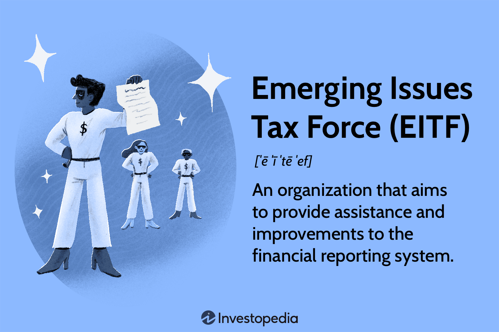

The rapid evolution of financial markets necessitates effective financial reporting and regulatory frameworks to maintain market integrity and investor confidence. In this dynamic environment, the Emerging Issues Task Force (EITF) and algorithmic trading emerge as pivotal components. Established by the Financial Accounting Standards Board (FASB), the EITF provides timely guidance on intricate financial reporting issues, helping corporations comply with Generally Accepted Accounting Principles (GAAP) and maintaining consistency in accounting practices. Meanwhile, algorithmic trading, employing complex computer algorithms, has revolutionized trading by enhancing market efficiency and liquidity. This article investigates how the EITF influences financial reporting and mitigates risks associated with algorithmic trading, a significant trend in modern markets requiring precise and transparent reporting mechanisms.

## Table of Contents

## Understanding the Emerging Issues Task Force (EITF)

The Emerging Issues Task Force (EITF) is a crucial component in the financial reporting ecosystem, formed under the auspices of the Financial Accounting Standards Board (FASB) in 1984. The establishment of the EITF was primarily driven by the need to provide rapid yet reliable guidance on emerging financial reporting issues, thus minimizing the diversity of practice among financial statement preparers. This objective is particularly significant in light of evolving business environments and financial complexities.

The EITF is comprised of industry experts who bring a wealth of knowledge and practical experience to address immediate accounting concerns. These members often include representatives from public accounting firms, corporate financial officers, and other stakeholders in the financial reporting process. The collaborative environment within EITF enables the development of consensus-based solutions that help maintain uniformity in financial reporting until the FASB can act on longer-term standard-setting initiatives.

Frequent meetings are a hallmark of the EITF's operational framework. These sessions are designed to swiftly tackle pressing issues that arise due to new and evolving financial instruments, changes in market practices, or shifts in regulatory landscapes. The outcomes of these meetings include the issuance of EITF consensuses, which provide interim but authoritative guidance on how specific transactions should be reported in the financial statements. The EITF's guidance possesses the authority equivalent to FASB pronouncements, thereby ensuring that it contributes significantly to the adherence to Generally Accepted Accounting Principles (GAAP).

In summary, the EITF's role is instrumental in the timely resolution of financial reporting challenges, supporting the broader mission of the FASB to uphold the quality and consistency of financial reporting. Through its structured approach to addressing emerging issues, the EITF helps companies navigate the complexities of financial disclosures, ensuring stakeholders receive transparent and comparable financial information.

## Role of EITF in Financial Reporting

The Emerging Issues Task Force (EITF) plays a pivotal role in financial reporting by assisting in the development of streamlined accounting principles, which are crucial to avoiding divergent practices among corporations. Established under the auspices of the Financial Accounting Standards Board (FASB), the EITF serves as a mechanism to ensure that financial reporting is both timely and consistent with existing accounting standards. This is vital to maintaining high levels of financial transparency and ensuring that corporations comply with the generally accepted accounting principles (GAAP).

The primary function of the EITF is to address and resolve emerging financial reporting issues that could potentially lead to inconsistencies or misunderstandings in the application of GAAP. It does so by collaborating with industry leaders and professionals to assess and provide guidance on complex accounting problems. The solutions proposed by the EITF are strategically designed to be practical and implementable across a wide array of industries, minimizing the risk of discrepancies and enhancing comparability between financial statements.

An essential aspect of the EITF's role is that its guidance and consensuses hold significant weight within the financial reporting landscape. The decisions made by the EITF [carry](/wiki/carry-trading) the same authority as those issued directly by the FASB. This ensures that once a consensus is reached within the EITF, it becomes an integral component of the accounting standards that corporations must follow. This authoritative status empowers the task force to make impactful decisions that can swiftly address novel financial reporting issues, supporting the integrity and reliability of financial data disclosed to investors and the public.

Through its work, the EITF has contributed to the stabilization of financial reporting environments by refining standard practices and ensuring adherence to GAAP. Its function in analyzing emerging financial issues allows it to preemptively address potential weaknesses in financial reporting frameworks. As such, the EITF remains an indispensable part of the infrastructure that upholds the high standards expected in financial accounting and reporting amidst the ongoing evolution of global financial markets.

## Algorithmic Trading and Its Significance

Algorithmic trading, also known as algo trading, employs computer algorithms to execute trading decisions at high speeds and volumes. These algorithms analyze market data and follow a predefined set of rules to determine the timing, price, and quantity of orders. This approach minimizes human intervention, allowing for rapid execution and decision-making based on real-time data analysis.

A significant advantage of [algorithmic trading](/wiki/algorithmic-trading) is its ability to enhance market efficiency and [liquidity](/wiki/liquidity-risk-premium). By automating trades, algorithms reduce transaction costs and the likelihood of human error, thus facilitating smoother market operations. The algorithm's speed can exploit minute price differentials across exchanges, contributing to price uniformity and tighter spreads.

However, the integration of algorithmic trading necessitates precise financial reporting to maintain transparency. The complexities involved in these automated systems highlight the importance of comprehensive and clear financial disclosures. As trading strategies become increasingly intricate, the need for detailed reporting grows to ensure that traders and investors understand the underlying processes and risks.

In financial markets, enhanced transparency helps mitigate risks associated with high-frequency trading, such as flash crashes or market manipulation. Robust financial reporting frameworks help monitor and regulate the market's automated segments, thus preserving market integrity and investor confidence.

Algorithmic trading represents a transformative advancement in financial technology, offering distinct improvements in trading efficiency and market dynamics. Its successful implementation, however, relies on precise and reliable financial reporting, underscoring the need for rigorous standards and oversight.

## Impact of EITF on Algorithmic Trading

The Emerging Issues Task Force (EITF) significantly influences algorithmic trading by establishing clear financial reporting standards that directly impact the operations and transparency of this modern trading practice. As algorithmic trading increasingly dominates financial markets, it brings with it complex accounting challenges that necessitate precise and timely resolutions. The EITF addresses these issues through its authoritative guidance, ensuring that financial reports accurately reflect the realities of high-speed trading environments.

Algorithmic trading, defined by its reliance on sophisticated algorithms to execute trading strategies at speeds and volumes unattainable by human traders, generates substantial amounts of data. This data must be accurately captured and reported to maintain market integrity. The EITF steps in to offer solutions to these accounting conundrums, such as the valuation of financial instruments traded at high frequencies and the recognition of revenue and expenses derived from such activities.

For example, consider a situation where a trading algorithm is employed to take advantage of market inefficiencies within milliseconds. The EITF might address how gains or losses from these ultra-short-term trades are recognized in financial statements, providing clarity that reduces ambiguity and ensures consistency with generally accepted accounting principles (GAAP). Through such guidance, the EITF helps mitigate risks including the misrepresentation of financial positions and the potential for regulatory scrutiny.

Moreover, by clarifying financial reporting standards for algorithmic trading, the EITF plays a pivotal role in fostering transparency and trust among market participants. This clarity is essential for investors and regulators seeking to understand the impact of algorithmic trading on market dynamics. The standardization advocated by the EITF ensures that financial data is both reliable and comparable, facilitating better decision-making and enhancing market stability.

In summary, the EITF's contributions to the financial reporting framework extend beyond conventional accounting issues to encompass the nuances of modern trading technologies. By addressing the complexities of algorithmic trading, the EITF upholds its commitment to improving financial reporting practices, ultimately aiding in the reduction of systemic risk and reinforcing the resilience of financial markets.

## Challenges and Opportunities

Emerging technologies present both challenges and opportunities for the Emerging Issues Task Force (EITF) and the financial reporting landscape. As financial markets become increasingly complex, the EITF must swiftly adapt its guidelines to ensure financial information's accuracy and fairness. One of the key challenges is managing the valuation and classification of new financial instruments, particularly those associated with algorithmic trading and cutting-edge technologies such as blockchain and cryptocurrencies. These instruments often lack a historical precedent, making it difficult to apply traditional accounting standards.

Algorithmic trading, for example, introduces unique complexities, as rapid transactions can lead to discrepancies in reporting real-time financial data. It requires enhanced measures to verify transaction authenticity and accuracy, potentially necessitating new standards for reconciliation and adjustment procedures. This demand poses a challenge but also underscores the need for innovative reporting solutions.

Opportunities lie in leveraging technologies like [artificial intelligence](/wiki/ai-artificial-intelligence) and [machine learning](/wiki/machine-learning) to improve the EITF's decision-making processes. These tools can analyze vast amounts of data to identify trends and anomalies in financial reporting, offering proactive guidance rather than reactive measures. This can streamline the implementation of guidelines that enhance market operations and bolster investor trust.

Furthermore, blockchain technology offers the prospect of immutable and transparent financial records, reducing errors and fraud while enhancing data security. By integrating blockchain insights, the EITF can promote higher standards of transparency and reliability in financial reporting, ultimately fostering greater confidence across financial markets.

In conclusion, the EITF faces a dynamic environment where the accuracy and fairness of financial information must be preserved amid technological advancements. By meeting these challenges with strategic adaptations and embracing technological opportunities, the task force can continue to uphold the integrity and reliability of financial reporting.

## Conclusion

The Emerging Issues Task Force (EITF) remains integral to the dynamic environment of financial reporting, ensuring that pioneering advancements, such as algorithmic trading, are underpinned by sound accounting standards. By addressing complex financial reporting issues promptly and effectively, the EITF upholds the relevance of Generally Accepted Accounting Principles (GAAP) in the face of technological advancements. This ensures that algorithms—designed to execute trades at unprecedented speeds and volumes—operate within a framework that prioritizes transparency and accountability.

The ongoing evolution of technology and financial instruments presents persistent challenges that the EITF must navigate diligently. These challenges require the task force to adapt continually, refining its guidelines to meet emerging complexities and foster consistency in reporting practices. Such adaptability not only supports the robustness of financial markets but also enhances investor confidence by providing clarity and reducing inherent risks associated with rapid market operations.

Collaboration among industry professionals, facilitated through the EITF, encourages a unified approach to confronting these challenges, paving the way for improved market operations and stability. By maintaining rigorous standards and fostering an environment of cooperation, the EITF plays a critical role in safeguarding the integrity of financial markets, ensuring they remain fair and transparent as they embrace technological advancements.

## References & Further Reading

[1]: ["Emerging Issues Task Force"](https://fasb.org/eitf) at the Financial Accounting Standards Board (FASB) website.

[2]: Hendershott, T., Jones, C. M., & Menkveld, A. J. (2011). ["Does Algorithmic Trading Improve Liquidity?"](https://onlinelibrary.wiley.com/doi/full/10.1111/j.1540-6261.2010.01624.x) The Review of Financial Studies, 24(8), 2506-2540.

[3]: Lopez de Prado, M. (2018). ["Advances in Financial Machine Learning"](https://www.amazon.com/Advances-Financial-Machine-Learning-Marcos/dp/1119482089) John Wiley & Sons.

[4]: Arnuk, S., & Saluzzi, J. (2012). ["Broken Markets: How High Frequency Trading and Predatory Practices on Wall Street are Destroying Investor Confidence and Your Portfolio"](https://ptgmedia.pearsoncmg.com/images/9780132875240/samplepages/0132875241.pdf) FT Press.

[5]: Hasbrouck, J., & Saar, G. (2013). ["Low-latency trading"](https://www.sciencedirect.com/science/article/abs/pii/S1386418113000165) The Quarterly Journal of Economics, 129(4), 1547-1623.