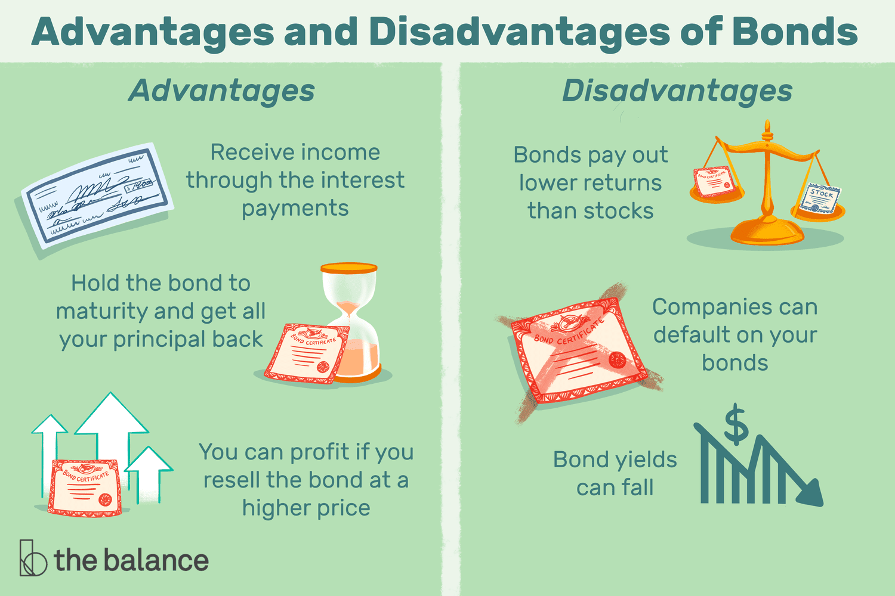

## Table of Contents

## What are emerging market bonds?

Emerging market bonds are debt instruments issued by countries or companies in developing economies. These bonds help these countries and companies raise money from investors around the world. They are considered riskier than bonds from developed countries because the economies and governments in emerging markets can be less stable. This higher risk means they often offer higher interest rates to attract investors.

Investors might be interested in emerging market bonds because of the potential for higher returns. However, they need to be aware of the risks, such as political instability, economic volatility, and currency fluctuations. These factors can affect the value of the bonds and the ability of the issuer to pay back the debt. Despite these risks, many investors see emerging market bonds as a way to diversify their investment portfolios and tap into the growth potential of developing economies.

## How do emerging market bonds differ from developed market bonds?

Emerging market bonds come from countries that are still growing and developing, like Brazil or India. These bonds often pay more interest because they are riskier. The countries might have more ups and downs in their economy, and their governments might change a lot. This can make it harder for them to pay back the money they borrowed. Also, the money you get back might be in a different currency, which can change in value and affect how much your bond is worth.

On the other hand, developed market bonds are from countries with strong and stable economies, like the United States or Germany. These bonds usually pay less interest because they are seen as safer. The governments in these countries are more stable and their economies don't change as much. The currency is also more stable, so you know better what your bond will be worth in the future. People often choose these bonds when they want a safer place to put their money.

In summary, the main differences between emerging and developed market bonds are the level of risk and the potential return. Emerging market bonds can offer higher returns but come with more risk due to economic and political instability. Developed market bonds offer lower returns but are considered safer because of the stability of the issuing countries.

## What are the main types of emerging market bonds?

Emerging market bonds come in different types. One type is called sovereign bonds. These are bonds that a country's government issues. They use the money to help their country grow. Another type is corporate bonds. These come from companies in emerging markets. The companies use the money to grow their business. Both types can be in the country's own money or in a foreign money like US dollars.

Another type is local currency bonds. These are paid back in the country's own money. This can be good if the country's money gets stronger, but bad if it gets weaker. Then there are hard currency bonds. These are paid back in a strong foreign money, like US dollars or euros. They are often seen as safer because the money is more stable. But, they can still be risky because the country might have trouble paying back the money if their economy has problems.

## How are emerging market bonds rated and what does it signify?

Emerging market bonds are rated by special companies called credit rating agencies. These agencies look at how likely a country or a company is to pay back the money they borrowed. They give the bonds a letter grade, like AAA, BB, or CCC. A higher grade, like AAA, means the bond is very safe and the country or company is very likely to pay back the money. A lower grade, like CCC, means the bond is riskier and there's a bigger chance they might not pay back the money.

These ratings help investors decide if they want to buy the bonds. If a bond has a high rating, more people might want to buy it because it seems safer. But, they might not get paid as much interest. If a bond has a low rating, fewer people might want to buy it because it's riskier. But, if they do buy it, they could get paid more interest to make up for the risk. So, the rating tells investors about the safety and the possible reward of the bond.

## What are the typical mechanisms for investing in emerging market bonds?

One common way to invest in emerging market bonds is by buying them directly. You can do this through a broker who helps you find and buy the bonds you want. These could be bonds from a country's government or from companies in that country. When you buy them directly, you get the interest payments and the money back when the bond matures. But, you need to be careful because these bonds can be risky, and you need to know a lot about the country and the company before you invest.

Another way to invest is through mutual funds or exchange-traded funds (ETFs) that focus on emerging market bonds. These funds collect money from many investors and use it to buy a bunch of different bonds. This can help spread out the risk because you're not putting all your money into just one bond. It's also easier because the fund managers do the research and make the decisions about which bonds to buy. But, you'll have to pay fees to the fund managers, and the value of the fund can go up and down based on how the bonds are doing.

Some investors also use bond index funds, which try to match the performance of a specific index of emerging market bonds. This can be a good way to get a broad exposure to these bonds without having to pick them yourself. Like mutual funds and ETFs, index funds can help spread out your risk. But, they also come with fees, and their value can change based on the overall performance of the bonds in the index.

## What are the potential risks associated with investing in emerging market bonds?

Investing in emerging market bonds can be risky because these countries might have unstable economies. The government or companies in these countries might have trouble paying back the money they borrowed. This can happen if their economy gets worse or if there's a big change in their government. Also, the value of the money in these countries can change a lot. If you bought a bond in their currency and their money gets weaker, you might get less money back than you expected.

Another risk is that these countries might have more political problems. If there's a lot of fighting or changing of leaders, it can make it hard for them to pay back their debts. Sometimes, these countries might even decide not to pay back their bonds at all, which is called defaulting. This can make you lose a lot of money. Also, because these bonds are riskier, they can be harder to sell if you need your money back quickly. This means you might have to wait longer or sell them for less than you paid.

## What are the advantages of investing in emerging market bonds?

One big advantage of investing in emerging market bonds is that they can offer higher returns. Because these bonds are riskier, they often pay more interest than bonds from developed countries. This means you could earn more money if everything goes well. Also, investing in these bonds can help you spread out your investments. Instead of putting all your money in one place, you can invest in different countries and companies. This can make your overall investment safer because if one bond does badly, the others might still do well.

Another advantage is that emerging markets often grow faster than developed markets. This means the countries and companies issuing the bonds might do better in the future, making your bonds worth more. Also, by investing in these bonds, you can be part of the growth and development of these countries. It's a way to support their progress while potentially [earning](/wiki/earning-announcement) a good return on your investment.

## Can you explain the yield and return characteristics of emerging market bonds?

Emerging market bonds often have higher yields than bonds from developed countries. Yield is like the interest you get for lending your money. Because these bonds are riskier, the countries or companies that issue them have to offer more interest to attract investors. So, if you buy an emerging market bond, you might get paid more in interest than if you bought a bond from a country like the US or Germany. But remember, higher yield means higher risk. If the country or company has trouble, they might not be able to pay you back, and you could lose money.

The return on emerging market bonds can also be higher, but it's not guaranteed. Return is what you earn from the interest payments and any change in the bond's price. If the country's economy does well, the bond's price might go up, and you could make a profit when you sell it. But if the economy does badly, the bond's price might go down, and you could lose money. Also, if you bought the bond in the country's own money, changes in the value of that money can affect your return. If their money gets weaker, you might get less money back than you expected, even if the bond pays all its interest on time.

## How does currency risk affect investments in emerging market bonds?

Currency risk is a big deal when you invest in emerging market bonds. It means that the value of the money from the country where you bought the bond can change. If their money gets weaker compared to your money, you might get less money back than you thought. For example, if you bought a bond in Brazilian reals and the real gets weaker against the US dollar, the interest payments and the money you get back at the end will be worth less in dollars. This can make your investment worth less, even if the bond pays all its interest on time.

But, currency risk can also work in your favor. If the money from the country where you bought the bond gets stronger, you could get more money back than you expected. This means your investment could be worth more. For example, if you bought a bond in Indian rupees and the rupee gets stronger against the US dollar, the interest payments and the money you get back at the end will be worth more in dollars. So, while currency risk adds another layer of uncertainty, it can also add to your potential rewards if the currency moves in the right direction.

## What role do emerging market bonds play in portfolio diversification?

Emerging market bonds can help spread out your investments. When you put your money into different kinds of investments, it's called diversification. This can make your overall investment safer because if one part does badly, the others might still do well. Emerging market bonds are different from other investments like stocks or bonds from developed countries. So, adding them to your portfolio can help balance things out. If the stock market goes down, your emerging market bonds might still be doing okay, which can protect your money.

Another way emerging market bonds help with diversification is by giving you a chance to invest in different countries and economies. These countries often grow faster than developed countries. By investing in their bonds, you can be part of this growth. This means your portfolio isn't just tied to one country or type of investment. It can make your investments more stable and potentially increase your returns. But remember, with higher potential rewards come higher risks, so it's important to understand these bonds before you invest.

## How have emerging market bonds performed historically compared to other asset classes?

Emerging market bonds have had ups and downs over the years, but they have often given higher returns than bonds from developed countries. This is because they are riskier, so they need to offer more interest to attract investors. For example, during times when the global economy is doing well, emerging market bonds can do really well because these countries grow faster. But, if there's a big problem in the world economy, like a financial crisis, these bonds can lose a lot of value because people get scared and want to move their money to safer places.

Compared to other asset classes like stocks or real estate, emerging market bonds can be a good way to spread out your investments. Stocks can go up and down a lot, and real estate might not be easy to sell quickly. Emerging market bonds can give you steady interest payments and might not move in the same way as stocks or real estate. This means that when stocks are doing badly, your emerging market bonds might still be doing okay, which can help keep your overall investments more stable. But, they are still riskier than bonds from developed countries, so it's important to think about how much risk you're okay with before you invest.

## What are advanced strategies for managing a portfolio of emerging market bonds?

One advanced strategy for managing a portfolio of emerging market bonds is to use a mix of different types of bonds. You can buy some bonds in the country's own money and some in a strong foreign money like US dollars. This can help balance out the risk because if the country's money gets weaker, the bonds in the foreign money might still do well. Another part of this strategy is to spread your money across many different countries and companies. This way, if one bond does badly, the others might still do okay, which can keep your overall investment safer.

Another strategy is to keep an eye on the economy and politics of the countries where you're investing. If you see that a country is doing well or its government is stable, you might want to buy more bonds from there. But if you see problems coming, you might want to sell some of your bonds before they lose value. This is called active management. It can be hard to do because you need to know a lot about these countries, but it can help you make better choices and maybe earn more money. Also, using tools like stop-loss orders can help protect your money. A stop-loss order means you tell your broker to sell a bond if it drops to a certain price, which can stop you from losing too much if the bond's value goes down a lot.

A third strategy is to use hedging to manage currency risk. Hedging means you do something to protect your investment from changes in the value of the country's money. For example, you can use financial products like currency forwards or options to lock in the exchange rate. This can help make sure you get the amount of money you expect back, even if the country's money gets weaker. Hedging can be complicated and might cost you some money, but it can be worth it if it helps you sleep better at night knowing your investment is safer.

## What is the understanding of bonds and fixed income securities?

Bonds are debt securities that serve as financial instruments for lending to governments, municipalities, or corporations. When an investor purchases a bond, they are effectively lending money to the issuer in exchange for periodic interest payments, referred to as coupon payments, and the return of the bond's principal amount upon maturity. Bonds provide a fixed income flow, making them an essential component of diversified investment portfolios.

Corporate bonds and government bonds, including treasury bonds, are two primary types of bonds differing in risk, return, and tax status. Corporate bonds are issued by companies and generally offer higher yields compared to government bonds to compensate for the increased risk of default. Government bonds, such as those issued by the U.S. Treasury, are considered lower risk due to the backing of the issuing government and may offer tax advantages, such as exemption from state and local taxes.

The principal of a bond is the amount borrowed by the issuer and promised to be paid back to the bondholder at maturity. The coupon rate is the [interest rate](/wiki/interest-rate-trading-strategies) paid by the issuer on the bond's face value. Maturity is the date when the bond's principal is due to be repaid. The basic formula for the bond's present value (PV) includes these components:

$$
PV = \sum_{t=1}^{n} \frac{C}{(1 + r)^t} + \frac{M}{(1 + r)^n}
$$

where $C$ is the annual coupon payment, $r$ is the interest rate (or discount rate), $n$ is the number of periods until maturity, and $M$ is the maturity value or principal.

Bond prices are inversely related to interest rates: when interest rates rise, bond prices typically fall and vice versa. This inverse relationship arises because existing bonds with lower coupon rates become less attractive compared to new issues with higher rates, prompting a decrease in their market value. For investors, this means that interest rate fluctuations can significantly impact the market value of their bond holdings.

Bonds are valuable for portfolio diversification and risk mitigation. They tend to be less volatile than equities, offering a stable income stream. The inclusion of bonds in a portfolio can reduce overall risk through diversification, as they often have a low or negative correlation with stocks. This dynamic allows investors to hedge against stock market downturns, contributing to more stable returns over time.

 to Algorithmic Bond Trading

Algorithmic trading, also known as algo trading, is the use of computer algorithms to automate and execute trading decisions in financial markets. It has substantially evolved and now plays a pivotal role in modern financial markets, particularly in the trading of bonds and other fixed income securities. The rise of [algorithmic trading](/wiki/algorithmic-trading) can be attributed to its ability to process large volumes of data at high speeds, significantly improving the efficiency and reliability of financial transactions.

Key features of algorithmic trading include speed, efficiency, and automation. Algorithms can execute trades within milliseconds, far surpassing human capabilities. This speed is crucial in markets where the window of opportunity can be fleeting. Efficiency is enhanced as algorithms can quickly analyze large datasets to identify trading opportunities and make informed decisions. Automation reduces human errors and biases, allowing for more consistent execution of trading strategies.

Algorithmic trading offers several benefits for both institutional and retail investors. For institutional investors, algorithms provide the ability to handle large trade volumes without significantly affecting market prices. They can also improve execution quality by minimizing the market impact of large orders and optimizing the execution price over time. Retail investors can benefit from algorithmic trading platforms that offer access to sophisticated trading strategies and the potential for improved returns through more timely and precise execution of trades.

In bond markets, algorithms play a critical role due to the vast amount of data and the diversity of securities available. Bonds, unlike equities, are traded over-the-counter (OTC), which makes price discovery more complex. Algorithms help by aggregating data from multiple sources—such as market exchanges, trading platforms, and dealer quotes—to provide a comprehensive view of the market. They utilize this information to determine the best execution path for bond trades, often employing techniques like statistical analysis and [machine learning](/wiki/machine-learning) to identify patterns and predict price movements.

By ensuring that trades are executed swiftly and accurately, algorithmic trading also contributes to market efficiency and [liquidity](/wiki/liquidity-risk-premium). Algorithms enable a continuous flow of buy and sell orders, which helps tighten bid-ask spreads and enhances price discovery, ensuring that markets remain liquid and efficient. This increased liquidity benefits all market participants by reducing the cost of trading and providing more opportunities for entering or exiting positions.

In conclusion, algorithmic bond trading enhances the trading experience by leveraging technology to process large datasets, execute trades swiftly, and maintain market efficiency. Its speed, efficiency, and ability to process vast data volumes have made it an integral part of the financial markets landscape, offering substantial benefits to both institutional and individual investors.

## References & Further Reading

[1]: Bhansali, V. (1998). ["Emerging Market Bonds: An Overview"](https://www.longtailalpha.com/wp-content/uploads/2018/03/Beyond-Risk-Parity-summary-v2.pdf). McGraw-Hill Education.

[2]: Narain, A. & Popper, H. (2012). ["The Impact of Emerging Market Bonds on Financial Stability"](https://www.researchgate.net/publication/228222958_The_Role_of_Central_Banks_in_Financial_Stability_How_Has_It_Changed). International Monetary Fund.

[3]: Chaboud, A., Chiquoine, B., Hjalmarsson, E., & Vega, C. (2014). ["Rise of the Machines: Algorithmic Trading in the Foreign Exchange Market"](https://www.jstor.org/stable/43612951). International Finance Discussion Papers 1109, Board of Governors of the Federal Reserve System (U.S.).

[4]: Hendershott, T., Jones, C. M., & Menkveld, A. J. (2011). ["Does Algorithmic Trading Improve Liquidity?"](https://onlinelibrary.wiley.com/doi/full/10.1111/j.1540-6261.2010.01624.x). The Review of Financial Studies, Volume 24, Issue 3, March 2011, Pages 879–919.

[5]: BlackRock Investment Institute. (2016). ["Examining Fixed Income Liquidity"](https://www.blackrock.com/corporate/insights/blackrock-investment-institute). BlackRock, Inc. 

[6]: O'Kane, D. (2012). ["Modeling Single-name and Multi-name Credit Derivatives"](https://download.e-bookshelf.de/download/0000/5780/36/L-G-0000578036-0015277939.pdf). Wiley Finance.