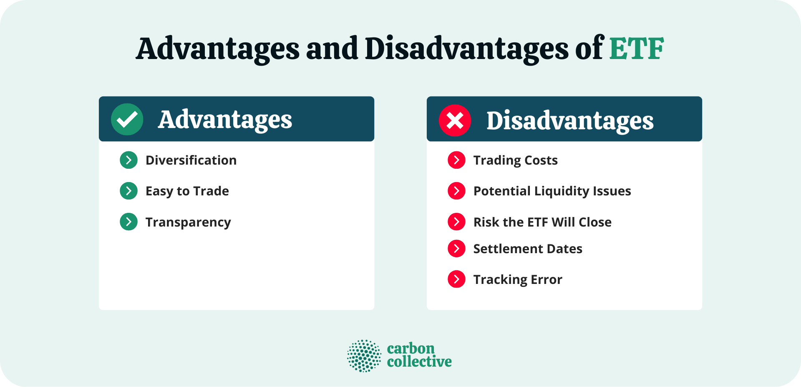

## Table of Contents

## What are Emerging Market ETFs?

Emerging Market ETFs are a type of investment fund that focuses on countries that are still developing their economies. These countries, called emerging markets, include places like Brazil, China, and India. ETFs, or Exchange Traded Funds, are collections of stocks or bonds that you can buy and sell on a stock exchange, just like a single stock. When you invest in an Emerging Market ETF, you're investing in a bunch of companies from these growing economies all at once.

These ETFs can be a good way to spread out your investment risk because they include many different companies and countries. This means if one company or country does poorly, it might not hurt your whole investment as much. However, investing in emerging markets can also be riskier than investing in more developed countries. The economies in these places can be less stable, and there might be more political or economic problems that can affect your investment. So, it's important to think carefully and maybe talk to a financial advisor before you decide to invest in an Emerging Market ETF.

## How do Emerging Market ETFs differ from other ETFs?

Emerging Market ETFs focus on countries that are still growing their economies, like Brazil, China, and India. These ETFs invest in companies from these places, which can be different from other ETFs that might focus on more developed countries like the United States or Europe. The main difference is where they invest. While other ETFs might include big, stable companies from rich countries, Emerging Market ETFs include companies from countries that are still developing.

Because they invest in growing economies, Emerging Market ETFs can be riskier. These countries might have more ups and downs in their economy, and there can be more political or economic problems. This means that while you might have a chance for bigger gains, you also face a higher chance of losing money. On the other hand, other ETFs, like those focused on developed markets, tend to be more stable but might not grow as quickly.

Both types of ETFs let you spread out your investment across many companies, which can help reduce risk. But with Emerging Market ETFs, you're spreading your risk across different countries and companies that are in the process of growing, which can be exciting but also more unpredictable. So, choosing between them depends on how much risk you're willing to take and what kind of growth you're looking for.

## What are the main advantages of investing in Emerging Market ETFs?

One big advantage of investing in Emerging Market ETFs is the chance for high growth. Countries like Brazil, China, and India are growing fast. Their economies are getting bigger, and their companies are expanding. When you invest in an [ETF](/wiki/etf-trading-strategies) that includes these companies, you can benefit from this growth. It's like getting a piece of the action in these booming places. Plus, because these ETFs include many different companies from different countries, you're spreading out your risk. If one company or country doesn't do well, it might not hurt your whole investment as much.

Another advantage is that you can get into these growing markets without having to pick individual stocks. It can be hard to know which companies in these countries will do well. But with an ETF, you're investing in a bunch of them all at once. This makes it easier and less stressful. Plus, ETFs are easy to buy and sell on the stock market, just like a single stock. So, you can quickly adjust your investments if you need to.

## What are the potential risks and disadvantages of Emerging Market ETFs?

Investing in Emerging Market ETFs can be riskier than investing in more developed markets. These countries are still growing their economies, so they can be less stable. There might be big ups and downs in their stock markets, and political or economic problems can happen more often. This means you could lose money if things don't go well in these countries. Also, it can be harder to get good information about companies in emerging markets. This makes it trickier to know if you're making a good investment.

Another risk is that these ETFs might not be as liquid as ETFs focused on developed markets. This means it might be harder to buy or sell them quickly without affecting the price. If lots of people want to sell at the same time, the price could drop a lot. Plus, because these markets can be more volatile, the value of your investment could change a lot in a short time. This can be stressful and might not be right for everyone, especially if you need your money to be more stable.

Even though Emerging Market ETFs can offer high growth potential, they might not always perform as well as expected. Sometimes, the growth in these countries can slow down or face setbacks. This means that while you might be hoping for big gains, you could end up with smaller returns or even losses. So, it's important to think carefully about how much risk you're willing to take before investing in these ETFs.

## How can Emerging Market ETFs contribute to portfolio diversification?

Emerging Market ETFs can help you spread out your investments by including companies from countries that are still growing their economies. When you invest in these ETFs, you're not just putting your money into one company or one country. Instead, you're investing in a bunch of different companies from places like Brazil, China, and India all at once. This means if something goes wrong in one country or with one company, it might not hurt your whole investment as much. It's like not putting all your eggs in one basket.

This kind of diversification can be really helpful because it can lower the risk of your overall investment. If your portfolio only includes stocks from developed countries like the U.S. or Europe, adding some Emerging Market ETFs can balance things out. These ETFs might go up when other parts of your portfolio go down, and vice versa. By mixing in investments from different parts of the world, you're giving yourself a better chance to handle the ups and downs of the market.

## What are some examples of popular Emerging Market ETFs?

One popular Emerging Market ETF is the Vanguard FTSE Emerging Markets ETF (VWO). This ETF includes a lot of different companies from countries like China, Brazil, and India. It's a good way to invest in these growing economies without having to pick individual stocks. People like it because it's big, it's easy to buy and sell, and it doesn't charge a lot of fees.

Another well-known ETF is the iShares MSCI Emerging Markets ETF (EEM). This one also focuses on companies from emerging markets, but it might have a slightly different mix of countries and companies than VWO. It's also easy to buy and sell, and it's popular because it's been around for a long time and has a good track record. Both of these ETFs can help you spread out your investments and maybe get some of the growth from these booming countries.

## How do geopolitical factors affect Emerging Market ETFs?

Geopolitical factors can have a big impact on Emerging Market ETFs. These factors include things like political changes, conflicts, and economic policies in the countries where the ETFs invest. For example, if there's a new government in a country like Brazil or India, they might change the rules for businesses. This can make the stock market in that country go up or down. If there's a war or a big fight between countries, it can scare investors away and make the value of the ETF drop.

Because Emerging Market ETFs include companies from many different countries, what happens in one place can affect the whole ETF. For instance, if there's a trade war between the U.S. and China, it can hurt the Chinese companies in the ETF. This means the ETF's value might go down even if other countries in the ETF are doing well. So, it's important to keep an eye on what's happening around the world because these events can shake up the value of your investment in an Emerging Market ETF.

## What role do currency fluctuations play in the performance of Emerging Market ETFs?

Currency fluctuations can have a big impact on the performance of Emerging Market ETFs. When you invest in these ETFs, you're buying stocks from companies in countries like Brazil, China, and India. These companies earn money in their local currencies, like the Brazilian real or the Chinese yuan. If the value of these currencies goes down compared to the U.S. dollar, the value of your investment can drop, even if the companies are doing well. This is because when the ETF converts the earnings back to dollars, you get less money.

On the other hand, if the local currencies get stronger against the dollar, it can help boost the value of your investment. When the companies' earnings are converted back to dollars, you get more money. So, currency movements can add another layer of risk and reward to your investment in Emerging Market ETFs. It's something to think about because these currency changes can sometimes be big and can affect how much money you make or lose.

## How should one evaluate the expense ratios of Emerging Market ETFs?

When you're looking at Emerging Market ETFs, one thing to check is the expense ratio. This is the fee that the ETF charges you every year for managing your money. It's shown as a percentage of your investment. A lower expense ratio means you pay less in fees, which is good because it leaves more money in your pocket. For example, if you invest $1,000 in an ETF with a 0.1% expense ratio, you'll pay $1 in fees each year. But if the expense ratio is 0.5%, you'll pay $5. Over time, these fees can add up, so it's smart to choose ETFs with lower expense ratios if you can.

However, it's not just about [picking](/wiki/asset-class-picking) the ETF with the lowest expense ratio. You also need to think about what you're getting for that fee. Some ETFs might have higher expense ratios because they include more research or better management. If the ETF performs well and makes you more money than you're paying in fees, it might be worth it. So, when you're comparing expense ratios, also look at how the ETF has done in the past and what kind of companies it includes. This way, you can make a better choice about which Emerging Market ETF is right for your investment goals.

## What are the long-term growth prospects for Emerging Market ETFs?

Emerging Market ETFs have good chances for growing a lot over the long term. Countries like China, India, and Brazil are getting bigger and better at making things. As more people in these places start buying stuff, the companies there can grow faster. This can make the value of the ETFs go up too. Plus, these countries are working on new technology and making their cities better, which can help their economies grow even more. So, if you're looking to invest for many years, Emerging Market ETFs might be a good choice because they can give you a piece of this growth.

But, it's not all easy. These places can have ups and downs because their economies are still growing. Things like political problems or big changes in the world can shake things up. This means your investment might go up and down a lot. Still, if you're okay with some risk and you keep your money in these ETFs for a long time, you might see big rewards. It's like planting a seed and waiting for it to grow into a big tree. It takes time, but it can be worth it.

## How do market liquidity and trading volumes impact Emerging Market ETFs?

Market [liquidity](/wiki/liquidity-risk-premium) and trading volumes are really important for Emerging Market ETFs. Liquidity means how easy it is to buy or sell the ETF without changing its price too much. If an ETF is very liquid, you can quickly buy or sell it without worrying about the price moving a lot. Trading volumes show how many shares of the ETF are bought and sold every day. When trading volumes are high, it usually means the ETF is more liquid. For Emerging Market ETFs, lower liquidity and trading volumes can make it harder to buy or sell them quickly. This can be a problem if you need to get your money out fast or if lots of people want to sell at the same time, which can push the price down.

Emerging Market ETFs often have lower liquidity and trading volumes compared to ETFs that focus on bigger, more developed markets. This is because the markets in places like Brazil, China, and India can be less stable and there might be fewer people trading these ETFs. If you're thinking about investing in an Emerging Market ETF, it's good to check how liquid it is and how many shares are traded each day. This can help you understand how easy it will be to buy or sell your shares when you need to. Keep in mind that while these ETFs can offer big growth over time, the lower liquidity might mean you need to be ready to hold onto your investment for a while.

## What advanced strategies can be used to optimize returns from Emerging Market ETFs?

One way to get the most out of your Emerging Market ETFs is to use a strategy called dollar-cost averaging. This means you put a little bit of money into the ETF every month instead of all at once. This can help you buy more shares when the price is low and fewer when it's high, which can lead to better returns over time. Another strategy is to keep an eye on the economic cycles of the countries in the ETF. For example, if you see that a country like China is starting to grow faster, you might want to put more money into the ETF to catch that growth. On the other hand, if you see that a country is slowing down, you might want to sell some shares to avoid losing money.

Another advanced strategy is to use hedging to protect your investment from currency risks. Since the value of the ETF can go up or down because of changes in the local currencies, you can use financial tools like currency ETFs or options to balance out those changes. This can help keep your returns more stable. Also, you can mix in some ETFs that focus on specific sectors in emerging markets, like technology or energy, if you think those sectors will do well. By spreading your money across different types of ETFs, you can take advantage of different growth opportunities and reduce your risk.

## References & Further Reading

[1]: MSCI. ["MSCI Emerging Markets Index."](https://www.msci.com/indexes/index/891800) Accessed October 2023.

[2]: "Emerging Markets: Analyzing Investment Opportunities," Financial Times. [Link](https://www.ft.com/content/3405a512-5cbb-11e1-8f1f-00144feabdc0)

[3]: Lopez de Prado, M. (2018). ["Advances in Financial Machine Learning"](https://www.amazon.com/Advances-Financial-Machine-Learning-Marcos/dp/1119482089). Wiley.

[4]: Jansen, S. (2020). ["Machine Learning for Algorithmic Trading: Predictive models to extract signals from market and alternative data for systematic trading strategies with Python."](https://github.com/stefan-jansen/machine-learning-for-trading) Packt Publishing.

[5]: Chan, E. P. (2008). ["Quantitative Trading: How to Build Your Own Algorithmic Trading Business"](https://github.com/ftvision/quant_trading_echan_book). Wiley Trading.

[6]: World Bank. ["Emerging Markets Data."](https://www.worldbank.org/en/news/press-release/2024/03/27/world-bank-group-publishes-new-data-aiming-to-boost-investment-in-emerging-markets) Accessed October 2023.