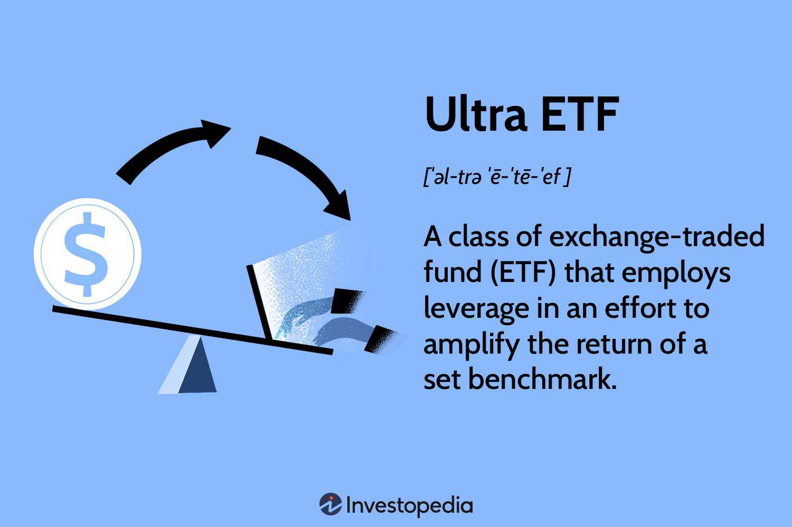

Emerging Market ETFs have become a popular choice for investors seeking portfolio diversification through exposure to rapidly growing economies. These financial instruments are composed of a basket of securities from countries that are transitioning towards more advanced economic markets. Investing in these ETFs provides both opportunities and challenges, shaped by the unique characteristics of emerging markets.

One of the main attractions of Emerging Market ETFs is their potential for high returns. These markets, characterized by fast-paced economic growth and industrialization, often outpace their developed counterparts in terms of GDP growth, offering substantial growth prospects for investors. This growth, however, comes with its own set of risks. The economies in question are often marked by high volatility, geopolitical uncertainties, and currency fluctuations that can significantly impact investment outcomes.



This article provides a comprehensive analysis of the advantages and disadvantages of investing in Emerging Market ETFs. It further discusses how algorithmic trading can be integrated into investment strategies related to these ETFs, offering potential for enhanced trade execution and risk management. We will also examine what Emerging Market ETFs are, how they function, and how they can be effectively incorporated into a broader investment strategy. This lays a foundation for assessing whether these financial products align with individual investment goals and risk tolerance levels.

## Table of Contents

## What Are Emerging Market ETFs?

An emerging market ETF (Exchange-Traded Fund) is a type of investment fund that invests in the equities of countries with economies that are in the process of progressing towards becoming more advanced, typically through industrialization and economic growth. These economies are termed as 'emerging markets,' and such ETFs are designed to provide investors with exposure to these developing regions, which are characterized by higher growth potential compared to developed markets.

Emerging market ETFs typically include a diverse array of stocks from several regions including Latin America, Asia, and Eastern Europe. For instance, countries like China, India, Brazil, Russia, and South Africa are often categorized as emerging markets due to their rapid economic development and increasing integration into the global economy. The inclusion of stocks from these areas offers investors a chance to participate in the expanding economic activities of these nations.

Generally, these ETFs are passively managed, meaning they aim to replicate the performance of a specific index relevant to emerging markets, rather than trying to outperform it through active trading strategies. The advantage of passive management is that it can often lead to lower management fees, making these funds more cost-effective for investors compared to actively managed funds. A widely used index for emerging market ETFs is the MSCI Emerging Markets Index, which tracks the performance of large- and mid-cap companies across 24 emerging market countries.

Investors need to understand the underlying indexes that these ETFs follow, as well as the specific stocks included in them. The selection criteria for these stocks generally revolve around market capitalization, economic representation, and [liquidity](/wiki/liquidity-risk-premium) of the companies in the respective countries. This understanding is crucial because the performance of these ETFs is heavily influenced by the economic health and geopolitical stability of the countries whose equities are included in the fund. Hence, changes in political climate, regulatory environment, and economic policies in these regions can significantly impact the [ETF](/wiki/etf-trading-strategies)'s returns.

In conclusion, emerging market ETFs are investment vehicles designed to tap into the growth potential of developing economies by investing in a diverse range of equities. Their passive management and focus on broad market indexes enable investors to gain access to these markets while enjoying benefits such as lower fees, diversification, and potential for significant growth. However, understanding the economic, political, and market factors that influence these ETFs is vital for making informed investment decisions.

## Pros of Investing in Emerging Market ETFs

Emerging market ETFs have gained popularity among investors due to their potential to offer substantial growth opportunities. These ETFs target equities in countries experiencing rapid economic development and promise higher returns compared to their developed market counterparts. Historical data supports this high growth potential, as emerging markets often experience accelerated GDP growth, infrastructure development, and increasing consumer markets. Economic indicators from these regions have frequently outpaced those of developed nations, showcasing their potential for investors seeking amplified returns ([World Bank](https://data.worldbank.org/)).

Diverse portfolio opportunities are another significant advantage of emerging market ETFs. These investment vehicles allow investors to diversify their portfolios by encompassing various sectors across different economies. For instance, an ETF might include technology stocks from Asia, mining companies from Latin America, and automotive firms from Eastern Europe. This diversification is crucial because it spreads investment risks across different industries and geopolitical environments, reducing potential negative impacts from isolated economic downturns.

Liquidity is a notable benefit when considering emerging market ETFs. Unlike traditional mutual funds that can have restrictions on trading frequency and settlements, ETFs are traded on major stock exchanges, providing investors with the flexibility to enter and [exit](/wiki/exit-strategy) positions with relative ease. This accessibility allows investors to manage their portfolios more dynamically and react swiftly to shifting market conditions.

Another advantageous aspect of emerging market ETFs is their cost-effectiveness. Typically, these ETFs incur lower fees compared to actively managed funds. This cost efficiency arises because emerging market ETFs are generally passively managed, tracking specific indexes with less frequent buying and selling of assets. This passive management style leads to reduced expense ratios, which can be particularly appealing for cost-conscious investors. Furthermore, these reduced operational costs do not significantly detract from the potential for substantial returns, making emerging market ETFs a financially appealing option.

## Cons of Investing in Emerging Market ETFs

Investing in Emerging Market ETFs presents several challenges that potential investors need to consider before committing their capital. Firstly, high [volatility](/wiki/volatility-trading-strategies) is a notable characteristic of emerging market economies. These markets often experience significant price swings due to various factors such as economic instability, fluctuating interest rates, and changes in domestic policy. Investors should be prepared for the possibility of rapid value fluctuations in their ETF holdings, which can impact both short-term and long-term investment outcomes.

Geopolitical risk is another critical consideration. Emerging markets can be particularly vulnerable to political changes, conflicts, and regional instability. These factors can influence investor confidence and lead to market unpredictability. Notable examples include changes in government, policy reforms, and civil unrest, which can affect market performance and lead to sudden shifts in ETF values.

Currency risk is an inherent issue with emerging market investments. These markets often involve exposure to foreign exchange fluctuations, which can significantly impact returns. Since emerging market currencies can be volatile, ETF investors face the risk of currency depreciation eroding their gains. Currency risk can be quantitatively assessed by looking at historical exchange rate fluctuations, though future movements remain unpredictable.

Expense ratios for emerging market ETFs can be higher compared to those that focus on developed markets. The increased cost is attributed to the complexities involved in operating in less stable environments, including higher transaction costs and additional research required to manage the fund. These expenses can impact the overall returns of the ETF, making it essential for investors to weigh the cost against the potential gains. 

In summary, while emerging market ETFs offer distinct advantages, the associated risks such as high volatility, geopolitical uncertainties, currency risk, and higher expense ratios require careful consideration. Investors should conduct thorough research and adopt strategies that address these challenges to optimize their investment outcomes.

## Algorithmic Trading and Emerging Market ETFs

Algorithmic trading involves using computer algorithms to execute trades at high frequencies and volumes, based on predetermined criteria. This approach is particularly advantageous in trading emerging market ETFs due to its ability to quickly adapt to market inefficiencies and rapid price movements. 

Emerging markets are known for their high volatility and frequent market shifts, which can provide both opportunities and challenges for investors. Algorithmic trading can exploit these opportunities by analyzing vast amounts of data at speeds unattainable by human traders, enabling the capture of short-term gains.

Algorithms can be programmed to automatically execute trades when certain market conditions are met, freeing investors from the need to manually monitor the market. For example, an algorithm may be designed to execute a buy order when the price of an ETF drops below a certain threshold, indicating a potential undervaluation. Conversely, it might sell when a rapid price increase suggests overvaluation. Simple conditional statements in Python could be used to simulate such trading decisions:

```python
def trade_signal(price, lower_threshold, upper_threshold):
    if price < lower_threshold:
        return "Buy"
    elif price > upper_threshold:
        return "Sell"
    else:
        return "Hold"

# Example usage:
current_price = 100
lower_threshold = 95
upper_threshold = 105
signal = trade_signal(current_price, lower_threshold, upper_threshold)
print(f"Trade Signal: {signal}")
```

Risk management is another crucial aspect where [algorithmic trading](/wiki/algorithmic-trading) shines. Emerging markets are susceptible to geopolitical events, regulatory changes, and abrupt currency fluctuations, which can introduce significant risks. Algorithms can incorporate risk management strategies such as stop-loss orders, which automatically sell an asset when it hits a certain price, limiting potential losses. Additionally, predictive analytics can forecast potential risks based on historical data, enabling preemptive action.

By employing quantitative models and leveraging [machine learning](/wiki/machine-learning), algorithms can continuously refine trading strategies and improve decision-making processes. For instance, machine learning models can analyze large datasets to identify patterns that signal market volatility or stability, allowing algorithms to adjust dynamically.

Overall, integrating algorithmic trading with emerging market ETFs offers a strategic advantage by enhancing the ability to react swiftly to market conditions, optimizing trade execution, and applying robust risk management techniques. However, the effectiveness of these algorithms relies heavily on the quality of data inputs and the sophistication of the trading models. Consequently, investors must rigorously back-test their algorithms and continuously monitor their performance to ensure optimal results in the ever-evolving landscape of emerging markets.

## Conclusion

Investing in emerging market ETFs offers investors the potential for considerable rewards due to their high growth prospects and the diversification benefits they provide. Emerging markets are often characterized by rapid economic development and expanding middle classes, which can create significant opportunities for capital appreciation. These characteristics make emerging market ETFs an attractive option for those seeking to enhance their portfolio's growth potential while gaining exposure to a variety of global economies.

However, the promising prospects of emerging market ETFs come with their own set of challenges. Investors must carefully consider the inherent risks associated with these markets, including high volatility and geopolitical instability. Emerging economies can experience substantial price fluctuations, often influenced by political changes, regulatory shifts, and regional conflicts. Furthermore, currency risk remains a significant [factor](/wiki/factor-investing), as exchange rate fluctuations can dramatically impact investment returns.

The integration of algorithmic trading into investment strategies for emerging market ETFs can provide a competitive edge. Algorithmic trading can help investors capitalize on market inefficiencies and respond to rapid price changes more effectively. By automating trades and employing sophisticated risk management techniques, investors can potentially mitigate some of the risks inherent to these markets and achieve better investment outcomes.

Ultimately, a balanced approach is essential for successfully investing in emerging market ETFs. Thorough research and a comprehensive understanding of the specific characteristics of these markets are vital. Incorporating robust risk management strategies and remaining adaptable to market changes can further enhance the potential for success. As investors navigate the complexities of emerging markets, a well-informed and diligent investment approach is crucial to realizing the rewards while managing the associated risks.

## References & Further Reading

[1]: MSCI. ["MSCI Emerging Markets Index."](https://www.msci.com/indexes/index/891800) Accessed October 2023.

[2]: "Emerging Markets: Analyzing Investment Opportunities," Financial Times. [Link](https://www.ft.com/content/3405a512-5cbb-11e1-8f1f-00144feabdc0)

[3]: Lopez de Prado, M. (2018). ["Advances in Financial Machine Learning"](https://www.amazon.com/Advances-Financial-Machine-Learning-Marcos/dp/1119482089). Wiley.

[4]: Jansen, S. (2020). ["Machine Learning for Algorithmic Trading: Predictive models to extract signals from market and alternative data for systematic trading strategies with Python."](https://github.com/stefan-jansen/machine-learning-for-trading) Packt Publishing.

[5]: Chan, E. P. (2008). ["Quantitative Trading: How to Build Your Own Algorithmic Trading Business"](https://github.com/ftvision/quant_trading_echan_book). Wiley Trading.

[6]: World Bank. ["Emerging Markets Data."](https://www.worldbank.org/en/news/press-release/2024/03/27/world-bank-group-publishes-new-data-aiming-to-boost-investment-in-emerging-markets) Accessed October 2023.