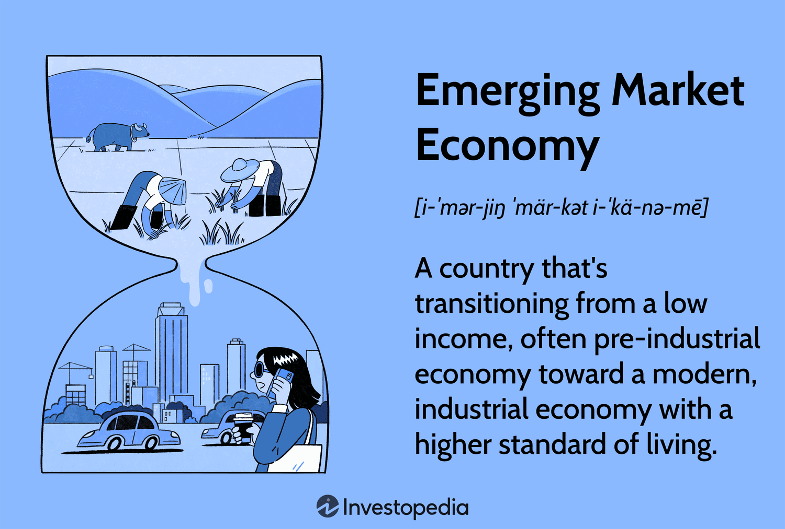

## Table of Contents

## What is an emerging market fund?

An emerging market fund is a type of investment fund that focuses on buying stocks, bonds, or other financial assets from countries that are considered to be in the early stages of economic development. These countries often have growing economies and are working on improving their industries and infrastructure. Examples of emerging markets include countries like Brazil, India, and China. Investing in these funds can offer the potential for high returns because these economies are growing quickly, but they also come with higher risks due to political instability, currency fluctuations, and less developed financial systems.

When you invest in an emerging market fund, you are spreading your money across many different companies and countries within these developing regions. This diversification can help reduce some of the risks because if one investment does poorly, others might do well. However, it's important to understand that these funds can be more volatile than funds that invest in more established markets like the United States or Europe. As a result, they might not be suitable for everyone, especially those who are more cautious with their investments or who need their money in the short term. Always consider your own financial goals and risk tolerance before deciding to invest in an emerging market fund.

## Why might an investor consider investing in an emerging market fund?

An investor might consider putting money into an emerging market fund because these funds can offer the chance for big gains. Countries like Brazil, India, and China are growing fast. When their economies do well, the companies in these countries can do well too. This means the stocks and bonds in the fund could go up in value, making the investor's money grow. It's like getting in on the ground floor of a new and exciting place where businesses are expanding and more people are buying things.

But there are also good reasons to be careful. Emerging markets can be riskier than more stable places like the United States or Europe. Things like political problems, sudden changes in currency value, or less reliable financial systems can make these investments go up and down a lot. That's why it's important for an investor to think about how much risk they can handle and how long they plan to keep their money invested. If they're okay with the ups and downs and can wait for the long term, an emerging market fund might be a good choice for them.

## What are the common types of emerging market funds?

There are a few common types of emerging market funds that investors can choose from. One type is an equity fund, which mainly invests in stocks of companies from emerging markets. These funds aim to grow by buying shares in businesses that are expected to do well as their countries develop. Another type is a bond fund, which focuses on buying government or corporate bonds from these countries. Bond funds can provide regular income and might be less risky than equity funds, but they still [carry](/wiki/carry-trading) risks related to the stability of the issuing country.

A third type is a blended fund, which mixes both stocks and bonds from emerging markets. This can help balance the risk and reward, giving investors a bit of both growth and income. Some funds also specialize in certain regions, like Latin America or Asia, while others spread their investments across many different emerging markets to diversify even more. Each type of fund has its own way of trying to make money and its own level of risk, so it's important for investors to pick the one that fits their goals and how much risk they're willing to take.

## How do emerging market funds differ from developed market funds?

Emerging market funds and developed market funds are different in a few big ways. Emerging market funds invest in countries that are still growing and developing, like Brazil, India, and China. These places can offer big chances for growth because their economies are getting bigger, and more people are starting to buy things. But, these funds can also be riskier because these countries might have problems with politics, money values changing a lot, and their financial systems might not be as strong as in other places.

On the other hand, developed market funds invest in countries that are already rich and stable, like the United States, Japan, and Germany. These funds usually have less risk because these countries have strong economies, good financial systems, and more stable governments. But, because they are already developed, they might not grow as fast as emerging markets. So, while they might be safer, the chance for big gains might not be as high.

In summary, choosing between an emerging market fund and a developed market fund depends on what an investor wants. If they're looking for big growth and are okay with more risk, an emerging market fund might be the way to go. But if they want something safer with steady growth, a developed market fund could be a better fit.

## What are the risks associated with investing in emerging market funds?

Investing in emerging market funds can be exciting because these countries are growing fast. But it also comes with big risks. One big risk is political instability. Governments in these countries can change suddenly, and new leaders might make different rules that can hurt businesses and the economy. Another risk is currency fluctuations. The money in these countries can change in value a lot compared to dollars or euros, which can make your investment worth less when you want to take your money out. 

Another thing to watch out for is the financial systems in these countries. They might not be as strong or well-regulated as in developed countries, which can lead to problems like companies not being honest about their money or banks getting into trouble. Also, these markets can be more volatile, meaning the prices of stocks and bonds can go up and down a lot more than in developed markets. This can be scary if you need your money soon, because you might have to sell your investments when they are worth less.

So, while emerging market funds can offer the chance for big gains, they come with higher risks. It's important for investors to think about how much risk they can handle and how long they plan to keep their money invested. If you're okay with the ups and downs and can wait for the long term, an emerging market fund might be a good choice. But if you need your money soon or can't handle big swings in value, you might want to look at other options.

## How can one evaluate the performance of an emerging market fund?

To evaluate the performance of an emerging market fund, you need to look at a few key things. First, check the fund's returns over different periods of time, like one year, three years, and five years. This will show you how the fund has done over the short term and the long term. It's also good to compare these returns to a benchmark, like an index that tracks emerging markets. If the fund is doing better than the benchmark, it's a good sign. But remember, past performance doesn't guarantee future results, so don't rely on it too much.

Another thing to look at is the fund's risk. You can do this by checking the fund's [volatility](/wiki/volatility-trading-strategies), which tells you how much the fund's value goes up and down. A higher volatility means more risk, but it can also mean more chance for big gains. Also, look at the fund's expense ratio, which is how much it costs to run the fund. A lower expense ratio means more of your money stays invested, which can help your returns over time. By looking at these things, you can get a good idea of how well an emerging market fund is doing and if it's a good fit for your investment goals.

## What role do emerging market funds play in a diversified investment portfolio?

Emerging market funds can be a helpful part of a diversified investment portfolio. They let you spread your money across different countries that are growing quickly, like Brazil, India, and China. By adding these funds to your portfolio, you're not putting all your eggs in one basket. This can help protect your money because if one part of your investments does badly, the other parts might do well. It's like having a safety net that can catch you if one of your investments falls.

But, it's important to remember that these funds come with more risk. The countries they invest in can have problems with politics or sudden changes in money value, which can make the fund go up and down a lot. That's why you need to think about how much risk you can handle before adding emerging market funds to your portfolio. If you're okay with the ups and downs and can wait for the long term, these funds can be a good way to grow your money while keeping your investments spread out.

## Can you explain the impact of currency fluctuations on emerging market funds?

Currency fluctuations can have a big impact on emerging market funds. When you invest in these funds, you're buying stocks or bonds from countries like Brazil or India. If the currency of these countries gets weaker compared to your home currency, like the US dollar, it can make your investment worth less when you want to take your money out. For example, if you invest $100 and the Brazilian real gets weaker, you might get back less than $100 when you convert it back to dollars.

On the other hand, if the currency of the emerging market gets stronger, it can make your investment worth more. So, currency fluctuations can add another layer of risk and reward to your investment. It's important to keep an eye on what's happening with these currencies because they can change a lot and affect how much money you make or lose from your emerging market fund.

## What are some strategies for mitigating risks in emerging market funds?

One way to lessen the risks when investing in emerging market funds is to spread your money around. Instead of putting all your money into one country or one type of investment, you can choose funds that invest in many different countries and types of assets. This way, if one country or investment does badly, the others might do well and help balance things out. Another strategy is to invest for the long term. Emerging markets can go up and down a lot in the short term, but over many years, they can grow a lot. If you can wait a long time before needing your money, you might be able to ride out the ups and downs and still make good returns.

Another thing you can do is to keep an eye on what's happening in the world. Things like changes in government, big economic news, or even natural disasters can affect emerging markets a lot. By staying informed, you can make better choices about when to buy or sell your investments. Also, think about using funds that are run by experienced managers who know a lot about emerging markets. They might be able to make smarter choices about where to invest your money and help protect it from big losses.

## How do geopolitical factors affect emerging market funds?

Geopolitical factors can have a big impact on emerging market funds. These are things like changes in government, wars, or big disagreements between countries. When these things happen, they can make the economy of a country go up and down a lot. For example, if a new government comes in and makes new rules that are bad for businesses, the stocks and bonds in that country might lose value. This can hurt the performance of an emerging market fund that invests in that country.

Because of this, it's important for investors to keep an eye on what's happening in the world. News about politics or big events can change how well an emerging market fund does. If a country is having a lot of problems, it might be a good idea to take some money out of that fund or not invest in it at all. On the other hand, if a country is doing well and things are stable, it might be a good time to put more money into that fund. By staying informed and being ready to make changes, investors can better handle the risks that come with geopolitical events.

## What are the tax implications of investing in emerging market funds?

When you invest in emerging market funds, you need to think about taxes. The money you make from these funds can be taxed in different ways. If you get dividends, which are payments from the companies the fund invests in, you'll have to pay taxes on them. The same goes for any capital gains, which is the money you make when you sell your investment for more than you paid for it. The tax rate can be different depending on where you live and how long you held the investment. In the United States, for example, long-term capital gains, which are gains from investments held for more than a year, are usually taxed at a lower rate than short-term gains.

Another thing to keep in mind is that some countries where the fund invests might also take a cut of your earnings through their own taxes. This is called foreign withholding tax. It can make the amount of money you take home a bit less. But, some countries have agreements with each other to help reduce this tax, so it's good to check if the country you're investing in has such an agreement with your home country. Remember, tax laws can change, so it's always a good idea to talk to a tax advisor to understand how your investments in emerging market funds will be taxed and how you can make the most of them.

## How do emerging market funds contribute to global economic development?

Emerging market funds help global economic development by giving money to companies and governments in countries that are still growing. When investors put money into these funds, it goes to businesses in places like Brazil, India, and China. This money helps these businesses grow bigger, hire more people, and make more things. When businesses do well, they can help the whole country's economy get stronger. This can lead to more jobs and better lives for people in these countries.

Also, when emerging market funds do well, they can attract more investors from around the world. This extra money can help these countries build better roads, schools, and hospitals. It's like a cycle: as more money comes in, the economy grows, and then even more investors want to be part of it. This can help lift whole countries out of poverty and make the world a more equal place. So, by investing in emerging market funds, people are not just trying to make money for themselves, but they're also helping other countries grow and develop.

## References & Further Reading

[1]: Bekaert, G., & Harvey, C. R. (2003). ["Emerging Markets Finance."](https://onlinelibrary.wiley.com/doi/abs/10.1111/1475-6803.00059) Journal of Empirical Finance.

[2]: Bodie, Z., Kane, A., & Marcus, A. J. (2014). ["Investments"](https://www.mheducation.com/highered/product/Investments-Bodie.html) (10th Edition). McGraw-Hill Education.

[3]: Lopez de Prado, M. (2018). ["Advances in Financial Machine Learning"](https://www.amazon.com/Advances-Financial-Machine-Learning-Marcos/dp/1119482089) Wiley.

[4]: Erb, C. B., Harvey, C. R., & Viskanta, T. E. (1996). ["Expected Returns and Volatility in 135 Countries."](https://www.semanticscholar.org/paper/Expected-Returns-and-Volatility-in-135-Countries-in-Erb-Harvey/63a2f19f6caace6c243a0c313733d6dee6f495d6) Journal of Portfolio Management.

[5]: Jansen, S. (2020). ["Machine Learning for Algorithmic Trading."](https://github.com/stefan-jansen/machine-learning-for-trading) Packt Publishing.