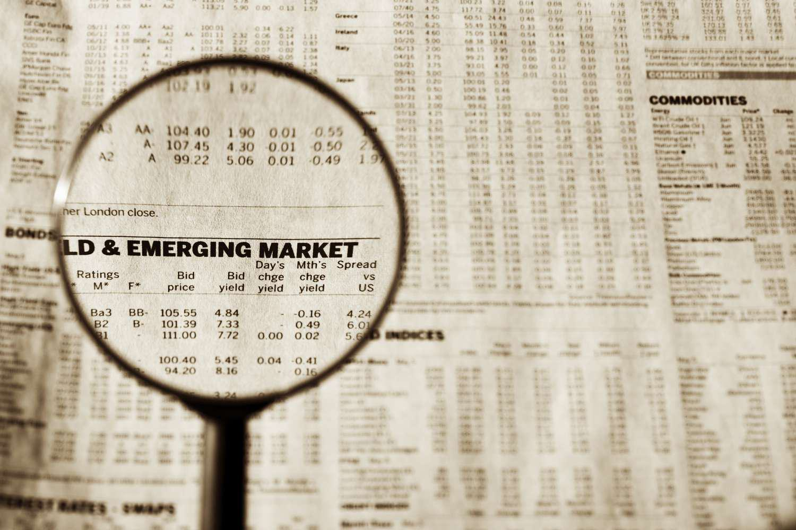

The global investment landscape is undergoing constant transformation, with emerging market funds playing a pivotal role in delivering promising opportunities for investors. Emerging markets are characterized by rapid economic expansion, increased consumer spending, and industrial growth, attracting substantial interest from those seeking higher returns. These economies offer fertile ground for investment, differentiating them remarkably from their developed counterparts.

Emerging market funds are designed to capitalize on these opportunities by investing in securities that originate predominantly from developing economies. Such funds aim to leverage the high-growth potential of countries transitioning through economic progress. In this article, we will examine the various forms of these funds, the investment opportunities they present, and the impact of algorithmic trading in shaping strategic approaches within these high-growth areas.



The realm of emerging market investments is broad, comprising mutual funds, exchange-traded funds (ETFs), and other investment formats that enable investors to participate in the economic boom of these regions. By understanding the types of funds and their intrinsic functions, investors can make informed choices in allocating their capital.

Moreover, the advent of algorithmic trading has revolutionized investment strategies globally, including in emerging markets. Algorithmic trading's role in enhancing the efficiency of transactions and risk management provides investors with sophisticated tools to navigate these complex markets.

This article also offers practical financial examples to demonstrate the potential for growth alongside the inherent risks associated with emerging market investments. By dissecting these elements, investors may gain valuable insights into maximizing their investment returns while tactfully managing risks in these vibrant yet volatile markets.

## Table of Contents

## What Are Emerging Market Funds?

Emerging market funds are investment vehicles primarily concentrated on securities from countries with developing economies. These economies, often characterized by rapid economic growth and increasing industrialization, provide attractive opportunities for investors seeking higher potential returns compared to traditional, developed markets. Emerging market funds can encompass a variety of investment formats, including mutual funds, exchange-traded funds (ETFs), and closed-end funds, catering to a range of investment strategies and risk appetites.

Mutual funds are one of the most common forms of emerging market funds, offering a pool of capital collected from many investors to purchase a diversified portfolio of stocks, bonds, and other securities from developing countries. Investors in these funds benefit from professional management and diversification, which can mitigate some specific risks associated with investing in singular emerging market assets.

Exchange-traded funds (ETFs) are another popular form, providing investors with exposure to indices tracking stocks or bonds within emerging markets. ETFs trade on stock exchanges similar to individual stocks, offering the flexibility of intra-[day trading](/wiki/day-trading-spy). They usually have lower expense ratios compared to mutual funds, making them cost-effective options for investors. Moreover, ETFs provide transparency, as they typically disclose their holdings on a daily basis.

In addition to mutual funds and ETFs, closed-end funds offer another pathway into emerging markets. These funds issue a fixed number of shares traded in the open market, allowing investors to buy and sell shares throughout the trading day at market-determined prices. Unlike mutual funds, closed-end funds are not obligated to issue new shares or redeem existing ones, potentially leading to premiums or discounts on their underlying net asset value (NAV).

Investors interested in emerging market funds should consider the unique characteristics of these economies, including their growth potential and inherent [volatility](/wiki/volatility-trading-strategies). The high-growth prospects are driven by factors such as increasing consumer demand, urbanization, and infrastructure development. However, these markets also present significant risks, including political instability, currency fluctuations, and regulatory uncertainties. Thus, informed investment decisions should balance the potential for high returns with a thorough assessment of associated risks.

## Types of Emerging Market Investments

Emerging market investments can be categorized into three main types: debt, equity, and alternative investments. Each category possesses unique characteristics that cater to different investor needs and risk appetites.

Debt investments in emerging markets typically consist of bonds issued by governments or corporations within these developing economies. These bonds offer a fixed return over a specified period and are considered less risky than equity investments, albeit with lower potential returns. Investors lend money to issuers in exchange for periodic interest payments and the return of principal upon maturity. The allure of emerging market bonds lies in their higher yield compared to bonds from developed countries, compensating for the increased risk associated with economic and political uncertainties in these regions.

Equity investments involve purchasing stocks of companies operating in emerging markets. These investments provide ownership stakes in businesses and the potential for capital appreciation as these economies expand. The growth prospects in emerging markets are often driven by demographic trends, urbanization, and technological advancements, leading to robust returns. However, the volatility of equity markets in developing economies can be significantly higher than in developed counterparts, requiring investors to be vigilant about market conditions and company performance.

Alternative investments offer exposure to emerging markets through non-traditional avenues, including private equity, real estate, and infrastructure projects. Private equity involves investing in privately held companies, providing capital for expansion or management buyouts. This investment type carries high risk but can yield substantial returns as companies mature. Real estate investments focus on acquiring properties in rapidly growing urban areas, driven by increasing populations and economic development. Infrastructure investments fund essential projects like transportation, utilities, and communication networks, capitalizing on the burgeoning demand in emerging markets.

Collectively, these investment types present a spectrum of opportunities for investors seeking to capitalize on the dynamic growth in emerging markets, albeit with varying levels of risk and return.

## Financial Examples of Emerging Market Investments

The American Funds Emerging Markets Bond Fund is a prime example of how investors can gain exposure to high-growth regions through debt instruments. This fund primarily invests in debt securities issued by governments and corporations situated within emerging markets. By doing so, it seeks to take advantage of the higher yield premiums often associated with these regions, compared to those found in developed markets. The fund's strategy typically involves a diversified approach, spreading investments across various countries and sectors to mitigate risks such as political instability and currency fluctuations that are prevalent in these markets. Investors gain the prospect of enhanced returns owing to the generally higher interest rates and potential appreciation of emerging market currencies.

On the equity side, the American Century Emerging Markets Fund showcases the potential of investing in stocks from countries like China, Taiwan, and India. This fund allocates its capital into companies that are positioned well to leverage economic growth within their respective regions. The focus often lies on sectors experiencing rapid expansion, such as technology, consumer goods, and financial services. This approach allows the fund to benefit from the burgeoning middle class and increasing consumer spending in these economies. Investors in this fund potentially benefit not only from capital appreciation but also from dividend income, reflecting the overall performance and profitability of the underlying companies.

Both these funds illustrate the diversification benefits and growth opportunities inherent in emerging market investments. By spreading investments across a range of financial instruments and geographic locations, these funds offer a balanced approach to capitalizing on the potential high returns available in developing economies, while simultaneously addressing the associated risks. This diversification can help cushion against specific economic or political disruptions in any single market, thereby providing a more stable and potentially rewarding investment experience.

## Algorithmic Trading in Emerging Markets

Algorithmic trading has significantly reshaped the interaction between investors and emerging markets, leveraging computational algorithms to execute trades at speeds and efficiencies beyond human capabilities. This transformation primarily hinges on the systematic use of data analysis, trading algorithms, and automation. 

Algorithmic trading involves using pre-set mathematical models to decide on trading actions, utilizing data-driven strategies to identify profitable opportunities and mitigate risk. One of the primary benefits of [algorithmic trading](/wiki/algorithmic-trading) in emerging markets is enhanced risk management. Algorithms are designed to process vast amounts of market data quickly, allowing investors to identify trends and anomalies indicative of potential risks or opportunities. For instance, Python libraries like Pandas and NumPy are often employed for data manipulation and analysis, enabling traders to handle large datasets efficiently.

Consider a simple moving average crossover strategy, a common algorithmic trading strategy. This involves buying stocks when a short-term moving average crosses above a long-term moving average and selling when the opposite occurs. A Python implementation might look like this:

```python
import pandas as pd

# Load market data
data = pd.read_csv('emerging_market_data.csv')

# Calculate short-term and long-term moving averages
short_term = data['Close'].rolling(window=20).mean()
long_term = data['Close'].rolling(window=50).mean()

# Generate trading signals
signals = pd.DataFrame(index=data.index)
signals['signal'] = 0.0
signals['signal'][20:] = np.where(short_term[20:] > long_term[20:], 1.0, 0.0)
signals['positions'] = signals['signal'].diff()
```

This code exemplifies how algorithmic trading can make decision-making more objective and data-driven, minimizing human biases and emotional decision-making. 

The rise of algorithmic trading in emerging markets also offers advantages in strategy optimization. Advanced algorithms can adapt to new data and learn from market behavior, thus continuously refining their trading strategies. Machine learning models, such as neural networks or support vector machines, are frequently used to interpret complex patterns or predict future price movements. 

Moreover, algorithmic trading allows for automated trading strategy implementation, facilitating swift execution and adjustment of orders based on algorithmic conclusions without manual intervention. This is particularly beneficial in volatile emerging markets, where rapid changes can significantly affect investment returns.

Overall, the adoption of algorithmic trading in emerging markets empowers investors to enhance performance and mitigate risks by leveraging technology to interpret market complexities and execute informed trades efficiently.

## Risks and Challenges of Investing in Emerging Markets

Investing in emerging markets presents both attractive growth prospects and numerous challenges that require careful consideration. Political and economic instability are primary concerns for investors. Governments in these regions may experience frequent changes in leadership, or face issues such as corruption, which can adversely affect the investment climate. Economic instability might arise from factors like inflation, fiscal deficits, and underdeveloped financial systems, potentially leading to unpredictable investment outcomes.

Currency fluctuations pose another significant risk. Emerging markets often have volatile currencies, influenced by their economic conditions and global market sentiment. For instance, if an investor's home currency strengthens against the currency of the emerging market they are invested in, the value of their investment in terms of the home currency decreases. Investors must [factor](/wiki/factor-investing) in foreign exchange risk when making investment decisions in these regions.

Market volatility is inherent to emerging markets. These markets tend to react sharply to global economic changes, geopolitical events, and shifts in investor sentiment. This volatility can lead to rapid and significant price movements, amplifying both potential gains and losses. For example, sudden capital outflows can lead to market declines, affecting asset prices across various sectors.

Limited transparency is another challenge. Emerging markets often have less stringent regulatory environments compared to developed markets, which can result in less reliable financial information and lower levels of corporate governance. Investors may face difficulties in obtaining accurate data on companies and economic conditions, complicating informed decision-making.

A comprehensive understanding of these risks is essential for effective investment strategies in emerging markets. Strategies such as diversification across different regions and sectors, hedging against currency risk, and monitoring political and economic updates can help mitigate some of these challenges. Additionally, technology such as algorithmic trading can support investors by providing tools for real-time data analysis and strategy implementation, thus enhancing decision-making capabilities in volatile environments.

## Conclusion: Navigating the Emerging Markets Landscape

Investing in emerging markets presents both rewarding opportunities and significant challenges, a balance that requires strategic planning and effective risk management. The potential for high returns is attractive, particularly in nations with rapid economic growth and development. However, these opportunities come with inherent risks such as political instability, currency fluctuations, and market volatility.

The integration of algorithmic trading has provided investors with advanced tools to navigate these volatile markets more effectively. By utilizing data-driven strategies that allow for enhanced risk assessment and strategic optimization, investors can make more informed decisions. Algorithmic trading can automate complex processes like data analysis and execution of trades, allowing for quicker response to market changes, which is crucial in dynamic emerging economies.

Understanding the various types of emerging market funds is essential for investors aiming to harness these opportunities. Whether through debt, equity, or alternative investments such as private equity and real estate, each vehicle offers distinct benefits and risks. Recognizing these distinctions enables investors to tailor their portfolios according to their risk tolerance and growth expectations.

Evaluating practical examples of emerging market investments can provide valuable insights into their growth potential and the diversification they offer. Funds like the American Funds Emerging Markets Bond Fund and the American Century Emerging Markets Fund highlight the range of possibilities within debt and equity investments, respectively.

Addressing the challenges associated with emerging markets is equally crucial. Effective risk management requires a comprehensive understanding of market conditions, legal frameworks, and socio-political climates. This ensures that investors are not only prepared to capitalize on growth opportunities but are also equipped to mitigate potential downsides.

In conclusion, investing in emerging markets is a strategic endeavor that, when navigated skillfully, can result in significant returns. The fusion of strategic investment planning, comprehensive market understanding, and the utilization of technological advancements such as algorithmic trading allows investors to effectively engage with these thriving markets. By acknowledging and preparing for the risks, while engaging with the lucrative aspects of emerging markets, investors can position themselves to capitalize on the growth these regions continue to offer.

## References & Further Reading

[1]: Bekaert, G., & Harvey, C. R. (2003). ["Emerging Markets Finance."](https://onlinelibrary.wiley.com/doi/abs/10.1111/1475-6803.00059) Journal of Empirical Finance.

[2]: Bodie, Z., Kane, A., & Marcus, A. J. (2014). ["Investments"](https://www.mheducation.com/highered/product/Investments-Bodie.html) (10th Edition). McGraw-Hill Education.

[3]: Lopez de Prado, M. (2018). ["Advances in Financial Machine Learning"](https://www.amazon.com/Advances-Financial-Machine-Learning-Marcos/dp/1119482089) Wiley.

[4]: Erb, C. B., Harvey, C. R., & Viskanta, T. E. (1996). ["Expected Returns and Volatility in 135 Countries."](https://www.semanticscholar.org/paper/Expected-Returns-and-Volatility-in-135-Countries-in-Erb-Harvey/63a2f19f6caace6c243a0c313733d6dee6f495d6) Journal of Portfolio Management.

[5]: Jansen, S. (2020). ["Machine Learning for Algorithmic Trading."](https://github.com/stefan-jansen/machine-learning-for-trading) Packt Publishing.