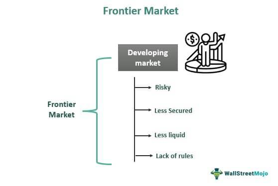

The investment landscape offers a wide array of opportunities, yet few areas garner as much attention as frontier and emerging markets. These markets present a compelling case for investors seeking substantial gains, primarily due to the dynamic economic environments they encompass. Frontier and emerging markets are often characterized by rapid growth and transition, making them attractive but also challenging for investors looking to expand their portfolios.

Aggressive investors, motivated by the potential for high returns, often seek out these markets. Their allure lies in the promise of financial growth that exceeds what's typically observed in developed markets. Frontier markets, though less developed, offer untapped opportunities and the potential for significant returns, albeit with heightened risks. On the other hand, emerging markets exhibit growth indicators that suggest they are on the verge of becoming developed economies, providing a blend of risk and stability that appeals to adventurous investors.



In recent years, advancements in investment strategies, particularly algorithmic trading, have further transformed how investors approach these markets. Algorithmic trading, known for its efficiency and precision, is increasingly being employed to navigate the complexities of high-risk investments associated with these economies. By leveraging algorithmic tools, investors can manage the volatility and unpredictability inherent in frontier and emerging markets, optimizing their strategies to achieve their financial objectives.

This article aims to compare frontier markets with emerging markets while exploring the influence of algorithmic trading on investment strategies. By understanding the distinctions and opportunities presented by each market type, investors can better position themselves to capitalize on the potential gains while mitigating risks.

## Table of Contents

## Understanding Frontier and Emerging Markets

Frontier and emerging markets play a significant role in the diversification of investment portfolios. These markets provide investors with the opportunity to tap into regions that exhibit potential for significant growth and substantial returns, albeit accompanied by varying levels of risk. 

Emerging markets are typically characterized by rapid economic growth, progressing infrastructure, and increasing involvement in the global economy. These economies are on a trajectory towards becoming developed markets. Countries like China, India, and Brazil are often cited as quintessential examples of emerging markets due to their substantial economic growth and global economic integration in recent decades. Emerging markets are generally marked by a significant degree of industrialization, expanding consumer markets, and an increasing middle class, all of which contribute to their economic dynamism. Investors are attracted to these markets due to their growth potential which often results in higher returns compared to more developed markets. However, they still face challenges such as political instability, regulatory changes, and currency risk.

In contrast, frontier markets are those that are even less developed than emerging markets. These markets are typically characterized by lower levels of economic development and infrastructure. Countries such as Vietnam, Kenya, and Nigeria are considered frontier markets. Despite their relative underdevelopment, frontier markets offer high potential returns largely because they are starting from a lower economic base. As these markets begin to develop fundamental economic and financial structures, they present unique opportunities for investors willing to accept higher levels of risk. Frontier markets often exhibit [volatility](/wiki/volatility-trading-strategies) due to factors like political instability, limited market transparency, and poor [liquidity](/wiki/liquidity-risk-premium). Nonetheless, the potential for significant economic development and the possibilities for first-mover advantage appeal to aggressive investors seeking to diversify their portfolios.

In summary, both frontier and emerging markets offer unique investment opportunities and challenges. Emerging markets provide growth potential with a somewhat moderate risk compared to frontier markets, which offer high potential returns at a higher risk. For investors, understanding these distinctions is crucial in making informed investment decisions aligned with their risk tolerance and financial objectives.

## Key Differences Between Frontier and Emerging Markets

Emerging and frontier markets both present unique investment opportunities but differ significantly in stability, liquidity, and risks involved. Emerging markets, typically more advanced economically than frontier markets, offer greater stability and liquidity. These markets, such as Brazil, India, and China, have more developed financial systems, better regulatory environments, and larger, more established capital markets. This stability is often reflected in higher credit ratings and a more predictable political climate. Consequently, these markets tend to attract more foreign investment and experience less volatility, making them less risky in comparison to frontier markets.

On the other hand, frontier markets are less mature and often characterized by underdeveloped financial infrastructures. Examples include countries like Vietnam, Kenya, and Nigeria. These markets present higher risks, often due to political instability, weaker governance, and limited market depth, which can result in poor liquidity. Investors might face challenges in executing large transactions without significantly impacting prices, leading to higher transaction costs and potential difficulties in exiting positions.

Despite these risks, frontier markets can potentially offer returns that exceed those from emerging markets. The risk-reward trade-off in these markets can be attractive to aggressive investors willing to tolerate high volatility and uncertainty for the chance of substantial gains. Economic growth in frontier markets might be driven by newfound natural resources, reforms aimed at improving market conditions, or a young, rapidly expanding population, all of which can contribute to substantial investment returns.

Overall, the decision to invest in frontier versus emerging markets hinges on the investor's risk tolerance, return expectations, and investment horizon. While emerging markets might appeal to those seeking growth with relatively lower risks, frontier markets could attract those willing to embrace risk for the possibility of outsized returns. Understanding these dynamics is crucial for investors looking to diversify their portfolios effectively.

## Algorithmic Trading in Frontier and Emerging Markets

Algorithmic trading, or algo trading, has seen a marked increase in adoption within frontier and emerging markets, primarily due to its ability to enhance trading efficiency and accuracy. Algo trading employs computer algorithms to automate trading decisions, which is particularly beneficial in these markets known for their high-risk and volatile nature.

The utility of [algorithmic trading](/wiki/algorithmic-trading) in managing market complexity cannot be overstated. Algorithms can process vast amounts of data at high speed, enabling traders to recognize patterns and execute trades faster and with greater precision than traditional methods. This is crucial in frontier and emerging markets, where unpredictable political and economic events can cause significant market swings.

Furthermore, the integration of [artificial intelligence](/wiki/ai-artificial-intelligence) (AI) into algorithmic trading systems is revolutionizing how investors engage with these markets. AI technologies, such as [machine learning](/wiki/machine-learning) models, are capable of adapting to new information and market conditions without explicit programming. Python libraries such as TensorFlow and PyTorch allow for the development of sophisticated AI models that can predict market trends and optimize trading strategies. An example of such a model might be:

```python
import numpy as np
from sklearn.model_selection import train_test_split
from sklearn.ensemble import RandomForestClassifier

# Sample data preparation
features = np.random.rand(1000, 10)  # Random features representing market data
labels = np.random.randint(2, size=1000)  # Binary outcomes representing market movement

# Train-test split
X_train, X_test, y_train, y_test = train_test_split(features, labels, test_size=0.2)

# Random forest model for trading strategy
model = RandomForestClassifier()
model.fit(X_train, y_train)
accuracy = model.score(X_test, y_test)
print("Model accuracy:", accuracy)
```

This example illustrates how a machine learning model can classify market movements, providing a basis for automated trading strategies.

In conclusion, the rise of algo trading in frontier and emerging markets signifies a shift towards more data-driven, analytical approaches to investment. As AI continues to evolve, its integration into algo trading stands to not only enhance market efficiency but also open new avenues for investing in these burgeoning economies.

## Advantages and Disadvantages of Investing in Frontier and Emerging Markets

Emerging markets have garnered attention for their potential to deliver high returns while exhibiting relatively lower risks compared to frontier markets. These markets are generally characterized by improving economic fundamentals, increasing foreign direct investments, and political stability, making them attractive for investors seeking growth opportunities. The comparatively lower risk in emerging markets is due to factors such as more mature financial systems, better regulatory frameworks, and higher liquidity. Consequently, investing in emerging markets can provide substantial returns, driven by rapid economic growth and urbanization.

Conversely, frontier markets present a different risk-reward profile. These markets offer significant opportunities for substantial gains due to their nascent stages of economic development. However, they also entail higher risks, including political instability, lack of liquidity, and less developed financial systems. Investors in frontier markets often face challenges such as volatile currency exchange rates and limited access to reliable market data. Despite these hurdles, the potential for lucrative returns remains a powerful draw for aggressive investors willing to accept higher levels of uncertainty.

Both frontier and emerging markets serve as important venues for portfolio diversification. They offer exposure to different economic cycles and growth trajectories compared to developed markets. The inclusion of these markets in an investment portfolio can reduce overall risk through diversification, in line with Markowitz's Modern Portfolio Theory. This theory suggests that by combining assets that are not perfectly correlated, investors can achieve optimal portfolio diversification, thereby enhancing returns while minimizing risk.

However, successful investment in these markets requires different risk appetite levels and robust risk management strategies. Investors must be adept at analyzing geopolitical risks, currency fluctuations, and market volatility. For example, Python can be used to simulate portfolio outcomes using various weights of investment in emerging and frontier markets, helping investors understand potential returns and associated risks.

Here is a simple Python code snippet to simulate a basic portfolio distribution:

```python
import numpy as np

# Example returns: emerging markets, frontier markets
returns = np.array([0.12, 0.18])

# Example risks: standard deviation of returns
risks = np.array([0.15, 0.30])

# Correlation matrix
correlation_matrix = np.array([[1.0, 0.5],
                               [0.5, 1.0]])

# Covariance matrix
covariance_matrix = np.outer(risks, risks) * correlation_matrix

# Calculate portfolio return and risk for a given weight in emerging markets
def portfolio_stats(weight_emer):
    weight_fron = 1 - weight_emer
    portfolio_return = weight_emer * returns[0] + weight_fron * returns[1]
    portfolio_variance = (weight_emer ** 2 * covariance_matrix[0][0] +
                          weight_fron ** 2 * covariance_matrix[1][1] +
                          2 * weight_emer * weight_fron * covariance_matrix[0][1])
    portfolio_risk = np.sqrt(portfolio_variance)
    return portfolio_return, portfolio_risk

# Example: 70% weight in emerging markets, 30% weight in frontier markets
portfolio_return, portfolio_risk = portfolio_stats(0.7)
print(f"Portfolio Return: {portfolio_return:.2%}, Portfolio Risk: {portfolio_risk:.2%}")
```

Ultimately, while emerging markets present a balanced opportunity for risk and reward, frontier markets demand a higher risk tolerance for potentially outsized returns. Investors eyeing these markets must carefully assess their financial goals and risk tolerance to craft a fitting investment strategy.

## How Investors Can Access These Markets

Investors seeking to gain exposure to frontier and emerging markets have several strategic avenues available, primarily through Exchange-Traded Funds (ETFs) and mutual funds that specialize in these markets. These financial instruments provide a convenient and diversified approach, catering to various investor risk profiles and investment strategies.

ETFs, by design, are investment funds traded on stock exchanges, much like stocks. They hold assets such as stocks, commodities, or bonds and generally operate with an [arbitrage](/wiki/arbitrage) mechanism designed to keep trading close to its net asset value. In emerging and frontier markets, ETFs allow investors to tap into a basket of securities representing these regions, mitigating the individual risks associated with investing directly in single stocks or bonds. This diversification helps in managing risks like currency fluctuations, political instability, and less transparency, which are prevalent in these markets.

Mutual funds offer another vehicle for accessing these markets, managed actively or passively, providing investors with a diversified portfolio and professional management. Unlike ETFs, mutual funds do not have their shares traded on the stock exchange, rather they are bought directly from the fund at its net asset value, which is calculated at the end of every trading day. This feature might appeal to investors preferring active management and daily revaluation based on broader market movements and fund managers’ expertise.

Notably, renowned financial institutions like Morgan Stanley and Guggenheim have developed ETFs specifically targeting emerging and frontier markets. These ETFs are designed to capture growth opportunities while spreading risks across various countries and sectors. For instance, Morgan Stanley’s ETFs focus on specific market indices or sectors in these economies, balancing the potential for high returns with the inherent volatility and risks.

Investors are advised to undertake thorough research and due diligence when selecting investment options targeting these markets. Understanding the specific risks associated with frontier and emerging markets is crucial. These risks include limited market liquidity, higher transaction costs, and possible regulatory changes, which can significantly impact investment returns.

Moreover, geopolitical dynamics and economic conditions in emerging and frontier markets can vary widely, affecting market sentiment and performance. Hence, keeping abreast of global economic indicators and regional developments is essential. Educating oneself about the complexities of each market and aligning investment choices with personal risk tolerance and financial objectives is key to capitalizing on the potential growth of frontier and emerging markets while managing the associated risks.

## Case Studies: Success Stories and Lessons Learned

Historical case studies offer critical insights for investors seeking to navigate frontier and emerging markets. Examining the growth trajectories and challenges faced by countries such as China, India, and various African nations highlights both potential rewards and inherent risks.

**China** stands as a transformative example. Over the last few decades, China's rapid industrialization and economic reforms have catapulted it from an emerging market to the world's second-largest economy. The country's strategic shift from a manufacturing-driven economy to one that embraces technology and services has played a significant role in its growth. Key lessons from China's experience include the importance of economic reform and the role of government policy in market development. However, issues such as regulatory unpredictability and trade tensions serve as cautionary tales for investors.

In **India**, a large and youthful population, coupled with a robust technological sector, has driven economic expansion. The country's IT and software services industry has become a global leader, contributing significantly to its GDP. However, challenges related to infrastructure deficiencies and bureaucratic hindrances have impeded growth potential. Investors can learn about the balance between sectoral strengths and infrastructural needs from India’s journey, emphasizing the value of diversified investments across sectors to mitigate risks.

African markets offer a contrasting narrative. Countries like Kenya and Nigeria represent burgeoning frontier markets characterized by both high risk and high reward potential. The abundance of natural resources in Africa has attracted significant foreign investment, driving economic growth. However, political instability and underdeveloped financial markets pose substantial risks. Successful investments in this region underscore the importance of understanding local contexts and the agility to respond to political and economic shifts.

Common lessons across these cases highlight the imperative of diversification and risk management. Emphasizing sectoral diversity within emerging and frontier markets can cushion investors against market volatility and unforeseen economic disruptions. Furthermore, the readiness to adapt to changing regulatory landscapes and economic policies remains critical for success. As witnessed through these historic examples, a strategic approach grounded in thorough research and risk awareness can effectively navigate the complexities of investing in less-developed economies.

## Future Outlook for Frontier and Emerging Markets

Predictions indicate a promising future for both frontier and emerging markets, largely buoyed by global economic shifts. As countries continue to evolve economically, frontier and emerging markets are poised to play increasingly significant roles in the global economy. This optimism is further supported by several critical factors that are expected to influence their growth trajectory.

Firstly, technological advancements, particularly in algorithmic trading, are expected to enhance market efficiency. Algorithmic trading, with its capacity to execute complex strategies at high speed and with pinpoint accuracy, has the potential to drastically reduce transaction costs and improve liquidity in traditionally volatile and illiquid markets. The integration of artificial intelligence in these algorithms is particularly transformative, offering sophisticated data analysis, pattern recognition, and predictive modeling capabilities. As such, investors will be better equipped to navigate the complexities of these markets, potentially leading to more stable investment environments.

In parallel, understanding global political and economic factors remains vital in shaping the futures of frontier and emerging markets. Geopolitical developments, trade agreements, and regulatory reforms can significantly impact market dynamics. For instance, shifts in trade policies or changes in government regulations can either open new opportunities or pose new challenges for investors. Similarly, economic indicators such as inflation rates, currency stability, and GDP growth will continue to be crucial metrics that influence investor confidence and market attractiveness.

Moreover, the diversification of global supply chains offers both opportunities and challenges for frontier and emerging markets. As companies seek to mitigate risks associated with concentrated supply chains, these markets may benefit from increased foreign direct investments. However, this also necessitates greater political and economic stability to attract and sustain such investments.

In summary, the future outlook for frontier and emerging markets is buoyant, supported by technological advancements and strategic economic positioning. For investors, staying abreast of these developments and carefully analyzing political and economic indicators will be essential in strategizing successful market entries and exits. As the global economic landscape evolves, frontier and emerging markets are set to be integral players in the next phase of global economic growth.

## Conclusion

Frontier and emerging markets present distinct opportunities that come entangled with considerable risks. These markets add a high degree of complexity but offer avenues for potentially high returns that conventional markets might not provide. The incorporation of algorithmic trading stands out as a modern method to effectively navigate these complex terrains. It aids in mitigating some of the inherent volatility and unpredictability through the application of advanced computational techniques and models. The integration of artificial intelligence and machine learning into algorithmic trading platforms further refines these strategies, making it feasible to process vast amounts of data rapidly and execute trades with precision.

For investors, the challenge is to conduct a nuanced evaluation of the prospects and risks associated with these markets. The development of successful investment strategies in these regions necessitates an adaptive approach that closely aligns with the investor's financial objectives and risk tolerance. Diversification remains a prudent approach, lowering exposure to risks specific to frontier and emerging markets while capitalizing on growth prospects.

Investors must consider the fluctuating political and economic landscapes that characterize these markets, adjusting their strategies dynamically to align with such shifts. As global economic trends continue to evolve, with technological advancements playing a key role, these markets will likely continue to attract attention from forward-thinking investors who are willing to balance potential rewards against their risk profile. This strategic balancing act is essential in crafting an approach that capitalizes on unique growth opportunities while effectively managing exposure to uncertainty.

## References & Further Reading

[1]: Bergstra, J., Bardenet, R., Bengio, Y., & Kégl, B. (2011). ["Algorithms for Hyper-Parameter Optimization."](https://dl.acm.org/doi/10.5555/2986459.2986743) Advances in Neural Information Processing Systems 24.

[2]: ["Advances in Financial Machine Learning"](https://www.amazon.com/Advances-Financial-Machine-Learning-Marcos/dp/1119482089) by Marcos Lopez de Prado

[3]: ["Evidence-Based Technical Analysis: Applying the Scientific Method and Statistical Inference to Trading Signals"](https://www.amazon.com/Evidence-Based-Technical-Analysis-Scientific-Statistical/dp/0470008741) by David Aronson

[4]: ["Machine Learning for Algorithmic Trading"](https://github.com/stefan-jansen/machine-learning-for-trading) by Stefan Jansen

[5]: ["Quantitative Trading: How to Build Your Own Algorithmic Trading Business"](https://www.amazon.com/Quantitative-Trading-Build-Algorithmic-Business/dp/1119800064) by Ernest P. Chan