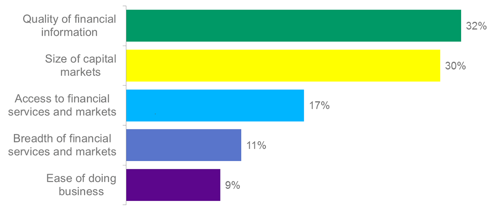

## Table of Contents

## What are emerging markets?

Emerging markets are countries that are in the process of growing their economies and improving their industries. These countries are moving from being less developed to more developed. They often have a lot of potential for growth and investment. Some examples of emerging markets include countries like Brazil, India, and China. These countries are attractive to investors because they can offer higher returns, even though they can also be riskier.

Investing in emerging markets can be exciting but also challenging. The economies in these countries can grow quickly, which can lead to big profits for investors. However, they can also be unpredictable. Things like political changes, economic instability, or currency fluctuations can affect investments. Because of these risks, it's important for investors to do a lot of research and be careful when putting money into emerging markets. Despite the risks, many people see emerging markets as great opportunities for long-term growth.

## What are frontier markets?

Frontier markets are countries that are even less developed than emerging markets. They are at an earlier stage of economic growth and have smaller, less mature financial markets. Countries like Vietnam, Bangladesh, and Kenya are examples of frontier markets. These countries are often seen as the next big opportunity for investors who are looking for growth in places that are not yet fully explored.

Investing in frontier markets can be very risky but also very rewarding. Because these markets are less developed, they can be harder to understand and predict. Things like political changes, economic instability, and currency issues can make investing in these countries challenging. However, if a frontier market grows quickly, investors can see big returns on their investments. Many investors are willing to take the risk because they believe in the long-term potential of these countries.

## How do emerging markets differ from frontier markets?

Emerging markets and frontier markets are both types of developing economies, but they are at different stages of growth. Emerging markets are countries that have already started to grow and develop their economies. They have more developed financial systems and are often seen as more stable than frontier markets. Countries like Brazil, India, and China are examples of emerging markets. These countries attract a lot of investors because they offer good opportunities for growth, even though they can still be risky.

Frontier markets, on the other hand, are at an earlier stage of development. They are less developed than emerging markets and have smaller, less mature financial systems. Countries like Vietnam, Bangladesh, and Kenya are examples of frontier markets. Investing in these countries can be very risky because they are less predictable and more prone to economic and political changes. However, the potential for high returns can be very attractive to investors who are willing to take on more risk.

In summary, the main difference between emerging and frontier markets is their level of development and the associated risks and rewards. Emerging markets are more developed and offer a balance of growth potential and risk, while frontier markets are less developed and can offer even higher potential returns but with greater risk. Both types of markets are important for investors looking for growth opportunities in different parts of the world.

## What are some examples of countries classified as emerging markets?

Emerging markets are countries that are growing and developing their economies. Some examples of these countries are Brazil, Russia, India, and China. These countries are often called the BRIC countries. They are attractive to investors because they have a lot of potential for growth. Even though they can be risky, many people see them as good places to invest money.

Other examples of emerging markets include Mexico, South Africa, and Indonesia. These countries are working on improving their industries and economies. They have more developed financial systems than frontier markets, which makes them a bit more stable. Investors like to put money into these countries because they can offer good returns over time.

## What are some examples of countries classified as frontier markets?

Frontier markets are countries that are not as developed as emerging markets. They are still growing and have smaller economies. Some examples of frontier markets are Vietnam, Bangladesh, and Kenya. These countries are trying to improve their industries and economies but are at an earlier stage of development.

Investing in frontier markets can be risky because they are less predictable. Things like political changes or economic problems can affect investments. However, if these countries grow quickly, investors can make a lot of money. Other examples of frontier markets include Nigeria, Pakistan, and Sri Lanka. These countries offer big opportunities for growth, but investors need to be careful because of the risks involved.

## What are the key economic indicators used to classify a market as emerging or frontier?

Economists look at several key indicators to decide if a country should be called an emerging or frontier market. For emerging markets, they check things like how fast the economy is growing, how much money people are making, and how well the stock market is doing. They also look at how much foreign money is coming into the country and how stable the government is. If a country has a growing economy, a rising middle class, and a more developed financial system, it might be seen as an emerging market.

For frontier markets, the indicators are a bit different because these countries are less developed. Economists look at the size of the economy, how much trade the country does with other countries, and how easy it is to invest money there. They also consider how stable the country is politically and how much the currency changes in value. If a country has a small economy, limited trade, and a less developed financial system, it might be classified as a frontier market. Both types of markets are important for investors looking for growth, but they come with different levels of risk and reward.

## What are the typical investment risks associated with emerging markets?

Investing in emerging markets can be risky. One big risk is that the economy in these countries can be up and down. Sometimes it grows a lot, and other times it can slow down or even shrink. This can make it hard to predict how your investments will do. Another risk is that the money in these countries, called the currency, can change in value a lot. If the currency loses value, the money you make from your investments might be worth less when you bring it back home.

Another risk is that the government in these countries can change. New leaders might make new rules that are not good for investors. This can make your investments worth less or harder to sell. Also, the companies in emerging markets might not have as much information available about them. It can be harder to find out if a company is doing well or not. This lack of information can make it riskier to invest in these companies. Despite these risks, many people still invest in emerging markets because they can offer big rewards if things go well.

## What are the typical investment risks associated with frontier markets?

Investing in frontier markets can be very risky. These countries are less developed than emerging markets, so their economies can be very unpredictable. The economy might grow a lot one year and then shrink the next. This makes it hard to know if your investments will do well. Also, the money used in these countries, called the currency, can change a lot in value. If the currency goes down, the money you make from your investments might not be worth as much when you take it back home.

Another big risk is that the government in frontier markets can change suddenly. New leaders might make new rules that are not good for investors. This can make your investments lose value or become harder to sell. It's also harder to get information about companies in frontier markets. There might not be a lot of details available about how well a company is doing. This lack of information can make it riskier to invest in these companies. Even with these risks, some people still invest in frontier markets because they can offer big rewards if things go well.

## How do investment returns in emerging markets compare to those in frontier markets?

Investment returns in emerging markets can be good, but they are usually not as high as in frontier markets. Emerging markets are more developed than frontier markets, so they are a bit more stable. This means the returns might not be as big, but they are also not as risky. If you invest in countries like Brazil, India, or China, you might see steady growth over time. These countries have growing economies and more people with money to spend, which can help your investments grow.

On the other hand, frontier markets can offer much higher returns, but they are also much riskier. These countries are less developed and their economies can change a lot. If you invest in places like Vietnam, Bangladesh, or Kenya, you might see big profits if the economy grows quickly. But there's also a chance that things could go wrong, like political changes or economic problems, which could make your investments lose value. So, while frontier markets can be exciting because of the potential for big returns, they are not for everyone because of the high risks involved.

## What role do political and economic stability play in the classification of emerging and frontier markets?

Political and economic stability are very important when deciding if a country is an emerging or frontier market. For emerging markets, like Brazil, India, and China, having a stable government helps attract more investors. When the government is stable, it means the rules for businesses and investments don't change a lot. This makes it easier for investors to plan and feel confident about their money. Also, a stable economy means the country is growing steadily, which can lead to good returns on investments. If a country has both political and economic stability, it is more likely to be seen as an emerging market.

For frontier markets, like Vietnam, Bangladesh, and Kenya, the situation is different. These countries are less developed and often have more political and economic ups and downs. This makes them riskier for investors. If the government changes a lot, it can lead to new rules that might not be good for businesses. And if the economy is not stable, it can be hard to predict how well investments will do. Because of these risks, countries with less political and economic stability are usually classified as frontier markets. Investors who choose these markets are looking for big rewards but are also ready to take on more risk.

## How have emerging and frontier markets performed historically in terms of growth and volatility?

Historically, emerging markets have shown good growth over time, but they can also be pretty volatile. Countries like Brazil, India, and China have seen their economies grow a lot in the past few decades. This growth has made them attractive to investors looking for good returns. But, because these countries are still developing, their economies can go up and down a lot. Things like changes in the government, economic problems, or big shifts in the world economy can make emerging markets swing a lot. So, while they can offer big rewards, they can also be risky.

Frontier markets, on the other hand, have shown even more growth potential, but they are also even more volatile. Countries like Vietnam, Bangladesh, and Kenya are at an earlier stage of development, so they can grow very quickly if things go well. But they can also be very unpredictable. Political changes, economic issues, and currency problems can make frontier markets go up and down a lot more than emerging markets. Investors who put money into frontier markets are often looking for big rewards, but they need to be ready for a lot of ups and downs along the way.

## What strategies should investors consider when investing in emerging versus frontier markets?

When investing in emerging markets, it's a good idea to do a lot of research first. Look at how the economy is doing and how stable the government is. Since these countries are more developed than frontier markets, they are a bit less risky. You might want to spread your money around by investing in different companies or industries. This can help lower your risk. Also, think about how long you want to keep your money in these markets. Emerging markets can be good for long-term growth, so be ready to wait for your investments to grow over time.

For frontier markets, you need to be ready for more risk. These countries are less developed and can be very unpredictable. It's important to do even more research and understand the political and economic situation. Since frontier markets can offer big rewards, some investors like to put a small part of their money into these markets. But be careful and don't put all your money in one place. You might want to work with someone who knows a lot about these markets, like a financial advisor, to help you make smart choices. Remember, frontier markets can be exciting but also very risky, so think about how much risk you are okay with before you invest.

## References & Further Reading

[1]: Bergstra, J., Bardenet, R., Bengio, Y., & Kégl, B. (2011). ["Algorithms for Hyper-Parameter Optimization."](https://dl.acm.org/doi/10.5555/2986459.2986743) Advances in Neural Information Processing Systems 24.

[2]: ["Advances in Financial Machine Learning"](https://www.amazon.com/Advances-Financial-Machine-Learning-Marcos/dp/1119482089) by Marcos Lopez de Prado

[3]: ["Evidence-Based Technical Analysis: Applying the Scientific Method and Statistical Inference to Trading Signals"](https://www.amazon.com/Evidence-Based-Technical-Analysis-Scientific-Statistical/dp/0470008741) by David Aronson

[4]: ["Machine Learning for Algorithmic Trading"](https://github.com/stefan-jansen/machine-learning-for-trading) by Stefan Jansen

[5]: ["Quantitative Trading: How to Build Your Own Algorithmic Trading Business"](https://www.amazon.com/Quantitative-Trading-Build-Algorithmic-Business/dp/1119800064) by Ernest P. Chan