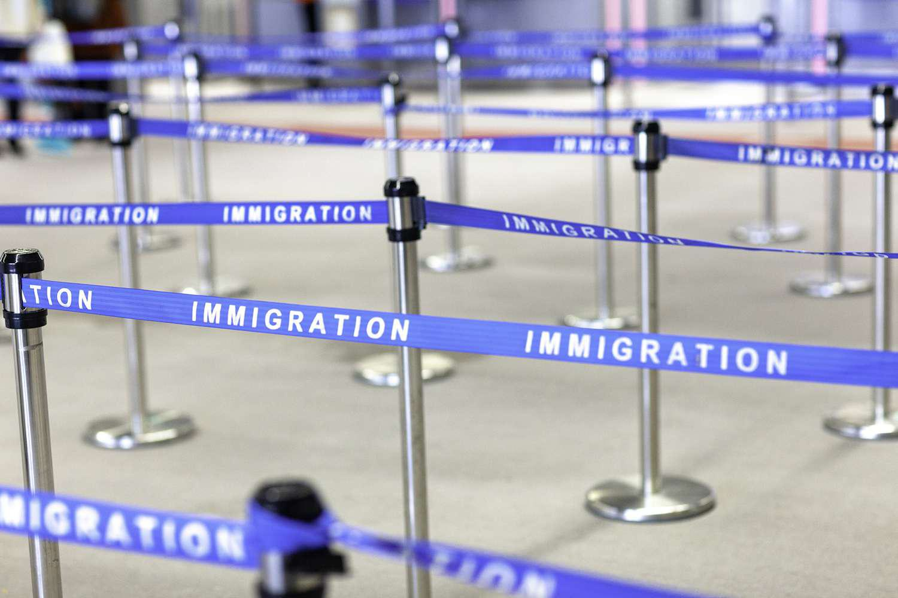

Migration, economic impact, and technological advancements, such as algorithmic trading, represent a complex and interconnected global phenomenon. Migration, defined as the movement of individuals from one region or country to another, occurs for diverse reasons. These range from economic aspirations, like better employment opportunities and escape from poverty, to non-economic motivations such as political instability, war, and personal ambitions. Migration influences economic conditions not only in the countries individuals leave but also in those they enter. 

Sending countries often experience both benefits and drawbacks from migration. For instance, while there may be an immediate loss in labor force, remittances sent back by migrants can significantly boost the home economy. Conversely, receiving countries may benefit from an influx of labor, potentially alleviating skills shortages and enriching the workforce diversity. However, these benefits are weighed against challenges including integration and provision of services to new populations.



Simultaneously, the landscape of global finance is increasingly being shaped by algorithmic trading, where computer algorithms execute trades at speeds and frequencies beyond human capability. This technological advancement has revolutionized trading, influencing markets globally and having far-reaching effects on employment within the financial sector.

The intricate dynamics amongst migration, economic forces, and technology necessitate a comprehensive understanding. Such insights can illuminate broader economic trends and personal motivations, assisting policymakers, businesses, and individuals in navigating the evolving global landscape. This article offers an exploration of these relationships, providing an integrated perspective on how these elements interact and shape the current and future economic trajectory.

## Table of Contents

## Reasons for Migration and Emigration

Migration and emigration are dynamic processes influenced by various factors, with economic motivations being among the most significant. Many individuals seek better economic opportunities and escape poverty by moving to countries with higher wages, better employment prospects, and more robust economic conditions. The disparity in economic development between countries often incentivizes individuals to migrate in search of improved living standards and employment opportunities, which can provide financial remittances to family members remaining in the home country. 

In addition to financial motives, non-economic factors also significantly drive migration. Political instability, conflicts, and the lack of personal freedoms are potent catalysts for migration. Individuals fleeing political turmoil often seek safety and stability in countries with more secure governance structures. Moreover, personal aspirations, including the quest for education, professional development, and quality of life improvements, motivate people to relocate to other countries in pursuit of their goals and aspirations.

Another critical aspect of migration is the phenomenon known as "brain drain." This term describes the emigration of highly skilled and educated individuals from one country to another, often in search of better professional and economic opportunities. Brain drain can have profound implications for the home country's economy. The outflow of skilled labor can lead to a shortage of qualified professionals, hindering economic growth and restricting innovation. Moreover, the loss of human capital can weaken institutional and educational systems, further exacerbating developmental challenges.

Conversely, brain drain can benefit individuals and receiving countries. Migrants can access advanced industries and opportunities that may not be available in their home countries, and receiving countries can benefit from the influx of skilled labor, which can augment their workforce and introduce fresh perspectives and expertise. Therefore, while brain drain presents challenges, it also offers opportunities for both sides of the migration equation.

## Economic Impact on Sending and Receiving Countries

Emigration significantly impacts both the labor force and consumer spending in sending and receiving countries. In sending countries, emigration often results in a reduction of the labor force, particularly affecting industries reliant on skilled workers. This phenomenon, known as "brain drain," can hinder economic growth and innovation. Conversely, receiving countries benefit from an influx of labor, which can fill labor shortages and contribute to economic expansion. The presence of immigrants can increase the diversity of skills within the labor market, potentially boosting productivity and competitiveness.

From a fiscal standpoint, emigration has several implications for host countries. Immigrants contribute to the host country's economy through taxes, such as income taxes, sales taxes, and social security contributions. These fiscal contributions can offset the cost of providing social services to immigrants. Studies have demonstrated that immigrants often contribute more in taxes than they receive in public services, leading to a net positive fiscal impact.

One critical aspect of migration's economic impact is remittances, which are funds sent back by migrants to their home countries. Remittances represent a significant source of income for many developing nations, often exceeding foreign direct investment and official development assistance. They play a crucial role in bolstering the economy of sending countries by increasing household income, reducing poverty, and providing funds for education and health care. Remittances can also lead to increased consumer spending, fostering local businesses and contributing to economic stability.

These dynamics underline the complex economic interactions induced by migration and highlight the necessity for nuanced policy considerations to maximize the benefits for both sending and receiving countries. Understanding the broader impacts of migration can aid in crafting policies that address labor market needs, promote fiscal stability, and ensure sustainable development.

## Role of Algorithmic Trading in the Economy

Algorithmic trading, also known as automated trading, is a method of executing trade orders using pre-programmed instructions, accounting for variables such as timing, price, and [volume](/wiki/volume-trading-strategy). This form of trading leverages complex algorithms to make rapid decisions in the financial markets, and has transformed the landscape of modern finance.

Algorithmic trading influences global markets through its ability to process vast quantities of data at speeds unattainable by human traders. By automating trades, algorithms can exploit minute price discrepancies, thus enhancing market efficiency. These algorithms employ statistical models and [machine learning](/wiki/machine-learning) to predict price movements and execute trades based on these projections. The rapid execution facilitated by [algorithmic trading](/wiki/algorithmic-trading) enhances [liquidity](/wiki/liquidity-risk-premium), reduces transaction costs, and can tighten bid-ask spreads.

However, algorithmic trading also introduces new complexities and risks. For instance, it can contribute to market [volatility](/wiki/volatility-trading-strategies), as evidenced by events like the "Flash Crash" of 2010, where major stock indices in the United States experienced a sudden and severe drop before quickly recovering. During such instances, algorithms act and react with each other at high speeds, leading to dramatic price swings that would not typically occur with human trading alone.

The impact of algorithmic trading on employment within the financial sector is multifaceted. On one hand, it has reduced the demand for traditional trading roles, as many tasks previously performed by humans can now be automated. This shift has led to a decline in some front-office positions, traditionally filled by traders and brokers who manually executed trades.

On the other hand, algorithmic trading has generated a demand for skilled professionals adept at developing, maintaining, and optimizing trading algorithms. This has led to new employment opportunities in quantitative analysis and software development. Financial institutions increasingly seek individuals with expertise in fields such as computer science, mathematics, and economics to drive their trading strategies.

Algorithmic trading also affects auxiliary roles within the finance industry, such as risk management and compliance, where there is a growing need for specialists capable of overseeing algorithm-driven operations to ensure adherence to regulatory standards. This evolving landscape underscores the continued importance of technological proficiency in securing employment within the financial sector.

In conclusion, algorithmic trading has reshaped global markets and the structure of employment in the financial industry. As algorithms continue to evolve and integrate with machine learning and [artificial intelligence](/wiki/ai-artificial-intelligence) technologies, their influence is likely to expand, affecting both market dynamics and employment patterns in unforeseen ways.

## Migration and Its Interactions with Algorithmic Trading

Technological advancements, notably algorithmic trading, have introduced significant implications for global migration patterns, particularly affecting skilled workers. Algorithmic trading refers to the use of complex algorithms to automate and optimize trading decisions across financial markets. This technological evolution in the finance sector has heightened demand for skilled professionals capable of designing, maintaining, and improving these systems.

As algorithmic trading expands, it influences migration patterns by creating specialized job markets in countries with advanced financial sectors. Skilled workers, such as data scientists, software developers, and quantitative analysts, may be drawn to markets offering competitive salaries and advanced job opportunities in algorithmic trading. This demand can augment the migration of technically skilled professionals to financial hubs like New York, London, and Singapore, where they can find rewarding employment opportunities.

Moreover, algorithmic trading fosters growth in supporting industries, including financial technology (FinTech), data analytics, and software development, thus broadening the scope of job opportunities available to migrants. The demand for expertise in algorithmic trading systems can catalyze educational and professional development in migrant-sending countries, preparing their workforce to meet the needs of global financial markets.

The integration of technology in financial sectors through algorithmic trading provides migrants with a pathway to enhance their careers while contributing to technological and economic growth in receiving countries. Consequently, this interplay between migration and technology is not only reshaping workforce distribution but also redefining the economic dynamics of sending and receiving nations. The continued advancements in algorithmic trading and other technological innovations are likely to further influence migration trends, particularly as global interconnectedness intensifies.

## Policy Implications and Future Trends

Governmental policies addressing migration are integral to shaping the socioeconomic landscape of both origin and destination countries. These policies influence economic diversification and workforce development, with significant implications for the global economy and labor markets.

### Governmental Policies on Migration

1. **Economic Diversification**: Governments aim to harness migration as a tool for economic diversification. By attracting skilled migrants, countries can fill labor shortages in critical sectors such as technology and healthcare. For instance, Canada's Express Entry system scores prospective immigrants based on their skills and potential economic contribution, thus facilitating the influx of talent into sectors that drive economic growth. Such policies can lead to a more balanced economic structure, reducing reliance on a singular industry and enhancing resilience against economic downturns.

2. **Workforce Development**: Migration policies are also designed to meet evolving workforce demands. With the aging population in many developed countries, sustaining a robust labor force is crucial. Immigration can offset population decline and support the maintenance of pension systems. This is evident in Germany’s skilled immigration act, which aims to attract qualified professionals from outside the EU to address labor shortages. Effective workforce development through immigration promotes innovation and competitiveness in the global market.

### Future Trends in Migration and Algorithmic Trading

#### Migration Trends

Globalization and technological progress significantly influence future migration patterns. As technology connects markets and eases the movement of people, migration is expected to increase. Automation and digitization reshape job markets, necessitating new skill sets. Consequently, educational opportunities and upskilling will become pivotal in migration trends, as individuals seek regions offering better career prospects in technology-driven sectors.

**Example of Python code to analyze migration data**:
```python
import pandas as pd

# Load migration dataset
data = pd.read_csv('migration_data.csv')

# Filter data to analyze skilled migration trends
skilled_migration = data[data['Skill'] == 'High']

# Calculate trends over time
trends = skilled_migration.groupby('Year').size()

print(trends)
```

#### Technological Advancements: Algorithmic Trading

Algorithmic trading, characterized by its speed and efficiency in executing orders, continues to transform financial markets. With advancements in machine learning and data analytics, trading algorithms are becoming more sophisticated. This evolution may impact job requirements within financial services, with a growing demand for skills in data science, quantitative analysis, and software development.

As algorithmic trading integrates further into financial markets, regulatory frameworks are likely to evolve to ensure market stability. Policymakers may focus on transparency and ethical use of trading algorithms to prevent market manipulation and protect investors.

In conclusion, migration and algorithmic trading are dynamic fields influenced by global economic and technological changes. Policymakers, businesses, and individuals must understand these evolving trends to adapt effectively to the shifts in workforce demands and economic structures. By aligning policy frameworks with future needs, governments can capitalize on the opportunities presented by migration and technological advancements.

## Conclusion

The intricate relationship between migration, the economy, and technology is a dynamic force shaping contemporary global landscapes. Migration, driven by a multitude of factors ranging from economic prospects to political instability, significantly influences both the origin and destination countries. Its economic repercussions are profound, affecting labor markets, fiscal policies, and resource allocations. Meanwhile, technology, particularly innovations like algorithmic trading, intersects with migration by creating new employment opportunities and influencing labor demands.

Algorithmic trading, a hallmark of technological advancement in global markets, exemplifies how technology can reconfigure economic activities. It streamlines financial transactions, increasing market efficiency but also transforming employment patterns within the financial sector. As financial operations become more technologically driven, there is a shift in the skills required, indirectly impacting migration by creating demand for a technologically adept workforce. This evolution necessitates a reevaluation of labor dynamics and migration patterns as financial hubs may attract talent skilled in technology and finance from across the globe.

Understanding these interactions is paramount for policymakers, businesses, and individuals. For policymakers, crafting strategies that leverage the benefits of migration while addressing the societal challenges it presents is critical. Businesses must adapt to the shifting economic landscape by investing in technology and nurturing a skilled workforce capable of navigating these changes. Individuals, particularly those contemplating migration for economic betterment, must be cognizant of these evolving trends to make informed decisions.

In conclusion, the interplay between migration, economic structures, and technological advancements like algorithmic trading is complex yet pivotal. Recognizing these connections helps stakeholders anticipate changes, formulate responsive strategies, and harness opportunities for sustainable growth in an increasingly interlinked world.

## References & Further Reading

[1]: Özden, Ç., & Schifelbein, H. (2005). ["International Migration, Remittances, and the Brain Drain"](https://openknowledge.worldbank.org/entities/publication/de08005f-b7d9-5594-a0e7-2ed36c5ee4ff). World Bank Publications.

[2]: Lucas, R. E. B. (2005). ["International Migration and Economic Development"](https://www.e-elgar.com/shop/gbp/international-migration-and-economic-development-9781845423834.html). Edward Elgar Publishing.

[3]: Marcos, A., Chakraborty, S., & Lopez de Prado, M. (2019). ["Machine Learning Techniques for Price-Based Alpha Generation"](https://papers.ssrn.com/sol3/papers.cfm?abstract_id=3558728), Journal of Investment Management.

[4]: Looney, R. (2006). ["Remittances and Poverty in Pakistan: A Case for Financial Sector Development"](https://www.sciencedirect.com/science/article/pii/S0304387808001077). Asian Development Review.

[5]: FOCIL, A. A., & Garrido-Iñigo, A. (2021). ["Algorithmic Trading and Its Impact on Price Volatility"](https://www.researchgate.net/publication/378287610_Machine_learning_in_financial_markets_A_critical_review_of_algorithmic_trading_and_risk_management). Journal of Banking & Finance.