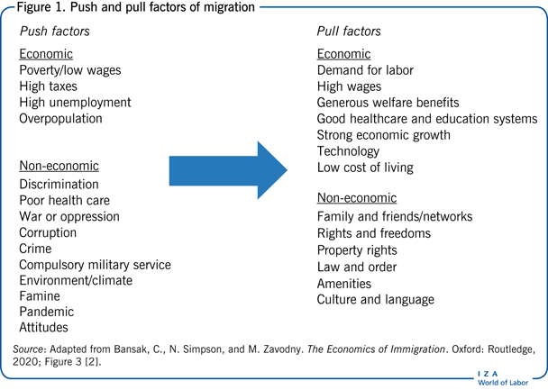

## Table of Contents

## What is emigration?

Emigration is when people leave their home country to live in another country. It can happen for many reasons, like finding better jobs, escaping war or danger, or joining family members who already moved. People who emigrate are called emigrants.

When someone emigrates, they usually go through a process to get permission to live in the new country. This can include getting a visa or other legal documents. Emigration can be hard because it means leaving behind friends, family, and familiar places. But it can also bring new opportunities and a chance for a better life.

## What are the common reasons people emigrate?

People emigrate for many different reasons. One big reason is to find better jobs and make more money. In some countries, there are not many good jobs, and people struggle to earn enough to live well. By moving to a new country, they hope to find work that pays better and offers more opportunities. Another reason is to join family members who have already moved. When family members are already living in another country, people often want to be with them and build a new life together.

Another common reason for emigration is to escape danger or difficult situations. This can include war, violence, or natural disasters that make life unsafe or very hard. People also emigrate to get away from poverty or lack of basic services like healthcare and education. Sometimes, they move to find more freedom or to escape from discrimination and unfair treatment. All these reasons push people to leave their home countries and start over somewhere new.

## How does emigration affect the economy of the country people leave?

When people emigrate, it can affect the economy of their home country in different ways. One way is through the loss of workers. When skilled people like doctors, engineers, or teachers leave, it can make it harder for the country to grow and develop. These people are important for building a strong economy, so when they go, it can slow things down. Also, when many young people leave, it can make the population older, which can be a problem because older people often need more support and can work less.

On the other hand, emigration can also bring some benefits to the home country's economy. One big benefit is the money that emigrants send back home, called remittances. This money can help families pay for food, education, and healthcare, which can improve their lives. Remittances can also help the overall economy by increasing the amount of money people have to spend. So, while losing skilled workers can be tough, the money sent back can make a big difference and help the economy in some ways.

## What are the economic impacts of emigration on the destination country?

When people emigrate to a new country, it can help the economy there by bringing in new workers. These workers can fill jobs that are hard to fill, especially if they have special skills. For example, if a country needs more doctors or engineers, emigrants with these skills can help. Also, when people move to a new country, they spend money on things like homes, food, and other goods. This spending can help the economy grow because it creates more demand for products and services.

But emigration can also create some challenges for the destination country. If a lot of people come in a short time, it can put pressure on things like housing, schools, and healthcare. This can make it harder for the country to provide good services for everyone. Also, if emigrants take lower-paying jobs, it can affect wages and make it harder for people already living there to earn enough money. So, while emigrants can help the economy in some ways, they can also create some problems that the country needs to manage.

## Can emigration lead to brain drain? If so, how?

Yes, emigration can lead to brain drain. Brain drain happens when a lot of smart and skilled people leave a country to live and work somewhere else. These people might be doctors, engineers, scientists, or teachers. When they leave, the country loses their knowledge and skills. This can make it harder for the country to grow and improve because it needs these people to build a strong economy and good services.

Brain drain can be a big problem for countries that are already struggling. If many skilled people leave, it can slow down development and make it harder to solve important problems. For example, if a country loses many doctors, it can be hard to provide good healthcare for everyone. The country might have to spend a lot of money and time to train new people to replace those who left. So, while emigration can be good for the people who leave, it can create challenges for the countries they leave behind.

## What are the social impacts of emigration on families and communities?

When people emigrate, it can be tough on their families. They might have to leave behind their parents, kids, or other loved ones. This can make everyone feel sad and miss each other a lot. Sometimes, families can stay in touch through calls or messages, but it's not the same as being together. Kids might have to grow up without one of their parents, and that can be hard for them. But, if the person who emigrates sends money back home, it can help the family have a better life, even if they are far apart.

Emigration can also change whole communities. When a lot of people leave, it can make the place feel empty. There might be fewer people to help with community projects or to join in local events. This can make the community weaker and less lively. But, if the people who leave send money back, it can help the community in other ways. For example, the money might be used to build new schools or fix up old buildings. So, while emigration can make communities feel different, it can also bring some good changes.

## How do remittances from emigrants influence the economies of their home countries?

Remittances are money that emigrants send back to their families in their home countries. This money can make a big difference. It helps families buy food, pay for school, and get healthcare. When families have more money, they can live better lives. This is really important in places where it's hard to find good jobs or where people don't have enough money to meet their needs.

But remittances do more than just help families. They also help the whole economy of the home country. When families get money from abroad, they spend it on things like food, clothes, and other goods. This spending can make the economy grow because it creates more demand for products and services. Sometimes, the money is used to start small businesses or to build new things like houses or schools. So, remittances can help the economy in many ways, making life better for a lot of people.

## What policies can governments implement to manage the effects of emigration?

Governments can do things to help with the problems that come from people leaving their country. One way is to make it easier for people to get good jobs at home. They can do this by helping businesses grow, teaching people new skills, and making it easier to start new companies. When people can find good work at home, they might not want to leave as much. Governments can also try to make the country a better place to live by improving schools, hospitals, and making sure everyone is treated fairly. This can help keep people from wanting to move away.

Another thing governments can do is to help families who have loved ones living in other countries. They can make it easier for these families to get the money sent back from abroad. This money, called remittances, can help families live better lives. Governments can also have programs to help families stay in touch with their loved ones who moved away. This can make it a little easier for everyone when they are apart. By doing these things, governments can help manage the effects of people leaving their country and make life better for those who stay behind.

## How does emigration relate to global labor markets and international trade?

When people emigrate, it changes the global labor market. Countries that need workers can get help from emigrants who move there. These workers can fill jobs that are hard to fill, like in healthcare or technology. This can help the economy of the country they move to because they bring new skills and ideas. But, the country they leave might lose important workers. This can make it harder for that country to grow and develop because they need those skilled people to build a strong economy.

Emigration also affects international trade. When people move to new countries, they often send money back home. This money, called remittances, can help families buy things they need, like food and clothes. When families have more money to spend, it can increase demand for products and services in their home country. This can help the economy grow because businesses sell more. Also, emigrants might start businesses that trade between their new country and their home country, which can create new trade links and help both economies.

## What are the long-term demographic effects of sustained emigration on a country?

When a lot of people keep leaving a country over a long time, it can change the number and types of people living there. If many young people emigrate, the country can end up with more old people than young ones. This is called an aging population. When there are more old people, it can be hard for the country because they might need more help with things like healthcare. Also, there might be fewer people working and paying taxes, which can make it harder for the government to take care of everyone.

Over time, emigration can also change the way a country looks in terms of who lives there. If a lot of people from certain places or with certain skills leave, it can make the country less diverse. This can affect the culture and the way people live. But, if the country can find ways to keep people from leaving or to bring in new people, it can help balance things out. Managing these changes is important for the country to keep growing and staying strong.

## How can data analytics be used to predict emigration trends and their economic impacts?

Data analytics can help us guess where people might move to and how it could affect the economy. By looking at information like how many people are leaving, where they are going, and why they are moving, we can see patterns. For example, if a lot of young people are leaving a country because they can't find good jobs, we can predict that this might keep happening if nothing changes. Also, if we know that people from one country often move to another specific country, we can use this information to plan for things like housing and jobs in the new country.

Understanding these patterns can help governments and businesses plan better. If we know that a lot of people might move to a certain place, the government can get ready by building more homes or schools. Businesses can also prepare by creating jobs that match the skills of the new people coming in. On the other hand, if a country is losing a lot of skilled workers, data analytics can show us how this might hurt the economy. Governments can then try to fix this by making it easier for people to find good jobs at home or by training new people to fill the gaps left by those who left.

## What role does international law play in regulating emigration and its economic consequences?

International law helps set rules for how countries handle people moving from one place to another. These rules can affect how easy or hard it is for people to leave their home country and move to a new one. For example, international treaties can make it easier for people to get visas or work permits in other countries. These treaties also protect the rights of people who move, making sure they are treated fairly and can work in their new home. By setting these rules, international law helps manage how many people move and where they go, which can have a big impact on the economies of both the countries they leave and the ones they move to.

The economic consequences of emigration can be influenced by international law too. For instance, laws about remittances can make it easier or harder for people to send money back home. If the laws are good, more money can flow back to families, helping their home country's economy grow. On the other hand, if the laws are strict, it might be harder for families to get this money, which can slow down the economy. Also, international agreements can help countries work together to manage the effects of brain drain, like sharing knowledge or training new workers. By working together, countries can use international law to make the economic effects of emigration better for everyone.

## References & Further Reading

[1]: Özden, Ç., & Schifelbein, H. (2005). ["International Migration, Remittances, and the Brain Drain"](https://openknowledge.worldbank.org/entities/publication/de08005f-b7d9-5594-a0e7-2ed36c5ee4ff). World Bank Publications.

[2]: Lucas, R. E. B. (2005). ["International Migration and Economic Development"](https://www.e-elgar.com/shop/gbp/international-migration-and-economic-development-9781845423834.html). Edward Elgar Publishing.

[3]: Marcos, A., Chakraborty, S., & Lopez de Prado, M. (2019). ["Machine Learning Techniques for Price-Based Alpha Generation"](https://papers.ssrn.com/sol3/papers.cfm?abstract_id=3558728), Journal of Investment Management.

[4]: Looney, R. (2006). ["Remittances and Poverty in Pakistan: A Case for Financial Sector Development"](https://www.sciencedirect.com/science/article/pii/S0304387808001077). Asian Development Review.

[5]: FOCIL, A. A., & Garrido-Iñigo, A. (2021). ["Algorithmic Trading and Its Impact on Price Volatility"](https://www.researchgate.net/publication/378287610_Machine_learning_in_financial_markets_A_critical_review_of_algorithmic_trading_and_risk_management). Journal of Banking & Finance.