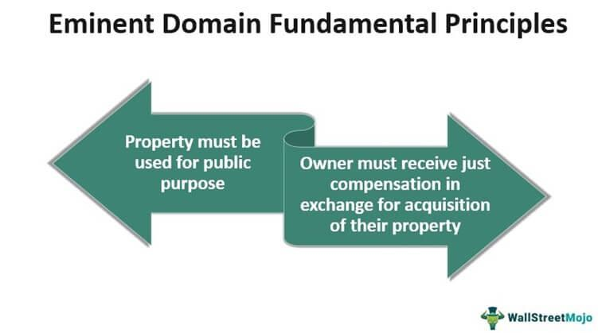

Property law is an essential pillar of legal systems worldwide, providing the framework for the ownership, use, and transfer of both tangible and intangible assets. Its significance extends beyond individual property rights, influencing economic policies, urban development, and societal structures. At its core, property law governs real property (land and buildings), personal property (movable objects), and intellectual property (creations of the mind), each governed by distinct legal principles and regulatory requirements.

Eminent domain presents a unique aspect of property law, involving the power of the state to seize private property for public use, provided that just compensation is offered. This legal mechanism, essential for infrastructure development and urban expansion, raises important questions about the balance between public interest and private property rights. Its application is often contentious, with legal debates focusing on what constitutes 'public use' and the adequacy of compensation.

Integral to property law are several foundational legal concepts, including title, which signifies ownership rights; deed, which is the legal document representing the transfer of property; mortgage, a secured loan using property as collateral; and easement, the right of use over another's property. These concepts underpin the legal frameworks governing property transactions and disputes, ensuring clarity and security in the handling of property rights.

Simultaneously, the advent of digital financial technologies has introduced algorithmic trading (algo trading) to the financial markets, revolutionizing trading strategies through automated processes driven by complex algorithms. Algo trading brings about numerous legal considerations, particularly concerning transparency, ethical use, and adherence to regulatory standards. Its rapid growth necessitates the adaptation of existing legal frameworks to address challenges such as market manipulation and data security.

This article seeks to explore the intersection of property law, eminent domain, and algo trading. As traditional legal structures confront digital innovations, understanding the convergence of these domains becomes crucial. Property law principles increasingly apply to digital assets, while algo trading's reliance on intellectual property calls for more nuanced legal protections and regulatory oversight. By examining these intersections, the discussion aims to shed light on the evolving landscape of property rights and financial technologies.

## Table of Contents

## Understanding Property Law

Property law is a branch of law that governs the various forms of ownership and tenancy in real property (land) and personal property. At its core, property law serves to facilitate transactions relating to property, regulate ownership rights, and resolve disputes among parties with interests in the same property.

### Definition and Scope of Property Law
Property law encompasses a wide range of legal issues concerning the ownership and use of both tangible and intangible assets. Its scope includes the establishment of ownership rights, regulation of property use, and prevention of disputes.

### Types of Properties Covered Under Property Law
1. **Real Property**: This pertains to land and anything permanently affixed to it, such as buildings. Real property rights include the rights to possess, control, and enjoy the land.

2. **Personal Property**: These are movable assets that are not fixed permanently to one location, including vehicles, furniture, and equipment. The legal principles guiding personal property focus on possession, ownership, transfer, and inheritance.

3. **Intellectual Property (IP)**: This involves creations of the mind, such as inventions, literary and artistic works, designs, and symbols. IP law protects the rights of creators to benefit from their inventions and works.

### Key Legal Principles Governing Property Law
Property law is governed by several key legal principles, including:

- **Possession**: The control a person intentionally has over an object. This could entail physical custody or the right to use the property.
- **Title**: The legal way of stating ownership of property. It refers to the complete legal rights to own, use, and dispose of property.
- **Use and Enjoyment**: The rights of property owners to use their property in any manner they see fit, subject to restrictions imposed by law or contract.
- **Transferability**: The ability to transfer property to another party, which involves the process of ensuring that the new owner receives the same rights the previous owner had.

### Ownership Rights and Transfer of Property
Ownership of property connotes a bundle of rights, including the right to use, sell, lease, or bequeath the property. Transfers of property can occur through various means such as sales, gifts, inheritance, or adverse possession. Legal frameworks ensure that these transfers are consensual and properly documented.

### Common Legal Disputes in Property Law
Disputes in property law commonly arise from:
- **Boundary Issues**: Disagreements over property lines.
- **Adverse Possession**: A situation in which someone claims ownership of land through continuous possession.
- **Easements and Encroachments**: Rights for one party to use another’s property or the unlawful intrusion onto someone else's land.
- **Land Use and Zoning Disputes**: Conflicts regarding the permitted use of land space and structures within specific zones.

Resolving these disputes often requires the intervention of courts, which rely on established legal principles and statutes to determine rightful ownership and other property-related rights.

Property law continues to evolve, adapting to changes in societal needs and technological advances, ensuring the fair and efficient allocation of property resources in society.

## Eminent Domain: Legal Framework

Eminent domain is a legal principle that allows governments to expropriate private property for public use, with the requisite provision of just compensation to the property owner. This concept is embedded in legal systems worldwide, historically tracing back to the idea that sovereign powers inherently possess the authority to appropriate land for the greater public good. In the United States, the Fifth Amendment to the Constitution enshrines this principle, mandating that private property cannot be "taken for public use, without just compensation."

The legal justification for eminent domain is rooted in the balance between private property rights and the needs of society. The notion of "public use" has evolved to encompass not only traditional uses, such as roads and schools, but also broader interpretations including economic development and community revitalization projects. This broadened scope remains contentious, prompting legal and ethical debates over the definition and limits of public use.

The process of exercising eminent domain involves several steps designed to ensure fairness and transparency. Initially, a government or authorized entity must clearly determine that a property acquisition serves a public purpose. Subsequently, the property owner must receive notification and an offer of compensation, typically based on fair market value assessments. If the owner contests the offer, negotiations or legal proceedings may ensue to determine appropriate compensation. This mechanism aims to balance the rapid attainment of public objectives with the individual rights of property owners.

Despite its foundational role in facilitating public infrastructure and development, eminent domain faces notable controversies and challenges. Critics argue that the flexibility in defining "public use" can lead to abuses, such as favoring private developers at the expense of less powerful communities. Additionally, disputes over what constitutes "just compensation" can result in prolonged litigation, delaying projects and increasing costs.

Historical and contemporary legal cases highlight these tensions and set precedents in eminent domain law. One landmark case, Kelo v. City of New London (2005), saw the U.S. Supreme Court uphold the authority of a city to transfer land from one private owner to another for the purpose of economic development, sparking significant public uproar and legislative response to limit eminent domain applications. Other notable cases, like Berman v. Parker (1954) and Hawaii Housing Authority v. Midkiff (1984), further illustrate the broad interpretations and applications of the "public use" clause, guiding the evolution of eminent domain jurisprudence.

## Important Legal Concepts in Property Law

Property law encompasses a variety of legal concepts essential for regulating rights and duties related to ownership and use of different types of property. Understanding these concepts is crucial for navigating legal transactions and resolving disputes.

### Key Legal Concepts

**Title:** In property law, the title refers to the legal right to own, use, and transfer a property. It establishes the person's ownership and may involve documentation proving such rights. Titles can be affected by various legal actions and claims, so ensuring clear title is vital during property transactions.

**Deed:** A deed is a formal legal document that transfers ownership of property from one party to another. It must be in writing, signed, and delivered to be effective. There are different types of deeds, such as warranty deeds, which guarantee a clear title, and quitclaim deeds, which transfer whatever interest the grantor has without warranties.

**Mortgage:** A mortgage is a legal agreement in which property is used as collateral for a loan. The lender holds a lien on the property until the debt is satisfied. Mortgages involve detailed contracts outlining terms such as interest rates, payment schedules, and foreclosure processes in case of default.

**Easement:** An easement is a right granted to use the property of another for a specific purpose, such as a utility company accessing land to maintain power lines. Easements can be created by deed, necessity, or prescription (use over time) and can significantly impact property rights and values.

### Role of Contracts

Contracts are fundamental in property law transactions, governing purchase agreements, leases, and mortgages. A valid contract typically requires an offer, acceptance, consideration, and mutual consent. Contracts ensure that terms are agreed upon and legally enforceable, providing structure and clarity in property exchanges.

### Property Disputes and Litigation

Property disputes often involve issues related to boundary disagreements, easement violations, and breach of contract terms. Litigation can arise over unclear titles, encroachments, or adverse possession claims, where someone claims ownership due to continuous and open possession of property without the owner's permission.

### Legal Remedies and Protections

Property owners have legal remedies available, such as injunctions to halt unauthorized use, damages for losses incurred, and specific performance to enforce contract terms. Protections may include insurance to cover title defects or liabilities and local laws safeguarding ownership rights.

### Impact of Zoning Laws and Regulations

Zoning laws and regulations significantly influence property rights by dictating how land can be used. They impose restrictions and guidelines on building locations, type of structures allowed, and activities that can be conducted. Zoning aims to provide orderly development and ensure compatibility of land uses, impacting property values and community layouts. Changes in zoning laws can affect the permissible use of property, leading to potential disputes and adjustments in property planning and development.

## Algorithmic Trading: Legal and Regulatory Considerations

Algorithmic trading, often referred to as algo trading, involves the use of computer algorithms to automate trading decisions in financial markets. This method leverages mathematical models, complex algorithms, and high-speed computations to make decisions based on a predefined set of rules. With the rise of technology and the internet, [algorithmic trading](/wiki/algorithmic-trading) has seen exponential growth and now forms a significant portion of trades executed in global markets. 

Legal and ethical considerations in algo trading primarily revolve around issues of fairness, transparency, and market integrity. One critical concern is the potential for algorithmic strategies to inadvertently engage in market manipulation, such as spoofing or layering, thereby compromising the fair operation of markets. Ethical considerations also include ensuring that these systems do not perpetuate biases and maintain equal access for all market participants.

Regulatory bodies are tasked with overseeing algo trading practices to protect market integrity and ensure investor confidence. In the United States, the Securities and Exchange Commission (SEC) and the Commodity Futures Trading Commission (CFTC) are principal authorities governing these activities. In the European Union, the Markets in Financial Instruments Directive II (MiFID II) establishes a regulatory framework for algorithmic trading. These bodies impose strict compliance requirements and transparency obligations on trading entities utilizing algorithms.

Common legal issues in algorithmic trading include concerns about transparency, potential market manipulation, and data security. Transparency is critical, as market participants must be able to understand and trust the fairness of market operations. Market manipulation, such as the creation of artificial market activity, is a significant legal risk with algorithms potentially enabling high-precision manipulative practices. Additionally, safeguarding data privacy and preventing unauthorized access to sensitive trading data is imperative to comply with legal standards and maintain client trust.

The impact of technology on trading laws and regulations is profound. As technology evolves, so too do the associated risks and vulnerabilities in trading systems. Regulatory frameworks are in a constant state of adaptation to address the challenges posed by technological advancements, such as high-frequency trading and the emergent use of [artificial intelligence](/wiki/ai-artificial-intelligence) in trading algorithms. Regulators must balance the necessity of innovation against the imperative of maintaining orderly and secure financial markets. This evolving landscape requires ongoing dialogue between technologists, legal experts, and regulators to ensure that legal frameworks remain robust and relevant.

## The Intersection of Property Law and Algo Trading

Property law traditionally applies to the ownership, transfer, and regulation of tangible and intangible assets. The emergence of algorithmic trading has introduced digital assets and trading algorithms as new categories necessitating legal consideration. This section examines how property law principles adapt to these innovations, focusing on legal ownership, intellectual property protection, regulatory challenges, and case studies of conflicts.

### Legal Ownership and Transfer of Digital Properties in Trading Algorithms

Digital assets used in algorithmic trading, including algorithms themselves, require a clear legal framework for defining and transferring ownership. Ownership in this context relates to the control and rights over the algorithm, which may be developed by individuals or firms having proprietary interests. As in traditional property law, a key aspect is establishing a legal chain of title, akin to the process for tangible property. The transfer of these digital properties involves licensing agreements rather than physical deeds, with careful attention to intellectual property laws. Ownership is often validated through documentation that may include contracts, user agreements, and proof of development or purchase.

### Protecting Intellectual Property Rights in Trading Algorithms

Algorithms used in trading are often proprietary and represent significant intellectual property. Protecting these algorithms involves applying intellectual property law, particularly patent and copyright law. Patent protection can be challenging due to legal hurdles in patenting software and algorithms, which may not meet the criteria of novelty or non-obviousness. Instead, copyright protection is more commonly utilized, as it safeguards the expression of code but not the underlying ideas. Additionally, trade secret laws provide a legal avenue, wherein algorithms remain protected through confidentiality agreements and security measures.

### Regulatory Challenges in Aligning Property Law with Modern Trading Technologies

Regulatory bodies, such as the Securities and Exchange Commission (SEC) in the United States, oversee the activities of algo trading firms to ensure fair practices and market stability. However, the rapid evolution of trading technologies poses unique regulatory challenges. Traditional property law frameworks struggle to keep pace with innovations in digital asset management and trading methodologies. Current regulations must address the transparency of trading algorithms, data security, and potential anti-competitive practices, necessitating continuous adaptation and development of legal guidelines.

### Case Studies Highlighting Conflicts and Resolutions in Property Law and Algo Trading

Several notable cases have illustrated the intersection of property law with algo trading, particularly concerning intellectual property disputes. For example, legal cases have arisen when developers depart trading firms, taking proprietary algorithms with them, which raises questions of trade secret misappropriation and breach of contract. Another common scenario involves disputes over algorithm performance, where parties may contest the interpretation and implementation of algorithm specifications in trading contracts. Resolving such conflicts often involves the application of legal principles concerning breach of contract and misappropriation, requiring both litigation and arbitration.

The dynamic nature of algorithmic trading necessitates a continual reassessment of property law principles to ensure they adapt effectively to encompass digital assets, while also safeguarding the innovations and competitive edges they provide to their creators and owners.

## Conclusion

The article has explored the intricate relationships between property law, eminent domain, and algorithmic trading, underscoring their individual importance and the complexities that emerge at their junction. Central to this examination is the recognition that property law is continually evolving, particularly as technological advancements reshape traditional concepts of ownership and property rights. This evolution necessitates a robust understanding of legal frameworks, especially as they pertain to digital assets and intellectual property within the context of algo trading.

Technological innovations prompt significant shifts in property law, expanding the traditional scope beyond tangible properties to encompass digital and intellectual properties. This transition highlights the crucial need for legal professionals to stay informed about both current laws and emerging technologies. The intersection with algo trading emphasizes this point further, as digital platforms and trading algorithms push the boundaries of conventional market operations, challenging existing legal norms and calling for new regulatory approaches.

Looking forward, the convergence of property law and financial technologies presents both challenges and opportunities. As financial transactions increasingly depend on technological infrastructures, legal systems must adapt, addressing issues such as digital asset ownership and intellectual property protection for algorithms. Future trends might include the development of more sophisticated legal instruments and regulatory frameworks tailored to the unique demands of the digital economy, fostering innovation while ensuring market integrity and security.

Balancing legal frameworks with innovation will be paramount to achieving sustainable progress in both trading and property rights. Stakeholders, including policymakers, legal experts, and industry participants, must collaborate to create flexible yet robust legal structures that accommodate technological advancements while safeguarding the rights and responsibilities associated with property ownership. This balance is key to nurturing an environment where innovation and legality coexist, promoting economic growth and protecting individual rights.

## References & Further Reading

[1]: ["Advances in Financial Machine Learning"](https://www.amazon.com/Advances-Financial-Machine-Learning-Marcos/dp/1119482089) by Marcos Lopez de Prado

[2]: ["Evidence-Based Technical Analysis: Applying the Scientific Method and Statistical Inference to Trading Signals"](https://www.amazon.com/Evidence-Based-Technical-Analysis-Scientific-Statistical/dp/0470008741) by David Aronson

[3]: ["Machine Learning for Algorithmic Trading"](https://github.com/stefan-jansen/machine-learning-for-trading) by Stefan Jansen

[4]: ["Quantitative Trading: How to Build Your Own Algorithmic Trading Business"](https://www.amazon.com/Quantitative-Trading-Build-Algorithmic-Business/dp/1119800064) by Ernest P. Chan

[5]: Bergstra, J., Bardenet, R., Bengio, Y., & Kégl, B. (2011). ["Algorithms for Hyper-Parameter Optimization."](https://dl.acm.org/doi/10.5555/2986459.2986743) Advances in Neural Information Processing Systems 24.